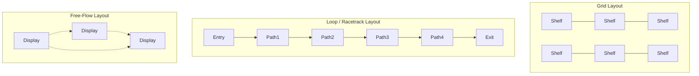
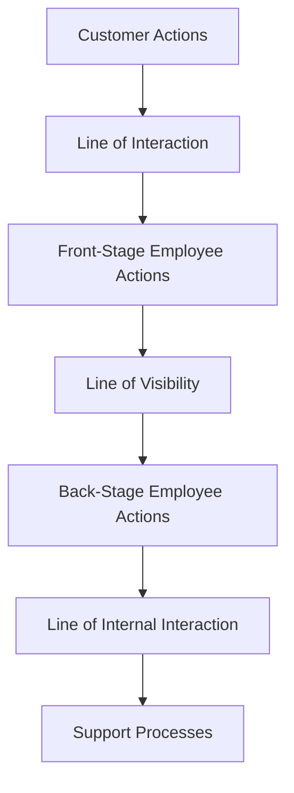

## Service Facility Layout Design

### Definition and Core Concept

Service facility layout design is the arrangement of physical space, equipment, and staff in facilities that primarily deliver services rather than manufacture goods (retail stores, banks, hospitals, restaurants, airports, call centers, hotels). Unlike manufacturing layouts, which are optimized primarily around material flow, service layouts must be optimized around **customer flow, customer experience, and customer contact intensity**, since the customer is frequently physically present during service delivery.

### Key Distinctions from Manufacturing Layout

| Attribute | Manufacturing Layout | Service Layout |
| --- | --- | --- |
| Primary flow concern | Materials/parts | Customers (and sometimes materials/information) |
| Presence of customer | Absent from production process | Often present and participating |
| Layout objective | Minimize material handling cost | Maximize customer satisfaction, sales, or throughput |
| Variability | Demand often smoothed via inventory | Demand often variable and unbufferable (services can't be inventoried) |
| Performance evaluation | Efficiency, cost per unit | Customer wait time, satisfaction, revenue per square foot |
| Emotional/psychological factors | Minimal | Significant (ambiance, comfort, wayfinding) |

### Classification by Customer Contact

Service layouts are often designed differently depending on the degree of customer contact required:

- **High customer-contact services** (restaurants, hospitals, retail): Layout emphasizes customer experience, visibility, comfort, and flow
- **Low customer-contact / back-office services** (check processing, claims processing, some call centers): Layout can resemble process or product layouts optimized for staff efficiency, since customers are not physically present

### Retail Layout Strategies

Retail is one of the most extensively studied service layout domains because layout directly influences sales.

**Key Points**

- **Grid layout**: Parallel aisles with regularly spaced shelving (common in supermarkets); maximizes product exposure and is easy for customers to navigate systematically, but can feel impersonal
- **Free-flow (free-form) layout**: Irregular, asymmetric fixture placement (common in boutique/specialty retail); encourages browsing and impulse purchases but is less space-efficient
- **Loop (racetrack) layout**: A single main aisle loops through the entire store, exposing customers to most merchandise (common in department stores like IKEA)
- **Spine layout**: A main central aisle with secondary aisles branching off, combining elements of grid and free-flow

### Diagram: Retail Layout Types

### Retail Merchandising Principles Influencing Layout

- **Decompression zone**: The entry area (typically the first several feet) where customers adjust to the store; avoided for high-margin impulse items since customers are not yet in "shopping mode"
- **Power wall / focal points**: High-visibility areas at the back or along key sightlines used to draw customers deeper into the store
- **Cross-merchandising**: Placing complementary products near each other (e.g., chips near soda) to increase basket size
- **Endcap displays**: High-traffic shelf ends used for promotions and impulse items
- **Slotting and eye-level placement**: Higher-margin or promoted products placed at eye level, since this position receives the most visual attention

### Service Blueprint as a Layout Design Tool

Since service layouts must account for customer interaction, the **service blueprint** technique is commonly used alongside layout planning. It maps:

- **Line of interaction**: Point where customer and service provider interact directly
- **Line of visibility**: Separates what the customer can see (front-stage/front-office) from what they cannot (back-stage/back-office)
- **Line of internal interaction**: Separates customer-contact employees from internal support activities

Layout decisions follow directly from this blueprint: front-stage areas require customer-facing design (aesthetics, comfort, wayfinding), while back-stage areas can be optimized purely for operational efficiency, similar to a process or product layout.

### Queue Management and Layout

Since many services involve waiting, queue configuration is a major layout consideration:

| Queue Configuration | Description | Typical Use Case |
| --- | --- | --- |
| Single line, multiple servers | One line feeds the next available server | Banks, airport check-in |
| Multiple lines, multiple servers | Each server has a dedicated line | Grocery checkout |
| Take-a-number | Customers receive a number and are called in sequence | DMV, deli counters |
| Virtual/remote queue | Customers reserve a time slot or receive an app notification | Restaurants, theme parks |

Single-line, multiple-server configurations are generally favored where perceived fairness matters, since all customers experience the same expected wait regardless of which server becomes available, and no one can "guess wrong" by choosing a slower line. [Inference — the psychological/fairness benefit is well-documented in service operations literature, but the ideal configuration also depends on service time variability and physical space constraints]

### Layout Considerations for High-Contact Service Facilities

**Example — Hospital Emergency Department layout considerations:**

1. Triage area positioned immediately at entry for rapid patient assessment
2. Treatment bays arranged to allow staff visibility across multiple patients simultaneously
3. Supply and medication stations positioned to minimize staff travel distance during time-critical procedures
4. Separate flow paths for ambulatory patients versus ambulance/critical arrivals
5. Family waiting areas physically separated from clinical treatment areas for privacy and noise control

### Servicescape Concept

The **servicescape** (a term originating from services marketing, applied heavily in layout design) refers to the physical environment in which a service is delivered, and includes:

- **Ambient conditions**: Lighting, temperature, music, scent
- **Spatial layout and functionality**: Arrangement of furniture, equipment, and pathways
- **Signs, symbols, and artifacts**: Wayfinding signage, décor, branding elements

These factors influence both employee behavior/productivity and customer perception, satisfaction, and purchase behavior. [Inference — the magnitude of servicescape impact on specific outcomes varies by industry and customer segment]

### Layout Metrics Specific to Service Facilities

- **Space productivity**: Revenue generated per square foot/meter, common in retail
- **Customer wait time**: Average and variance in time spent queuing
- **Throughput capacity**: Maximum customers served per hour given layout and staffing
- **Travel distance (customer)**: Distance customers must walk to complete a typical transaction or visit
- **Server utilization**: Percentage of time service staff are actively engaged versus idle

### Common Service Layout Design Trade-offs

| Trade-off | Description |
| --- | --- |
| Efficiency vs. Experience | A layout optimized purely for throughput (e.g., fast-food kitchens) may sacrifice ambiance valued in casual dining |
| Privacy vs. Supervision | Bank teller stations or hospital bays need enough openness for staff oversight but enough separation for customer privacy |
| Flexibility vs. Branding consistency | Modular/flexible layouts (movable retail fixtures) support seasonal changes but may dilute a consistent design identity |
| Space utilization vs. Comfort | Maximizing seating density (restaurants, waiting rooms) can reduce perceived comfort and increase perceived crowding |

### Related Topics

- Process (functional) layout
- Cellular layout and group technology
- Systematic layout planning (SLP)
- Queuing theory and waiting-line models
- Service blueprinting
- Retail merchandising and store design
- Capacity planning for service operations
- Customer experience management in operations