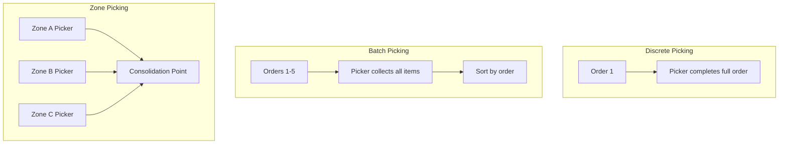

## Warehouse and Distribution Center Layout

### Definition and Core Concept

Warehouse and distribution center (DC) layout design is the arrangement of storage areas, material handling equipment, aisles, and workflow zones to optimize the movement, storage, and retrieval of goods. Unlike production facility layouts, warehouse layouts are optimized around **item flow through receiving, storage, order picking, and shipping**, with the central objective typically being minimization of total travel distance/time per order while maintaining storage density and accuracy.

### Core Warehouse Functions and Flow

- **Receiving**: Unloading, inspection, and verification of incoming goods
- **Put-away**: Movement of received goods into storage locations
- **Storage**: Holding inventory until needed
- **Order picking**: Retrieval of items to fulfill customer or production orders
- **Packing**: Consolidation and preparation of orders for shipment
- **Shipping/staging**: Final holding area before loading onto outbound transportation
- **Cross-docking**: A bypass flow where goods move directly from receiving to shipping with minimal or no storage time

### Overall Flow Pattern Types

| Pattern | Description | Best Suited For |
| --- | --- | --- |
| **U-flow (U-shaped)** | Receiving and shipping on the same side of the building; goods flow in a U-shape through storage | Facilities with space constraints; allows shared dock staff and equipment |
| **Through-flow (I-flow)** | Receiving on one end, shipping on the opposite end; straight-line flow | High-volume facilities where flow-through speed is prioritized |
| **L-flow** | Receiving and shipping on adjacent, perpendicular sides | Facilities with irregular building shapes |

### Diagram: U-Flow vs. Through-Flow

<svg xmlns="http://www.w3.org/2000/svg" viewBox="0 0 640 300">
<text x="320" y="24" font-size="16" text-anchor="middle" font-family="sans-serif" font-weight="bold">Warehouse Flow Patterns (svg_diagram)</text>

<text x="140" y="50" text-anchor="middle" font-family="sans-serif" font-size="12" font-weight="bold">U-Flow</text>

<rect x="40" y="60" width="200" height="160" fill="none" stroke="#333" stroke-width="1.5" />

<rect x="50" y="70" width="50" height="30" fill="`#fde68a`" stroke="`#b45309`" />

<text x="75" y="90" text-anchor="middle" font-family="sans-serif" font-size="9">Receiving</text>

<rect x="50" y="180" width="50" height="30" fill="`#fde68a`" stroke="`#b45309`" />

<text x="75" y="200" text-anchor="middle" font-family="sans-serif" font-size="9">Shipping</text>

<rect x="150" y="90" width="70" height="100" fill="`#cfe8ff`" stroke="`#2b6cb0`" />

<text x="185" y="145" text-anchor="middle" font-family="sans-serif" font-size="9">Storage</text>

<path d="M75,100 L75,140 L185,140 L185,90" fill="none" stroke="#333" stroke-width="1.2" marker-end="url(#a3)" />

<path d="M185,190 L185,180 L75,180" fill="none" stroke="#333" stroke-width="1.2" marker-end="url(#a3)" />

<text x="480" y="50" text-anchor="middle" font-family="sans-serif" font-size="12" font-weight="bold">Through-Flow</text>

<rect x="380" y="60" width="220" height="160" fill="none" stroke="#333" stroke-width="1.5" />

<rect x="390" y="130" width="50" height="30" fill="`#fde68a`" stroke="`#b45309`" />

<text x="415" y="150" text-anchor="middle" font-family="sans-serif" font-size="9">Receiving</text>

<rect x="530" y="130" width="50" height="30" fill="`#fde68a`" stroke="`#b45309`" />

<text x="555" y="150" text-anchor="middle" font-family="sans-serif" font-size="9">Shipping</text>

<rect x="450" y="130" width="70" height="30" fill="`#cfe8ff`" stroke="`#2b6cb0`" />

<text x="485" y="150" text-anchor="middle" font-family="sans-serif" font-size="9">Storage</text>

<line x1="440" y1="145" x2="450" y2="145" stroke="#333" stroke-width="1.2" marker-end="url(#a3)" />

<line x1="520" y1="145" x2="530" y2="145" stroke="#333" stroke-width="1.2" marker-end="url(#a3)" />

</svg>

### Storage Configuration Strategies

**Key Points**

- **Dedicated (fixed-slot) storage**: Each SKU has a permanently assigned location; simplifies worker memorization and slotting but often results in lower space utilization since empty slots cannot be used for other items
- **Random storage**: Items are stored in any available open location, tracked via warehouse management system (WMS); maximizes space utilization but requires reliable location-tracking technology
- **Class-based (ABC) storage**: SKUs are grouped into velocity classes (A = fast-moving, B = medium, C = slow-moving), with A-items placed nearest to shipping/picking areas to minimize travel

### ABC Analysis for Slotting

ABC analysis, based on the Pareto principle, is commonly used to determine storage placement priority:

| Class | % of SKUs (typical) | % of Order Volume (typical) | Placement Priority |
| --- | --- | --- | --- |
| A | ~20% | ~80% | Closest to shipping/pick face |
| B | ~30% | ~15% | Mid-distance |
| C | ~50% | ~5% | Farthest from shipping |

[Inference — the specific 80/20-style percentages are illustrative approximations; actual SKU velocity distributions vary by business and should be derived from historical order data]

### Order Picking Methods

- **Discrete (single-order) picking**: One picker completes one order at a time; simplest but least efficient for high order volume
- **Batch picking**: A picker collects items for multiple orders in a single pass, then sorts afterward; reduces travel distance per order
- **Zone picking**: Warehouse is divided into zones; each picker is responsible for their zone only, and orders are consolidated afterward (via conveyor or pick-and-pass)
- **Wave picking**: Orders are grouped and released for picking in scheduled waves aligned with shipping schedules or carrier pickup times

### Diagram: Order Picking Methods

### Aisle and Rack Configuration

- **Standard (90-degree) aisles**: Racks perpendicular to walls; simplest layout, most common
- **Fishbone (angled) aisles**: Aisles angled toward a central picking/shipping point, reducing travel distance for piece-picking operations; used notably in some e-commerce fulfillment center designs [Unverified — specific implementation details and measured performance gains vary by facility and are proprietary to individual operators]
- **Narrow-aisle and very-narrow-aisle (VNA) racking**: Reduces aisle width to increase storage density, requiring specialized narrow-aisle forklifts or automated guided vehicles

### Vertical Space Utilization

- **Selective pallet racking**: Standard racking allowing direct access to every pallet position; lower density but high selectivity
- **Drive-in/drive-through racking**: Forklifts drive into the rack structure to store/retrieve pallets; higher density but lower selectivity (typically last-in-first-out, LIFO)
- **Push-back racking**: Pallets are pushed back on rails as new pallets are loaded, providing a compromise between density and selectivity
- **Pallet flow (gravity flow) racking**: Pallets are loaded on one end and flow via gravity/rollers to the pick face, supporting first-in-first-out (FIFO) rotation

### Slotting Optimization Considerations

- **Cube utilization**: Ratio of storage volume actually used for inventory versus total available warehouse volume
- **Pick density**: Number of picks per unit area, influencing how tightly fast-moving items should be clustered
- **Product affinity**: Items frequently ordered together should be stored near each other to reduce picker travel
- **Physical characteristics**: Weight, size, and fragility affect placement (heavy items placed lower and near egress points for ergonomic and safety reasons)

### Automation in Warehouse Layout

- **Automated Storage and Retrieval Systems (AS/RS)**: Computer-controlled systems that automatically place and retrieve loads from defined storage locations, often using high-density racking with minimal aisle width
- **Conveyor systems**: Fixed-path material transport connecting functional zones (receiving to storage, picking to packing)
- **Automated Guided Vehicles (AGVs) and Autonomous Mobile Robots (AMRs)**: Mobile automation for transporting goods between zones without fixed conveyor infrastructure
- **Goods-to-person (GTP) systems**: Automated shuttle or robotic systems that bring inventory to a stationary picker, rather than having the picker travel to inventory locations, substantially reducing picker walking time [Inference — the magnitude of walking-time reduction is well-documented directionally but varies by specific system vendor and facility layout]

### Layout Metrics for Warehouse/DC Performance

| Metric | Description |
| --- | --- |
| Travel distance per pick | Average distance traveled by a picker per item retrieved |
| Picks per hour | Picker productivity rate |
| Cube utilization | Percentage of available storage volume actually occupied |
| Dock-to-stock time | Time from receiving to the item being available in a storage location |
| Order cycle time | Time from order release to shipment readiness |
| Storage/retrieval accuracy | Percentage of picks/put-aways completed without error |

### Cross-Docking Layout Considerations

Cross-docking facilities are designed with minimal or no long-term storage area, instead emphasizing:

1. High number of dock doors relative to floor area (to allow simultaneous inbound and outbound trailers)
2. Short travel distance between inbound and outbound staging lanes
3. Real-time inbound/outbound trailer scheduling coordination
4. Minimal or no put-away/pick processes, since goods are sorted and immediately reloaded

### Common Layout Trade-offs in Warehouse Design

| Trade-off | Description |
| --- | --- |
| Storage density vs. accessibility | Narrow aisles and deep racking increase density but slow retrieval and reduce selectivity |
| Automation cost vs. labor cost | Automated systems (AS/RS, GTP) have high capital cost but reduce ongoing labor cost and error rates |
| Flexibility vs. optimization | Highly optimized slotting for current SKU velocity may require costly re-slotting if product mix shifts |
| Travel distance vs. safety | Shorter travel paths achieved via narrow aisles can increase forklift-pedestrian collision risk if not properly managed |

### Related Topics

- Cellular layout and group technology
- Process (functional) layout
- Systematic layout planning (SLP)
- Inventory management and ABC analysis
- Material handling systems and equipment selection
- Supply chain network design
- Warehouse management systems (WMS)
- Automated storage and retrieval systems (AS/RS)