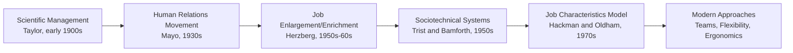

## Job Design Principles and Methods

### Definition and Core Concept

Job design is the process of defining the specific tasks, responsibilities, methods, and relationships that constitute a job or work role, with the objective of achieving organizational efficiency, product/service quality, and employee well-being simultaneously. It sits at the intersection of industrial engineering (efficiency-focused) and organizational behavior (motivation and satisfaction-focused).

### Objectives of Job Design

**Key Points**

- Improve productivity and efficiency of the work process
- Ensure product/service quality through appropriate task structuring
- Support employee safety and ergonomic well-being
- Enhance employee motivation, satisfaction, and engagement
- Enable manageable training and skill development requirements
- Support organizational flexibility (cross-training, adaptability to change)

### Historical Evolution of Job Design Approaches

### Scientific Management (Taylorism)

Frederick Taylor's approach, developed in the early 1900s, emphasized breaking jobs into the smallest possible standardized tasks, determined through time study, with strict specialization and minimal worker discretion.

**Core Principles:**

1. Scientifically study each element of a job to determine the "one best way"
2. Scientifically select and train workers for specific tasks
3. Cooperate with workers to ensure the scientific method is followed
4. Divide work and responsibility between management (planning) and workers (execution)

**Advantages**: High efficiency for repetitive, high-volume tasks; simplified training; predictable output rates

**Disadvantages**: Low job satisfaction, monotony, high turnover, and worker alienation due to extreme task fragmentation and lack of autonomy [Inference — the degree of dissatisfaction varies by individual worker preferences and cultural/organizational context]

### Job Enlargement, Job Enrichment, and Job Rotation

As reactions to the limitations of extreme task specialization, several approaches emerged to restructure jobs for greater variety and motivation:

| Method | Description | Primary Effect |
| --- | --- | --- |
| **Job Enlargement** | Adding more tasks of similar skill level and responsibility (horizontal expansion) | Reduces monotony through variety |
| **Job Enrichment** | Adding tasks with greater responsibility, autonomy, and decision-making authority (vertical expansion) | Increases intrinsic motivation |
| **Job Rotation** | Periodically moving workers between different jobs or tasks | Reduces fatigue/boredom, builds cross-functional skills |

**Example:**

- *Enlargement*: A data entry clerk who previously only entered invoices now also enters purchase orders and shipping records (same skill level, more variety)
- *Enrichment*: The same clerk is now given authority to resolve discrepancies directly with vendors rather than escalating to a supervisor (added responsibility and autonomy)
- *Rotation*: The clerk spends one week per month working in the shipping department instead of data entry

### Job Characteristics Model (Hackman and Oldham)

This model identifies five core job dimensions that influence critical psychological states, which in turn affect work outcomes such as motivation, performance, and satisfaction.

**The Five Core Dimensions:**

| Dimension | Description |
| --- | --- |
| Skill variety | Degree to which a job requires different skills and talents |
| Task identity | Degree to which a job involves completing a whole, identifiable piece of work |
| Task significance | Degree to which the job has substantial impact on others |
| Autonomy | Degree of freedom and independence in scheduling and carrying out the work |
| Feedback | Degree to which the job provides clear information about performance effectiveness |

**Motivating Potential Score (MPS) Formula:**

$$MPS = \left(\frac{SV + TI + TS}{3}\right) \times Autonomy \times Feedback$$

Where $SV$ = skill variety, $TI$ = task identity, $TS$ = task significance, each typically scored on a 1–7 scale.

**Example calculation:**

If Skill Variety = 5, Task Identity = 6, Task Significance = 4, Autonomy = 6, Feedback = 5:

$$MPS = \left(\frac{5+6+4}{3}\right) \times 6 \times 5 = 5 \times 6 \times 5 = 150$$

A higher MPS suggests greater potential for intrinsic motivation. Because Autonomy and Feedback are multiplicative rather than additive, a job scoring zero on either dimension will have zero motivating potential regardless of how high the other dimensions score. [Inference — the practical interpretation and thresholds for "high" or "low" MPS scores vary across organizational contexts and industries]

### Sociotechnical Systems (STS) Approach

This approach, originating from studies of coal mining operations by Trist and Bamforth, emphasizes designing jobs and work systems by jointly optimizing the **technical system** (equipment, processes) and the **social system** (relationships, group dynamics), rather than optimizing the technical system alone and forcing workers to adapt.

**Key Principles:**

- Self-managed or semi-autonomous work teams
- Joint optimization rather than technology-first design
- Boundary management between the work system and its environment
- Variance control at the source (problems addressed where they occur, not passed downstream)

### Ergonomic Job Design

Ergonomics (human factors engineering) focuses on fitting the job to the physical and cognitive capabilities of the worker, reducing injury risk and fatigue while improving performance.

**Key Physical Ergonomics Considerations:**

- Workstation height and reach distances relative to worker anthropometry
- Repetitive motion and cumulative trauma disorder (e.g., carpal tunnel syndrome) risk reduction
- Lifting guidelines (e.g., NIOSH lifting equation for safe load limits)
- Seating, posture, and tool design

**NIOSH Lifting Equation (simplified form):**

$$RWL = LC \times HM \times VM \times DM \times AM \times FM \times CM$$

Where $RWL$ is the Recommended Weight Limit, $LC$ is the load constant (typically 51 lb / 23 kg), and $HM, VM, DM, AM, FM, CM$ are multipliers for horizontal distance, vertical location, travel distance, asymmetry angle, lift frequency, and coupling (grip) quality, respectively — each multiplier ranges from 0 to 1 and reduces the recommended weight as conditions deviate from ideal.

**Cognitive Ergonomics Considerations:**

- Mental workload and information processing demands
- Decision-making complexity and time pressure
- Attention and vigilance requirements (relevant to monitoring/inspection tasks)

### Behavioral Approaches to Job Design

- **Autonomous work groups / self-managed teams**: Teams given collective responsibility for a complete process or product, with authority over scheduling, task allocation, and sometimes hiring
- **Flextime**: Allowing employees discretion over start/end work times within core hour constraints
- **Compressed workweeks**: Restructuring the standard workweek into fewer, longer days (e.g., four 10-hour days)
- **Telecommuting/remote work design**: Job design considerations for tasks and communication patterns that do not require physical co-location

### Comparison of Job Design Approaches

| Approach | Primary Focus | Best Suited For |
| --- | --- | --- |
| Scientific Management | Efficiency, standardization | High-volume, low-skill repetitive tasks |
| Job Enlargement/Enrichment | Motivation via task variety/responsibility | Roles suffering from monotony or low engagement |
| Job Characteristics Model | Diagnosing and redesigning for intrinsic motivation | Knowledge work, professional roles |
| Sociotechnical Systems | Joint social-technical optimization | Team-based production environments |
| Ergonomic Design | Physical/cognitive safety and performance | Manual labor, repetitive physical tasks |

### Trade-offs in Job Design Decisions

**Key Points**

- **Efficiency vs. motivation**: Highly specialized, narrow jobs (Taylorist) maximize short-run efficiency but may reduce long-run motivation and increase turnover
- **Standardization vs. flexibility**: Rigid, standardized jobs simplify training and quality control but limit adaptability to changing conditions
- **Individual vs. team-based design**: Individual job design offers clear accountability; team-based design supports flexibility and mutual support but can complicate individual performance measurement
- **Cost of redesign vs. expected benefit**: Job redesign efforts (enrichment, ergonomic retrofits) carry implementation costs that must be weighed against expected productivity, quality, or retention gains [Inference — return on investment for job redesign initiatives is highly context-dependent and difficult to generalize]

### Related Topics

- Work measurement and time study
- Methods analysis and process charts
- Learning curves
- Motion study and micro-motion analysis
- Ergonomics and human factors engineering
- Compensation systems and incentive pay
- Team-based work systems
- Standard time determination