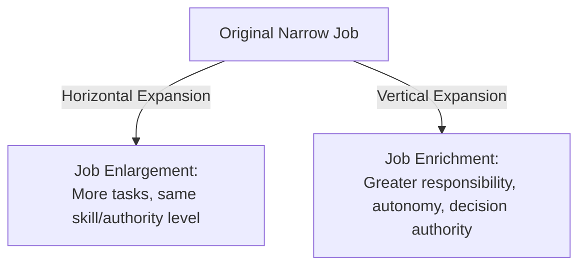

## Job Enrichment and Job Enlargement

### Definition and Core Concept

Job enrichment and job enlargement are two distinct approaches to redesigning jobs to counteract the negative effects of excessive task specialization (monotony, low motivation, high turnover) that often result from scientific management-style job design. Both aim to improve employee outcomes, but they differ fundamentally in the direction and nature of the expansion applied to a job.

### Core Distinction: Horizontal vs. Vertical Expansion

| Attribute | Job Enlargement | Job Enrichment |
| --- | --- | --- |
| Direction of change | Horizontal (more breadth) | Vertical (more depth) |
| What is added | More tasks at the same skill/responsibility level | Greater autonomy, decision-making, and accountability |
| Primary goal | Reduce monotony through task variety | Increase intrinsic motivation through meaningful responsibility |
| Underlying theory | Task variety theory | Herzberg's Two-Factor Theory; Job Characteristics Model |
| Typical effect on skill requirements | Minimal increase | Often requires higher skill/judgment |
| Risk if poorly implemented | Perceived as "more of the same work" without added reward | Perceived as extra burden without corresponding authority or compensation |

### Job Enlargement in Detail

Job enlargement, sometimes called **horizontal job loading**, combines multiple narrow tasks (often previously performed by different workers) into a single, broader job, without necessarily changing the level of skill, responsibility, or decision-making authority required.

**Example:**

An assembly worker who previously only tightened bolts on a single component now also installs the wiring harness and attaches a bracket — three tasks instead of one, but all at a similar skill and responsibility level.

**Advantages:**

- Reduces monotony and repetitive-motion fatigue by increasing task variety
- Can reduce cumulative trauma/ergonomic injury risk, since workers are not performing the identical motion continuously
- Relatively simple and low-cost to implement, since it does not usually require significant retraining or restructuring of authority
- May reduce the number of workers needed for a given process segment by consolidating tasks

**Disadvantages:**

- Motivational gains are often temporary; workers may still find the enlarged job unfulfilling since the underlying nature of the work (routine, low autonomy) has not changed [Inference — the durability of motivational improvement is debated in the literature and appears to depend on individual differences]
- Increases training time and potential for errors, since workers must learn multiple tasks (though these are similar in complexity to the original task)
- Does little to address autonomy or achievement needs identified in motivation theories such as Herzberg's

### Job Enrichment in Detail

Job enrichment, or **vertical job loading**, restructures a job to include planning, decision-making, and evaluative responsibilities that were previously reserved for supervisors or other higher-level roles. It is grounded primarily in Frederick Herzberg's Two-Factor (Motivator-Hygiene) Theory.

### Herzberg's Two-Factor Theory Foundation

| Factor Type | Examples | Effect if Absent | Effect if Present |
| --- | --- | --- | --- |
| **Hygiene factors** | Salary, working conditions, company policy, supervision | Causes dissatisfaction | Does not create satisfaction, only prevents dissatisfaction |
| **Motivator factors** | Achievement, recognition, responsibility, growth, the work itself | Does not necessarily cause dissatisfaction | Creates genuine satisfaction and motivation |

Herzberg argued that improving hygiene factors alone (e.g., raising pay, improving break rooms) cannot generate lasting motivation; only enriching the motivator factors embedded in the job itself produces genuine engagement. This is the theoretical basis for job enrichment.

### Herzberg's Vertical Loading Principles

Herzberg proposed specific principles for enriching jobs, each linked to a particular motivator:

| Principle | Motivator Involved |
| --- | --- |
| Remove some controls while retaining accountability | Responsibility, achievement |
| Increase individual accountability for own work | Responsibility, recognition |
| Give a person a complete natural unit of work (module, division, area) | Responsibility, achievement, recognition |
| Grant additional authority (job freedom) | Responsibility, achievement, recognition |
| Make periodic reports available directly to workers rather than only to supervisors | Internal recognition |
| Introduce new, more difficult tasks not previously handled | Growth and learning |
| Assign individuals specific specialized tasks, enabling them to become experts | Growth, advancement |

**Example:**

A customer service representative who previously could only follow a fixed script and escalate all exceptions to a supervisor is now authorized to approve refunds up to $200, directly resolve billing disputes, and receives their own customer satisfaction metrics rather than only team-level metrics reported by a manager.

**Advantages:**

- Addresses intrinsic motivators directly (achievement, recognition, growth), producing more durable engagement than enlargement alone
- Can reduce supervisory burden, as more decisions are made at the point of work
- Often improves quality and customer responsiveness, since workers closer to the task have authority to resolve issues without escalation delay

**Disadvantages:**

- Requires greater investment in training and skill development
- Not all employees desire additional responsibility; some prefer clearly bounded, low-discretion roles [Inference — individual differences in growth-need strength, as identified in the Job Characteristics Model, significantly moderate enrichment's effectiveness]
- May require corresponding changes to compensation structures, since added responsibility without added reward can be perceived as exploitative
- Poorly designed enrichment initiatives (e.g., adding responsibility without adequate authority or resources) can increase stress rather than motivation

### Relationship to the Job Characteristics Model

Job enrichment directly targets several of the five core job dimensions from the Hackman and Oldham Job Characteristics Model:

| Core Dimension | Enrichment Technique |
| --- | --- |
| Skill variety | Introducing new, more difficult tasks |
| Task identity | Assigning a complete natural unit of work |
| Autonomy | Removing controls while retaining accountability; granting additional authority |
| Feedback | Providing direct performance reports to the worker |

Job enlargement, by contrast, primarily affects only **skill variety**, and even then only marginally, since the added tasks are typically similar in nature and difficulty to the original task.

### Implementation Process for Job Enrichment

1. Select jobs with low motivating potential (diagnosed via Job Characteristics Model surveys)
2. Diagnose which specific core dimensions are lacking (e.g., low autonomy vs. low task identity)
3. Apply targeted vertical loading principles matched to the deficient dimension(s)
4. Pilot the redesign with a subset of employees or a single work unit before full rollout
5. Provide necessary training and adjust compensation/authority structures to match new responsibilities
6. Measure outcomes (satisfaction, turnover, quality, productivity) and iterate

### Combined Approach: Enlargement Plus Enrichment

In practice, many job redesign initiatives combine both approaches — expanding the breadth of tasks (enlargement) while simultaneously increasing autonomy and responsibility over those tasks (enrichment). This combined approach is sometimes associated with the formation of **autonomous work teams**, where a group is given a complete, enlarged set of tasks along with enriched collective authority over how the work is performed.

### Trade-offs and Limitations

**Key Points**

- Both approaches increase job complexity, which raises training costs and time-to-proficiency
- Enrichment initiatives without matching authority, resources, or compensation can produce resentment rather than motivation
- Enlargement without enrichment may fail to produce lasting motivational gains, since the underlying lack of autonomy remains unaddressed
- Not universally applicable; highly standardized, safety-critical, or regulation-bound jobs (e.g., certain pharmaceutical or aviation maintenance tasks) may have limited room for added discretion without compromising compliance or safety [Inference — the extent of this constraint depends on the specific regulatory framework governing the job]
- Individual differences in growth-need strength mean enrichment benefits are not uniform across all employees

### Related Topics

- Job design principles and methods
- Herzberg's Two-Factor Theory
- Job Characteristics Model (Hackman and Oldham)
- Job rotation
- Autonomous and self-managed work teams
- Work measurement and time study
- Employee motivation theories in operations
- Ergonomic job design