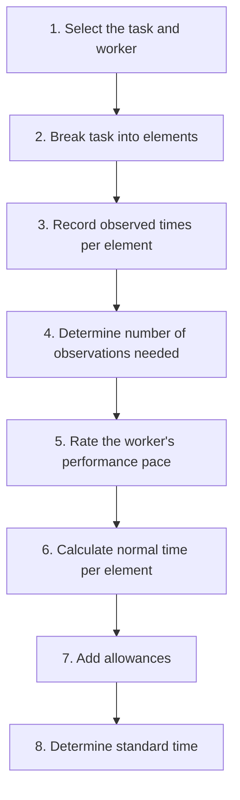
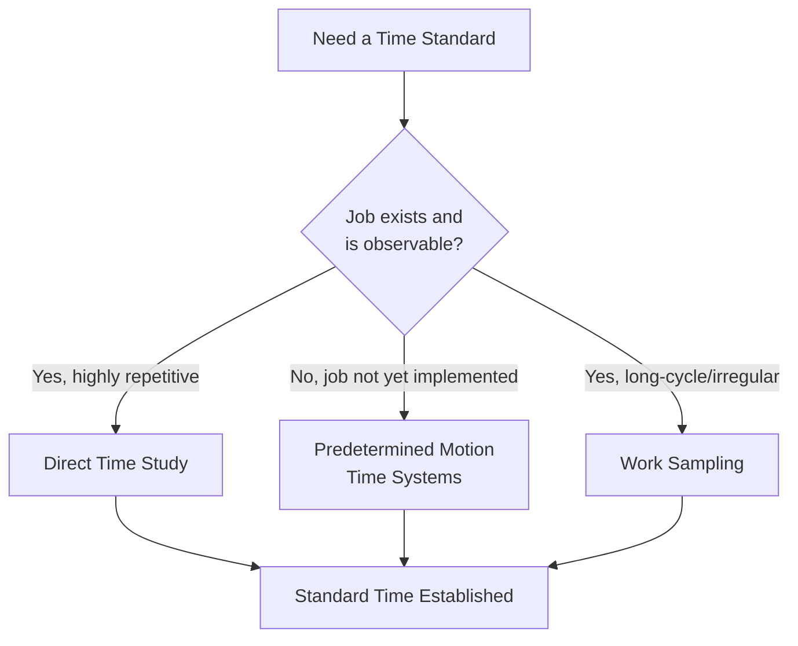

## Time Study and Standard Time Determination

### Definition and Core Concept

Time study is a work measurement technique used to determine the amount of time required by a qualified, trained worker, working at a normal pace, to complete a specific task following a prescribed method. The output of time study is a **standard time**, which serves as the basis for labor planning, cost estimation, incentive pay systems, capacity planning, and scheduling.

### Purpose and Applications of Standard Times

**Key Points**

- Labor cost estimation and product/service pricing
- Production scheduling and capacity planning
- Line balancing in product/assembly layouts
- Wage incentive plan design
- Performance evaluation and productivity measurement
- Staffing level determination

### The Time Study Process — Overview

### Step 1–2: Task Selection and Element Breakdown

The job is broken into distinct, observable **elements** — small, definable segments of work with clear start and end points (e.g., "reach for part," "position part," "tighten bolt"). Elements should be:

- Short enough for precise timing but long enough to be measured reliably
- Clearly delineated with identifiable start/end points ("breakpoints")
- Separated into constant elements (time is the same regardless of work variation, e.g., machine cycle time) and variable elements (time changes based on job characteristics, e.g., size or weight of the part)

### Step 3: Recording Observed Times

Observed times are recorded using a stopwatch (traditional method) or, increasingly, digital time-study software or video analysis. Two common stopwatch methods:

- **Continuous timing**: The stopwatch runs continuously throughout the study; element times are derived by subtraction between consecutive readings
- **Snapback (repetitive) timing**: The stopwatch is reset to zero after each element, directly reading each element's duration

### Step 4: Determining Sample Size

Because observed times vary between cycles due to natural human variability, a statistically adequate number of observations must be taken. The required sample size can be calculated using the following formula, based on a desired confidence level and accuracy:

$$n = \left(\frac{z \cdot s}{a \cdot \bar{x}}\right)^2$$

Where:

- $n$ = required number of observations
- $z$ = z-value corresponding to the desired confidence level (e.g., 1.96 for 95% confidence)
- $s$ = sample standard deviation of observed times
- $a$ = desired accuracy level (as a decimal, e.g., 0.05 for ±5%)
- $\bar{x}$ = sample mean of observed times

**Example calculation:**

Suppose a preliminary sample of 10 observations yields a mean of $\bar{x} = 2.4$ minutes and a standard deviation of $s = 0.3$ minutes. For 95% confidence ($z = 1.96$) and ±5% accuracy ($a = 0.05$):

$$n = \left(\frac{1.96 \times 0.3}{0.05 \times 2.4}\right)^2 = \left(\frac{0.588}{0.12}\right)^2 = (4.9)^2 \approx 24.01$$

This indicates approximately 24 observations are needed to achieve the desired confidence and accuracy — more than the 10 initially collected, so additional observations would need to be taken.

### Step 5: Performance Rating

Since observed times reflect the pace of the specific worker being studied (who may work faster or slower than a "normal" pace), the analyst applies a **performance rating (pace rating)** to adjust the observed time to reflect what a qualified worker performing at a normal, sustainable pace would require.

- A rating of 100% (or 1.00) represents "normal" pace
- A rating above 100% indicates the observed worker performed faster than normal pace
- A rating below 100% indicates the observed worker performed slower than normal pace

Common rating systems include the **Westinghouse system**, which rates performance across four factors: skill, effort, conditions, and consistency, each assigned a rating that is summed to produce an overall performance rating adjustment.

### Step 6: Calculating Normal Time

$$NT = OT \times R$$

Where $NT$ = normal time, $OT$ = observed time (average of the recorded observations for an element), and $R$ = performance rating (as a decimal, e.g., 1.10 for 110%).

**Example:**

If the average observed time for an element is 0.50 minutes, and the worker was rated at 110% pace (faster than normal):

$$NT = 0.50 \times 1.10 = 0.55 \text{ minutes}$$

Note that a faster-than-normal worker produces a *higher* normal time estimate, since the observed time must be inflated to represent what an average-pace worker would need.

### Step 7: Adding Allowances

Normal time does not account for unavoidable delays, fatigue, or personal needs. **Allowances** are added to normal time to produce a realistic, sustainable standard. Common allowance categories:

| Allowance Type | Description | Typical Range (illustrative) |
| --- | --- | --- |
| Personal allowance | Restroom breaks, water, brief rest | 5% |
| Fatigue allowance | Physical/mental fatigue recovery, varies by job demands | 4–15%+ |
| Delay (unavoidable) allowance | Minor unavoidable interruptions (waiting for materials, machine adjustments) | 0–5% |

[Inference — specific allowance percentages vary substantially by industry, job physical/mental demands, and organizational policy or labor agreements; the ranges above are illustrative, not universal standards]

Allowances are typically applied as a percentage of normal time (or sometimes of the total workday), calculated as:

$$ST = NT \times (1 + A)$$

Where $ST$ = standard time and $A$ = total allowance fraction (e.g., 0.15 for 15%).

**Example:**

If normal time is 0.55 minutes and total allowances are 15%:

$$ST = 0.55 \times (1 + 0.15) = 0.55 \times 1.15 = 0.6325 \text{ minutes}$$

Alternatively, some organizations apply allowances as a percentage of the standard time itself (allowance factor applied to total workday), using the formula:

$$ST = \frac{NT}{1 - A}$$

Using the same example with $A = 0.15$:

$$ST = \frac{0.55}{1 - 0.15} = \frac{0.55}{0.85} \approx 0.647 \text{ minutes}$$

The two formulas produce different results and reflect different conventions for how allowances are defined (percentage of normal time added, versus percentage of the total standard time consumed by allowances) — the applicable formula depends on the specific allowance policy in use. [Unverified — which convention is "standard" varies by textbook, industry, and organization]

### Complete Worked Example

**Scenario:** A time study of a packaging task records the following observed times (in minutes) for one element across 5 cycles: 0.48, 0.52, 0.50, 0.47, 0.53

**Step 1 — Average observed time:**

$$OT = \frac{0.48+0.52+0.50+0.47+0.53}{5} = \frac{2.50}{5} = 0.50 \text{ minutes}$$

**Step 2 — Apply performance rating** (worker rated at 95%, slightly slower than normal):

$$NT = 0.50 \times 0.95 = 0.475 \text{ minutes}$$

**Step 3 — Apply allowances** (assume 12% total allowance, added to normal time):

$$ST = 0.475 \times (1 + 0.12) = 0.475 \times 1.12 = 0.532 \text{ minutes}$$

**Standard time for this element ≈ 0.532 minutes.** This process is repeated for every element in the task, and the standard times for all elements are summed to produce the total standard time for the complete job cycle.

### Alternative Work Measurement Techniques

Beyond direct stopwatch time study, several other techniques are used to establish standard times:

| Technique | Description | Best Suited For |
| --- | --- | --- |
| **Predetermined Motion Time Systems (PMTS)**, e.g., MTM, MOST | Uses tables of pre-established times for basic human motions (reach, grasp, move) to build standard times without direct observation | New job design before physical implementation; highly repetitive manual tasks |
| **Work sampling** | Statistical sampling of random observations over time to estimate the percentage of time spent on various activities/delays, rather than continuous timing | Estimating allowances, machine utilization, or standards for non-repetitive/long-cycle work |
| **Standard data systems** | Compiling previously established elemental times from past time studies into a reusable database | Organizations with many similar jobs sharing common elements |
| **Historical data analysis** | Deriving time standards from historical production records | Situations where direct time study is impractical, though generally less rigorous |

### Diagram: Work Measurement Technique Selection

### Work Sampling Sample Size Formula

For work sampling studies estimating the proportion of time spent on an activity:

$$n = \frac{z^2 \cdot p(1-p)}{e^2}$$

Where $p$ is the estimated proportion of time spent on the activity, $e$ is the desired absolute error, and $z$ is the z-value for the desired confidence level.

**Example:** To estimate, with 95% confidence and ±3% precision, the proportion of time a machine is idle, given a preliminary estimate that the machine is idle 20% of the time ($p = 0.20$):

$$n = \frac{(1.96)^2 \times 0.20 \times 0.80}{(0.03)^2} = \frac{3.8416 \times 0.16}{0.0009} = \frac{0.6147}{0.0009} \approx 683$$

Approximately 683 random observations would be required.

### Common Sources of Error in Time Study

- **Rating bias**: Performance rating is inherently subjective and prone to analyst inconsistency
- **Observer effect (Hawthorne-type influence)**: Workers may alter their pace when aware they are being timed
- **Insufficient sample size**: Leads to standards that do not accurately reflect true task variability
- **Element boundary ambiguity**: Poorly defined breakpoints between elements produce inconsistent element timing
- **Non-representative worker selection**: Using an atypical worker (significantly faster/slower than the target population) skews standards even after rating adjustment [Inference — the degree of skew depends on how far the selected worker deviates from the intended "qualified, trained" benchmark]

### Related Topics

- Job design principles and methods
- Learning curves
- Predetermined Motion Time Systems (MTM, MOST)
- Work sampling
- Line balancing
- Wage incentive systems
- Methods analysis and process charts
- Ergonomics and human factors engineering