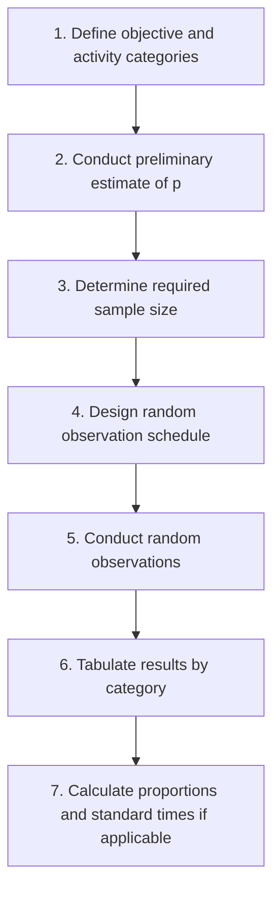

## Work Sampling

### Definition and Core Concept

Work sampling is a statistical work measurement technique that estimates the proportion of time a worker, machine, or process spends on various activities (working, idle, delayed) by taking a large number of random, instantaneous observations over an extended period, rather than continuously timing every cycle as in traditional time study. It relies on the statistical principle that a sufficiently large random sample will accurately represent the true proportion of time spent on each activity category across the entire study period.

### Core Statistical Basis

Work sampling is grounded in the **binomial distribution** and the law of large numbers: each random observation is treated as an independent trial classifying the worker/machine into one of several predefined activity categories. As the number of observations increases, the sample proportions converge toward the true population proportions of time spent in each state.

### The Work Sampling Process — Overview

### Step 1: Defining Objectives and Activity Categories

Before sampling begins, categories must be clearly and mutually exclusively defined. Common examples:

- **Machine utilization study**: Categories might be "running," "idle-no operator," "idle-waiting for material," "under maintenance"
- **Worker activity study**: Categories might be "direct work," "material handling," "idle/personal," "machine-paced waiting"
- **Allowance determination study**: Categories focused specifically on delay types to establish appropriate allowance percentages for time standards

### Step 2–3: Preliminary Estimate and Sample Size Determination

An initial estimate of $p$ (the proportion of time spent on the activity of interest) is needed, typically from a small pilot study or historical data. The required number of observations is then calculated using:

$$n = \frac{z^2 \cdot p(1-p)}{e^2}$$

Where:

- $n$ = required number of observations
- $z$ = z-value for desired confidence level (1.96 for 95%, 2.58 for 99%)
- $p$ = estimated proportion of time spent on the activity
- $e$ = desired absolute precision (error margin), expressed as a decimal

**Example calculation:**

A preliminary study suggests a machine is idle approximately 30% of the time ($p = 0.30$). Management wants to estimate this proportion with 95% confidence ($z = 1.96$) and a precision of ±4% ($e = 0.04$):

$$n = \frac{(1.96)^2 \times 0.30 \times 0.70}{(0.04)^2} = \frac{3.8416 \times 0.21}{0.0016} = \frac{0.8067}{0.0016} \approx 504$$

Approximately 504 random observations are required.

**Important property**: The required sample size is maximized when $p = 0.50$, since $p(1-p)$ reaches its maximum value of 0.25 at that point. Activities with proportions closer to 0 or 1 (very rare or very common activities) require fewer observations to estimate with the same precision.

### Step 4: Designing the Random Observation Schedule

Observations must occur at **truly random times** throughout the study period to avoid bias (e.g., avoiding a pattern where observations always occur at the top of the hour, which workers might learn to anticipate). This is typically achieved using:

- Random number tables or software-generated random times within each work shift
- Random route generation for studies covering multiple workers/machines across a facility, ensuring the observer's path itself does not become predictable

**Example random schedule (illustrative, for an 8-hour shift, 10 observations):**

| Observation # | Scheduled Time |
| --- | --- |
| 1 | 8:07 AM |
| 2 | 8:41 AM |
| 3 | 9:38 AM |
| 4 | 10:12 AM |
| 5 | 11:03 AM |
| 6 | 12:47 PM |
| 7 | 1:19 PM |
| 8 | 2:56 PM |
| 9 | 3:22 PM |
| 10 | 4:08 PM |

### Step 5–6: Conducting Observations and Tabulating Results

At each scheduled random time, the observer records which predefined category applies at that instant. Over the full study, tallies accumulate into a summary table.

**Example tabulation after a completed study (400 total observations):**

| Category | Tally Count | Proportion |
| --- | --- | --- |
| Running (productive) | 280 | 70% |
| Idle — waiting for material | 60 | 15% |
| Idle — no operator | 40 | 10% |
| Under maintenance | 20 | 5% |
| **Total** | **400** | **100%** |

### Step 7: Applications of Results

**Determining Allowances for Time Standards**

If work sampling shows that unavoidable delays account for a certain percentage of total time, this proportion can be directly used as the delay allowance component in standard time calculations (see time study allowance formulas).

**Determining Standard Time via Work Sampling (Alternative to Stopwatch Time Study)**

Work sampling can also be used to establish an entire standard time, using the formula:

$$ST = \frac{(Total\ Time \times P_w \times R)}{Units\ Produced} \times (1 + A)$$

Where $Total\ Time$ is the total study duration, $P_w$ is the proportion of time observed as "working," $R$ is the average performance rating during working observations, $Units\ Produced$ is the output quantity during the study period, and $A$ is the allowance fraction.

**Worked Example:**

A work sampling study over a 480-minute shift finds workers are "working" 75% of observations ($P_w = 0.75$), with an average performance rating of 105% ($R = 1.05$), producing 300 units during the shift, with a 10% allowance ($A = 0.10$):

$$ST = \frac{480 \times 0.75 \times 1.05}{300} \times (1 + 0.10)$$

$$ST = \frac{378}{300} \times 1.10 = 1.26 \times 1.10 = 1.386 \text{ minutes per unit}$$

### Comparison: Work Sampling vs. Stopwatch Time Study

| Attribute | Work Sampling | Stopwatch Time Study |
| --- | --- | --- |
| Observation method | Random, instantaneous snapshots | Continuous or repetitive direct timing |
| Best suited for | Long-cycle, irregular, or multi-worker/machine studies | Short-cycle, highly repetitive tasks |
| Observer training required | Lower | Higher (requires stopwatch proficiency, element breakpoint judgment) |
| Cost per study (typical) | Lower for large-scale, long-duration studies | Higher for equivalent duration coverage |
| Disruption to workers | Minimal (brief, infrequent observation) | Can be higher (continuous observer presence) |
| Precision for detailed elemental times | Low (cannot capture fine element-level detail) | High (captures precise element durations) |
| Statistical basis | Binomial distribution / proportion estimation | Direct measurement with normal distribution assumptions for averaging |

### Diagram: Work Sampling vs. Continuous Time Study Observation Pattern

<ns0:svg xmlns:ns0="[http://www.w3.org/2000/svg" viewBox="0 0 600 260">](http://www.w3.org/2000/svg%22%3E)

<ns0:text x="300" y="24" font-size="16" text-anchor="middle" font-family="sans-serif" font-weight="bold">Observation Patterns Compared (svg_diagram)</ns0:text>

<ns0:text x="60" y="60" font-family="sans-serif" font-size="12" font-weight="bold">Work Sampling (random instants)</ns0:text>

<ns0:line x1="60" y1="90" x2="560" y2="90" stroke="#333" stroke-width="2" />

<ns0:circle cx="95" cy="90" r="5" fill="#2b6cb0" />

<ns0:circle cx="150" cy="90" r="5" fill="#2b6cb0" />

<ns0:circle cx="230" cy="90" r="5" fill="#2b6cb0" />

<ns0:circle cx="310" cy="90" r="5" fill="#2b6cb0" />

<ns0:circle cx="400" cy="90" r="5" fill="#2b6cb0" />

<ns0:circle cx="480" cy="90" r="5" fill="#2b6cb0" />

<ns0:circle cx="530" cy="90" r="5" fill="#2b6cb0" />

<ns0:text x="300" y="115" text-anchor="middle" font-family="sans-serif" font-size="10">Irregular, randomized timing — brief snapshot at each point</ns0:text>

<ns0:text x="60" y="160" font-family="sans-serif" font-size="12" font-weight="bold">Stopwatch Time Study (continuous)</ns0:text>

<ns0:line x1="60" y1="190" x2="560" y2="190" stroke="#333" stroke-width="2" />

<ns0:rect x="60" y="185" width="500" height="10" fill="#fde68a" opacity="0.6" />

<ns0:text x="300" y="215" text-anchor="middle" font-family="sans-serif" font-size="10">Continuous observer presence throughout each full work cycle</ns0:text>

</ns0:svg>

### Advantages of Work Sampling

- Lower cost for studying long-duration or infrequent activities compared to continuous observation
- One observer can study multiple workers or machines simultaneously across a facility
- Less intrusive; brief, infrequent observation is less likely to alter worker behavior than continuous stopwatch monitoring
- Statistically sound method for establishing allowances and utilization rates
- Requires less specialized observer training than detailed elemental stopwatch timing

### Disadvantages and Limitations

- Provides only proportional/aggregate data, not detailed elemental time breakdowns needed for method improvement analysis
- Requires a large number of observations for precise results, particularly for rare activities (though rare activities also require less absolute precision in many practical applications)
- Less suitable for very short-cycle repetitive tasks, where random instantaneous sampling may miss brief but important activity states
- Requires disciplined randomization; non-random or predictable observation timing introduces bias and undermines the statistical validity of results
- Worker or observer bias can still occur if workers detect a pattern in observer presence, even when observation instants are randomized [Inference — the degree of behavioral change under observation, sometimes referred to as a Hawthorne-type effect, varies across work environments and observer visibility]

### Sequential (Running) Sample Size Adjustment

As a work sampling study progresses, the observed proportion $p$ may differ from the initial estimate. Analysts often recalculate the required sample size periodically during the study using the updated observed proportion, adjusting the number of remaining observations needed to achieve the target confidence and precision.

### Related Topics

- Time study and standard time determination
- Job design principles and methods
- Predetermined Motion Time Systems (MTM, MOST)
- Allowances in standard time calculation
- Machine utilization analysis
- Statistical process control
- Capacity planning
- Learning curves