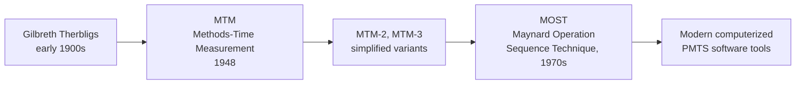

## Predetermined Motion Time Systems

### Definition and Core Concept

Predetermined Motion Time Systems (PMTS) are work measurement techniques that establish standard times for tasks by summing pre-established, standardized time values for basic fundamental human motions (reach, grasp, move, position, release, etc.), rather than through direct stopwatch observation of an actual worker performing the task. Each motion's time value has been previously determined through extensive research (often via micromotion film/video analysis) and compiled into reference tables, independent of any specific worker or job.

### Core Rationale and Advantages Over Direct Time Study

**Key Points**

- Standards can be established **before** a job physically exists, since only the motion sequence needs to be defined, not an actual worker performing it
- Eliminates the need for performance rating, since motion time values are already defined at a "normal" pace, removing a major source of subjectivity in traditional time study
- Encourages methods analysis and improvement during standard-setting, since the analyst must explicitly define each motion, often revealing inefficient movement patterns
- Produces highly consistent standards across different analysts and locations, since standard published values are used rather than analyst judgment
- Useful for costing and bidding on new products before production begins

### Historical Development

Frank and Lillian Gilbreth's early motion study work identified **Therbligs** — 17 fundamental hand motions (e.g., reach, grasp, move, position, hold, release) — which laid the conceptual foundation for later quantified PMTS systems.

### Methods-Time Measurement (MTM)

MTM, developed in 1948, is one of the most widely used PMTS systems. It assigns time values, measured in **TMUs (Time Measurement Units)**, to fundamental motions.

**Key TMU Conversion:**

$$1\ TMU = 0.00001\ hours = 0.0006\ minutes = 0.036\ seconds$$

$$1\ second \approx 27.8\ TMU$$

**Basic MTM Motion Categories:**

| Motion | Symbol | Description |
| --- | --- | --- |
| Reach | R | Moving the empty hand toward an object |
| Move | M | Moving an object with the hand |
| Turn | T | Rotating the hand, wrist, or forearm |
| Grasp | G | Closing fingers/hand around an object to gain control |
| Position | P | Aligning, orienting, and engaging an object with another |
| Release | RL | Relinquishing control of an object |
| Disengage | D | Separating one object from another |

Each motion's time value depends on additional variables such as distance moved, degree of difficulty (e.g., reaching for an object in a fixed known location vs. one that must be visually located), and weight (for Move).

**Example MTM-1 Table Excerpt (illustrative values in TMUs) — Reach (R):**

| Distance Moved (inches) | Case A (to exact location, or to object in fixed location) | Case B (to object whose location varies) |
| --- | --- | --- |
| 2 | 2.0 | 2.5 |
| 4 | 3.4 | 4.5 |
| 8 | 5.3 | 6.7 |
| 12 | 6.8 | 8.4 |

[Unverified — exact published TMU values vary by MTM version and licensed reference source; the values above are illustrative approximations of the general table structure, not verbatim reproductions of proprietary published tables]

### Worked MTM Example

**Task:** Pick up a pen from a fixed location 8 inches away and set it down at a location 6 inches away.

| Motion | Description | Approx. TMU (illustrative) |
| --- | --- | --- |
| R8A | Reach 8 inches to fixed location | 5.3 |
| G1A | Grasp pen (simple grasp) | 2.0 |
| M6B | Move pen 6 inches to approximate location | 8.0 |
| RL1 | Release pen | 2.0 |
| **Total** |  | **17.3 TMU** |

Converting to time:

$$17.3\ TMU \times 0.036\ \text{seconds/TMU} \approx 0.62\ \text{seconds}$$

[Unverified — illustrative TMU values used for demonstration; production use requires referencing the licensed, current MTM data tables]

### MTM Variants

| Variant | Description | Trade-off |
| --- | --- | --- |
| **MTM-1** | Most detailed, motion-by-motion analysis | Highest precision, most time-consuming to apply |
| **MTM-2** | Combines related MTM-1 motions into fewer, broader categories | Faster application, somewhat less precise |
| **MTM-3** | Further simplified, fewer motion categories than MTM-2 | Fastest application, lowest precision, suited for less repetitive/lower-volume jobs |

### Maynard Operation Sequence Technique (MOST)

MOST, developed as a further simplification of MTM in the 1970s, models work as sequences of standardized **activity sequence models** rather than individual micro-motions, substantially speeding up the analysis process while maintaining reasonable accuracy for many applications.

**MOST Sequence Models:**

| Model | Sequence | Use Case |
| --- | --- | --- |
| **General Move** | Get – Place – Return | Moving objects freely through space |
| **Controlled Move** | Get – Move Controlled – Return | Moving objects along a fixed path or surface (e.g., sliding, operating a lever) |
| **Tool Use** | Combines Get/Place with tool-specific actions (fasten, cut, measure) | Tasks requiring hand tools |

Each sequence model is composed of standardized sub-activity parameters, each assigned an index value; the sum of index values (multiplied by 10) gives the TMU-equivalent time directly, without needing to add individual elemental motion times.

**General Move Model Structure (illustrative):**

$$ABG\ ABP\ A$$

Where A = Action Distance, B = Body Motion, G = Gain Control, P = Placement — each parameter is assigned an index value from a standard MOST reference table based on observed sequence characteristics, and the total is multiplied by 10 to yield TMU.

### Comparison of PMTS Approaches

| System | Level of Detail | Relative Analysis Speed | Typical Application |
| --- | --- | --- | --- |
| MTM-1 | Very high (individual micro-motions) | Slowest | Highly repetitive, high-volume, short-cycle tasks (e.g., mass assembly) |
| MTM-2 | Medium-high | Faster than MTM-1 | Medium-volume repetitive work |
| MTM-3 | Medium | Faster than MTM-2 | Lower-volume, less repetitive work |
| MOST | Sequence-model based | Significantly faster than MTM variants | Broad range of manual work, including less repetitive tasks |

### Comparison: PMTS vs. Direct Time Study vs. Work Sampling

| Attribute | PMTS | Direct Time Study | Work Sampling |
| --- | --- | --- | --- |
| Requires existing job/worker to observe | No | Yes | Yes |
| Performance rating needed | No (already normalized) | Yes | Yes (if used for standard time) |
| Level of detail | Very high (individual motions) | High (elemental) | Low (proportional/aggregate) |
| Best suited for | Job design/costing before implementation; highly repetitive tasks | Existing repetitive, short-cycle tasks | Long-cycle, irregular, or multi-subject studies |
| Analyst training/certification | Substantial (formal certification typically required) | Moderate | Moderate |
| Cost to apply per job | High for detailed MTM-1; moderate for MOST | Moderate | Low to moderate |

### Applications of PMTS

**Key Points**

- Establishing standards for proposed new jobs prior to physical implementation, supporting cost estimation and bidding
- Comparing alternative method designs quantitatively before selecting a final workflow (since a proposed method's motions can be timed on paper)
- Auditing or validating time standards derived from direct time study
- Training aid for teaching efficient motion patterns to new employees
- Balancing assembly lines where task times must be estimated before the line is physically built

### Advantages

- Removes the subjectivity of performance rating from standard-setting
- Can be applied before physical job implementation, supporting proactive method design
- Produces highly consistent, reproducible standards across analysts (given proper training) and locations
- Naturally encourages motion economy principles during method design, since inefficient sequences are visible in the buildup of motion counts

### Disadvantages and Limitations

- Requires formal training and certification to apply correctly and consistently; incorrect motion classification produces inaccurate standards
- Original tables were developed primarily for manual, physically observable motions; less directly applicable to cognitive, decision-intensive, or highly variable creative work [Inference — extension of PMTS principles to knowledge work is an area of ongoing methodological debate, with less consensus than for manual/repetitive tasks]
- Table-based systems (particularly MTM-1) can be time-consuming to apply for complex, long-cycle jobs, motivating the development of simplified variants like MOST
- May not fully capture the effect of learning curves, since values represent an already-proficient worker's expected motion time, not the ramp-up period for a newly trained worker
- Union and labor relations concerns can arise if PMTS-derived standards are perceived as overly rigid or disconnected from actual working conditions [Inference — the degree of labor relations friction depends heavily on organizational context and historical labor-management dynamics]

### Related Topics

- Time study and standard time determination
- Work sampling
- Motion economy principles (Gilbreth's Therbligs)
- Job design principles and methods
- Line balancing
- Methods analysis and process charts
- Learning curves
- Standard data systems