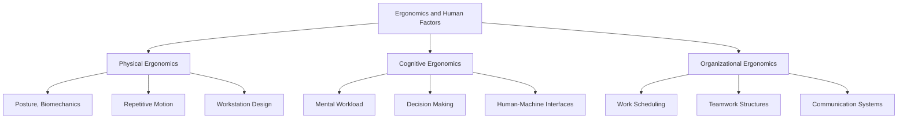
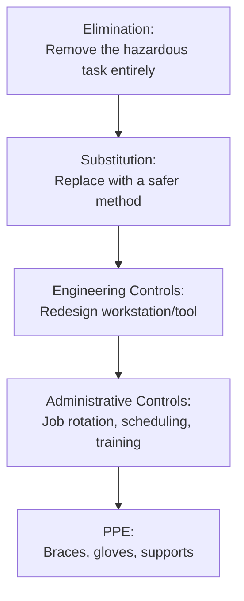

## Ergonomics and Human Factors

### Definition and Core Concept

Ergonomics (also called human factors engineering) is the scientific discipline concerned with designing jobs, tasks, equipment, tools, and work environments to fit the physical and cognitive capabilities and limitations of the people who use them. The core objective is to optimize the interaction between humans and the systems they work within, simultaneously improving safety, health, comfort, and performance.

### Core Domains of Ergonomics

### Physical Ergonomics

Physical ergonomics addresses the anatomical, anthropometric, physiological, and biomechanical characteristics of humans as they relate to physical activity.

**Key Focus Areas:**

| Focus Area | Description |
| --- | --- |
| **Anthropometry** | Study of human body measurements (height, reach, grip strength) used to design workstations, tools, and equipment to fit the target user population |
| **Biomechanics** | Study of forces and mechanical movement in the human body, used to assess strain on joints and muscles during tasks |
| **Posture** | Body positioning during work; poor posture over time increases musculoskeletal injury risk |
| **Repetitive motion** | Frequent, repeated movements that can lead to cumulative trauma disorders |
| **Manual material handling** | Lifting, carrying, pushing, and pulling tasks, and their associated injury risks |

### Anthropometric Design Principles

Since human body dimensions vary across a population, workstation and equipment design typically follows one of several design strategies:

- **Design for the average**: Sizing based on the mean of the population; risks poor fit for those at the extremes (increasingly discouraged as a sole strategy)
- **Design for extremes**: Sizing based on the smallest or largest expected user (e.g., doorway height designed for the tallest expected user; reach distance designed for the shortest expected user)
- **Design for adjustability**: Providing adjustable equipment (chair height, monitor position, desk height) to accommodate the full range of expected users; generally the preferred modern approach where feasible

**Example:** Office chair seat height is typically designed for adjustability, since fixed seat height would poorly fit either very short or very tall employees, whereas an emergency vehicle door height might be designed for the largest expected user (design for extremes) to ensure universal accessibility regardless of adjustability cost or complexity.

### Manual Material Handling and Lifting Guidelines

The **NIOSH (National Institute for Occupational Safety and Health) Lifting Equation** is a widely referenced tool for evaluating and designing safe manual lifting tasks.

$$RWL = LC \times HM \times VM \times DM \times AM \times FM \times CM$$

| Variable | Description |
| --- | --- |
| $RWL$ | Recommended Weight Limit |
| $LC$ | Load Constant (typically 51 lb / 23 kg under ideal conditions) |
| $HM$ | Horizontal Multiplier (penalizes horizontal distance of load from the body) |
| $VM$ | Vertical Multiplier (penalizes vertical starting height of the lift) |
| $DM$ | Distance Multiplier (penalizes vertical travel distance of the lift) |
| $AM$ | Asymmetric Multiplier (penalizes twisting motion during the lift) |
| $FM$ | Frequency Multiplier (penalizes frequent repetition of the lift) |
| $CM$ | Coupling Multiplier (penalizes poor hand-hold/grip quality) |

Each multiplier ranges from 0 to 1, with 1 representing ideal conditions; the **Lifting Index (LI)** is then calculated as:

$$LI = \frac{Actual\ Weight\ Lifted}{RWL}$$

An $LI$ greater than 1.0 indicates increased risk of low-back injury for a portion of the working population, prompting a need for task redesign. [Inference — while the NIOSH equation and its LI threshold are established and widely used, individual injury risk still varies by worker fitness, technique, and other factors not captured by the equation]

### Cognitive Ergonomics

Cognitive ergonomics addresses mental processes — perception, memory, reasoning, and motor response — as they affect interactions between humans and other elements of a system.

**Key Focus Areas:**

| Focus Area | Description |
| --- | --- |
| **Mental workload** | The cognitive demand placed on a worker relative to their capacity |
| **Situational awareness** | A worker's perception and understanding of their environment and task state |
| **Human-machine interface (HMI) design** | Design of controls, displays, and information systems for intuitive use |
| **Decision-making under time pressure** | Task design considerations for high-stakes, time-constrained decisions |
| **Vigilance and monitoring** | Sustained attention tasks (e.g., quality inspection, control room monitoring), which are prone to attention decrement over time |

**Example:** In control room design for a manufacturing plant, cognitive ergonomics principles guide the placement of critical alarms in the operator's primary field of view, the use of consistent color coding for status indicators (e.g., red for critical alarms), and the limitation of simultaneous alarm triggers to avoid overwhelming the operator's cognitive capacity during an incident.

### Organizational Ergonomics (Macroergonomics)

Organizational ergonomics addresses the optimization of sociotechnical systems, including organizational structures, policies, and processes.

**Key Focus Areas:**

- Work scheduling (shift design, rest breaks, rotation patterns)
- Team and communication structures
- Participatory design processes (involving workers in ergonomic redesign decisions)
- Telework and remote work system design

### Common Workplace Ergonomic Risk Factors

**Key Points**

- **Awkward postures**: Bending, twisting, reaching overhead, kneeling for extended periods
- **Repetition**: High-frequency repeated motions, particularly of the hands, wrists, or shoulders
- **Force**: High physical exertion required to perform a task (heavy lifting, tight gripping)
- **Duration**: Extended exposure time to any of the above risk factors without adequate recovery
- **Vibration**: Exposure to hand-arm or whole-body vibration (e.g., from power tools or vehicles)
- **Contact stress**: Pressure from hard or sharp edges against the body (e.g., resting wrists on a hard desk edge)
- **Environmental factors**: Poor lighting, extreme temperatures, excessive noise

### Cumulative Trauma Disorders (CTDs)

Also called repetitive strain injuries (RSIs) or musculoskeletal disorders (MSDs), these conditions develop gradually from repeated stress on a particular body part rather than from a single acute incident.

**Common Examples:**

| Disorder | Affected Area | Common Cause |
| --- | --- | --- |
| Carpal tunnel syndrome | Wrist/hand nerve compression | Repetitive wrist flexion, prolonged keyboard use |
| Tendinitis | Tendons (various locations) | Repetitive motion, overuse |
| Epicondylitis (tennis/golfer's elbow) | Elbow tendon | Repetitive forearm rotation or gripping |
| Lower back strain | Lumbar spine/muscles | Improper lifting technique, prolonged awkward posture |

### Ergonomic Workstation Design Example

**Example — Computer workstation ergonomic guidelines:**

1. Monitor top at or slightly below eye level, approximately arm's length away
2. Keyboard and mouse positioned to allow elbows at approximately 90 degrees with wrists in a neutral (straight) position
3. Chair providing lumbar support, with seat height allowing feet flat on the floor or a footrest
4. Frequent micro-breaks or task variation to reduce static posture duration

### Job Design Interventions Informed by Ergonomics

- **Job rotation**: Reduces cumulative exposure to any single repetitive motion by varying tasks
- **Engineering controls**: Redesigning tools, workstations, or equipment to reduce physical strain (e.g., adjustable-height workbenches, powered lift-assist devices)
- **Administrative controls**: Adjusting work schedules, break frequency, or staffing levels to reduce exposure duration
- **Personal protective equipment (PPE)**: Used as a supplementary control when engineering and administrative controls cannot fully eliminate a risk

### Hierarchy of Controls Applied to Ergonomic Risk

Elimination and substitution are generally considered the most effective and reliable controls, while PPE is considered the least reliable since it depends on consistent correct use by the individual worker. [Inference — this hierarchy is a well-established occupational safety principle, though its specific application and effectiveness ranking can vary by hazard type]

### Business Case for Ergonomics Investment

**Key Points**

- Reduced injury-related costs (workers' compensation claims, medical costs, lost workdays)
- Reduced absenteeism and turnover associated with musculoskeletal discomfort
- Improved productivity, since well-designed workstations reduce fatigue-related slowdowns over a shift
- Improved quality, since fatigue and discomfort can increase error rates in precision tasks
- Regulatory compliance with occupational safety standards (e.g., OSHA guidelines in the United States) [Inference — the magnitude of return on ergonomic investment varies substantially by industry, task type, and baseline risk exposure, and is difficult to generalize into a single figure]

### Related Topics

- Job design principles and methods
- Time study and standard time determination
- Predetermined motion time systems
- Job enrichment and job enlargement
- Occupational safety and health management
- Workplace layout and workstation design
- Learning curves
- Motion economy principles