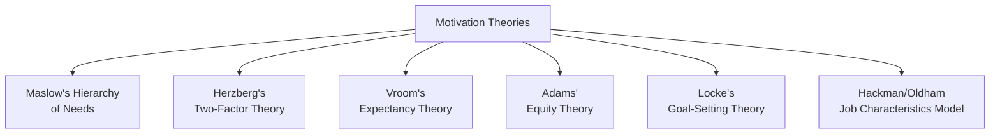
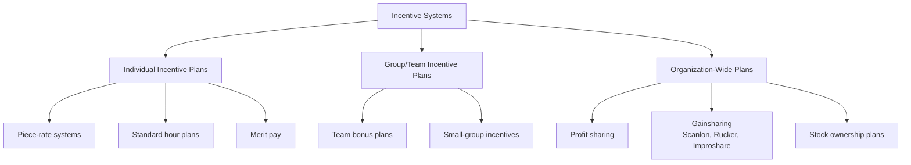

## Workforce Motivation and Incentive Systems

### Definition and Core Concept

Workforce motivation and incentive systems encompass the theoretical frameworks and practical compensation/reward mechanisms used to influence employee effort, performance, and engagement within an operations context. Incentive systems translate motivation theory into concrete pay structures and reward designs intended to align individual worker behavior with organizational productivity, quality, and efficiency goals.

### Foundational Motivation Theories

### Maslow's Hierarchy of Needs

Proposes that human needs exist in a hierarchy, and lower-level needs must be substantially satisfied before higher-level needs become motivating.

| Level | Need | Workplace Application |
| --- | --- | --- |
| 1 (base) | Physiological | Adequate wages to meet basic living needs |
| 2 | Safety | Job security, safe working conditions |
| 3 | Social/Belonging | Team cohesion, positive workplace relationships |
| 4 | Esteem | Recognition, status, achievement |
| 5 (top) | Self-actualization | Meaningful work, growth opportunities, autonomy |

[Inference — while widely taught, the strict sequential ordering of needs proposed by Maslow has been challenged empirically; it is best treated as a conceptual framework rather than a strictly validated predictive model]

### Herzberg's Two-Factor Theory

As applied in job design, this theory distinguishes hygiene factors (pay, working conditions, policies) that prevent dissatisfaction from motivator factors (achievement, recognition, responsibility) that create genuine satisfaction. This theory underlies job enrichment approaches to motivation, in contrast to purely financial incentive approaches.

### Vroom's Expectancy Theory

Proposes that motivation is a function of three beliefs, multiplied together:

$$Motivation = Expectancy \times Instrumentality \times Valence$$

| Component | Definition |
| --- | --- |
| **Expectancy** | Belief that effort will lead to the desired performance level |
| **Instrumentality** | Belief that the achieved performance will lead to a specific reward |
| **Valence** | The value or desirability the individual places on that reward |

Because the relationship is multiplicative, if any single component is zero (e.g., a worker believes no amount of effort will improve performance, or believes performance will not actually be rewarded), overall motivation collapses to zero regardless of the other two factors. This has direct implications for incentive system design: incentive plans must maintain clear, credible, and valued links between effort, performance, and reward.

### Adams' Equity Theory

Proposes that employees compare the ratio of their inputs (effort, skill, time) to outcomes (pay, recognition) against the same ratio for relevant comparison others (coworkers, industry peers). Perceived inequity — whether under-reward or over-reward — creates psychological tension that motivates corrective behavior (reduced effort, demands for higher pay, or turnover).

$$\frac{Outcomes_{self}}{Inputs_{self}} \quad vs. \quad \frac{Outcomes_{other}}{Inputs_{other}}$$

**Implication for incentive design:** Incentive systems perceived as unfair relative to peer compensation, even if objectively generous in absolute terms, can undermine motivation and increase turnover risk. [Inference — the strength of this effect depends on the transparency of compensation information and the specific comparison group employees select]

### Locke's Goal-Setting Theory

Proposes that specific, challenging (but attainable) goals lead to higher performance than vague or easy goals, provided the individual is committed to the goal and receives feedback on progress.

**Key Conditions for Effective Goals:**

- Specificity (clear, quantifiable targets rather than "do your best")
- Appropriate difficulty (challenging but achievable)
- Goal commitment (buy-in from the employee)
- Feedback (regular progress information)
- Task complexity considerations (very complex tasks may require goals focused on process/strategy rather than pure output)

### Types of Incentive Systems

### Individual Incentive Plans

**Piece-Rate Systems**

Workers are paid a fixed amount per unit of output produced, rather than (or in addition to) an hourly wage.

$$Earnings = (Units\ Produced \times Rate\ per\ Unit)$$

**Straight piece-rate example:**

If the rate is $0.75 per unit and a worker produces 320 units in a day:

$$Earnings = 320 \times \$0.75 = \$240.00$$

**Differential piece-rate (Taylor plan)**: Uses two different rates — a lower rate for output below a standard, and a higher rate for output at or above the standard — to more strongly incentivize meeting or exceeding the standard.

**Example (Taylor Differential Piece-Rate):**

Standard = 300 units/day. Rate below standard = $0.60/unit. Rate at/above standard = $0.80/unit.

| Scenario | Units Produced | Calculation | Earnings |
| --- | --- | --- | --- |
| Below standard | 280 | $280 \times \$0.60$ | $168.00 |
| At/above standard | 320 | $320 \times \$0.80$ | $256.00 |

**Standard Hour Plans**

Workers are paid their regular hourly wage for completing a job in the standard time or less; if completed faster than standard, they receive full pay for the standard time (effectively a bonus for the time saved), while working more slowly than standard typically results in pay based only on hours actually worked (or a guaranteed base rate, depending on plan design).

**Example:**

Standard time for a job = 4 hours at $20/hour = $80 standard pay. If a worker completes the job in 3 hours:

$$Earnings = 4\ hours \times \$20 = \$80.00 \text{ (paid for standard time, despite finishing early)}$$

This effectively raises the worker's effective hourly rate to $\$80 / 3\ hours \approx \$26.67/hour$ for that job.

### Group and Team-Based Incentive Plans

Group incentives distribute rewards based on collective performance of a team, department, or work unit rather than individual output, intended to support teamwork and reduce competition or inequity concerns among interdependent workers.

**Advantages:**

- Encourages cooperation and mutual assistance among team members
- Reduces the administrative complexity of tracking highly granular individual output
- Better suited to jobs where output is genuinely interdependent and difficult to attribute to a single individual

**Disadvantages:**

- Potential for "free-riding," where some members contribute less while still sharing in the reward
- Weaker direct link between individual effort and individual reward can reduce motivational strength for high performers [Inference — the magnitude of free-riding risk is influenced by group size, task visibility, and team cohesion]

### Organization-Wide Incentive Plans

**Profit Sharing**

A portion of company profits is distributed to employees, typically based on a predetermined formula, often paid annually or quarterly.

**Gainsharing**

Unlike profit sharing (tied to overall company profit, which is influenced by many factors outside employee control, such as market pricing), gainsharing ties bonuses specifically to measurable productivity or cost-saving improvements that employees can more directly influence.

| Gainsharing Plan | Core Measure | Description |
| --- | --- | --- |
| **Scanlon Plan** | Labor cost as a ratio of sales value of production | Bonus pool funded when labor cost ratio improves versus a historical base ratio |
| **Rucker Plan** | Labor cost as a ratio of value added | Similar to Scanlon but uses value added (sales minus materials/supplies cost) as the base |
| **Improshare (Improved Productivity through Sharing)** | Standard hours of output versus actual hours worked | Bonus based on productivity improvement measured in labor-hour terms, independent of cost/pricing fluctuations |

**Example (Simplified Improshare-style calculation):**

If the historical standard requires 1,000 labor-hours to produce a given output level, and the actual hours worked to produce that same output is 850 hours:

$$Hours\ Saved = 1{,}000 - 850 = 150\ hours$$

If the gainsharing formula splits savings 50/50 between the company and employees:

$$Employee\ Share = 150 \times 0.50 = 75\ hours\ worth\ of\ bonus\ pay$$

### Comparison of Incentive System Types

| Plan Type | Link to Individual Effort | Administrative Complexity | Best Suited For |
| --- | --- | --- | --- |
| Piece-rate | Very strong | Low-moderate | Highly standardized, easily measured individual output |
| Standard hour plan | Strong | Moderate | Jobs with established time standards |
| Team/group bonus | Moderate | Moderate | Interdependent team-based work |
| Profit sharing | Weak (diluted by external factors) | Low | Organization-wide alignment, long-term retention |
| Gainsharing | Moderate-strong (department/plant level) | Moderate-high | Productivity-focused improvement culture |

### Risks and Limitations of Incentive Systems

**Key Points**

- **Quality trade-offs**: Output-based individual incentives can encourage workers to sacrifice quality for speed/volume unless quality is also measured and factored into pay
- **Gaming and manipulation**: Workers may find ways to inflate measured output or manipulate metrics without genuinely improving productivity
- **Reduced intrinsic motivation ("crowding out")**: Some research suggests strong extrinsic financial incentives can, in certain contexts, reduce intrinsic motivation for tasks that were previously performed for inherent interest or satisfaction [Inference — the "motivation crowding" effect is an area of ongoing academic debate and appears context- and task-dependent rather than universal]
- **Inequity perceptions**: Poorly calibrated standards (too easy or too difficult) can create perceived unfairness, undermining the incentive's intended effect
- **Short-term focus**: Incentives tied to narrow, short-term metrics may discourage attention to long-term factors like equipment maintenance, safety, or skill development

### Designing Effective Incentive Systems

1. Ensure performance measures are accurate, fair, and difficult to manipulate
2. Set standards using rigorous work measurement methods (time study, PMTS) rather than arbitrary targets, to support perceived fairness
3. Balance individual and team-based components appropriate to the actual interdependence of the work
4. Include quality and safety metrics alongside output metrics to avoid unintended trade-offs
5. Communicate clearly how effort translates into reward (addressing expectancy and instrumentality directly)
6. Periodically review and recalibrate standards as methods, technology, or market conditions change

### Related Topics

- Job design principles and methods
- Job enrichment and job enlargement
- Time study and standard time determination
- Learning curves
- Performance measurement and appraisal systems
- Total compensation strategy
- Team-based work systems
- Organizational behavior in operations management