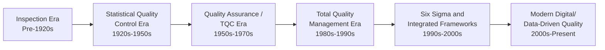
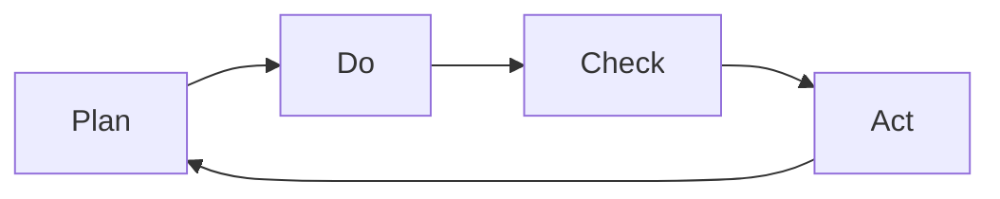

## Evolution of Quality Management Thought

### Definition and Core Concept

The evolution of quality management thought traces the historical development of ideas, philosophies, and methodologies concerning how organizations define, control, and improve product and service quality — from early inspection-based approaches through statistical control, company-wide quality philosophies, and into modern integrated quality management frameworks.

### Historical Timeline Overview

### Era 1: Inspection (Pre-1920s)

Quality was managed primarily through **inspection**, where finished products were examined after production to sort out defective units, rather than through control of the production process itself.

**Key Characteristics:**

- Reactive, after-the-fact approach; defects already incurred production cost before detection
- Focused on separating good units from bad units ("sorting")
- No systematic method for preventing defects from occurring
- Craftsman-based quality in earlier pre-industrial contexts relied on individual skill rather than formal systems

### Era 2: Statistical Quality Control (1920s–1950s)

The introduction of statistical methods marked a shift from pure inspection toward **process control** — using data to monitor and control the production process itself, catching problems before large quantities of defects accumulated.

**Key Figures and Contributions:**

| Figure | Contribution |
| --- | --- |
| **Walter Shewhart** | Developed the control chart (1924) at Bell Labs, introducing the concept of distinguishing common cause (natural) variation from special cause (assignable) variation in a process |
| **Harold Dodge and Harry Romig** | Developed acceptance sampling plans at Bell Labs, enabling statistically sound sampling-based inspection of incoming/outgoing lots rather than 100% inspection |
| **W. Edwards Deming** | Studied under Shewhart; later applied statistical quality control principles in postwar Japan, becoming highly influential in Japanese quality practices |

**Shewhart's Plan-Do-Check-Act (PDCA) Cycle**, though refined and popularized later, originated conceptually from this era's emphasis on iterative, data-driven process improvement.

**World War II Influence**: Wartime production demands accelerated adoption of statistical quality control in the United States, as military contracts required documented quality standards and inspection procedures at scale.

### Era 3: Quality Assurance / Total Quality Control (1950s–1970s)

This era broadened quality's scope from a purely statistical/manufacturing-floor activity to an organization-wide concern involving design, engineering, and management functions.

**Key Figures and Contributions:**

| Figure | Contribution |
| --- | --- |
| **W. Edwards Deming** | Developed the "14 Points for Management" and emphasized that most quality problems stem from systemic/management-controlled factors (common causes) rather than individual worker error |
| **Joseph Juran** | Introduced the "Quality Trilogy" (Quality Planning, Quality Control, Quality Improvement) and emphasized the cost of poor quality and management's responsibility for quality |
| **Armand Feigenbaum** | Coined the term "Total Quality Control" (TQC), emphasizing that quality is the responsibility of every department, not solely a quality control department |
| **Kaoru Ishikawa** | Developed the cause-and-effect (fishbone/Ishikawa) diagram and promoted quality circles, emphasizing company-wide employee involvement in quality |
| **Genichi Taguchi** | Developed robust design methods and the Taguchi Loss Function, framing quality loss as a continuous function of deviation from target rather than a simple pass/fail specification limit |

### Deming's 14 Points (Summary Categories)

Deming's points, while extensive, broadly emphasized:

1. Create constancy of purpose toward improvement
2. Adopt a new philosophy rejecting acceptance of defects as normal
3. Cease dependence on mass inspection; build quality into the process
4. End the practice of awarding business on price alone
5. Improve constantly the system of production and service
6. Institute training and retraining
7. Institute leadership rather than supervision focused on quotas
8. Drive out fear so employees can raise problems without reprisal
9. Break down barriers between departments
10. Eliminate slogans and exhortations that do not address systemic causes
11. Eliminate numerical quotas that can incentivize poor quality
12. Remove barriers that rob workers of pride of workmanship
13. Institute vigorous education and self-improvement programs
14. Put everyone in the company to work on the transformation

[Inference — this is a condensed thematic summary; Deming's original formulation contains specific wording and nuance not fully captured in a brief paraphrase]

### Juran's Quality Trilogy

| Component | Focus |
| --- | --- |
| **Quality Planning** | Identifying customers, determining their needs, and designing products/processes to meet those needs |
| **Quality Control** | Monitoring ongoing operations to ensure performance meets planned standards, taking corrective action on deviations |
| **Quality Improvement** | Achieving unprecedented levels of performance through structured, project-based improvement efforts |

### Taguchi's Contributions

Taguchi's **Quality Loss Function** proposed that any deviation from a target value — not just deviation beyond a specification limit — represents a loss to society, expressed as:

$$L(y) = k(y - T)^2$$

Where $L(y)$ is the loss, $y$ is the actual measured value, $T$ is the target value, and $k$ is a proportionality constant. This contrasts with a traditional "goal-post" view of quality (any value within specification limits is equally acceptable), instead framing quality as continuously improving as variation from target decreases, even within specification limits.

### Era 4: Total Quality Management (1980s–1990s)

TQM emerged as an integrated management philosophy synthesizing the contributions of Deming, Juran, Ishikawa, and others into a comprehensive, organization-wide approach to quality, heavily influenced by the success of Japanese manufacturers (particularly in automotive and electronics industries) that had adopted statistical and company-wide quality practices earlier.

**Core TQM Principles:**

| Principle | Description |
| --- | --- |
| Customer focus | Quality defined by meeting/exceeding customer expectations |
| Continuous improvement (Kaizen) | Ongoing, incremental improvement rather than one-time fixes |
| Employee involvement | Empowering all employees, not just quality specialists, to contribute to quality |
| Process focus | Managing quality through process control rather than end-inspection alone |
| Management commitment | Quality driven by top leadership, not delegated solely to a quality department |
| Fact-based decision making | Reliance on data and statistical tools rather than opinion |

**U.S. Institutionalization of TQM:**

- The **Malcolm Baldrige National Quality Award** was established in 1987 in the United States, providing a formal framework and award recognizing organizational excellence in quality management
- The **ISO 9000** series of international quality management standards was first published in 1987, providing a certifiable framework for quality management systems

### Era 5: Six Sigma and Integrated Frameworks (1990s–2000s)

**Six Sigma**, pioneered at Motorola in the 1980s and popularized broadly by General Electric in the 1990s, introduced a highly structured, statistically rigorous, project-based approach to quality improvement, targeting a defect rate of 3.4 defects per million opportunities (DPMO).

**Key Structural Elements:**

- **DMAIC methodology** (Define, Measure, Analyze, Improve, Control) for improving existing processes
- **DMADV/DFSS** (Define, Measure, Analyze, Design, Verify / Design for Six Sigma) for designing new processes
- Formalized belt-based certification hierarchy (Green Belt, Black Belt, Master Black Belt)

**Lean Manufacturing** integration also intensified during this period, combining waste-elimination principles (from the Toyota Production System) with statistical quality improvement, giving rise to hybrid approaches often termed **Lean Six Sigma**.

### Era 6: Modern Digital and Data-Driven Quality (2000s–Present)

**Key Points**

- Integration of quality management with enterprise digital systems (quality management software, statistical process control software)
- Increased use of real-time sensor data and IoT (Internet of Things) for continuous process monitoring
- Application of predictive analytics and machine learning to anticipate quality failures before they occur
- Growing emphasis on quality within complex, global, multi-tier supply chains, requiring supplier quality management systems
- Continued evolution of standards frameworks (e.g., updated ISO 9001 revisions incorporating risk-based thinking)

[Inference — the specific pace and extent of digital quality tool adoption varies significantly across industries and organizational maturity levels]

### Comparative Summary of Major Quality Philosophies

| Philosophy/Framework | Primary Originator(s) | Core Emphasis |
| --- | --- | --- |
| Statistical Quality Control | Shewhart, Dodge, Romig | Statistical process monitoring |
| 14 Points / Systemic View | Deming | Management responsibility for systemic quality causes |
| Quality Trilogy | Juran | Planning, control, and improvement as distinct managerial processes |
| Company-Wide Quality Control | Feigenbaum, Ishikawa | Quality as a cross-functional, organization-wide responsibility |
| Robust Design / Loss Function | Taguchi | Minimizing variation from target, not just meeting specification limits |
| Total Quality Management | Synthesis of above | Integrated, customer-focused, continuous improvement culture |
| Six Sigma | Motorola, GE | Statistically rigorous, project-based defect reduction |
| Lean Six Sigma | Toyota Production System + Six Sigma | Combined waste elimination and statistical quality improvement |

### Enduring Themes Across the Evolution

- **Shift from detection to prevention**: Progressive movement from inspecting defects after the fact toward preventing defects through process design and control
- **Shift from narrow to broad ownership**: Quality responsibility expanded from a dedicated inspection department to encompass the entire organization
- **Increasing reliance on data**: Each era generally increased the rigor and volume of data used to inform quality decisions
- **Customer-centricity**: Later eras increasingly defined quality relative to customer needs and expectations rather than purely internal conformance standards

### Related Topics

- Statistical process control (control charts)
- Total Quality Management principles and implementation
- Six Sigma and DMAIC methodology
- ISO 9000 quality management standards
- Malcolm Baldrige National Quality Award criteria
- Taguchi methods and robust design
- Cost of quality
- Lean manufacturing and the Toyota Production System