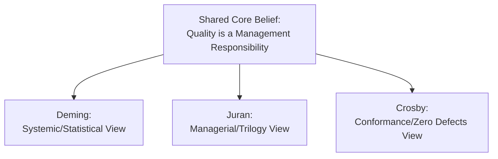
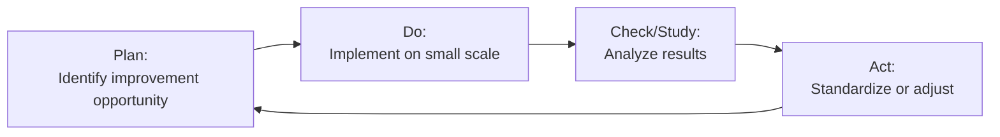
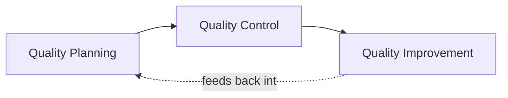
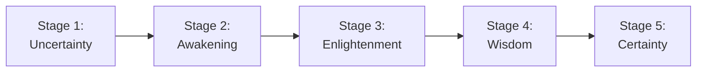

## Contributions of Deming, Juran, and Crosby

### Overview

W. Edwards Deming, Joseph Juran, and Philip Crosby are widely regarded as three of the most influential figures in the development of modern quality management thought. Each developed a distinct philosophical framework, yet all three shared a common core belief: quality is fundamentally a management responsibility, not merely a function of factory-floor inspection.

### W. Edwards Deming

**Background**: Deming, a statistician who studied under Walter Shewhart, applied statistical quality control principles extensively in post-World War II Japan, where his teachings were highly influential in Japanese manufacturers' quality transformation. He later became prominent in the United States following increased attention to Japanese quality competitiveness in the 1980s.

**Core Philosophy**: Deming argued that the vast majority of quality problems (he estimated roughly 94%, a figure often cited in quality literature) stem from **common causes** — systemic issues built into the process design, materials, equipment, or management systems — rather than **special causes** attributable to individual worker error. Since common causes are embedded in the system, only management (which controls the system) has the authority to address them.

**The Deming Cycle (PDCA / PDSA)**

Deming popularized and refined the **Plan-Do-Check-Act** cycle (later often called Plan-Do-Study-Act, PDSA) as a structured, iterative approach to continuous process improvement.

**Deming's 14 Points for Management (thematic summary):**

| Category | Representative Points |
| --- | --- |
| Constancy of purpose | Create long-term commitment to improvement rather than short-term profit focus |
| Adopt new philosophy | Reject acceptance of defects, delays, and mistakes as inevitable |
| Cease dependence on inspection | Build quality into the process rather than inspecting defects out afterward |
| End lowest-price purchasing | Move toward long-term supplier relationships based on quality and trust, not price alone |
| Improve constantly | Continuously improve production and service systems |
| Institute training | Ensure workers and management are properly trained for their roles |
| Drive out fear | Enable employees to report problems and ask questions without fear of reprisal |
| Break down departmental barriers | Encourage cross-functional collaboration |
| Eliminate slogans and quotas | Numerical targets divorced from process improvement can incentivize poor quality or gaming of metrics |
| Institute leadership | Replace supervision focused on output numbers with leadership focused on process improvement |
| Transformation is everyone's job | Quality transformation requires participation at all organizational levels |

[Inference — this is a condensed thematic grouping of Deming's original 14 points; the original formulation contains more specific wording and context]

**Deming's System of Profound Knowledge**

Later in his career, Deming articulated four interrelated areas of knowledge necessary for effective management:

1. **Appreciation for a system**: Understanding how organizational components interact and affect one another
2. **Knowledge of variation**: Distinguishing common cause from special cause variation using statistical methods
3. **Theory of knowledge**: Understanding how organizational learning and prediction occur
4. **Psychology**: Understanding human motivation and behavior in the workplace

### Joseph Juran

**Background**: Juran, also highly influential in postwar Japanese quality development, approached quality primarily from a managerial and economic perspective rather than Deming's more statistically grounded approach, though both shared substantial common ground.

**The Juran Trilogy**

Juran proposed that quality management consists of three interrelated managerial processes:

| Process | Description | Key Activities |
| --- | --- | --- |
| **Quality Planning** | Developing the products, services, and processes needed to meet customer needs | Identify customers, determine their needs, develop product/process features, establish process controls |
| **Quality Control** | Ongoing monitoring to ensure operations meet planned performance | Evaluate actual performance, compare to goals, act on differences |
| **Quality Improvement** | Achieving breakthrough levels of performance beyond current standards | Establish infrastructure, identify improvement projects, diagnose causes, implement remedies |

**Juran's Cost of Quality Framework**

Juran was highly influential in framing quality in economic terms, categorizing quality-related costs into four groups:

| Cost Category | Description | Example |
| --- | --- | --- |
| Prevention costs | Costs incurred to prevent defects from occurring | Training, quality planning, process improvement |
| Appraisal costs | Costs of measuring and inspecting to detect defects | Inspection, testing, audits |
| Internal failure costs | Costs of defects found before reaching the customer | Scrap, rework, downtime |
| External failure costs | Costs of defects found after reaching the customer | Warranty claims, returns, reputational damage |

Juran's economic framing helped justify quality investment to management audiences by demonstrating that spending on prevention and appraisal typically reduces the larger, often hidden, costs of internal and external failure.

**Juran's "Fitness for Use" Definition**

Juran defined quality succinctly as **"fitness for use"** — meaning a product or service performs as the customer expects and needs it to, a customer-centric framing that influenced later quality definitions broadly.

**Pareto Principle Application**

Juran popularized the application of the **Pareto Principle** ("vital few, trivial many") to quality management, observing that a small number of causes (roughly 20%) typically account for the majority (roughly 80%) of quality problems, providing a rationale for prioritizing improvement efforts on the most impactful causes rather than spreading resources evenly. [Inference — the specific 80/20 ratio is illustrative and approximate; actual distributions vary across specific quality problem sets]

### Philip Crosby

**Background**: Crosby, drawing on his experience in quality management roles in the U.S. manufacturing and defense industries, took a more conformance-and-management-attitude-focused approach compared to Deming's statistical emphasis and Juran's economic/managerial framing.

**Crosby's Four Absolutes of Quality Management**

| Absolute | Description |
| --- | --- |
| 1. Quality is defined as conformance to requirements | Not as an abstract notion of "goodness," but as meeting clearly specified requirements |
| 2. The system for causing quality is prevention | Not appraisal/inspection after the fact |
| 3. The performance standard is Zero Defects | Not "acceptable quality levels" that tolerate some defect rate |
| 4. The measurement of quality is the Price of Nonconformance (PONC) | The cost of not doing things right the first time |

**Zero Defects Philosophy**

Crosby's "Zero Defects" concept, perhaps his most well-known and debated contribution, argues that organizations should aim for defect-free work as the standard, rather than accepting a statistically "acceptable" defect rate as inevitable. Crosby framed this primarily as a matter of employee attitude and management commitment rather than solely a statistical or technical challenge.

[Inference — the Zero Defects concept has drawn both strong advocacy and significant academic critique; critics, including some aligned with Deming's more statistically grounded view, have argued that treating "zero defects" purely as a motivational/attitudinal target without addressing underlying systemic and statistical process variation may be unrealistic or even counterproductive in some contexts]

**Crosby's Quality Management Maturity Grid**

Crosby developed a maturity model describing organizational progression through quality management stages:

**Crosby's 14 Steps to Quality Improvement (thematic summary):**

Crosby's improvement process emphasized management commitment, employee education, goal-setting, and recognition, structured as a sequential organizational change process beginning with visible management commitment and culminating in an ongoing, institutionalized quality culture. [Inference — condensed thematic summary; the original 14-step formulation includes more specific sequential detail]

### Comparative Analysis: Deming vs. Juran vs. Crosby

| Dimension | Deming | Juran | Crosby |
| --- | --- | --- | --- |
| Primary lens | Statistical/systemic | Managerial/economic | Attitudinal/conformance |
| Quality definition emphasis | Reduction of variation | Fitness for use | Conformance to requirements |
| View on defect targets | Continuous reduction of variation (no fixed "acceptable" endpoint) | Economically optimal quality level (balancing cost of quality) | Zero Defects as the standard |
| Primary tool emphasis | Statistical process control, control charts | Cost of quality, Pareto analysis, project-by-project improvement | Motivational/cultural programs, cost of nonconformance |
| View of numerical quotas | Generally critical (can incentivize gaming) | More neutral/supportive of measurable targets within economic framework | Supportive of clear, high (zero-defect) targets |
| Degree of statistical rigor emphasized | Very high | Moderate-high | Lower (more behavioral/cultural focus) |

### Areas of Agreement Across All Three

**Key Points**

- Quality is primarily a management responsibility, not solely a worker or inspection department responsibility
- Prevention is superior to detection/inspection as a quality strategy
- Continuous improvement, rather than a one-time fix, is necessary for sustained quality performance
- Top management commitment and leadership are essential prerequisites for successful quality initiatives
- Cross-functional and organization-wide involvement is necessary; quality cannot be isolated to a single department

### Areas of Divergence and Debate

- Deming's rejection of numerical quotas contrasts with Crosby's embrace of a specific numerical target (Zero Defects), reflecting differing views on how targets influence behavior
- Juran's economically-optimized view of quality investment (balancing prevention/appraisal costs against failure costs) differs from Crosby's more absolute framing that failure costs always justify maximal prevention investment toward zero defects
- Deming's heavier statistical emphasis contrasts with Crosby's more behavioral/motivational approach, reflecting different views on whether quality problems are primarily technical/systemic or attitudinal in origin

### Related Topics

- Evolution of quality management thought
- Total Quality Management principles and implementation
- Cost of quality
- Statistical process control (control charts)
- Pareto analysis and quality improvement prioritization
- ISO 9000 quality management standards
- Six Sigma and DMAIC methodology
- Continuous improvement (Kaizen)