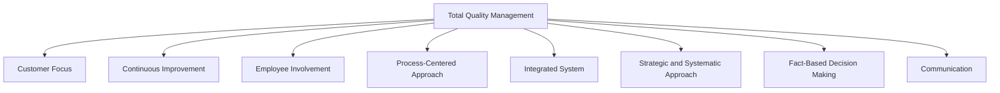
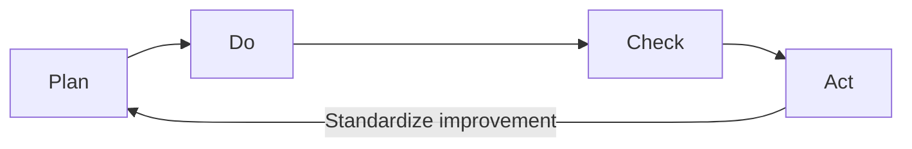
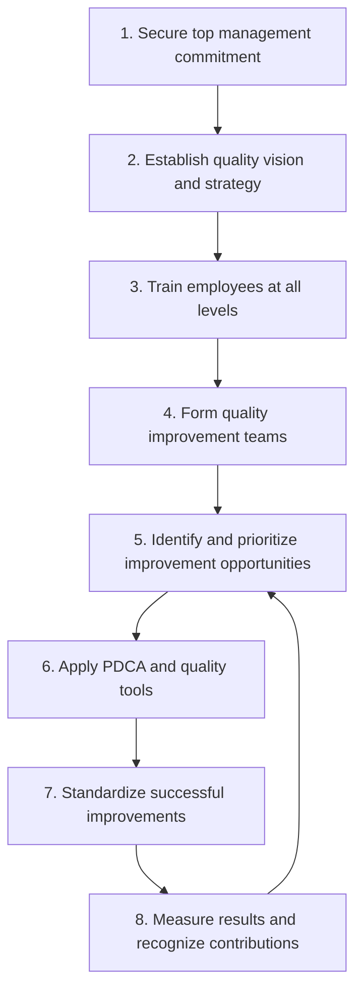

## Total Quality Management Principles

### Definition and Core Concept

Total Quality Management (TQM) is an integrated, organization-wide management philosophy that emphasizes continuous improvement, customer focus, and the participation of all employees in achieving long-term quality and organizational success. TQM synthesizes contributions from earlier quality pioneers (Deming, Juran, Crosby, Ishikawa, Feigenbaum) into a comprehensive management approach rather than a narrow technical or statistical discipline alone.

### Core Principles of TQM

### Principle 1: Customer Focus

Quality is ultimately defined by the customer, not solely by internal specifications or engineering standards. TQM emphasizes understanding both **internal customers** (the next process step or department receiving output) and **external customers** (end users, purchasers) to ensure quality efforts are aligned with actual needs and expectations.

**Key Points**

- Voice of the Customer (VOC) methods (surveys, focus groups, complaint analysis) used to systematically capture customer requirements
- Quality Function Deployment (QFD) used to translate customer requirements into specific design and process characteristics
- Customer satisfaction measurement as an ongoing feedback loop, not a one-time assessment

### Principle 2: Continuous Improvement (Kaizen)

TQM rejects the notion of a fixed, "acceptable" quality level, instead emphasizing ongoing, incremental improvement as a permanent organizational activity rather than a one-time project.

**Key Concepts:**

- **Kaizen**: Japanese term for continuous, incremental improvement, involving all employees, applied to processes across the organization
- **PDCA/PDSA cycle**: Plan-Do-Check-Act (or Plan-Do-Study-Act), a structured, iterative method for testing and implementing improvements
- **Benchmarking**: Comparing organizational processes and performance against best-in-class internal or external references to identify improvement opportunities

### Principle 3: Employee Involvement

TQM holds that quality cannot be achieved by a dedicated quality department alone; every employee, at every level, has a role in creating and maintaining quality. This principle draws heavily on Ishikawa's and Feigenbaum's earlier emphasis on company-wide quality participation.

**Mechanisms for Employee Involvement:**

| Mechanism | Description |
| --- | --- |
| **Quality circles** | Small groups of employees who meet regularly to identify and solve quality-related problems in their work area |
| **Employee empowerment** | Granting front-line employees authority to make quality-related decisions and stop production when defects are identified |
| **Cross-functional teams** | Teams drawing members from multiple departments to address quality issues that span functional boundaries |
| **Suggestion systems** | Formal mechanisms for employees to propose quality or process improvements |
| **Training and skill development** | Ongoing investment in employee capability, since quality improvement requires problem-solving and statistical skills at all organizational levels |

### Principle 4: Process-Centered Approach

TQM emphasizes managing and improving the **processes** that produce outputs, rather than solely inspecting and reacting to the outputs themselves. A well-designed and controlled process is expected to reliably produce quality outputs, reducing the need for extensive after-the-fact inspection.

**Key Tools Supporting Process Focus:**

- Process mapping and flowcharting to visualize and analyze workflow
- Statistical process control (control charts) to monitor process stability and distinguish common cause from special cause variation
- Standardized work procedures to reduce unwanted process variation

### Principle 5: Integrated System

TQM views the organization as an interconnected system in which quality in one area (e.g., supplier quality) directly affects quality outcomes elsewhere (e.g., final product quality). This systems view discourages siloed, department-specific quality efforts in favor of coordinated, organization-wide alignment.

**Key Points**

- Quality management systems (e.g., aligned with ISO 9001 principles) formalize this integration through documented policies, procedures, and quality objectives
- Supplier quality management extends the quality system beyond organizational boundaries into the supply chain
- Cross-departmental alignment ensures that quality objectives in one function (e.g., manufacturing) do not conflict with objectives elsewhere (e.g., sales, procurement)

### Principle 6: Strategic and Systematic Approach

Quality improvement under TQM is treated as a core strategic objective integrated into the organization's overall strategic planning, rather than a tactical or isolated initiative.

- Quality goals are cascaded from top-level strategic objectives down through departmental and individual performance metrics
- Long-term planning horizons are emphasized over short-term cost-cutting that might compromise quality
- Structured deployment methods (e.g., Hoshin Kanri / policy deployment) are sometimes used to align quality objectives across all organizational levels

### Principle 7: Fact-Based Decision Making

TQM emphasizes that quality decisions should be grounded in data and statistical analysis rather than opinion, intuition, or anecdote alone.

**Core Quality Tools Commonly Used:**

| Tool | Purpose |
| --- | --- |
| **Check sheets** | Structured data collection forms |
| **Pareto charts** | Prioritizing the "vital few" causes of quality problems |
| **Cause-and-effect (Ishikawa/fishbone) diagrams** | Identifying potential root causes of a problem |
| **Histograms** | Visualizing the distribution of process data |
| **Control charts** | Monitoring process stability over time |
| **Scatter diagrams** | Identifying relationships between two variables |
| **Flowcharts** | Mapping process steps to identify inefficiencies or failure points |

These are often referred to collectively as the **"Seven Basic Quality Tools,"** foundational to TQM's fact-based approach.

### Principle 8: Communication

Effective communication — both vertically (management to employees and vice versa) and horizontally (across departments) — is essential to sustaining a TQM culture, ensuring that quality goals, standards, and improvement results are transparently shared throughout the organization.

### TQM Implementation Framework

### Relationship Between TQM and Related Frameworks

| Framework | Relationship to TQM |
| --- | --- |
| **ISO 9001** | Provides a certifiable, documented quality management system framework that operationalizes many TQM principles (process focus, continuous improvement, customer focus) |
| **Malcolm Baldrige Criteria** | A structured self-assessment and award framework closely aligned with TQM principles, used to evaluate organizational quality management maturity |
| **Six Sigma** | A more statistically rigorous, project-based methodology often implemented within a broader TQM culture, providing structured tools (DMAIC) for specific improvement projects |
| **Lean Manufacturing** | Complements TQM's quality focus with a parallel emphasis on waste elimination; frequently integrated as "Lean Six Sigma" or "Lean TQM" hybrid approaches |

### Benefits of TQM Implementation

**Key Points**

- Improved product/service quality and consistency
- Increased customer satisfaction and loyalty
- Reduced costs associated with rework, scrap, and warranty claims (cost of poor quality)
- Improved employee morale and engagement through meaningful involvement in improvement efforts
- Enhanced organizational agility and responsiveness to changing customer needs
- Stronger supplier relationships through integrated quality expectations

### Common Barriers to Successful TQM Implementation

- **Lack of sustained top management commitment**: TQM initiatives that are treated as short-term programs rather than long-term cultural change often fail to produce lasting results
- **Insufficient employee training**: Without adequate statistical and problem-solving skill development, employee involvement efforts may lack the tools needed to drive meaningful improvement
- **Resistance to cultural change**: Shifting from a blame-oriented or inspection-focused culture to a collaborative, prevention-focused culture can face significant organizational resistance
- **Misaligned incentive systems**: Reward structures that emphasize short-term output volume over quality can undermine TQM objectives
- **Treating TQM as a program rather than a philosophy**: Organizations that implement TQM tools mechanically without genuine cultural adoption often see limited or temporary results [Inference — the specific failure rate and causes of TQM implementation difficulties are widely discussed in management literature but vary substantially by organizational context, making generalized statistics difficult to state with precision]

### Criticisms and Limitations of TQM

- Some critics argue TQM's broad, philosophical nature makes it difficult to implement consistently compared to more structured methodologies like Six Sigma
- The emphasis on incremental, continuous improvement (Kaizen) may be less suited to situations requiring rapid, breakthrough (radical) innovation
- Measuring the direct return on investment of TQM initiatives can be challenging, since benefits (culture, morale, long-term customer loyalty) are not always easily quantifiable in the short term [Inference — this measurement challenge is widely noted in quality management literature, though its practical significance varies by organization and metric design]

### Related Topics

- Evolution of quality management thought
- Contributions of Deming, Juran, and Crosby
- Statistical process control (control charts)
- Seven basic quality tools
- ISO 9000 quality management standards
- Six Sigma and DMAIC methodology
- Cost of quality
- Quality Function Deployment (QFD)