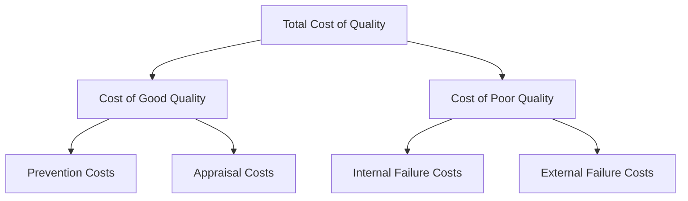
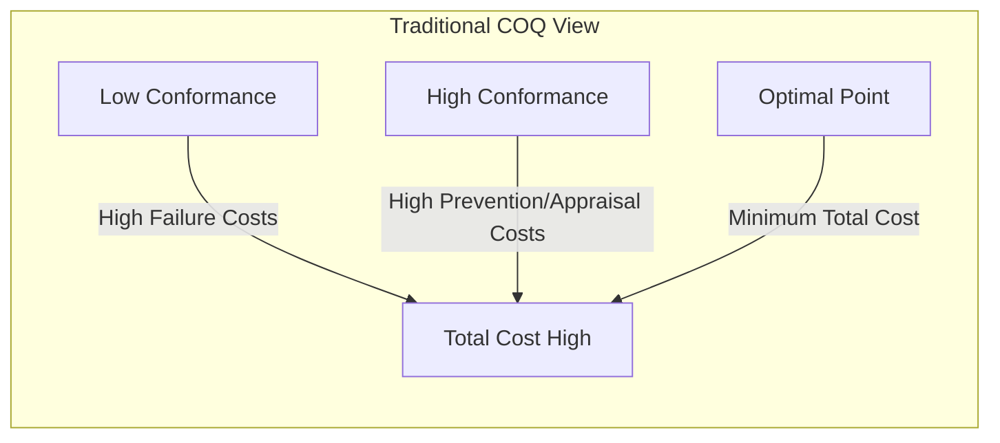
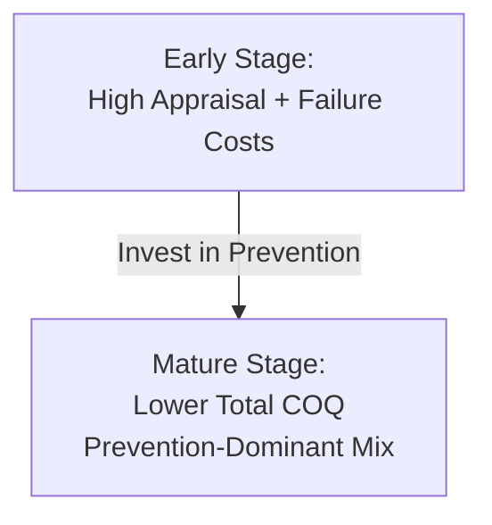

## Cost of Quality Framework

### Definition and Core Concept

The Cost of Quality (COQ) framework is a method for quantifying the total financial impact of quality-related activities within an organization, encompassing both the costs of ensuring good quality (prevention and appraisal) and the costs incurred when quality fails (internal and external failure). The framework, significantly developed and popularized by Joseph Juran and later Armand Feigenbaum, provides an economic rationale for quality investment by making quality costs visible to management in financial terms rather than purely technical or statistical terms.

### The Four Cost of Quality Categories

### Prevention Costs

Costs incurred to prevent defects and errors from occurring in the first place — investments made **before** production or service delivery begins.

**Examples:**

- Quality planning and quality system design
- Employee training in quality methods and procedures
- Process capability studies and design reviews
- Supplier quality assurance and qualification programs
- Preventive maintenance of equipment
- Quality circles and improvement project activities

### Appraisal Costs

Costs incurred to measure, evaluate, and audit products or services to ensure conformance to quality standards — activities that detect defects but do not prevent them from occurring.

**Examples:**

- Incoming material inspection
- In-process inspection and testing
- Final product inspection and testing
- Calibration and maintenance of测试 measurement/testing equipment
- Quality audits
- Field testing of products before full release

### Internal Failure Costs

Costs associated with defects discovered **before** the product or service reaches the customer.

**Examples:**

- Scrap (materials/products that cannot be used or reworked)
- Rework (correcting defective units before shipment)
- Re-inspection and re-testing after rework
- Downtime caused by quality problems
- Failure analysis to determine root causes
- Price reductions or downgrading of off-spec products (e.g., selling as "second quality")

### External Failure Costs

Costs associated with defects discovered **after** the product or service reaches the customer — generally the most damaging cost category, since it includes both direct financial costs and harder-to-quantify reputational damage.

**Examples:**

- Warranty claims and repair costs
- Product returns and replacements
- Complaint handling and customer service costs related to defects
- Product recalls
- Liability claims and litigation costs
- Lost sales and customer goodwill due to reputational damage
- Lost future business from dissatisfied customers

### The Cost of Quality "Iceberg" Concept

A widely used visual metaphor illustrates that visible, easily measured costs (like scrap and warranty claims) represent only a fraction of the true cost of poor quality; many costs remain hidden or difficult to quantify precisely.

<svg xmlns="http://www.w3.org/2000/svg" viewBox="0 0 500 320">
<text x="250" y="24" font-size="16" text-anchor="middle" font-family="sans-serif" font-weight="bold">Cost of Quality Iceberg (svg_diagram)</text>
<rect x="0" y="60" width="500" height="80" fill="#dbeafe" opacity="0.5" />
<line x1="0" y1="140" x2="500" y2="140" stroke="#2b6cb0" stroke-width="1" stroke-dasharray="4,4" />
<text x="10" y="75" font-family="sans-serif" font-size="10" fill="#1e40af">Waterline</text>
<polygon points="180,60 320,60 260,100 230,100" fill="#93c5fd" stroke="#1e40af" stroke-width="1.5" />
<text x="250" y="82" text-anchor="middle" font-family="sans-serif" font-size="10">Visible Costs:</text>
<text x="250" y="95" text-anchor="middle" font-family="sans-serif" font-size="9">Scrap, Rework, Warranty</text>
<polygon points="230,100 260,100 340,300 160,300" fill="#1e3a8a" stroke="#1e40af" stroke-width="1.5" />
<text x="250" y="150" text-anchor="middle" font-family="sans-serif" font-size="9" fill="white">Hidden Costs:</text>
<text x="250" y="170" text-anchor="middle" font-family="sans-serif" font-size="9" fill="white">Lost customer goodwill</text>
<text x="250" y="190" text-anchor="middle" font-family="sans-serif" font-size="9" fill="white">Lost future sales</text>
<text x="250" y="210" text-anchor="middle" font-family="sans-serif" font-size="9" fill="white">Excess inventory buffers</text>
<text x="250" y="230" text-anchor="middle" font-family="sans-serif" font-size="9" fill="white">Management time on failures</text>
<text x="250" y="250" text-anchor="middle" font-family="sans-serif" font-size="9" fill="white">Reduced employee morale</text>
<text x="250" y="270" text-anchor="middle" font-family="sans-serif" font-size="9" fill="white">Opportunity costs</text>
</svg>

[Inference — the "iceberg" is a widely used conceptual/illustrative metaphor in quality management literature rather than a precisely measured proportional depiction]

### Total Cost of Quality Formula

$$Total\ COQ = Prevention + Appraisal + Internal\ Failure + External\ Failure$$

**Worked Example:**

A manufacturing plant reports the following annual quality-related costs:

| Category | Annual Cost |
| --- | --- |
| Prevention (training, quality planning) | $120,000 |
| Appraisal (inspection, testing) | $280,000 |
| Internal failure (scrap, rework) | $450,000 |
| External failure (warranty, returns) | $650,000 |

$$Total\ COQ = 120{,}000 + 280{,}000 + 450{,}000 + 650{,}000 = \$1{,}500{,}000$$

If annual sales revenue is $15,000,000, the Cost of Quality as a percentage of sales:

$$COQ\% = \frac{1{,}500{,}000}{15{,}000{,}000} \times 100 = 10\%$$

[Inference — a COQ figure in the range of roughly 10-20% of sales is commonly cited in quality management literature as typical for organizations without mature quality systems, though actual figures vary substantially by industry, product complexity, and quality system maturity]

### The Classic Cost of Quality Trade-off Curve

Traditional quality economics proposed an optimal quality level where the sum of prevention/appraisal costs and failure costs is minimized — implying that pursuing quality beyond a certain point becomes economically inefficient, since prevention/appraisal costs would rise faster than failure costs decline.

**Modern Critique of the Traditional Trade-off View**

This traditional "optimal quality level" model has been substantially challenged, particularly by Philip Crosby and later quality thought, which argues that as prevention investment matures and process capability improves, both failure costs AND total prevention/appraisal costs can decline simultaneously — meaning there is effectively no fixed economic optimum short of striving toward zero defects, since well-designed prevention investment eventually reduces the need for extensive appraisal as well. [Inference — this is a widely cited theoretical debate in quality management literature; the empirical relationship between conformance level and total cost is context-dependent and varies by industry, process maturity, and specific cost structure]

### Modern COQ View: Investment Shifts Cost Structure Over Time

As organizations mature their quality systems, the cost mix typically shifts toward a higher proportion of prevention costs and a lower proportion of total costs overall, since effective prevention reduces both failure costs and, eventually, the extensive appraisal/inspection previously needed to catch defects. [Inference — this directional shift is a widely described pattern in quality management literature, though the specific pace and magnitude of cost mix change vary by organization]

### Uses of the Cost of Quality Framework

**Key Points**

- Justifying investment in quality improvement initiatives by translating technical quality issues into financial terms management can act on
- Identifying which cost category is disproportionately large, guiding where improvement resources should be focused (often applying Pareto analysis within the COQ categories)
- Tracking quality improvement progress over time by monitoring COQ as a percentage of sales or operating costs
- Benchmarking quality performance against industry standards or best-in-class organizations
- Supporting business cases for capital investment in process improvement, automation, or supplier quality programs

### Challenges in Measuring Cost of Quality

- **Hidden and indirect costs are difficult to quantify precisely**: Lost customer goodwill, reduced employee morale, and opportunity costs of management time spent firefighting quality issues are real but not easily captured in standard accounting systems
- **Inconsistent categorization across organizations**: Different companies may classify similar costs differently (e.g., some may count certain inspection activities as prevention rather than appraisal), complicating benchmarking
- **Accounting system limitations**: Standard financial/cost accounting systems are often not structured to automatically segregate costs into the four COQ categories, requiring supplemental data collection and estimation
- **Short-term vs. long-term cost visibility**: External failure costs, particularly reputational damage and lost future sales, may not manifest in financial statements until well after the underlying quality failure occurred [Inference — the degree of lag and difficulty in attribution varies substantially by industry and customer relationship structure]

### Cost of Quality and Related Frameworks

| Framework | Relationship to COQ |
| --- | --- |
| **Total Quality Management (TQM)** | COQ provides the economic justification and measurement framework supporting TQM's continuous improvement philosophy |
| **Six Sigma** | Six Sigma projects frequently use COQ (particularly reduction in internal/external failure costs) as a primary financial metric for evaluating project value |
| **ISO 9001** | While not mandating a specific COQ methodology, quality management systems certified under ISO 9001 often incorporate cost-of-quality-style metrics into management review processes |
| **Juran's Quality Trilogy** | COQ directly supports the "Quality Improvement" phase of the trilogy by identifying and prioritizing high-cost problem areas |

### Related Topics

- Contributions of Deming, Juran, and Crosby
- Total Quality Management principles
- Pareto analysis and quality improvement prioritization
- Six Sigma and DMAIC methodology
- Statistical process control (control charts)
- Quality Function Deployment (QFD)
- Supplier quality management
- ISO 9000 quality management standards