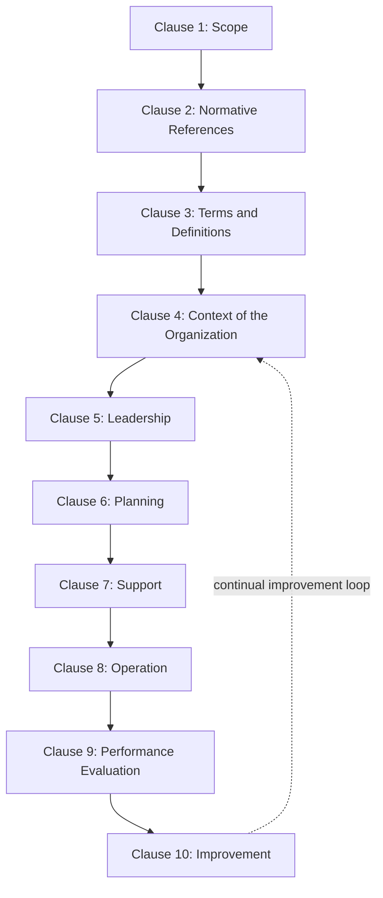

## ISO 9000 Quality Management Systems

### Definition and Core Concept

ISO 9000 refers to a family of international standards, published by the International Organization for Standardization (ISO), concerned with quality management systems (QMS). The family provides a framework and set of principles organizations can use to consistently meet customer and regulatory requirements while pursuing continual improvement. **ISO 9001** is the only standard within the family against which organizations can be formally certified; the other standards in the family are supporting/guidance documents rather than certifiable requirements.

### The ISO 9000 Family Structure

| Standard | Purpose |
| --- | --- |
| **ISO 9000** | Provides fundamental concepts, principles, and vocabulary used throughout the family |
| **ISO 9001** | Specifies the requirements for a quality management system; the only certifiable standard in the family |
| **ISO 9004** | Provides guidance for sustained organizational success and performance improvement beyond basic ISO 9001 compliance |
| **ISO 19011** | Provides guidance on auditing management systems, including quality management systems |

### Current Status and Revision Timeline

The fifth and current edition of ISO 9001 was published in 2015, and it is scheduled to be withdrawn and replaced by ISO 9001:2026. International consensus to proceed with this revision was reached in August 2023, with the revised version expected to be published in September 2026. Organizations already certified to ISO 9001:2015 will be granted a transition period to migrate to the new edition, with specifics available through their certification body. Given the current date, this revision may already be published or imminent — organizations should verify the latest status directly with ISO or their certification body. [ISO 9001:2015 - Quality management systems — Requirements +2](https://www.iso.org/standard/62085.html)

### High-Level Structure (Annex SL) and Clause Overview

ISO 9001:2015 consists of 10 clauses, with the first three clauses providing background to the standard and clauses 4 through 10 describing the actual requirements. The standard follows the harmonized structure used across ISO management system standards, making its auditable content sit in Clauses 4 to 10. [Tech Quality Pedia](https://techqualitypedia.com/clauses-of-iso-9001/)[ISO Library](https://iso-library.com/standard/9001/)

Clauses 1 to 3 cover scope, normative references, and terms (with the terms taken from ISO 9000), while the auditable requirements are: context of the organization (4), leadership (5), planning (6), support (7), operation (8), performance evaluation (9), and improvement (10). This shared structure is what makes ISO 9001 straightforward to integrate with other management system standards such as ISO 14001, ISO 45001, and ISO/IEC 27001. [ISO Library](https://iso-library.com/standard/9001/)[ISO Library](https://iso-library.com/standard/9001/)

### Clause-by-Clause Summary

**Clause 4 — Context of the Organization**

The organization is required to determine internal and external issues relevant to its purpose and strategic direction that affect its ability to achieve the intended results of its quality management system. This includes defining the scope of the QMS by taking into account the organization's strategic objectives, key products and services, risk tolerance, and any regulatory, contractual, or stakeholder obligations. [Instate](https://www.instate.biz/wp-content/uploads/2020/09/ISO-9001-2015-Quality-Management-Systems-Requirements.pdf)[Instate](https://www.instate.biz/wp-content/uploads/2020/09/ISO-9001-2015-Quality-Management-Systems-Requirements.pdf)

**Clause 5 — Leadership**

Top management must demonstrate leadership and commitment, establish and communicate a quality policy, and ensure that responsibilities and authorities are assigned, communicated, and understood. [The 9000 Store](https://the9000store.com/iso-9001-2015-requirements/)

**Clause 6 — Planning**

This clause covers organizational quality management system planning to address organizational risks, opportunities, changes, and quality objectives. A significant feature of this clause is that quality objectives must include a description of who is responsible, what the target is, and when it is planned to be achieved, with progress monitored over time. [The 9000 Store](https://the9000store.com/iso-9001-2015-requirements/)[Qudos-software](https://www.qudos-software.com/image/data/downloads/QudosArticle-NewISO9001clauses-Sept2014.pdf)

**Clause 7 — Support**

This clause covers the resources needed for the QMS, including providing resources, ensuring employees are competent and aware, and maintaining documented information to support the quality management system. A new requirement introduced in this clause is the need to determine, make available, and maintain organizational knowledge. [The 9000 Store](https://the9000store.com/iso-9001-2015-requirements/)[Qudos-software](https://www.qudos-software.com/image/data/downloads/QudosArticle-NewISO9001clauses-Sept2014.pdf)

**Clause 8 — Operation**

This clause covers the plan and control processes needed to meet requirements for products and services, including design and development, control of external providers, production and service provision, and release of products and services. [The 9000 Store](https://the9000store.com/iso-9001-2015-requirements/)

**Clause 9 — Performance Evaluation**

Requires monitoring, measurement, analysis, and evaluation of the QMS, including internal audits and management review, to assess whether the system is achieving intended results.

**Clause 10 — Improvement**

Requires organizations to determine and select opportunities for improvement, address nonconformities through corrective action, and continually improve the suitability, adequacy, and effectiveness of the QMS.

### The Seven Quality Management Principles

ISO 9000/9001 is built around seven core quality management principles that underpin the entire framework:

| Principle | Description |
| --- | --- |
| Customer focus | Meeting and exceeding customer requirements and expectations |
| Leadership | Establishing unity of purpose and direction at all levels |
| Engagement of people | Competent, empowered, and engaged people at all levels |
| Process approach | Managing activities as interrelated processes within a coherent system |
| Improvement | Ongoing focus on improvement as a permanent organizational objective |
| Evidence-based decision making | Decisions based on analysis and evaluation of data and information |
| Relationship management | Managing relationships with interested parties, including suppliers, for sustained success |

### Risk-Based Thinking

The risk-based approach came as a result of the incorporation of Annex SL into ISO 9001:2015, and it plays an important part in the standard, with clear clauses to determine risks and take action. This represents a major change requiring a risk-based approach, with references to "risk" and "opportunity" made throughout the standard. Even though the concept of risk was new to ISO 9001:2015 specifically, many organizations already had risk management approaches in place that needed to be aligned with the updated requirements. [ISO 9001:2015 QUALITY MANAGEMENT SYSTEMS - REQUIREMENTS +2](https://www.instate.biz/wp-content/uploads/2020/09/ISO-9001-2015-Quality-Management-Systems-Requirements.pdf)

### The PDCA Cycle as the Organizing Framework

The seven mandatory ISO 9001 clauses (4 through 10) are arranged according to the PDCA model. The PDCA cycle helps facilitate change in an organized, systematic manner and fundamentally supports the goal of improving quality management. [Tech Quality Pedia](https://techqualitypedia.com/clauses-of-iso-9001/)[9001simplified](https://www.9001simplified.com/learn/iso-9001-2015-requirements.php)

| PDCA Stage | Corresponding Clauses | Focus |
| --- | --- | --- |
| **Plan** | Clauses 4, 5, 6 | Establishing objectives, determining resources, and managing risk, with the context of the organization, customer requirements, and needs of interested parties as key inputs |
| **Do** | Clauses 7, 8 | Implementing what was planned, including the core production and/or service provision activities |
| **Check** | Clause 9 | Monitoring and measuring key processes and their output against targets, then analyzing results |
| **Act** | Clause 10 | Taking action to improve performance as necessary, based on the evaluation of monitoring and measurement results |

### Integration with Other Management System Standards

ISO 9001:2015 is based on the High Level Structure (HLS), which allows it to integrate with other management systems sharing the same structure, such as IATF 16949:2016 (Automotive Quality Management System), ISO 14001:2015 (Environmental Management System), and ISO 45001:2018 (Occupational Health and Safety Management). This shared Annex SL structure enables organizations to build a unified Integrated Management System (IMS), with single document control, audit programs, and management review spanning quality, safety, and environmental domains. [Tech Quality Pedia](https://techqualitypedia.com/clauses-of-iso-9001/)[SmartQHSE](https://www.smartqhse.com/iso-9001-guide)

### Certification Process

Certification is carried out by third-party certification bodies, normally accredited under an IAF-recognized national accreditation body. The usual route is a two-stage initial audit: Stage 1 reviews readiness, scope, documented information, and internal audit/management review evidence, while Stage 2 assesses actual implementation and effectiveness across the defined scope. Certificates are typically issued for a three-year cycle, with surveillance audits conducted in between and a recertification audit at the end of the cycle. [ISO 9001:2015 — Quality Management Systems | Certification +2](https://iso-library.com/standard/9001/)

Organizations that do not want formal certification can still use ISO 9001 purely as an internal framework, or issue a self-declaration of conformity instead of pursuing third-party certification. [ISO Library](https://iso-library.com/standard/9001/)

### Scope and Applicability

Clause 1 (Scope) establishes that the standard specifies requirements for a quality management system so that products and/or services consistently meet requirements and enhance customer satisfaction. It applies to organizations of any size and in any sector, including manufacturers, service providers, public bodies, and not-for-profit organizations. Because the requirements must apply universally across industries and organization sizes worldwide, they are necessarily written in a fairly generic way, which can make the precise practical meaning of certain clauses harder to interpret without additional guidance. [Decoding the ISO 9001:2015 Requirements: A 10-Clause Breakdown +2](https://www.9001simplified.com/learn/iso-9001-2015-requirements.php)

Importantly: a quality management system under ISO 9001 is substantially broader than quality control alone — while quality control refers to checking specific product or service features for conformance, a QMS concerns the management of the entire organization and its processes. [9001simplified](https://www.9001simplified.com/learn/iso-9001-2015-requirements.php)

### Industry Adoption and Significance

ISO 9001 is the most widely recognized standard defining quality management system requirements and serves as the base standard for IATF 16949, the automotive industry's quality management system standard. ISO 9001 has become one of the most widely implemented management system standards globally, with certification often functioning as a market signal of operational maturity, particularly valuable in contexts such as government tenders, large-enterprise procurement, and supply-chain qualification where buyers cannot easily verify a supplier's capability directly. [Inference — the specific competitive/market value of certification varies by industry, buyer expectations, and region] [Tech Quality Pedia](https://techqualitypedia.com/clauses-of-iso-9001/)

### Relationship to Broader Quality Management Philosophies

| Concept | Relationship to ISO 9000/9001 |
| --- | --- |
| Total Quality Management (TQM) | ISO 9001 operationalizes many TQM principles (customer focus, process approach, continuous improvement) into a certifiable, documented framework |
| Cost of Quality | Not explicitly required by ISO 9001, but often incorporated into management review and performance evaluation (Clause 9) as a supplementary metric |
| Six Sigma | Can be implemented alongside or within an ISO 9001-certified QMS as a structured methodology for specific improvement projects |
| Juran's Quality Trilogy | ISO 9001's Plan-Do-Check-Act structure parallels Juran's Quality Planning, Control, and Improvement processes |

### Benefits and Limitations

**Key Points — Benefits**

- Provides a structured, internationally recognized framework for quality management
- Facilitates market access and customer trust, particularly in B2B and regulated industries
- Encourages systematic risk identification and process-based management
- Supports integration with other management systems (environmental, safety) via the shared Annex SL structure

**Key Points — Limitations**

- Certification demonstrates conformance to a documented system, not a guarantee of superior product/service quality outcomes [Inference — this distinction is a commonly noted critique in quality management literature]
- Implementation and certification costs, including audit fees and internal resource investment, can be substantial, particularly for smaller organizations
- The standard's generic, universally applicable wording can make practical interpretation and implementation challenging without experienced guidance
- Organizations may treat certification as a compliance exercise rather than genuinely embedding continuous improvement culture, limiting realized benefits [Inference — the extent of this "compliance-only" outcome varies significantly by organizational commitment and leadership involvement]

### Related Topics

- Total Quality Management principles
- Cost of quality framework
- Contributions of Deming, Juran, and Crosby
- Statistical process control (control charts)
- Six Sigma and DMAIC methodology
- Malcolm Baldrige National Quality Award criteria
- Quality auditing (ISO 19011)
- Supplier quality management