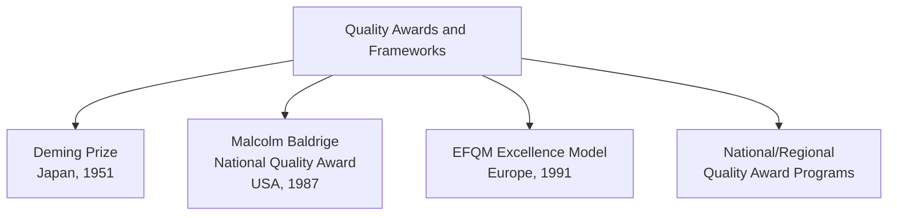
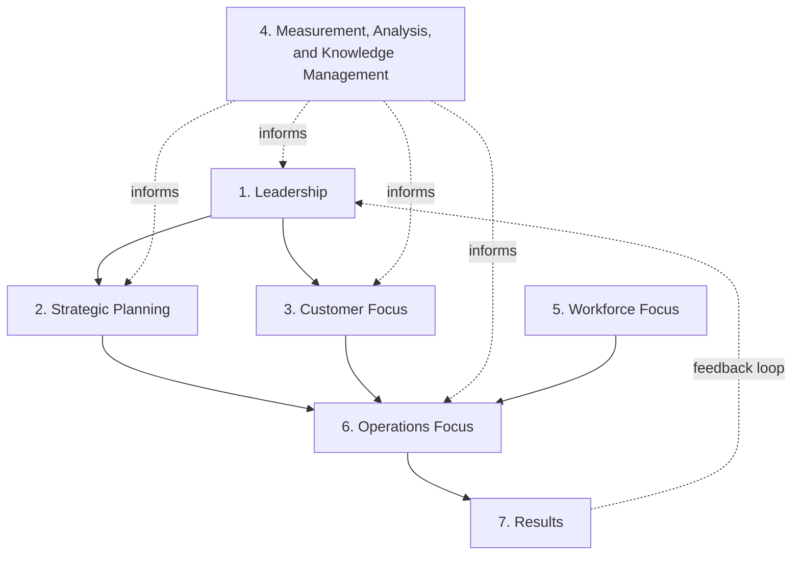

## Quality Awards and Frameworks

### Definition and Core Concept

Quality awards and frameworks are formal, structured systems used to recognize, assess, and guide organizations toward excellence in quality management and overall organizational performance. Unlike certification standards (such as ISO 9001), which verify conformance to a defined set of requirements, quality awards typically use a **self-assessment and competitive evaluation model**, scoring organizations against a comprehensive criteria framework and recognizing top performers.

### Major Quality Awards and Frameworks Overview

### The Deming Prize

**Background**: Established in Japan in 1951 by the Union of Japanese Scientists and Engineers (JUSE), the Deming Prize was the first major quality award and honors the contributions of W. Edwards Deming to Japanese quality management following World War II.

**Core Focus**: The Deming Prize places heavy emphasis on statistical quality control methods and company-wide quality control (TQC/CWQC) implementation, evaluating both the quality control methods used and the results achieved.

**Award Categories:**

| Category | Description |
| --- | --- |
| Deming Prize for Individuals | Recognizes individuals who have made outstanding contributions to the study or dissemination of TQM-related theory |
| Deming Distinguished Service Award for Dissemination and Promotion (overseas) | Recognizes individuals contributing to TQM outside Japan |
| Deming Prize (organizational) | Recognizes organizations that have achieved distinctive performance improvement through company-wide quality management |

**Evaluation Approach**: Examiners assess an organization's quality management practices through document review and on-site examination, focusing heavily on whether TQM principles have been genuinely and effectively implemented throughout the organization's management systems, rather than solely evaluating final performance results in isolation.

### Malcolm Baldrige National Quality Award (MBNQA)

**Background**: Established by the U.S. Congress in 1987, the Baldrige Award is administered by the National Institute of Standards and Technology (NIST) and recognizes U.S. organizations for performance excellence.

**The Baldrige Criteria for Performance Excellence Framework**

The Baldrige framework evaluates organizations across seven interrelated categories:

| Category | Focus |
| --- | --- |
| 1. Leadership | How senior leaders guide the organization and communicate values |
| 2. Strategic Planning | How the organization develops strategic objectives and action plans |
| 3. Customer Focus | How the organization engages customers and builds customer relationships |
| 4. Measurement, Analysis, and Knowledge Management | How the organization selects, gathers, analyzes, and manages data and information assets |
| 5. Workforce Focus | How the organization engages, manages, and develops its workforce |
| 6. Operations Focus | How the organization designs, manages, and improves its work processes |
| 7. Results | Performance and improvement outcomes across all key organizational areas |

**Scoring Approach**: Baldrige uses a points-based scoring system across the seven categories, with the **Results** category typically carrying the heaviest weighting, reflecting an emphasis on demonstrated outcomes rather than process description alone. Applicants undergo a rigorous, multi-stage review process including a detailed written application and, for the highest-scoring applicants, a site visit by trained examiners.

**Award Categories**: The Baldrige Award is given in multiple sectors, including manufacturing, service, small business, education, healthcare, and nonprofit organizations, reflecting the framework's applicability well beyond traditional manufacturing quality contexts.

### EFQM Excellence Model

**Background**: Developed by the European Foundation for Quality Management (EFQM) in 1991, this framework is widely used across Europe as a comprehensive organizational excellence and self-assessment tool.

**Core Structure**: The EFQM model is organized around three core questions, moving through Enablers (how an organization operates) to Results (what it achieves):

| Component Group | Categories |
| --- | --- |
| **Enablers** | Leadership; Strategy; People; Partnerships and Resources; Processes, Products, and Services |
| **Results** | Customer Results; People Results; Society Results; Business/Key Performance Results |

**RADAR Logic**: EFQM assessment uses a scoring methodology called RADAR (Results, Approach, Deployment, Assessment, and Refinement), evaluating both the soundness of an organization's approach to achieving results and the extent to which that approach has been effectively deployed and refined over time.

### Comparison of Major Quality Award Frameworks

| Attribute | Deming Prize | Baldrige Award | EFQM Excellence Model |
| --- | --- | --- | --- |
| Origin | Japan, 1951 | United States, 1987 | Europe, 1991 |
| Primary emphasis | Statistical/TQC implementation rigor | Balanced leadership, process, and results | Balanced enablers and results (RADAR logic) |
| Assessment approach | Document review + on-site examination | Written application + site visit for finalists | Self-assessment against defined criteria |
| Sector applicability | Broad, though rooted in manufacturing origins | Broad — manufacturing, service, healthcare, education, nonprofit | Broad — applicable across sectors |
| Primary use case | Recognition of sustained TQM excellence | Recognition and diagnostic self-improvement tool | Self-assessment and continuous improvement diagnostic |

### National and Regional Quality Award Programs

Beyond the three major international frameworks, many countries and regions maintain their own national quality award programs, often modeled closely on the Baldrige or EFQM frameworks, adapted to local context.

**Examples (illustrative, non-exhaustive):**

- Canada Awards for Excellence
- Australian Business Excellence Awards
- Singapore Quality Award
- Various U.S. state-level Baldrige-based quality award programs

[Inference — the specific current status, criteria, and administering bodies of individual national award programs can change over time; verification against current official sources is recommended for programs relevant to a specific country]

### Common Structural Themes Across Award Frameworks

**Key Points**

- **Leadership emphasis**: All major frameworks place significant weight on senior leadership's role in establishing vision, values, and quality commitment
- **Balanced enabler-results structure**: Frameworks generally evaluate both the processes/approaches an organization uses (enablers) and the outcomes achieved (results), rather than focusing on either alone
- **Self-assessment orientation**: Most frameworks are explicitly designed to be useful as internal self-assessment diagnostic tools, independent of whether an organization pursues formal award recognition
- **Continuous improvement focus**: Frameworks generally reward evidence of ongoing refinement and adaptation, not simply a static snapshot of current practices
- **Stakeholder breadth**: Modern frameworks (particularly EFQM and Baldrige) explicitly evaluate impact on multiple stakeholder groups (customers, employees, society), reflecting broader organizational excellence concepts beyond narrow product quality

### Uses of Quality Award Frameworks Beyond Competition

Even organizations that do not pursue formal award application often use these frameworks internally as:

- **Self-assessment diagnostic tools**: Identifying organizational strengths and improvement opportunities through structured criteria review
- **Benchmarking tools**: Comparing organizational maturity against the framework's criteria over successive assessment cycles
- **Strategic planning inputs**: Using framework categories to structure strategic planning discussions
- **Training and organizational development frameworks**: Using award criteria language to build shared vocabulary around quality and excellence across the organization

### Relationship to ISO 9001 and Certification Standards

| Attribute | Quality Awards (Baldrige, EFQM, Deming) | ISO 9001 Certification |
| --- | --- | --- |
| Evaluation basis | Comprehensive organizational excellence, including strategy, leadership, and results | Conformance to a defined quality management system requirement set |
| Outcome | Recognition/award (non-certifying, competitive) | Formal, renewable third-party certification |
| Scope | Broad — encompasses overall organizational performance, not solely quality management | Narrower — specifically the quality management system |
| Frequency of assessment | Typically annual application cycles for award consideration | Multi-year certification cycle with periodic surveillance audits |

Many organizations pursue both: ISO 9001 certification as a baseline quality management system foundation, and participation in award frameworks (formally or as internal self-assessment) as a mechanism for pursuing broader organizational excellence beyond minimum certification requirements. [Inference — the degree to which organizations combine both approaches, and the specific sequencing typically used, varies by industry and organizational maturity]

### Criticisms and Limitations of Quality Award Frameworks

- **Resource-intensive application process**: Preparing a comprehensive Baldrige or EFQM application can require substantial organizational time and documentation effort, which may be disproportionately burdensome for smaller organizations
- **Potential for "winning the award, missing the point"**: Organizations may focus disproportionately on the application/scoring process itself rather than genuine cultural transformation [Inference — this critique appears in quality management literature but the degree to which it applies varies by organizational intent and leadership commitment]
- **Award-winning does not guarantee continued excellence**: Some past award recipients have experienced subsequent performance declines, raising questions about whether award criteria fully predict sustained long-term organizational success [Inference — this observation has been discussed in management literature, though causal analysis of why specific award recipients later struggled is generally complex and multi-factorial]

### Related Topics

- Total Quality Management principles
- Contributions of Deming, Juran, and Crosby
- ISO 9000 quality management systems
- Cost of quality framework
- Strategic planning in operations
- Benchmarking methodologies
- Organizational excellence and continuous improvement
- Six Sigma and DMAIC methodology