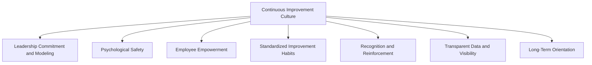
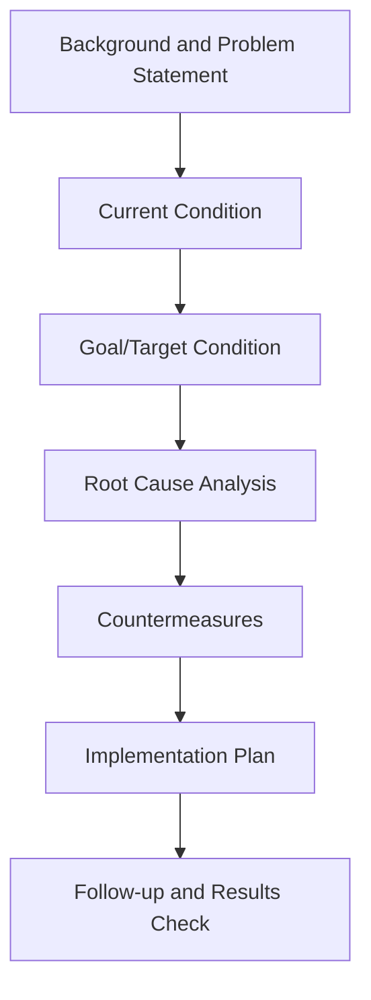

## Building a Culture of Continuous Improvement

### Definition and Core Concept

Building a culture of continuous improvement refers to the deliberate organizational effort to embed ongoing, incremental performance enhancement as a shared value, behavior, and habitual practice among all employees, rather than treating improvement as a periodic project or the responsibility of a specialized department. A genuine improvement culture is characterized by widespread, self-sustaining engagement in problem identification and solution-seeking, driven by intrinsic organizational values rather than solely by management mandate.

### Distinguishing Culture from Tools and Programs

**Key Points**

- **Tools and methodologies** (Kaizen events, Six Sigma projects, PDCA cycles) are the *mechanisms* through which improvement occurs
- **Culture** is the underlying set of shared beliefs, values, and behavioral norms that determine whether those tools are used consistently, voluntarily, and effectively across the organization
- An organization can implement improvement tools and methodologies without ever developing genuine improvement culture, resulting in tools being used sporadically, superficially, or only when mandated
- Sustainable, compounding improvement gains are generally associated with cultural embedding, not merely tool deployment [Inference — the specific causal relationship and magnitude of this effect varies by organization and is difficult to isolate from other contributing factors]

### Core Elements of a Continuous Improvement Culture

### Leadership Commitment and Modeling

Leadership plays a foundational role in establishing and sustaining improvement culture, not merely by endorsing improvement initiatives verbally but by visibly modeling improvement behaviors themselves.

**Key Leadership Behaviors:**

- Actively participating in improvement activities (e.g., gemba walks — visiting the actual place where work happens to observe and learn directly)
- Asking process-oriented questions ("What did we learn?" "What's the root cause?") rather than solely results-oriented questions
- Allocating dedicated time and resources for improvement activities, rather than treating them as extracurricular
- Consistently reinforcing improvement priorities over competing short-term pressures (e.g., not abandoning improvement time during periods of high production demand)

### Psychological Safety

Psychological safety — the shared belief that team members can speak up, raise problems, admit mistakes, or propose ideas without fear of punishment or humiliation — is widely identified as a foundational precondition for sustained improvement culture.

**Why Psychological Safety Matters for Improvement:**

- Employees closest to the work are often best positioned to identify process problems, but will not surface them if doing so carries personal risk
- A blame-oriented culture encourages problem concealment rather than problem-solving, since admitting an issue is disincentivized
- Deming's principle to "drive out fear" directly reflects this same underlying concept, predating the more recent psychological safety literature by decades

**Example — Contrast in organizational response to a discovered defect:**

| Low Psychological Safety Response | High Psychological Safety Response |
| --- | --- |
| Immediate focus on identifying who caused the defect | Immediate focus on understanding how the defect occurred |
| Disciplinary action discourages future reporting | Structured root-cause analysis (e.g., 5 Whys) encourages learning |
| Employees learn to hide or work around problems | Employees are encouraged to escalate problems early |

### Employee Empowerment and Involvement

Genuine improvement culture requires distributing improvement responsibility and authority broadly across the organization, rather than concentrating it within a specialized quality or improvement department.

**Mechanisms Supporting Empowerment:**

- **Suggestion systems**: Formal channels for employees to propose improvements, ideally with transparent tracking and feedback on submitted ideas
- **Small-group improvement activities**: Quality circles, kaizen teams, or similar structures that give front-line employees dedicated time and authority to address problems in their own work area
- **Authority to stop work**: In manufacturing contexts, granting front-line workers authority to halt a process upon identifying a quality problem (a concept closely associated with the Toyota Production System's "andon" system)
- **Cross-functional problem-solving teams**: Bringing together employees from different functions to address problems that span departmental boundaries

### Standardized Improvement Habits and Routines

Sustainable improvement culture typically embeds structured routines that make improvement activity a regular, expected part of work rather than an occasional special event.

**Common Structural Routines:**

| Routine | Description |

 

| Daily huddles/stand-up meetings | Brief, regular team meetings to review performance, surface problems, and assign quick-response actions |

| Structured problem-solving methods (PDCA, A3 reports, 5 Whys) | Standardized formats and methods that guide consistent, disciplined improvement thinking across the organization |

| Visual management boards | Physical or digital boards displaying key metrics, ongoing improvement initiatives, and problem status, keeping improvement visible and top-of-mind |

| Regular kaizen events | Scheduled, focused improvement workshops targeting specific processes over a defined short period |

### The A3 Problem-Solving Format

A widely used structured tool for embedding disciplined improvement thinking, originating from Toyota's problem-solving practices, condensing a complete improvement analysis onto a single page (traditionally A3-sized paper).

### Recognition and Reinforcement

Sustained improvement behavior requires ongoing reinforcement, since intrinsic motivation alone may not be sufficient to maintain engagement over long periods, particularly during periods of competing operational pressure.

**Key Points**

- Recognizing improvement contributions publicly (not only large breakthrough improvements, but consistent small incremental ones)
- Aligning performance evaluation and incentive systems with improvement participation, not solely with short-term output metrics that might discourage time spent on improvement activities
- Sharing success stories across the organization to reinforce that improvement effort is valued and impactful
- Avoiding reinforcement structures that inadvertently punish improvement efforts (e.g., reducing future headcount or budget as a "reward" for efficiency gains, which can discourage future disclosure of improvement opportunities)

### Transparent Data and Visibility

A culture of continuous improvement depends on employees having ready access to relevant performance data, enabling fact-based identification of problems and evaluation of whether implemented changes actually produced improvement.

- **Real-time or near-real-time performance dashboards** at the team or department level
- **Visual management systems** displaying key process metrics directly at the point of work
- **Transparent sharing of both successes and failures**, since concealing negative results undermines the learning function that improvement culture depends on

### Long-Term Orientation

Genuine improvement culture requires a management mindset that values sustained, compounding gains over time rather than solely short-term financial results, since meaningful cultural change and skill development typically require sustained investment before producing measurable returns.

[Inference — the specific time horizon required to observe measurable cultural or performance change varies substantially across organizations, industries, and the scope of the improvement effort, and is difficult to state as a universal figure]

### Common Barriers to Building Improvement Culture

**Key Points**

- **Inconsistent leadership commitment**: Improvement initiatives that lose leadership attention during competing priorities (cost pressures, personnel turnover) signal to employees that improvement is not genuinely valued
- **Blame-oriented management practices**: Punitive responses to disclosed problems quickly extinguish future willingness to report issues
- **Misaligned metrics and incentives**: Reward systems that emphasize only short-term output can crowd out time and attention needed for improvement activity
- **Insufficient training in improvement methods**: Employees empowered to identify problems but lacking structured problem-solving skills may struggle to translate good intentions into effective solutions
- **Treating improvement as a program with an end date**: Programs framed as time-limited initiatives (e.g., "this year's improvement campaign") can undermine the intended permanence of a genuine culture shift
- **Middle management resistance**: Middle managers who perceive front-line empowerment as a threat to their authority or role may inadvertently suppress improvement activity, even when senior leadership supports it [Inference — the prevalence and intensity of this specific barrier varies by organizational structure and management style]

### Measuring Improvement Culture Maturity

While improvement culture itself is difficult to measure directly, several proxy indicators are commonly used to assess organizational maturity:

| Indicator | What It Suggests |
| --- | --- |
| Volume and quality of employee-submitted improvement suggestions | Level of grassroots engagement |
| Percentage of suggestions implemented (not just submitted) | Whether the organization follows through, sustaining trust in the system |
| Frequency of structured problem-solving activity (kaizen events, A3s completed) | Degree to which improvement routines are embedded in regular work |
| Employee survey measures of psychological safety and empowerment | Underlying cultural conditions supporting improvement behavior |
| Trend in relevant performance metrics over time (defect rates, cycle time, cost) | Whether improvement activity is translating into measurable outcomes |

### Relationship to Broader Quality and Operations Frameworks

| Framework | Relationship to Continuous Improvement Culture |
| --- | --- |
| Total Quality Management (TQM) | Continuous improvement (Kaizen) is one of TQM's core stated principles; culture-building is the practical mechanism for realizing it |
| Toyota Production System / Lean | Deeply embeds continuous improvement culture through concepts like kaizen, gemba, and andon, treating culture-building as inseparable from technical lean tools |
| Six Sigma | Provides structured, statistically rigorous improvement methodology (DMAIC) that can be embedded within a broader improvement culture, though Six Sigma alone (as a discrete project methodology) does not guarantee cultural embedding |
| Deming's System of Profound Knowledge | The "Psychology" component directly addresses the human and cultural dimensions necessary for sustained improvement, alongside statistical and systems knowledge |

### Related Topics

- Total Quality Management principles
- Contributions of Deming, Juran, and Crosby
- Job enrichment and job enlargement
- Workforce motivation and incentive systems
- Lean manufacturing and the Toyota Production System
- Six Sigma and DMAIC methodology
- Quality awards and frameworks
- Root cause analysis techniques (5 Whys, fishbone diagrams)