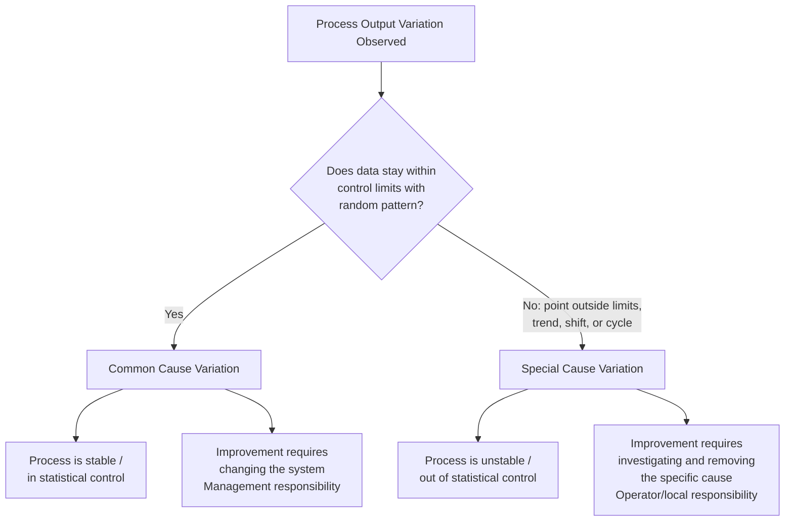

## Common Cause Versus Special Cause Variation

### Overview

**Key Points**

- All processes exhibit variation; the fundamental question in Statistical Process Control (SPC) is whether that variation stems from the process's inherent design or from an identifiable external disruption.
- **Common cause variation** (also called "chance cause" or "random cause" variation) is the natural, inherent variability present in a process due to its design, materials, methods, and environment. It is always present and affects all outcomes.
- **Special cause variation** (also called "assignable cause" variation) arises from specific, identifiable factors that are not part of the process's normal operation — equipment malfunction, operator error, a bad batch of raw material, or a one-time environmental disturbance.
- This distinction, formalized by Walter Shewhart in the 1920s and later popularized by W. Edwards Deming, is the theoretical foundation of control charts and the broader discipline of process improvement.

### Conceptual Foundations

#### Shewhart's Original Framework

Walter Shewhart, working at Bell Labs, introduced the distinction to solve a practical manufacturing problem: engineers were "tampering" with processes by adjusting them in response to every fluctuation, which actually increased variation rather than reducing it. Shewhart proposed that variation falls into two categories:

1. **Controlled variation**: Variation that follows a stable, consistent, predictable statistical distribution over time. This is common cause variation.
2. **Uncontrolled variation**: Variation that is unpredictable, changes over time, or does not follow a consistent distribution. This is special cause variation.

A process exhibiting only common cause variation is said to be in a **state of statistical control** — not because it is free of variation, but because that variation is stable and predictable within known limits.

#### Deming's Extension

Deming reframed this distinction in management terms, estimating (controversially, and often cited without a rigorous source) that roughly 94% of problems in a system are attributable to common causes (the system itself, which only management can change) and about 6% to special causes (which front-line operators can often identify and address). [Unverified] The specific 94/6 split is Deming's heuristic estimate rather than a universally derived statistical constant, and actual proportions vary significantly by industry and process.

### Common Cause Variation

#### Characteristics

- **Source**: Built into the process — machine tolerances, minor material variability, ambient temperature fluctuations, normal human variability in manual tasks, measurement system noise.
- **Pattern**: Random, but stable and predictable in aggregate. Individual points are unpredictable, but the overall distribution (mean, spread, shape) remains constant over time.
- **Statistical signature**: Data points fall randomly within control limits with no trends, shifts, cycles, or unusual patterns.
- **Responsibility**: Because common cause variation is a property of the system's design, only management or process owners with authority to redesign the process, upgrade equipment, or change specifications can reduce it. Operators typically cannot eliminate it by working harder or more carefully within the existing process.

#### Example

A CNC machine cutting metal rods to a nominal length of 100 mm will never produce rods of exactly 100.000 mm every time. Due to tiny variations in tool wear, vibration, thermal expansion, and material hardness, the actual lengths might range from 99.95 mm to 100.05 mm, clustering symmetrically around 100 mm following an approximately normal distribution. This spread is common cause variation — expected, stable, and inherent to that machine's capability.

### Special Cause Variation

#### Characteristics

- **Source**: External or intermittent factors not part of the normal process — a broken tool, an untrained temporary worker, a power surge, a supplier switching raw material lots, a miscalibrated instrument.
- **Pattern**: Unpredictable and non-random in the statistical sense — it manifests as points outside control limits, trends, shifts in level, increased spread, or cyclical patterns not previously present.
- **Statistical signature**: Detected via control chart rules (see below) as violations of the expected random pattern.
- **Responsibility**: Because special causes are specific and identifiable, they are typically within the authority and knowledge of the process operator or local team to detect, investigate, and correct.

#### Example

Using the same CNC machine scenario: if a cutting tool suddenly chips, subsequent rod lengths might jump to 100.3–100.5 mm, well outside the historical distribution, and remain there until the tool is replaced. This sudden, identifiable shift is special cause variation.

### Detecting Special Causes: Control Chart Rules

Control charts plot process data over time against a centerline (typically the mean, $\bar{x}$) and control limits, conventionally set at $\pm 3$ standard deviations ($3\sigma$) from the centerline.

$$UCL = \bar{x} + 3\sigma, \quad LCL = \bar{x} - 3\sigma$$

Several commonly used pattern-recognition heuristics (often called the **Western Electric Rules** or **Nelson Rules**) flag special causes:

| Rule | Pattern | Typical Interpretation |
| --- | --- | --- |
| 1 | A single point beyond $3\sigma$ | Sudden, large disturbance |
| 2 | 9 consecutive points on one side of the centerline | Sustained shift in process mean |
| 3 | 6 consecutive points steadily increasing or decreasing | Trend (e.g., tool wear, drift) |
| 4 | 14 consecutive points alternating up and down | Overcontrol or two interleaved processes |
| 5 | 2 of 3 consecutive points beyond $2\sigma$ (same side) | Emerging shift |
| 6 | 4 of 5 consecutive points beyond $1\sigma$ (same side) | Emerging shift |
| 7 | 15 consecutive points within $1\sigma$ (either side) | Reduced variation or miscalculated limits |
| 8 | 8 consecutive points beyond $1\sigma$ (either side), none within | Mixture of two distributions |

[Inference] Different organizations and software packages implement variants of these rules with slightly different point-count thresholds; the numbers above reflect the most commonly cited convention (Nelson, 1984), but practitioners should confirm which rule set their control charting software applies by default.

### Visualizing the Distinction

### The Control Chart as a Diagnostic Tool (svg_diagram)

<svg xmlns="http://www.w3.org/2000/svg" viewBox="0 0 720 380">
<text x="360" y="24" text-anchor="middle" font-size="16" font-weight="bold" fill="#1a1a1a">Control Chart: Common vs Special Cause Signals (svg_diagram)</text>

<line x1="70" y1="320" x2="680" y2="320" stroke="#333" stroke-width="1.5" />
<line x1="70" y1="60" x2="70" y2="320" stroke="#333" stroke-width="1.5" />
<text x="30" y="325" font-size="11" fill="#333">Value</text>
<text x="640" y="340" font-size="11" fill="#333">Sample #</text>

<line x1="70" y1="100" x2="680" y2="100" stroke="#c0392b" stroke-width="1.5" stroke-dasharray="6,4" />
<text x="685" y="104" font-size="11" fill="#c0392b">UCL</text>
<line x1="70" y1="190" x2="680" y2="190" stroke="#555" stroke-width="1.5" stroke-dasharray="2,3" />
<text x="685" y="194" font-size="11" fill="#555">CL (x̄)</text>
<line x1="70" y1="280" x2="680" y2="280" stroke="#c0392b" stroke-width="1.5" stroke-dasharray="6,4" />
<text x="685" y="284" font-size="11" fill="#c0392b">LCL</text>

<rect x="70" y="100" width="610" height="180" fill="#2ecc71" opacity="0.06" />

<polyline points="90,190 120,175 150,205 180,180 210,200 240,170 270,195 300,185 330,175 360,200" fill="none" stroke="`#2c3e50`" stroke-width="2" />

<polyline points="360,200 390,200 420,85" fill="none" stroke="`#2c3e50`" stroke-width="2" />

<polyline points="420,85 450,130 480,95 510,140 540,110" fill="none" stroke="`#2c3e50`" stroke-width="2" />

<polyline points="540,110 570,150 600,175 630,195 660,215" fill="none" stroke="`#2c3e50`" stroke-width="2" />

<g fill="#2c3e50">
<circle cx="90" cy="190" r="3.5" />
<circle cx="120" cy="175" r="3.5" />
<circle cx="150" cy="205" r="3.5" />
<circle cx="180" cy="180" r="3.5" />
<circle cx="210" cy="200" r="3.5" />
<circle cx="240" cy="170" r="3.5" />
<circle cx="270" cy="195" r="3.5" />
<circle cx="300" cy="185" r="3.5" />
<circle cx="330" cy="175" r="3.5" />
<circle cx="360" cy="200" r="3.5" />
<circle cx="390" cy="200" r="3.5" />
</g>

<circle cx="420" cy="85" r="6" fill="#e74c3c" stroke="#1a1a1a" stroke-width="1.5" />
<circle cx="450" cy="130" r="3.5" fill="#2c3e50" />
<circle cx="480" cy="95" r="6" fill="#e74c3c" stroke="#1a1a1a" stroke-width="1.5" />
<circle cx="510" cy="140" r="3.5" fill="#2c3e50" />
<circle cx="540" cy="110" r="3.5" fill="#2c3e50" />
<circle cx="570" cy="150" r="3.5" fill="#2c3e50" />
<circle cx="600" cy="175" r="3.5" fill="#2c3e50" />
<circle cx="630" cy="195" r="3.5" fill="#2c3e50" />
<circle cx="660" cy="215" r="3.5" fill="#2c3e50" />

<text x="395" y="70" font-size="11" fill="`#c0392b`" font-weight="bold">Point beyond UCL</text>

<line x1="420" y1="80" x2="410" y2="70" stroke="`#c0392b`" stroke-width="1" />

<text x="560" y="235" font-size="11" fill="`#c0392b`" font-weight="bold">Trend (Rule 3)</text>

<text x="150" y="230" font-size="11" fill="`#27ae60`">Stable: common cause only</text>

<circle cx="90" cy="360" r="4" fill="#2c3e50" />
<text x="100" y="364" font-size="10" fill="#333">In-control point</text>
<circle cx="230" cy="360" r="5" fill="#e74c3c" stroke="#1a1a1a" />
<text x="240" y="364" font-size="10" fill="#333">Special cause signal</text>
</svg>

### Practical Implications in Operations Management

#### Diagnosis Before Action

A central operational principle is that the correct response depends entirely on which type of variation is present:

- **If only common cause variation exists**: Reacting to individual data points (e.g., adjusting a machine because one part measured slightly off) is counterproductive. Shewhart and Deming term this **tampering**, and it demonstrably increases overall variation — a phenomenon formally modeled by the "funnel experiment." Improvement requires redesigning the process itself (new equipment, tighter incoming material specs, revised procedures, employee training programs affecting the whole system).
- **If special cause variation exists**: Reacting immediately and locally is appropriate. The team should investigate the specific point in time, identify the assignable cause, and eliminate it. Treating a special cause as if it were normal system noise means a real, fixable problem goes unaddressed and may recur or worsen.

#### The Cost of Misclassification

| Error Type | Description | Consequence |
| --- | --- | --- |
| Reacting to common cause as if special | Adjusting the process for normal, expected variation | Increased variation (tampering), wasted resources, operator confusion |
| Treating special cause as common | Ignoring an out-of-control signal as "just noise" | Defects persist or worsen, root cause remains unaddressed, potential safety/quality escapes |

#### Process Capability Context

Once a process is confirmed to be in statistical control (only common cause variation present), it becomes meaningful to assess **process capability** — comparing the natural variation to customer specification limits using indices such as $C_p$ and $C_{pk}$:

$$C_p = \frac{USL - LSL}{6\sigma}$$

$$C_{pk} = \min\left(\frac{USL - \bar{x}}{3\sigma}, \frac{\bar{x} - LSL}{3\sigma}\right)$$

Calculating capability indices on a process still exhibiting special cause variation is a common analytical error [Inference] — the presence of unstable, unpredictable variation invalidates the assumption of a fixed, describable distribution that these indices depend on, since the estimated $\sigma$ would not reflect a single stable state.

### Common Misconceptions

- **"Common cause variation is acceptable and doesn't need attention."** In practice, most quality frameworks (e.g., Six Sigma, Lean, continuous improvement) treat *reducing* common cause variation as an ongoing strategic goal, even though it does not require urgent, point-specific intervention.
- **"A point within control limits is always 'fine.'"** Control limits describe statistical predictability, not desirability against a specification. A process can be perfectly "in control" (only common cause variation) while still producing output outside the customer's specification limits if the process is not capable.
- **"More data points outside limits mean the process is worse."** It may instead indicate that a single special cause is actively and continuously present (e.g., a persistent equipment fault), which is a distinct diagnostic situation from many independent random special causes.

### Related Topics

- Control charts (X-bar and R charts, X-bar and S charts, individuals and moving range charts, p-charts, c-charts)
- Western Electric Rules and Nelson Rules for control chart interpretation
- Process capability analysis ($C_p$, $C_{pk}$, $P_p$, $P_{pk}$)
- The funnel experiment and the concept of tampering
- Deming's System of Profound Knowledge
- Six Sigma DMAIC methodology and root cause analysis (5 Whys, fishbone/Ishikawa diagrams)
- Statistical control versus process capability (voice of the process vs. voice of the customer)
- Type I and Type II errors in control chart interpretation (false alarms vs. missed signals)