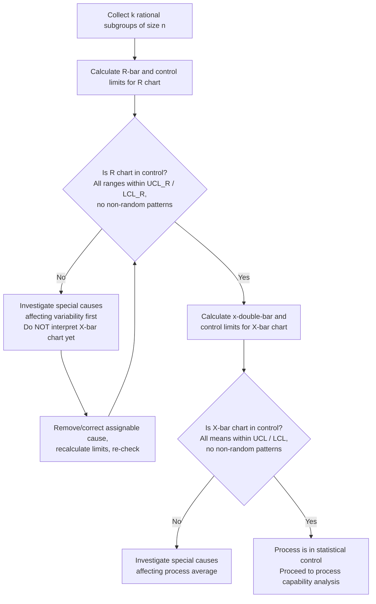

## X-bar and R Charts

### Overview

**Key Points**

- X-bar and R charts are paired **control charts for variables data** — continuous, measurable quantities such as length, weight, diameter, or temperature — used to monitor a process's central tendency and dispersion simultaneously.
- The **X-bar chart** ($\bar{X}$ chart) tracks the mean of small subgroups over time, detecting shifts in the process average.
- The **R chart** (Range chart) tracks the range (max − min) within each subgroup over time, detecting changes in process variability (spread).
- The two charts are always used together and interpreted in a specific order: the R chart must be evaluated for control *first*, because the X-bar chart's control limits are calculated using the average range, and those limits are meaningless if the range itself is unstable.

### Rationale for Using Subgroups

A single measurement cannot distinguish between a shift in average and an increase in spread. By collecting rational subgroups — small samples (typically $n = 3$ to $5$, though up to $10$ is used) collected close together in time and under similar conditions — X-bar and R charts separate these two dimensions of process behavior:

- **X-bar chart** answers: "Is the process average stable over time?"
- **R chart** answers: "Is the process consistency (spread) stable over time?"

The concept of the **rational subgroup**, introduced by Shewhart, is central: items within a subgroup should be produced under essentially identical conditions so that any variation *within* the subgroup reflects only common cause variation, while variation *between* subgroups can reveal special causes.

### Data Collection and Notation

| Symbol | Meaning |
| --- | --- |
| $n$ | Subgroup size (number of items per sample) |
| $k$ | Number of subgroups collected |
| $x_i$ | Individual measurement within a subgroup |
| $\bar{x}$ | Mean of one subgroup |
| $R$ | Range of one subgroup ($x_{max} - x_{min}$) |
| $\bar{\bar{x}}$ | Grand mean (average of all subgroup means), the centerline of the X-bar chart |
| $\bar{R}$ | Average range (average of all subgroup ranges), the centerline of the R chart |

For each subgroup $j$:

$$\bar{x}_j = \frac{1}{n}\sum_{i=1}^{n} x_i, \qquad R_j = x_{max,j} - x_{min,j}$$

Then across all $k$ subgroups:

$$\bar{\bar{x}} = \frac{1}{k}\sum_{j=1}^{k} \bar{x}_j, \qquad \bar{R} = \frac{1}{k}\sum_{j=1}^{k} R_j$$

### Control Limit Formulas

X-bar and R charts use **control chart constants** — tabulated factors ($A_2$, $D_3$, $D_4$) that depend only on subgroup size $n$, derived from the statistical relationship between the range and the standard deviation for a normal distribution. This avoids needing to calculate $\sigma$ directly from raw data.

#### R Chart Limits

$$UCL_R = D_4 \bar{R}, \qquad CL_R = \bar{R}, \qquad LCL_R = D_3 \bar{R}$$

#### X-bar Chart Limits

$$UCL_{\bar{x}} = \bar{\bar{x}} + A_2 \bar{R}, \qquad CL_{\bar{x}} = \bar{\bar{x}}, \qquad LCL_{\bar{x}} = \bar{\bar{x}} - A_2 \bar{R}$$

#### Common Control Chart Constants

| $n$ | $A_2$ | $D_3$ | $D_4$ |
| --- | --- | --- | --- |
| 2 | 1.880 | 0 | 3.267 |
| 3 | 1.023 | 0 | 2.575 |
| 4 | 0.729 | 0 | 2.282 |
| 5 | 0.577 | 0 | 2.114 |
| 6 | 0.483 | 0 | 2.004 |
| 7 | 0.419 | 0.076 | 1.924 |
| 8 | 0.373 | 0.136 | 1.864 |
| 9 | 0.337 | 0.184 | 1.816 |
| 10 | 0.308 | 0.223 | 1.777 |

[Unverified] These constants are standard tabulated values (originally published by ASTM/Shewhart-derived statistical tables) and are consistent across major SPC references; practitioners should confirm the exact table used by their software or textbook, as rounding conventions can differ slightly in the fourth decimal place.

Note that $D_3 = 0$ for $n \leq 6$, meaning the R chart has no meaningful lower control limit (it cannot go below zero) for small subgroup sizes — a range of zero is not itself a special cause signal in that regime, though it may warrant investigation if it never varies at all.

### Worked Example

**Example**

A packaging line fills bottles with a target net weight of 500 g. Five subgroups of $n = 4$ bottles each are sampled:

| Subgroup | $x_1$ | $x_2$ | $x_3$ | $x_4$ | $\bar{x}_j$ | $R_j$ |
| --- | --- | --- | --- | --- | --- | --- |
| 1 | 498 | 502 | 500 | 501 | 500.25 | 4 |
| 2 | 497 | 499 | 503 | 500 | 499.75 | 6 |
| 3 | 501 | 500 | 502 | 499 | 500.50 | 3 |
| 4 | 496 | 498 | 500 | 497 | 497.75 | 4 |
| 5 | 502 | 501 | 499 | 500 | 500.50 | 3 |

**Step 1 — Grand mean and average range:**

$$\bar{\bar{x}} = \frac{500.25 + 499.75 + 500.50 + 497.75 + 500.50}{5} = \frac{2498.75}{5} = 499.75$$

$$\bar{R} = \frac{4+6+3+4+3}{5} = \frac{20}{5} = 4.0$$

**Step 2 — R chart limits** (using $n=4$: $D_4 = 2.282$, $D_3 = 0$):

$$UCL_R = 2.282 \times 4.0 = 9.128, \qquad LCL_R = 0 \times 4.0 = 0$$

All observed ranges (3, 3, 4, 4, 6) fall within $[0, 9.128]$ — the R chart is in control, so the X-bar limits are valid to interpret.

**Step 3 — X-bar chart limits** (using $A_2 = 0.729$):

$$UCL_{\bar{x}} = 499.75 + (0.729 \times 4.0) = 499.75 + 2.916 = 502.67$$

$$LCL_{\bar{x}} = 499.75 - (0.729 \times 4.0) = 499.75 - 2.916 = 496.83$$

All subgroup means (500.25, 499.75, 500.50, 497.75, 500.50) fall within $[496.83, 502.67]$ — the process average is also in statistical control.

### Interpretation Sequence

**Key Points**

- Evaluating the X-bar chart while the R chart is out of control is a common and serious analytical error [Inference] — because $\bar{R}$ (and therefore the X-bar control limits) is inflated or distorted by the unstable variability, making the X-bar chart's limits unreliable for detecting real shifts in the mean.

### Chart Appearance (svg_diagram)

<svg xmlns="http://www.w3.org/2000/svg" viewBox="0 0 720 420">
<text x="360" y="22" text-anchor="middle" font-size="15" font-weight="bold" fill="#1a1a1a">X-bar and R Charts (svg_diagram)</text>

<text x="20" y="55" font-size="12" font-weight="bold" fill="`#1a1a1a`">X-bar Chart</text>

<line x1="70" y1="130" x2="680" y2="130" stroke="#333" stroke-width="1.2" />

<line x1="70" y1="50" x2="70" y2="130" stroke="#333" stroke-width="1.2" />

<line x1="70" y1="65" x2="680" y2="65" stroke="#c0392b" stroke-width="1.3" stroke-dasharray="6,4" />
<text x="685" y="69" font-size="10" fill="#c0392b">UCL</text>
<line x1="70" y1="90" x2="680" y2="90" stroke="#555" stroke-width="1.2" stroke-dasharray="2,3" />
<text x="685" y="94" font-size="10" fill="#555">x̿</text>
<line x1="70" y1="115" x2="680" y2="115" stroke="#c0392b" stroke-width="1.3" stroke-dasharray="6,4" />
<text x="685" y="119" font-size="10" fill="#c0392b">LCL</text>

<polyline points="110,92 210,88 310,95 410,85 510,90 610,87" fill="none" stroke="`#2c3e50`" stroke-width="2" />

<g fill="`#2c3e50`">

<circle cx="110" cy="92" r="3.5" />

<circle cx="210" cy="88" r="3.5" />

<circle cx="310" cy="95" r="3.5" />

<circle cx="410" cy="85" r="3.5" />

<circle cx="510" cy="90" r="3.5" />

<circle cx="610" cy="87" r="3.5" />

</g>

<text x="20" y="200" font-size="12" font-weight="bold" fill="`#1a1a1a`">R Chart</text>

<line x1="70" y1="360" x2="680" y2="360" stroke="#333" stroke-width="1.2" />

<line x1="70" y1="210" x2="70" y2="360" stroke="#333" stroke-width="1.2" />

<line x1="70" y1="225" x2="680" y2="225" stroke="#c0392b" stroke-width="1.3" stroke-dasharray="6,4" />
<text x="685" y="229" font-size="10" fill="#c0392b">UCL</text>
<line x1="70" y1="290" x2="680" y2="290" stroke="#555" stroke-width="1.2" stroke-dasharray="2,3" />
<text x="685" y="294" font-size="10" fill="#555">R̄</text>
<line x1="70" y1="355" x2="680" y2="355" stroke="#c0392b" stroke-width="1.3" stroke-dasharray="6,4" />
<text x="685" y="359" font-size="10" fill="#c0392b">LCL</text>

<polyline points="110,270 210,300 310,280 410,310 510,275 610,295" fill="none" stroke="`#27ae60`" stroke-width="2" />

<g fill="`#27ae60`">

<circle cx="110" cy="270" r="3.5" />

<circle cx="210" cy="300" r="3.5" />

<circle cx="310" cy="280" r="3.5" />

<circle cx="410" cy="310" r="3.5" />

<circle cx="510" cy="275" r="3.5" />

<circle cx="610" cy="295" r="3.5" />

</g>

<text x="360" y="400" text-anchor="middle" font-size="11" fill="#333">Subgroup number (sampled sequentially over time)</text>

</svg>

### Assumptions and Requirements

- **Data type**: Continuous (variables) data — measurements, not counts or pass/fail classifications. For attribute data, p-charts, np-charts, c-charts, or u-charts are used instead.
- **Subgroup size**: Typically constant across all subgroups (this is required for the standard formulas above; unequal subgroup sizes require modified constants or an X-bar and S chart approach).
- **Rational subgrouping**: Items within a subgroup must be produced under near-identical conditions (same shift, same machine setting, same short time window) so within-subgroup variation reflects only common cause variation.
- **Normality**: The underlying process distribution is ideally approximately normal, though X-bar charts are fairly robust to moderate departures from normality due to the Central Limit Theorem — subgroup *means* tend toward normality even when individual measurements are not perfectly normal.
- **Independence**: Subgroups should be independent of one another (no autocorrelation from sampling too frequently on a slow-drifting process).

### X-bar and R Chart vs. X-bar and S Chart

| Aspect | X-bar and R Chart | X-bar and S Chart |
| --- | --- | --- |
| Dispersion measure | Range ($R$) | Standard deviation ($s$) |
| Subgroup size | Best for small $n$ (typically $n \leq 10$) | Preferred for larger $n$ (commonly $n > 10$) |
| Computational simplicity | Simpler, historically favored for manual calculation | Requires more computation (was more burdensome before automation) |
| Statistical efficiency | Range becomes a less efficient estimator of spread as $n$ grows | More statistically efficient at larger subgroup sizes |

[Inference] With modern SPC software eliminating manual calculation burden, many contemporary quality references favor X-bar and S charts even at moderate subgroup sizes, since $s$ makes fuller use of all data points within the subgroup rather than only the two extremes.

### Practical Application Notes

**Example**

In the bottling example above, if subgroup 4's mean (497.75) had instead been, say, 495, it would fall below the $LCL_{\bar{x}}$ of 496.83 — signaling a special cause (perhaps a temporary underfill due to a clogged nozzle) warranting immediate investigation of that specific time period, machine, or operator, rather than a system-wide process redesign.

**Key Points**

- Control limits should typically be calculated from an initial baseline of at least 20–25 subgroups to obtain stable estimates of $\bar{\bar{x}}$ and $\bar{R}$ before "freezing" limits for ongoing monitoring.
- Once frozen, limits are not recalculated every period; they are only revised after a confirmed, permanent process change (following investigation and correction of any special causes in the baseline data).
- Both charts should also be checked against the pattern-based Western Electric/Nelson Rules (runs, trends, cycles), not just single-point limit violations, since a process can display non-random behavior while every point remains technically within $\pm 3\sigma$.

### Next Steps

- Control charts for variables: X-bar and S charts (standard deviation-based alternative)
- Control charts for individuals and moving range (I-MR charts) for low-volume or single-unit processes
- Attribute control charts: p, np, c, and u charts
- Determining appropriate subgroup size and sampling frequency
- Process capability analysis ($C_p$, $C_{pk}$) following confirmed statistical control
- Western Electric Rules and Nelson Rules for pattern-based out-of-control detection
- Control chart constants derivation and the relationship between range and standard deviation
- Establishing and revising control limits after a process change