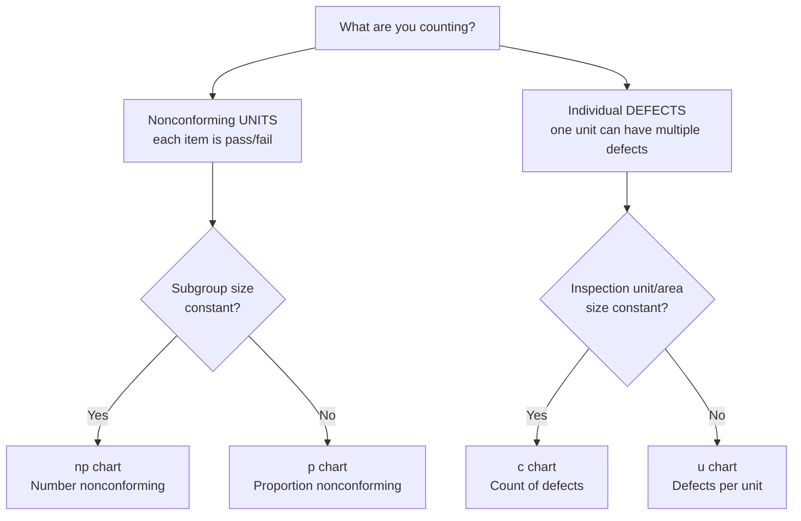

## Control Charts for Attributes: p, np, c, and u Charts

### Overview

**Key Points**

- Attribute control charts monitor **qualitative or count-based data** — classifications such as conforming/nonconforming, pass/fail, or counts of defects — as opposed to the continuous measurements used in variables charts (X-bar/R, X-bar/S).
- Four standard chart types cover the major attribute-data scenarios: **p chart** (proportion nonconforming, variable subgroup size), **np chart** (number nonconforming, constant subgroup size), **c chart** (count of defects per unit, constant inspection area), and **u chart** (defects per unit, variable inspection area).
- Selection among the four depends on two binary decisions: (1) are you counting *nonconforming units* or *individual defects*, and (2) is the subgroup size or inspection area constant or variable?

### Classification Framework

### Key Distinction: Nonconforming Units vs. Defects

- A **nonconforming unit** (used by p and np charts) is an item that fails to meet at least one specification — it is classified simply as good or bad, regardless of how many things are wrong with it.
- A **defect** (used by c and u charts) is a single flaw or nonconformity. One unit can contain multiple defects (e.g., a car door might have three scratches and one dent — that is one nonconforming unit but four defects).

This distinction determines which underlying probability distribution governs the chart: p and np charts are based on the **binomial distribution**, while c and u charts are based on the **Poisson distribution**.

### p Chart (Proportion Nonconforming)

#### Use Case

Tracks the fraction of nonconforming units in subgroups, where **subgroup (sample) size may vary** from period to period.

#### Formulas

For subgroup $i$ with sample size $n_i$ and number of nonconforming units $np_i$:

$$p_i = \frac{np_i}{n_i}$$

Center line, using the overall average proportion nonconforming across all $k$ subgroups:

$$\bar{p} = \frac{\sum_{i=1}^{k} np_i}{\sum_{i=1}^{k} n_i}$$

Control limits (recalculated for each subgroup if $n_i$ varies):

$$UCL_i = \bar{p} + 3\sqrt{\frac{\bar{p}(1-\bar{p})}{n_i}}, \qquad LCL_i = \bar{p} - 3\sqrt{\frac{\bar{p}(1-\bar{p})}{n_i}}$$

If $LCL_i$ computes to a negative value, it is set to $0$, since a proportion cannot be negative.

**Example**

A call center audits 100–150 calls per day for compliance script adherence. Day 1: 8 nonconforming out of 120 calls ($p_1 = 0.0667$); Day 2: 5 nonconforming out of 100 calls ($p_2 = 0.050$). Because sample sizes differ daily, the p chart's control limits will be wider on days with smaller $n_i$ and narrower on days with larger $n_i$, reflecting greater sampling uncertainty with fewer observations.

### np Chart (Number Nonconforming)

#### Use Case

Tracks the *actual count* (not proportion) of nonconforming units, but requires **constant subgroup size** $n$ across all samples. It is often preferred over the p chart when $n$ is fixed because plotting raw counts is more intuitive for operators than proportions.

#### Formulas

$$\overline{np} = \frac{\sum_{i=1}^{k} np_i}{k}$$

$$UCL = \overline{np} + 3\sqrt{\overline{np}\left(1 - \frac{\overline{np}}{n}\right)}, \qquad LCL = \overline{np} - 3\sqrt{\overline{np}\left(1 - \frac{\overline{np}}{n}\right)}$$

(equivalently, letting $\bar{p} = \overline{np}/n$: $UCL = \overline{np} + 3\sqrt{n\bar{p}(1-\bar{p})}$)

**Example**

A PCB assembly line inspects a fixed batch of 200 boards each shift for solder defects classified as pass/fail. If $\overline{np} = 6$ nonconforming boards per shift on average, control limits are calculated directly on the count of 6, avoiding the need to convert to a proportion.

### c Chart (Count of Defects)

#### Use Case

Tracks the total number of defects found within a **constant inspection unit** (a fixed area, length, or single unit of product where multiple defects are possible), assuming defects occur independently and the opportunity for defects is constant.

#### Formulas

$$\bar{c} = \frac{\sum_{i=1}^{k} c_i}{k}$$

$$UCL = \bar{c} + 3\sqrt{\bar{c}}, \qquad LCL = \bar{c} - 3\sqrt{\bar{c}}$$

(again, $LCL$ is set to $0$ if the formula yields a negative value)

**Example**

A textile mill inspects 50 m² sections of fabric for weaving flaws. If the average is $\bar{c} = 4$ flaws per 50 m² section, then $UCL = 4 + 3\sqrt{4} = 4 + 6 = 10$ and $LCL = 4 - 6 = -2 \rightarrow 0$. Any section with more than 10 flaws signals a special cause.

### u Chart (Defects Per Unit)

#### Use Case

Tracks the average number of defects per inspection unit when the **inspection area or unit size varies** between samples (e.g., different batch sizes, different lengths of cable inspected per shift).

#### Formulas

For subgroup $i$ with $c_i$ total defects found across $n_i$ inspection units (or area of size $n_i$):

$$u_i = \frac{c_i}{n_i}$$

$$\bar{u} = \frac{\sum_{i=1}^{k} c_i}{\sum_{i=1}^{k} n_i}$$

$$UCL_i = \bar{u} + 3\sqrt{\frac{\bar{u}}{n_i}}, \qquad LCL_i = \bar{u} - 3\sqrt{\frac{\bar{u}}{n_i}}$$

**Example**

A call center reviews recorded calls for scripting errors, but the number of calls reviewed varies daily (some days 30 calls, others 45). If Day 1 has 6 total errors across 30 calls ($u_1 = 0.20$) and Day 2 has 7 errors across 45 calls ($u_2 = 0.156$), the u chart accounts for the differing sample sizes when setting control limits for each day.

### Summary Comparison Table

| Chart | Distribution | What is Counted | Subgroup Size | Formula for $\sigma$ |
| --- | --- | --- | --- | --- |
| **p** | Binomial | Proportion nonconforming | Variable | $\sqrt{\bar{p}(1-\bar{p})/n_i}$ |
| **np** | Binomial | Number nonconforming | Constant | $\sqrt{\overline{np}(1-\overline{np}/n)}$ |
| **c** | Poisson | Count of defects | Constant | $\sqrt{\bar{c}}$ |
| **u** | Poisson | Defects per unit | Variable | $\sqrt{\bar{u}/n_i}$ |

### Variable Control Limits Visualization (svg_diagram)

<svg xmlns="http://www.w3.org/2000/svg" viewBox="0 0 720 320">
<text x="360" y="22" text-anchor="middle" font-size="15" font-weight="bold" fill="#1a1a1a">p Chart with Variable Control Limits (svg_diagram)</text>
<line x1="70" y1="270" x2="680" y2="270" stroke="#333" stroke-width="1.2" />
<line x1="70" y1="50" x2="70" y2="270" stroke="#333" stroke-width="1.2" />
<text x="30" y="160" font-size="11" fill="#333" transform="rotate(-90 30 160)">Proportion</text>
<text x="640" y="290" font-size="11" fill="#333">Subgroup #</text>

<line x1="70" y1="170" x2="680" y2="170" stroke="#555" stroke-width="1.2" stroke-dasharray="2,3" />
<text x="685" y="174" font-size="10" fill="#555">p̄</text>

<polyline points="70,110 150,110 150,95 260,95 260,120 380,120 380,90 500,90 500,130 620,130 680,130" fill="none" stroke="`#c0392b`" stroke-width="1.3" stroke-dasharray="6,4" />

<polyline points="70,230 150,230 150,245 260,245 260,220 380,220 380,250 500,250 500,210 620,210 680,210" fill="none" stroke="`#c0392b`" stroke-width="1.3" stroke-dasharray="6,4" />

<text x="685" y="130" font-size="10" fill="`#c0392b`">UCL</text>

<text x="685" y="214" font-size="10" fill="`#c0392b`">LCL</text>

<g fill="#2c3e50">
<circle cx="110" cy="175" r="3.5" />
<circle cx="200" cy="160" r="3.5" />
<circle cx="310" cy="185" r="3.5" />
<circle cx="430" cy="150" r="3.5" />
<circle cx="550" cy="180" r="3.5" />
<circle cx="650" cy="165" r="3.5" />
</g>
<polyline points="110,175 200,160 310,185 430,150 550,180 650,165" fill="none" stroke="#2c3e50" stroke-width="1.5" />

<text x="100" y="300" font-size="10" fill="#666">Note: UCL/LCL width narrows as subgroup size n increases, and widens as n decreases.</text>

</svg>

### Assumptions and Limitations

- **Independence**: Defects or nonconformities are assumed to occur independently of one another; clustering (e.g., all defects from one root cause appearing together) can violate the Poisson assumption underlying c and u charts.
- **Constant opportunity**: c charts require that the "area of opportunity" for a defect to occur (unit size, inspection length) truly stays constant; if it varies even slightly, a u chart is the more defensible choice.
- **Rare event assumption**: The Poisson approximation (c and u charts) works best when the probability of a defect at any single point is small but the number of opportunities is large. [Inference] For processes with very high defect rates approaching a large fraction of inspected units, the normal approximation to the Poisson distribution — which underlies the $3\sigma$ limit formulas — may become less accurate, and exact Poisson-based limits or transformation methods may be more appropriate.
- **Minimum sample size for p/np charts**: A common guideline is that $n\bar{p} \geq 5$ (or some references suggest $\geq 5$ for both $n\bar{p}$ and $n(1-\bar{p})$) to ensure the normal approximation to the binomial distribution is reasonable. [Unverified] Exact minimum thresholds vary somewhat by textbook and industry convention.

### Practical Selection Guidance

**Next Steps**

| Scenario | Recommended Chart |
| --- | --- |
| Fixed daily inspection of 500 units, tracking pass/fail | np chart |
| Daily inspection where sample size varies (100–200 units/day), pass/fail | p chart |
| Inspecting a fixed 10 m² sheet of material for scratches (multiple possible) | c chart |
| Inspecting variable-length cable runs for insulation defects | u chart |
| Software code review counting bugs per fixed 1,000 lines of code | c chart |
| Software code review counting bugs where module sizes vary | u chart |

### Comparison with Variables Control Charts

| Aspect | Attribute Charts (p, np, c, u) | Variables Charts (X-bar/R, X-bar/S) |
| --- | --- | --- |
| Data type | Counts/classifications | Continuous measurements |
| Information content | Lower (pass/fail or count only) | Higher (exact measured value) |
| Sample size needed to detect shifts | Generally larger | Generally smaller |
| Cost of data collection | Often cheaper (go/no-go gauges, visual inspection) | Often more expensive (precision instruments) |
| Distribution basis | Binomial (p, np) or Poisson (c, u) | Normal (via Central Limit Theorem) |

### Related Topics

- Variables control charts: X-bar and R charts, X-bar and S charts
- Choosing appropriate sample size for attribute charts (economic and statistical considerations)
- The binomial and Poisson distributions as statistical foundations for SPC
- Demerit/weighted defect charts (extensions of c and u charts for defects of varying severity)
- Western Electric Rules and Nelson Rules applied to attribute charts
- Acceptance sampling versus continuous process monitoring
- Process capability analysis for attribute data (e.g., defects per million opportunities, DPMO, in Six Sigma)