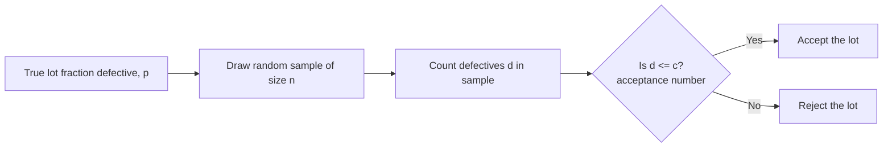
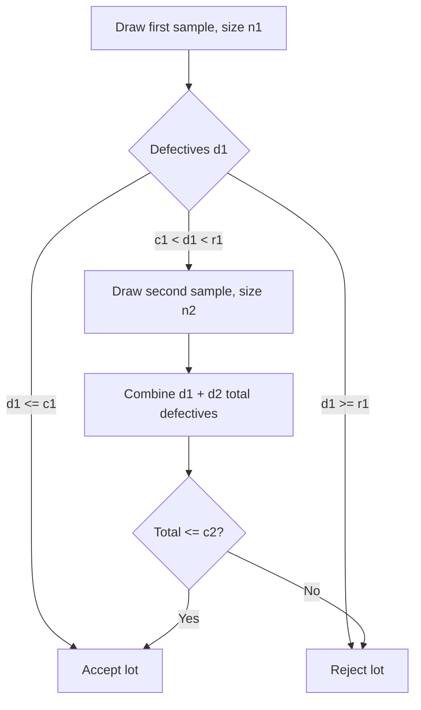
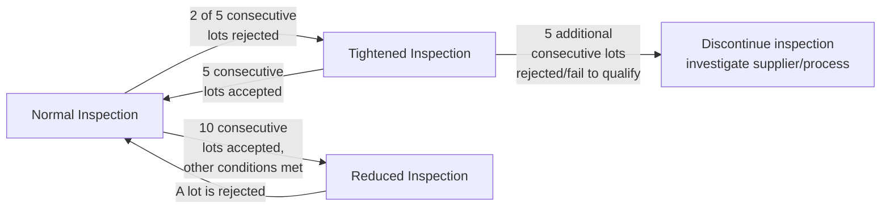

## Acceptance Sampling Plans

### Overview

**Key Points**

- Acceptance sampling is a statistical quality control method used to decide whether to **accept or reject a lot (batch) of material** based on inspecting a sample from that lot, rather than inspecting every single item (100% inspection) or none at all.
- It sits at the boundary between a supplier and a customer (or between production stages) — applied at receiving inspection, in-process handoffs, or final outgoing inspection.
- Unlike control charts, which monitor an ongoing process to detect shifts in real time, acceptance sampling makes a one-time accept/reject decision about a specific, already-produced lot.
- All acceptance sampling plans involve balancing two competing risks: rejecting a genuinely good lot (**producer's risk**) and accepting a genuinely bad lot (**consumer's risk**).

### Why Use Sampling Instead of 100% Inspection

| Factor | Favors Sampling | Favors 100% Inspection |
| --- | --- | --- |
| Inspection cost | High cost per unit | Low cost per unit |
| Destructive testing | Testing destroys the item (e.g., crash tests, tensile tests) | Non-destructive testing |
| Lot size | Very large lots | Small lots |
| Inspector fatigue/error | Human inspection prone to fatigue over long runs | Automated/reliable inspection |
| Criticality | Non-critical characteristics | Safety-critical characteristics (may require 100%) |

[Inference] For safety-critical or highly regulated characteristics (e.g., aerospace fasteners, pharmaceutical potency), 100% inspection or redundant automated inspection is frequently mandated regardless of the cost/benefit tradeoff that would otherwise favor sampling, since the consequence of a single escaped defect can be disproportionately severe.

### Core Terminology

| Term | Symbol | Definition |
| --- | --- | --- |
| Lot size | $N$ | Total number of units in the batch being evaluated |
| Sample size | $n$ | Number of units randomly drawn from the lot for inspection |
| Acceptance number | $c$ | Maximum number of defective units allowed in the sample for the lot to still be accepted |
| Rejection number | $r$ | Number of defectives at which the lot is rejected (often $r = c+1$) |
| Acceptable Quality Level | $AQL$ | The worst tolerable defect rate that is still considered acceptable as a process average |
| Rejectable Quality Level / Lot Tolerance Percent Defective | $RQL$ / $LTPD$ | The defect rate considered unacceptable, which the plan should reject with high probability |
| Producer's risk | $\alpha$ | Probability of rejecting a lot that is actually at or better than $AQL$ (a "false alarm" against the supplier) |
| Consumer's risk | $\beta$ | Probability of accepting a lot that is actually as bad as or worse than $RQL$/$LTPD$ (a "miss" that harms the customer) |

### The Operating Characteristic (OC) Curve

The **OC curve** is the fundamental analytical tool for evaluating and comparing sampling plans. It plots the probability of lot acceptance ($P_a$) against the true (but unknown) fraction defective in the lot.

$$P_a(p) = \sum_{d=0}^{c} \binom{n}{d} p^d (1-p)^{n-d}$$

This is the cumulative binomial probability of finding $c$ or fewer defectives ($d$) in a sample of size $n$, given a true lot fraction defective $p$.

#### OC Curve Shape (svg_diagram)

<svg xmlns="http://www.w3.org/2000/svg" viewBox="0 0 700 380">
<text x="350" y="22" text-anchor="middle" font-size="15" font-weight="bold" fill="#1a1a1a">Operating Characteristic Curve (svg_diagram)</text>
<line x1="70" y1="320" x2="650" y2="320" stroke="#333" stroke-width="1.3" />
<line x1="70" y1="60" x2="70" y2="320" stroke="#333" stroke-width="1.3" />
<text x="330" y="355" font-size="11" fill="#333">True fraction defective (p)</text>
<text x="25" y="190" font-size="11" fill="#333" transform="rotate(-90 25 190)">P(accept)</text>

<text x="55" y="330" font-size="10" fill="#333">0</text>

<text x="640" y="330" font-size="10" fill="#333">1.0</text>

<text x="45" y="65" font-size="10" fill="#333">1.0</text>

<text x="50" y="325" font-size="10" fill="#333">0</text>

<line x1="250" y1="60" x2="250" y2="320" stroke="#95a5a6" stroke-width="1.5" stroke-dasharray="4,3" />
<line x1="70" y1="60" x2="250" y2="60" stroke="#95a5a6" stroke-width="1.5" stroke-dasharray="4,3" />
<line x1="250" y1="320" x2="650" y2="320" stroke="#95a5a6" stroke-width="1.5" stroke-dasharray="4,3" />
<text x="255" y="80" font-size="9" fill="#95a5a6">Ideal (theoretical) discrimination</text>

<path d="M 70,65 C 150,70 200,90 230,150 C 260,220 290,280 350,300 C 420,315 500,318 650,319" fill="none" stroke="`#2980b9`" stroke-width="2.5" />

<line x1="160" y1="60" x2="160" y2="320" stroke="#27ae60" stroke-width="1" stroke-dasharray="2,2" />
<text x="130" y="340" font-size="10" fill="#27ae60">AQL</text>
<line x1="380" y1="60" x2="380" y2="320" stroke="#c0392b" stroke-width="1" stroke-dasharray="2,2" />
<text x="360" y="340" font-size="10" fill="#c0392b">LTPD</text>

<line x1="70" y1="90" x2="160" y2="90" stroke="#27ae60" stroke-width="1" />
<text x="170" y="94" font-size="9" fill="#27ae60">α (producer's risk zone)</text>
<line x1="380" y1="300" x2="470" y2="300" stroke="#c0392b" stroke-width="1" />
<text x="480" y="304" font-size="9" fill="#c0392b">β (consumer's risk zone)</text>
</svg>

**Key Points**

- The ideal OC curve (a vertical step function) would perfectly accept every lot at or below $AQL$ and reject every lot above it — this is unattainable with any finite sample, since sampling always carries statistical risk.
- Real OC curves are S-shaped: increasing $n$ (for a fixed $c/n$ ratio) makes the curve steeper (better discrimination between good and bad lots), while increasing $c$ relative to $n$ shifts the curve to the right (more lenient acceptance).

### Types of Sampling Plans

#### Single Sampling Plan

Draw one sample of size $n$; accept if defectives $\leq c$, reject otherwise. Simplest to administer.

**Example**

$n = 80$, $c = 2$: draw 80 units; if 2 or fewer are defective, accept the lot; if 3 or more, reject it.

#### Double Sampling Plan

Draw a first, smaller sample. If the result is clearly good or clearly bad, decide immediately; if it falls in an ambiguous middle range, draw a second sample and combine both results before deciding.

**Key Points**

- Double sampling generally results in a **lower average sample size** than single sampling for the same level of discrimination, because many lots are decided on the first, smaller sample alone — at the cost of a more complex administrative procedure.

#### Multiple Sampling Plan

An extension of double sampling using several (often five to seven) smaller sample stages, each with its own accept/reject/continue thresholds. Further reduces average sample size but increases administrative complexity.

#### Sequential Sampling Plan

Items are inspected one at a time (or in very small groups), and a running cumulative count of defectives is plotted against two boundary lines (derived from Wald's Sequential Probability Ratio Test, SPRT). Sampling continues until the cumulative result crosses either the acceptance or rejection boundary.

$$\text{Accept if: } \sum d_i \leq h_1 + s \cdot n, \qquad \text{Reject if: } \sum d_i \geq h_2 + s \cdot n$$

where $h_1$, $h_2$ are boundary intercepts and $s$ is the slope, all derived from the specified $AQL$, $LTPD$, $\alpha$, and $\beta$. [Unverified] The exact derivation of $h_1$, $h_2$, and $s$ involves logarithmic functions of the risk parameters; practitioners typically use standard published tables (e.g., MIL-STD or ANSI/ASQ tables) rather than deriving these from first principles for routine use.

#### Comparison of Plan Types

| Plan Type | Avg. Sample Size | Administrative Complexity | Best Suited For |
| --- | --- | --- | --- |
| Single | Highest (fixed) | Lowest | Simple, quick decisions; automated inspection |
| Double | Lower than single (variable) | Moderate | Reducing inspection cost when many lots are clearly good/bad |
| Multiple | Lower than double (variable) | High | High-volume repetitive lot acceptance |
| Sequential | Lowest (variable, item-by-item) | Highest | Expensive or destructive testing where minimizing sample size matters most |

### Standard Sampling Plan Systems

#### ANSI/ASQ Z1.4 (formerly MIL-STD-105E)

A widely referenced standard for **attribute** sampling plans (pass/fail inspection), organized around:

- **Inspection level** (I, II, III — with II as the general default), which determines the relationship between lot size and sample size.
- **AQL tables**, from which sample size codes and corresponding $(n, c)$ pairs are read off based on lot size and desired $AQL$.
- **Switching rules** between normal, tightened, and reduced inspection, based on recent lot acceptance/rejection history — providing an adaptive mechanism that increases scrutiny when quality appears to be degrading and reduces inspection burden when a supplier demonstrates sustained good quality.

[Inference] The specific numeric thresholds in the switching rules (e.g., "2 of 5," "5 consecutive," "10 consecutive") are as codified in the ANSI/ASQ Z1.4 standard; organizations sometimes adapt these thresholds in internal procedures, so the exact switching criteria should be verified against the specific standard or internal quality manual in use.

#### ANSI/ASQ Z1.9 (formerly MIL-STD-414)

The counterpart standard for **variables** sampling plans — used when the quality characteristic is a continuous measurement rather than pass/fail. Variables plans can achieve equivalent discrimination (equivalent $AQL$/$LTPD$ protection) with smaller sample sizes than attribute plans, since each measurement carries more information than a simple pass/fail classification, but they require the underlying data to be reasonably normal and require actual measurement rather than a simple go/no-go gauge.

#### Dodge-Romig Tables

An alternative, older system focused on minimizing **average total inspection (ATI)** for specified $LTPD$ protection, historically used in contexts prioritizing rejected-lot rectification (100% inspection of rejected lots) over acceptance-level assurance.

### Average Outgoing Quality (AOQ)

For plans where rejected lots are subjected to 100% inspection and all discovered defectives are replaced with good units (a common **rectifying inspection** scheme), the **Average Outgoing Quality** describes the expected quality level of all lots leaving the inspection point (combining both accepted lots as-is and rejected-then-rectified lots):

$$AOQ = \frac{P_a(p) \times p \times (N - n)}{N}$$

The **Average Outgoing Quality Limit (AOQL)** is the maximum value of $AOQ$ across all possible incoming quality levels $p$ — representing the worst-case average quality a customer will receive, regardless of how bad the incoming lots are, given that all rejected lots get rectified.

**Example**

If incoming lots are extremely poor (very high $p$), most lots will be rejected and then fully rectified (100% inspected and defectives replaced), pulling the outgoing quality back up. If incoming lots are already excellent (very low $p$), the outgoing quality is also excellent, since even accepted lots contain few defects. The $AOQ$ curve peaks somewhere in between — at moderate incoming defect rates where many lots are still accepted "as is" without inspection, but the acceptance rate is high enough that this uninspected fraction still allows some meaningfully defective lots through.

### Acceptance Sampling vs. SPC: Complementary but Distinct

| Aspect | Acceptance Sampling | Statistical Process Control (Control Charts) |
| --- | --- | --- |
| Purpose | Accept/reject a specific lot | Monitor ongoing process stability over time |
| Timing | Applied after production, before shipment/use | Applied continuously during production |
| Decision | Binary: accept or reject this lot | Continuous: is the process in or out of control |
| Improves the process? | No — sorts good lots from bad, does not fix the process | Yes — enables real-time detection and correction of special causes |
| Underlying philosophy | "Inspect quality in" (detection-oriented) | "Build quality in" (prevention-oriented) |

**Key Points**

- Deming was notably critical of relying heavily on acceptance sampling, arguing it is fundamentally a detection-based strategy that sorts defects after the fact rather than preventing them, and advocated prioritizing process control and supplier quality partnerships over inspection-based lot acceptance. [Unverified] The precise framing and emphasis of this critique vary somewhat across secondary sources summarizing Deming's teachings, though the general position is widely and consistently attributed to him.

### Practical Considerations and Limitations

- **Sample must be truly random**: Non-random sampling (e.g., always pulling from the top of a pallet) can badly bias the accept/reject decision and invalidate the statistical guarantees of the OC curve.
- **Rejected lots still require disposition**: A rejected lot must be handled — returned to supplier, 100% sorted, scrapped, or used under a deviation/waiver — sampling itself does not fix the lot.
- **Not a substitute for process improvement**: Acceptance sampling manages risk at a boundary; it does not reduce the underlying defect rate of the source process.
- **Sample size vs. protection trade-off**: Larger samples provide steeper (more discriminating) OC curves and tighter risk control, but at proportionally higher inspection cost — a classic economic trade-off decision.

### Next Steps

- Deriving and reading operating characteristic (OC) curves for specific $(n, c)$ combinations
- ANSI/ASQ Z1.4 and Z1.9 standard tables and their practical application
- Rectifying inspection schemes and Average Outgoing Quality Limit (AOQL) calculations
- Sequential Probability Ratio Test (SPRT) foundations for sequential sampling plans
- Deming's critique of inspection-based quality and the shift toward supplier quality partnerships
- Continuous sampling plans (e.g., CSP-1) for ongoing production lines rather than discrete lots
- Relationship between acceptance sampling economics and Total Quality Management (TQM) philosophy