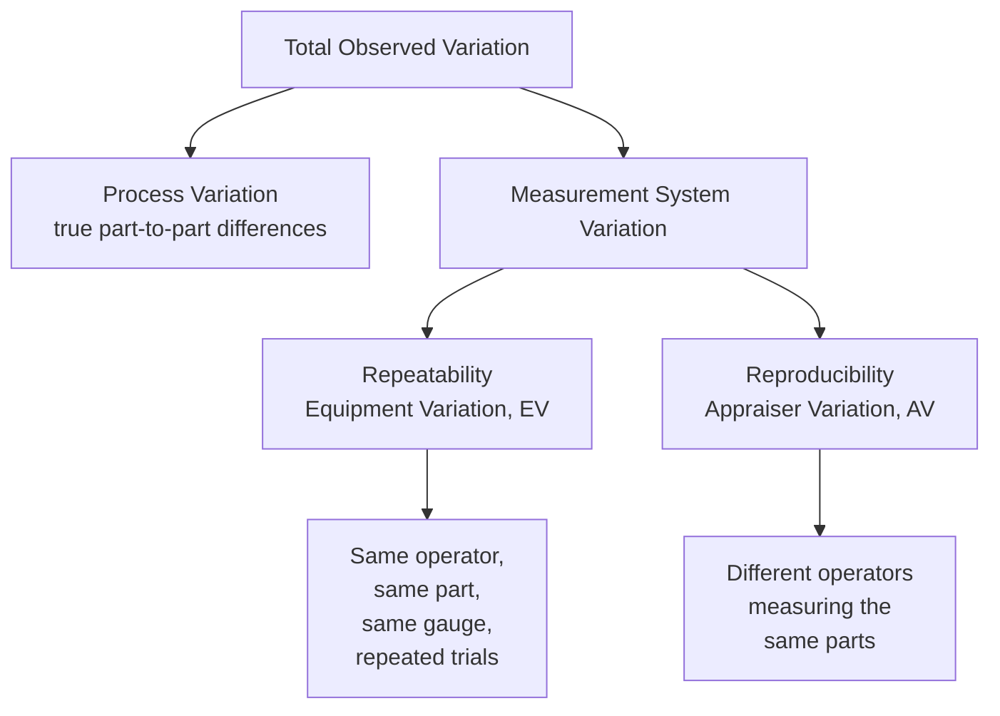
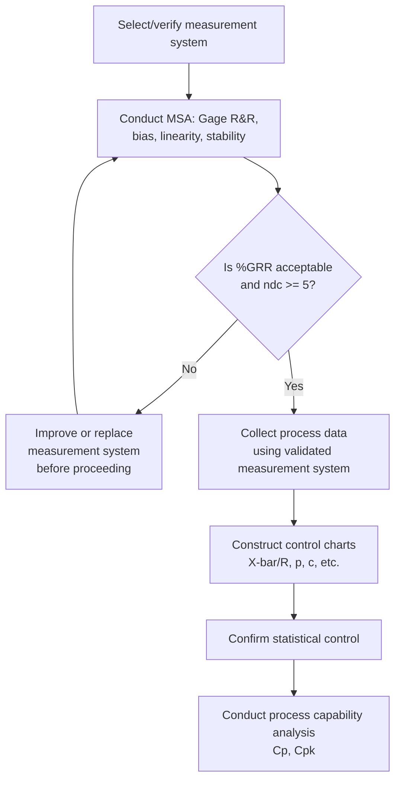

## Measurement System Analysis

### Overview

**Key Points**

- Measurement System Analysis (MSA) is the discipline of quantifying how much of the **observed variation** in process data comes from the actual process versus from the **measurement system itself** — the gauge, instrument, operator, and procedure used to collect the data.
- Before any control chart, capability study, or improvement effort can be trusted, the measurement system used to generate the underlying data must itself be shown to be adequate; otherwise, conclusions about the process may actually be conclusions about a faulty gauge or inconsistent measurement procedure.
- The most common MSA tool for continuous data is **Gage Repeatability and Reproducibility (Gage R&R)**, which decomposes total observed variation into process variation and measurement system variation, further splitting the latter into repeatability and reproducibility components.

### Why MSA Matters: The Total Variation Model

Any observed measurement contains two combined sources of variation:

$$\sigma^2_{Total} = \sigma^2_{Process} + \sigma^2_{Measurement}$$

If $\sigma^2_{Measurement}$ is large relative to $\sigma^2_{Process}$, several serious downstream problems can occur:

- **Control charts** may show false out-of-control signals (or mask real ones), because the noise floor from the measurement system inflates or distorts the observed variation.
- **Capability indices** ($C_p$, $C_{pk}$) will be understated, making an actually-capable process look incapable, since the inflated total $\sigma$ used in the denominator is not purely process variation.
- **Root cause investigations** may chase phantom process problems that are actually measurement artifacts.

### Key Terminology

| Term | Definition |
| --- | --- |
| **Repeatability** | Variation observed when the *same* operator measures the *same* part with the *same* gauge multiple times. Also called Equipment Variation (EV). Reflects the inherent precision of the instrument itself. |
| **Reproducibility** | Variation observed when *different* operators measure the *same* parts with the *same* gauge. Also called Appraiser Variation (AV). Reflects differences in technique, training, or interpretation between people. |
| **Bias** | The difference between the average of measured values and a known, accepted reference (true) value — a systematic offset, not random scatter. |
| **Linearity** | How bias changes across the operating range of the instrument (e.g., a scale accurate at low weights but biased at high weights). |
| **Stability** | Whether a measurement system's bias or variation remains constant over time. |
| **Discrimination (Resolution)** | The smallest detectable increment the measurement system can distinguish; inadequate resolution can make a genuinely capable process appear incapable simply because the gauge cannot detect fine differences. |

### The Five Core Elements of Measurement System Quality

1. **Bias** — accuracy relative to a known standard
2. **Repeatability** — precision under identical conditions
3. **Reproducibility** — precision across operators
4. **Stability** — consistency over time
5. **Linearity** — consistency of bias across the measurement range

[Inference] Different sources organize these five elements slightly differently (some group bias and linearity together as "accuracy" studies, separate from "precision" studies covering repeatability and reproducibility), but the same five underlying properties are consistently assessed across standard MSA methodology (e.g., AIAG MSA reference manual conventions).

### Gage R&R Study Design

#### Standard Study Structure

A typical **crossed Gage R&R study** involves:

- $p$ parts (typically 10), selected to represent the full range of process variation
- $o$ operators (typically 2–3)
- $r$ trials/repetitions per operator per part (typically 2–3)

Each operator measures each part multiple times, in random order, without knowledge of prior results (blind measurement) to avoid bias from memory or expectation.

#### ANOVA Method (Preferred Modern Approach)

The **Analysis of Variance (ANOVA)** method decomposes total variation into four components:

$$\sigma^2_{Total} = \sigma^2_{Part} + \sigma^2_{Operator} + \sigma^2_{Operator \times Part} + \sigma^2_{Repeatability}$$

- $\sigma^2_{Part}$: true part-to-part variation (the "signal" — this represents actual process variation, which is desirable to have)
- $\sigma^2_{Operator}$: variation attributable to differences between operators (part of reproducibility)
- $\sigma^2_{Operator \times Part}$: interaction — whether some operators measure certain parts differently than other parts (also part of reproducibility)
- $\sigma^2_{Repeatability}$: equipment/inherent measurement variation

$$\sigma^2_{Reproducibility} = \sigma^2_{Operator} + \sigma^2_{Operator \times Part}$$

$$\sigma^2_{GageR\&R} = \sigma^2_{Repeatability} + \sigma^2_{Reproducibility}$$

[Inference] The ANOVA method is generally preferred over the older "Average and Range" method because it can separate and quantify the operator-by-part interaction term explicitly, whereas the Average and Range method cannot detect this interaction effect at all.

#### Average and Range (Xbar-R) Method (Traditional Approach)

An older, manually calculable method using ranges rather than full analysis of variance:

$$EV \text{ (Repeatability)} = \bar{R} \times K_1$$

$$AV \text{ (Reproducibility)} = \sqrt{(\bar{X}_{diff} \times K_2)^2 - \frac{EV^2}{nr}}$$

$$GRR = \sqrt{EV^2 + AV^2}$$

where $K_1$ and $K_2$ are constants dependent on the number of trials and operators respectively (analogous in spirit to the $d_2$ control chart constants), $\bar{R}$ is the average range across repeated trials, and $\bar{X}_{diff}$ is the range between operators' overall averages. [Unverified] Exact $K_1$/$K_2$ table values depend on the specific number of trials and operators used and should be taken from the standard published MSA reference tables rather than approximated.

### Evaluating Gage R&R Results

#### Percent Study Variation (%GRR)

The most commonly reported metric expresses Gage R&R as a percentage of total observed variation:

$$\%GRR = \frac{\sigma_{GageR\&R}}{\sigma_{Total}} \times 100$$

#### Acceptance Criteria (Industry Convention)

| %GRR | Interpretation |
| --- | --- |
| < 10% | Measurement system is generally considered acceptable |
| 10% – 30% | May be acceptable depending on application, cost of gauge, criticality of characteristic, and cost of improvement |
| > 30% | Measurement system generally considered unacceptable; improvement needed |

[Unverified] These thresholds (10%/30%) are the most widely cited industry convention (commonly associated with AIAG guidelines), but some organizations apply stricter or more lenient cutoffs depending on the criticality of the characteristic being measured; the specific thresholds in force should be confirmed against the applicable quality standard or customer requirement.

#### Number of Distinct Categories (ndc)

An alternative metric estimating how many distinct, statistically distinguishable groups the measurement system can reliably separate across the observed part variation:

$$ndc = 1.41 \times \frac{\sigma_{Part}}{\sigma_{GageR\&R}}$$

A commonly cited guideline is $ndc \geq 5$ for a measurement system to be considered adequate for distinguishing process variation; an $ndc$ of 1 or 2 suggests the gauge can barely distinguish "small," "medium," and "large" parts, which is inadequate for meaningful control charting.

### Worked Example

**Example**

A Gage R&R study on a caliper measuring shaft diameters yields:

$$\sigma_{Repeatability} = 0.0015 \text{ mm}, \qquad \sigma_{Reproducibility} = 0.0008 \text{ mm}, \qquad \sigma_{Part} = 0.012 \text{ mm}$$

**Step 1 — Gage R&R variation:**

$$\sigma_{GageR\&R} = \sqrt{0.0015^2 + 0.0008^2} = \sqrt{0.00000225 + 0.00000064} = \sqrt{0.00000289} \approx 0.0017 \text{ mm}$$

**Step 2 — Total variation:**

$$\sigma_{Total} = \sqrt{\sigma_{GageR\&R}^2 + \sigma_{Part}^2} = \sqrt{0.0017^2 + 0.012^2} = \sqrt{0.00000289 + 0.000144} \approx 0.01212 \text{ mm}$$

**Step 3 — %GRR:**

$$\%GRR = \frac{0.0017}{0.01212} \times 100 \approx 14.0\%$$

**Step 4 — Number of distinct categories:**

$$ndc = 1.41 \times \frac{0.012}{0.0017} \approx 9.95 \rightarrow 9$$

**Interpretation**: At 14% GRR, this measurement system falls into the "may be acceptable" middle zone, requiring judgment based on the criticality of the shaft diameter characteristic and the cost of improving the gauge. The $ndc$ of 9 comfortably exceeds the minimum guideline of 5, suggesting the gauge can adequately discriminate between different parts despite the moderate %GRR.

### Gage R&R Results Visualization (svg_diagram)

<svg viewBox="0 0 700 340" xmlns="http://www.w3.org/2000/svg">
<text x="350" y="22" text-anchor="middle" font-size="15" font-weight="bold" fill="#1a1a1a">Variance Component Breakdown (svg_diagram)</text>
<!-- Stacked bar showing variance contribution -->

<text x="100" y="60" font-size="12" font-weight="bold" fill="`#1a1a1a`">Total Variation Decomposition</text>

<rect x="100" y="80" width="500" height="50" fill="#27ae60" opacity="0.7"/>
<text x="330" y="110" text-anchor="middle" font-size="12" fill="#fff" font-weight="bold">Part-to-Part Variation (86%)</text>
<rect x="600" y="80" width="45" height="50" fill="#e74c3c" opacity="0.8"/>
<text x="622" y="110" text-anchor="middle" font-size="9" fill="#fff">GRR</text>
<text x="622" y="122" text-anchor="middle" font-size="8" fill="#fff">14%</text>
<!-- Second bar: breakdown of GRR itself -->

<text x="100" y="180" font-size="12" font-weight="bold" fill="`#1a1a1a`">Gage R&R Breakdown</text>

<rect x="100" y="200" width="330" height="40" fill="`#e67e22`" opacity="0.75"/>

<text x="265" y="225" text-anchor="middle" font-size="11" fill="#fff">Repeatability (EV) ~ 65%</text>

<rect x="430" y="200" width="180" height="40" fill="#9b59b6" opacity="0.75"/>
<text x="520" y="225" text-anchor="middle" font-size="11" fill="#fff">Reproducibility (AV) ~ 35%</text>

<text x="100" y="280" font-size="10" fill="#333">Repeatability > Reproducibility often points toward equipment/fixturing issues.</text>

<text x="100" y="298" font-size="10" fill="#333">Reproducibility > Repeatability often points toward training or procedure issues.</text>

</svg>

### Diagnosing Common Causes by Dominant Component

| Dominant Component | Likely Root Cause | Typical Corrective Action |
| --- | --- | --- |
| High repeatability (EV) | Worn or loose gauge, poor fixturing, environmental factors (vibration, temperature) | Gauge maintenance/calibration, improved fixturing, environmental control |
| High reproducibility (AV) | Inconsistent operator technique, unclear measurement procedure, inadequate training | Standardized work instructions, operator training, error-proofing the setup |
| High Part variation, low GRR | Good — measurement system is not the limiting factor | Focus improvement efforts on the actual process |
| High Operator × Part interaction | Certain operators struggle with certain part types/features (e.g., hard-to-reach features) | Investigate specific part-operator combinations; may indicate a fixture or accessibility design issue |

### Bias, Linearity, and Stability Studies

Beyond Gage R&R (which addresses precision/consistency), a complete MSA also verifies accuracy over the gauge's life:

- **Bias study**: Measure a single reference part (with a known, certified value) repeatedly and compare the average reading to the reference value; a statistically significant difference indicates the gauge needs calibration or adjustment.
- **Linearity study**: Measure several reference parts spanning the low, middle, and high end of the operating range; plot bias against the reference value — a non-flat trend indicates the gauge's accuracy degrades differently at different measurement magnitudes.
- **Stability study**: Repeatedly measure the same reference part over an extended period (days, weeks, months) and plot results on a control chart to detect drift, requiring periodic recalibration if a trend or shift emerges.

### MSA for Attribute Data

For pass/fail or categorical measurement systems (e.g., visual inspection, go/no-go gauges), **Attribute Agreement Analysis** is used instead of Gage R&R, evaluating:

- **Within-appraiser agreement**: Does the same inspector classify the same item consistently across repeated evaluations?
- **Between-appraiser agreement**: Do different inspectors agree with each other on the same items?
- **Agreement with a known standard**: Do inspectors' classifications match a verified correct answer (if available)?

Common statistical measures include **percent agreement** and **Cohen's Kappa** (or Fleiss' Kappa for more than two raters), which corrects raw agreement percentages for the level of agreement expected purely by chance.

$$\kappa = \frac{P_o - P_e}{1 - P_e}$$

where $P_o$ is the observed proportion of agreement and $P_e$ is the expected proportion of agreement by chance alone. [Unverified] Interpretation thresholds for Kappa vary by source; commonly cited rough guidelines suggest $\kappa > 0.75$ indicates good agreement and $\kappa < 0.40$ indicates poor agreement, but these bands are conventions rather than fixed statistical cutoffs.

### Integration into the SPC Workflow

**Key Points**

- MSA is logically a **prerequisite** step in the SPC sequence, not a parallel or optional activity — control charts and capability indices calculated on data from an unvalidated measurement system carry unknown and potentially large amounts of unaccounted-for noise.

### Next Steps

- Gage R&R study design: crossed vs. nested designs, and destructive testing considerations
- Attribute Agreement Analysis and Kappa statistics for pass/fail measurement systems
- Calibration systems and traceability to national/international measurement standards
- Bias, linearity, and stability study design and analysis
- Impact of measurement system variation on control chart sensitivity and Type I/Type II error rates
- Statistical Process Control fundamentals: control charts for variables and attributes
- Process capability indices ($C_p$, $C_{pk}$) and their dependency on measurement system adequacy