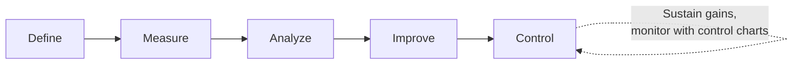
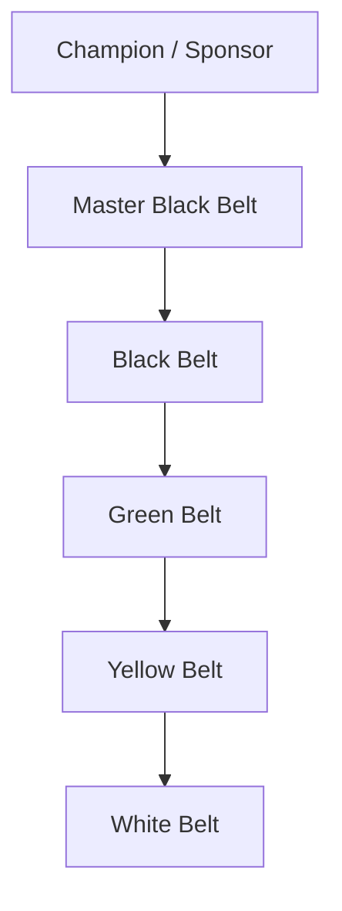

## Six Sigma Philosophy and Organizational Roles

### Overview

**Key Points**

- Six Sigma is a **data-driven methodology and management philosophy** for reducing process variation and defects, originally developed at Motorola in the 1980s and popularized through General Electric's adoption in the 1990s under Jack Welch.
- The name derives from the statistical goal of achieving a process capability where the specification limits sit at $\pm 6\sigma$ from the process mean, corresponding (under idealized long-term drift assumptions) to approximately **3.4 defects per million opportunities (DPMO)**.
- Six Sigma combines a **statistical toolkit** (control charts, hypothesis testing, design of experiments, regression) with a **structured project methodology** (DMAIC or DMADV) and a **hierarchical certification/belt system** that assigns organizational roles and responsibilities.
- Beyond statistics, Six Sigma functions as an organizational philosophy emphasizing customer focus, data-driven decision-making, process thinking, and a culture of continuous improvement.

### Historical Development

[Inference] The historical narrative below reflects the commonly cited origin story found across most Six Sigma literature and training materials; exact internal details of Motorola's original development process are less publicly documented than the subsequent GE-driven popularization.

- **Motorola (1980s)**: Engineer Bill Smith and colleagues developed the Six Sigma methodology to address quality problems, formalizing statistical rigor around defect reduction. Motorola won the inaugural Malcolm Baldrige National Quality Award in 1988, partly attributed to Six Sigma initiatives.
- **General Electric (1990s)**: CEO Jack Welch adopted and aggressively scaled Six Sigma company-wide, tying belt certification and project completion to compensation and promotion decisions, which significantly increased the methodology's visibility and adoption across industries.
- **Broader adoption**: Six Sigma spread beyond manufacturing into services, healthcare, finance, and software, often combined with **Lean** manufacturing principles into the hybrid **Lean Six Sigma** framework, which adds waste-elimination and flow-efficiency concepts to Six Sigma's variation-reduction focus.

### The Statistical Basis of "Six Sigma"

$$\text{Defects (ppm)} \approx \Phi(-Z) \times 2 \times 10^6 \quad \text{(two-sided, short-term)}$$

where $Z$ represents the number of standard deviations between the process mean and the nearest specification limit.

| Sigma Level | Short-Term DPMO (no shift) | Long-Term DPMO (with 1.5σ shift) |
| --- | --- | --- |
| 2σ | ~45,500 | ~308,538 |
| 3σ | ~2,700 | ~66,807 |
| 4σ | ~63 | ~6,210 |
| 5σ | ~0.57 | ~233 |
| 6σ | ~0.002 | ~3.4 |

**Key Points**

- The widely cited "3.4 DPMO at Six Sigma" figure incorporates a **1.5 sigma shift** assumption — the empirical observation (attributed to Motorola's original studies) that process means tend to drift by roughly 1.5 standard deviations over the long term due to tool wear, material lot changes, and other long-term sources of variation not captured in short-term studies. [Unverified] The universality and precise justification of the 1.5σ shift figure has been debated in the statistical quality literature; it is best understood as a widely adopted practical convention rather than a derived constant applicable to every process.

### DMAIC: The Core Improvement Methodology

DMAIC is the structured, five-phase problem-solving framework applied to improving an *existing* process.

| Phase | Primary Objective | Representative Tools |
| --- | --- | --- |
| **Define** | Clarify the problem, project scope, customer requirements, and business case | Project charter, SIPOC diagram, Voice of the Customer (VOC), CTQ tree |
| **Measure** | Establish baseline performance and validate the measurement system | Process mapping, data collection plan, Gage R&R, control charts |
| **Analyze** | Identify root causes of the problem using data | Root cause analysis, Pareto charts, hypothesis testing, regression, fishbone/Ishikawa diagrams |
| **Improve** | Develop, test, and implement solutions addressing root causes | Design of Experiments (DOE), pilot testing, FMEA, solution prioritization matrices |
| **Control** | Sustain the improvement and prevent regression | Control plans, updated control charts, standard operating procedures, mistake-proofing (poka-yoke) |

**Key Points**

- DMAIC is applied to **improving an existing process**; when the process does not yet exist or requires a fundamental redesign, the related **DMADV** (Define, Measure, Analyze, Design, Verify) methodology — also called **Design for Six Sigma (DFSS)** — is used instead.

### DMADV / Design for Six Sigma (Brief Contrast)

| Aspect | DMAIC | DMADV / DFSS |
| --- | --- | --- |
| Applies to | Existing process needing improvement | New process or product needing design |
| Final phases | Improve, Control | Design, Verify |
| Typical use case | Reducing defects in a current manufacturing line | Designing a new product or service from scratch |

### Six Sigma Belt Hierarchy and Organizational Roles

The belt system, borrowed conceptually from martial arts ranking, defines a structured hierarchy of training, authority, and responsibility within a Six Sigma deployment.

#### Champion (or Sponsor)

- Typically a senior executive or department leader who selects and prioritizes projects aligned with strategic business goals.
- Removes organizational barriers, secures resources, and provides executive-level support for Black Belt project teams.
- Not expected to perform hands-on statistical analysis personally; the role is primarily one of organizational sponsorship and strategic alignment.

#### Master Black Belt (MBB)

- The most senior technical and mentoring role, typically requiring several years of Black Belt project experience.
- Trains and coaches Black Belts and Green Belts, provides advanced statistical consultation, and often oversees the overall Six Sigma program strategy and deployment across the organization.
- Frequently serves as an internal Six Sigma program manager, aligning project selection with organizational priorities.

#### Black Belt (BB)

- Works full-time (or a substantial majority of time) leading complex, cross-functional DMAIC or DMADV projects.
- Possesses in-depth statistical knowledge (hypothesis testing, DOE, regression, advanced control charting) and strong project management and change leadership skills.
- Typically mentors Green Belts working on related sub-projects.

#### Green Belt (GB)

- Works on Six Sigma projects **part-time**, alongside regular job responsibilities, typically leading smaller-scope projects or supporting Black Belt-led initiatives.
- Trained in core DMAIC tools and basic statistical methods but generally relies on Black Belts or Master Black Belts for advanced statistical techniques.

#### Yellow Belt

- Possesses foundational awareness of Six Sigma concepts and terminology; typically participates as a team member on projects rather than leading them.
- Often represents front-line employees who provide process knowledge and data but are not responsible for the statistical analysis.

#### White Belt

- The most basic level of Six Sigma awareness training, often an introductory orientation for employees with no direct project responsibility, aimed at building general organizational literacy about Six Sigma terminology and goals.

[Unverified] Belt naming, exact training-hour requirements, and certification criteria are not standardized industry-wide — they vary meaningfully between certifying bodies (e.g., ASQ, IASSC) and individual organizations' internal programs, so the specific competencies implied by a given belt level should be verified against the certifying body or organization in question rather than assumed universal.

### Organizational Role Comparison Table

| Role | Typical Time Commitment | Statistical Depth | Primary Responsibility |
| --- | --- | --- | --- |
| Champion/Sponsor | Oversight only | Low (strategic understanding) | Project selection, resource allocation, barrier removal |
| Master Black Belt | Full-time (program-wide) | Highest | Training, mentoring, program strategy |
| Black Belt | Full-time (project-focused) | High | Leading complex improvement projects |
| Green Belt | Part-time | Moderate | Leading smaller projects, supporting Black Belts |
| Yellow Belt | Minimal, as team member | Basic | Team participation, process knowledge |
| White Belt | Awareness only | Minimal | General organizational literacy |

### Core Philosophical Principles

**Key Points**

- **Customer focus**: Improvement priorities are driven by Critical-to-Quality (CTQ) characteristics defined from the customer's perspective (Voice of the Customer), not solely by internal efficiency metrics.
- **Data-driven decision making**: Decisions and root-cause conclusions are based on statistical evidence rather than intuition, anecdote, or organizational hierarchy/seniority.
- **Process orientation**: Problems are treated as symptoms of underlying process design issues rather than attributed primarily to individual worker error — echoing the common-cause/special-cause distinction from SPC and Deming's broader systems thinking.
- **Variation reduction as the central lever**: Consistent with Six Sigma's statistical roots, reducing variation (not just shifting the average) is treated as a primary path to improved quality and predictability.
- **Financial accountability**: Six Sigma projects are typically required to demonstrate a quantifiable business case and measurable financial or operational impact (cost savings, cycle time reduction, defect reduction), distinguishing it from purely academic quality initiatives.

### Six Sigma vs. Lean vs. Lean Six Sigma

| Framework | Primary Focus | Core Question |
| --- | --- | --- |
| **Six Sigma** | Reducing variation and defects | "Why is this process producing inconsistent or defective output?" |
| **Lean** | Eliminating waste, improving flow and speed | "Where is time, material, or effort being wasted in this process?" |
| **Lean Six Sigma** | Combined: waste elimination and variation reduction | "How do we make this process both faster and more consistent?" |

[Inference] Lean Six Sigma is widely regarded as more comprehensive for holistic process improvement than either framework alone, since Six Sigma's rigorous statistical control complements Lean's speed and waste-reduction focus, but the specific tool selection and sequencing in a combined deployment vary by practitioner and organizational context.

### Common Criticisms and Limitations

- **Implementation cost and overhead**: Establishing a belt hierarchy, training infrastructure, and dedicated Black Belt roles requires significant organizational investment, which can be difficult to justify in smaller organizations.
- **Risk of tool-focus over culture change**: Critics argue that some organizations adopt Six Sigma's tools and certifications without genuinely embedding the underlying data-driven, customer-focused culture, resulting in superficial "belt collecting" rather than sustained improvement.
- **Potential rigidity**: The structured DMAIC sequence, while valuable for complex problems, can be perceived as excessive overhead for simple, quickly-solvable issues that do not require a full project lifecycle.
- **Innovation trade-off debate**: [Unverified] Some commentators (including retrospective analyses of GE's later performance) have questioned whether an intense organizational focus on variation reduction and process discipline may, in certain contexts, compete with resources and incentives needed for breakthrough innovation — though this remains a debated and context-dependent claim rather than an established empirical consensus.

### Next Steps

- DMAIC methodology in depth: tools and techniques for each phase
- Design for Six Sigma (DFSS) and the DMADV methodology
- Lean principles and waste identification (the 8 wastes / DOWNTIME framework)
- Voice of the Customer (VOC) and Critical-to-Quality (CTQ) tree construction
- Statistical tools underlying Six Sigma: hypothesis testing, ANOVA, regression, Design of Experiments (DOE)
- Failure Mode and Effects Analysis (FMEA) as an Improve-phase risk tool
- Building a Six Sigma deployment: project selection, prioritization, and governance structures