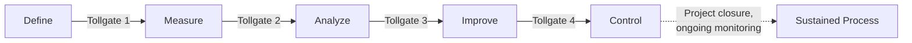
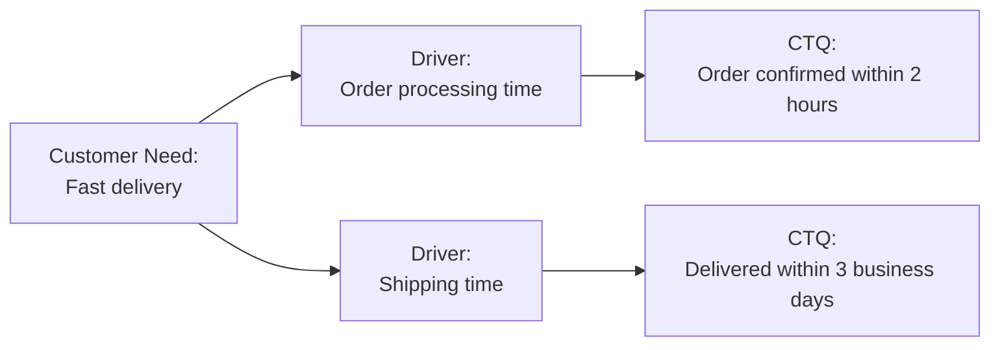
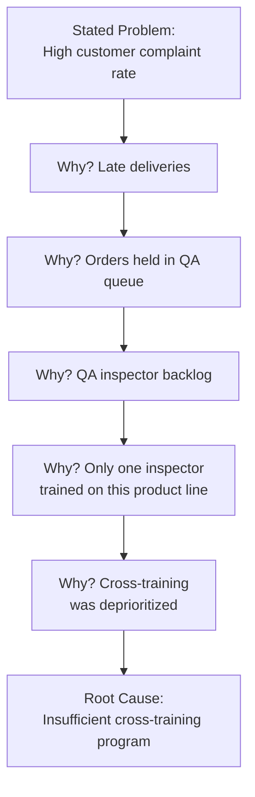
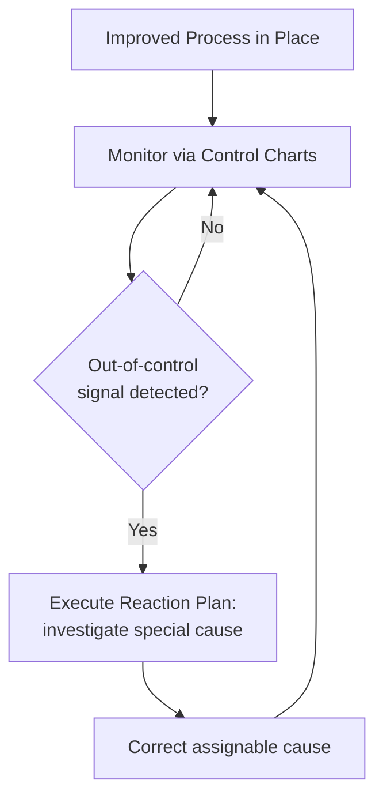

## The DMAIC Methodology

### Overview

**Key Points**

- DMAIC (Define, Measure, Analyze, Improve, Control) is the core five-phase, structured problem-solving framework used within Six Sigma to improve an existing process by systematically identifying and eliminating root causes of defects or variation.
- Each phase has defined objectives, deliverables ("tollgates" or "gate reviews"), and a standard toolkit; a project team typically cannot proceed to the next phase without demonstrating that the current phase's objectives have been met.
- Unlike ad hoc problem-solving, DMAIC enforces a disciplined separation between diagnosing a problem (Define/Measure/Analyze) and solving it (Improve/Control), explicitly delaying solution generation until root causes are data-verified — countering the common organizational tendency to jump to solutions prematurely.

### The Five-Phase Sequence

### Phase 1: Define

#### Objective

Clarify the problem, establish project scope and boundaries, identify the customer and their requirements, and build the business case justifying the project.

#### Key Deliverables and Tools

- **Project Charter**: A foundational document capturing the problem statement, goal statement, business case, scope (in-scope/out-of-scope boundaries), timeline, and team roles.
- **SIPOC Diagram** (Suppliers, Inputs, Process, Outputs, Customers): A high-level process map establishing context before detailed analysis begins.
- **Voice of the Customer (VOC)**: Systematic gathering of customer needs and expectations via surveys, interviews, complaints data, or focus groups.
- **Critical-to-Quality (CTQ) Tree**: Translates broad customer needs into specific, measurable process requirements.

**Example**

A project charter for a hospital emergency department might state: Problem — "Average patient wait time from triage to physician evaluation is 68 minutes, exceeding the target of 30 minutes." Goal — "Reduce average wait time to under 30 minutes within 6 months." Scope — "Triage through initial physician contact; excludes treatment and discharge processes."

### Phase 2: Measure

#### Objective

Establish a reliable, quantified baseline of current process performance and confirm the measurement system itself is trustworthy before drawing conclusions from the data.

#### Key Deliverables and Tools

- **Detailed Process Map**: A more granular flowchart than the SIPOC, showing all steps, decision points, and handoffs in the current process.
- **Data Collection Plan**: Specifies what data will be collected, by whom, how often, and using what operational definitions (ensuring consistent interpretation of terms like "defect" or "on-time").
- **Measurement System Analysis (MSA)**: Gage R&R and related studies to confirm the measurement system's precision and accuracy are adequate before trusting the resulting data.
- **Baseline Capability Metrics**: Initial calculation of process capability ($C_p$, $C_{pk}$) or sigma level/DPMO to quantify the current state.
- **Control charts**: Establishing whether the current process is in statistical control before further analysis.

**Key Points**

- Skipping or rushing the Measure phase is a common project failure mode [Inference] — teams that proceed to Analyze using an unvalidated measurement system risk building an entire root-cause investigation on data that does not accurately reflect the true process behavior.

### Phase 3: Analyze

#### Objective

Use the baseline data to identify and statistically verify the **root cause(s)** of the defect or variation, distinguishing correlation from causation wherever possible.

#### Key Deliverables and Tools

- **Pareto Analysis**: Applying the 80/20 principle to identify which few defect types or causes account for the majority of the problem.
- **Root Cause Analysis Tools**: Fishbone (Ishikawa) diagrams organizing potential causes into categories (commonly Man, Machine, Method, Material, Measurement, Environment — the "6 Ms"); the **5 Whys** technique for iteratively drilling into a stated problem.
- **Hypothesis Testing**: Statistical tests (t-tests, ANOVA, chi-square tests) to formally verify whether an observed difference between groups (e.g., two shifts, two suppliers, two machines) is statistically significant or likely due to random chance.
- **Regression Analysis**: Quantifying the relationship between input variables (Xs) and the output (Y) to identify which inputs most strongly drive the outcome.
- **Failure Mode and Effects Analysis (FMEA)**: Sometimes introduced here (or in Improve) to systematically evaluate potential failure modes, their severity, likelihood of occurrence, and detectability.

**Example**

A Pareto chart of defect types on an assembly line might reveal that of 12 distinct defect categories, just 3 (misaligned components, solder voids, and incorrect torque) account for 78% of all recorded defects — directing the team's limited investigative resources toward those three causes rather than spreading effort evenly across all twelve.

**Key Points**

- The Analyze phase's central discipline is **verifying** root causes with data (via hypothesis testing or correlation/regression analysis) rather than relying solely on brainstormed hypotheses from a fishbone diagram — a fishbone diagram generates candidate causes, but statistical analysis is needed to confirm which candidates are actually significant drivers.

### Phase 4: Improve

#### Objective

Develop, test, and implement solutions that directly address the statistically verified root causes identified in Analyze.

#### Key Deliverables and Tools

- **Design of Experiments (DOE)**: Structured, statistically efficient experimentation varying multiple input factors simultaneously to identify optimal settings and interactions between variables, more efficient than one-factor-at-a-time testing.
- **Solution Prioritization Matrix**: Evaluating candidate solutions against criteria such as impact, cost, implementation difficulty, and risk (e.g., an Impact/Effort matrix).
- **Pilot Testing**: Implementing the proposed solution on a small scale before full rollout, to validate effectiveness and surface unforeseen issues.
- **Mistake-Proofing (Poka-Yoke)**: Designing process changes or physical/procedural safeguards that make errors physically difficult or impossible to commit, rather than relying solely on inspection or training.
- **Updated FMEA**: Reassessing failure modes for the newly designed process to ensure the solution does not introduce new risks.

**Example**

Following identification of "insufficient cross-training" as the root cause of QA backlog, a DOE might test combinations of training duration (4 hrs vs. 8 hrs) and training method (hands-on vs. video-based) across a pilot group, measuring resulting inspection throughput and error rate, before selecting and scaling the best-performing combination.

### Phase 5: Control

#### Objective

Sustain the improvement over the long term, preventing the process from reverting to its prior state ("backsliding") after the project team disengages.

#### Key Deliverables and Tools

- **Control Plan**: A formal document specifying which process parameters will be monitored, how, how often, by whom, and what response is required if a parameter drifts out of range.
- **Statistical Process Control (SPC) Charts**: Ongoing control charts (X-bar/R, p, c, etc., as appropriate to the data type) to monitor the improved process and detect any future special cause variation.
- **Standard Operating Procedures (SOPs)**: Updated and documented work instructions reflecting the new, improved process.
- **Training and Handoff**: Transferring ownership and knowledge from the project team to the process owner and operating personnel who will sustain the gains long-term.
- **Response/Reaction Plan**: A documented escalation procedure for what to do if the control chart signals an out-of-control condition after project closure.

**Key Points**

- The Control phase is where DMAIC most directly connects back to core SPC concepts — the entire purpose of establishing new control charts here is to ensure any future special cause variation is caught quickly, before the process degrades back toward its pre-project baseline.
- A DMAIC project without a rigorous Control phase risks the classic "improvement regression" pattern, where initial gains are measured and celebrated but silently erode over subsequent months without a monitoring mechanism to catch the drift.

### Tollgate Reviews

Between each phase, a **tollgate review** (or gate review) is conducted, typically involving the project Champion or Master Black Belt, to formally verify that the phase's objectives and deliverables have been satisfactorily completed before authorizing progression to the next phase.

| Tollgate | Typical Review Questions |
| --- | --- |
| Define → Measure | Is the problem clearly scoped? Is the business case sound? Is the team properly resourced? |
| Measure → Analyze | Is the measurement system validated? Is the baseline data reliable and sufficient? |
| Analyze → Improve | Are root causes statistically verified, not just hypothesized? |
| Improve → Control | Has the solution been piloted and shown to address the verified root cause? |
| Control → Closure | Is a monitoring plan in place? Has ownership been transferred to the process owner? |

### Summary Table: DMAIC at a Glance

| Phase | Central Question | Primary Output |
| --- | --- | --- |
| Define | What problem are we solving, and for whom? | Project charter, SIPOC, CTQ tree |
| Measure | How is the process performing today, and can we trust the data? | Validated baseline data, MSA results |
| Analyze | Why is the problem occurring? | Statistically verified root cause(s) |
| Improve | What changes will fix the root cause? | Piloted, validated solution |
| Control | How do we make the improvement stick? | Control plan, updated control charts, SOPs |

### Common Pitfalls in DMAIC Execution

- **Jumping to Improve prematurely**: Proposing and implementing solutions before root causes are data-verified in Analyze, often driven by organizational pressure for quick visible action.
- **Weak Define phase scoping**: An overly broad or vaguely defined problem statement can cause a project to expand indefinitely ("scope creep") without a clear boundary for what constitutes completion.
- **Treating Measure as a formality**: Collecting data quickly without validating the measurement system first, risking conclusions built on unreliable data (see Measurement System Analysis).
- **Underinvesting in Control**: Declaring project success immediately after a successful pilot in Improve, without establishing the ongoing monitoring infrastructure needed to sustain the gain — a common cause of the "improvement fade" phenomenon documented anecdotally across many Six Sigma deployments. [Unverified] The specific prevalence rates cited for improvement regression after weak Control phases vary across sources and are not derived from a single authoritative study.

### Related Frameworks: DMAIC vs. PDCA

| Aspect | DMAIC | PDCA (Plan-Do-Check-Act) |
| --- | --- | --- |
| Origin | Six Sigma / Motorola-GE lineage | Deming/Shewhart continuous improvement cycle |
| Typical scope | Larger, formally chartered projects with dedicated resources | Smaller, faster, often continuous improvement cycles |
| Statistical rigor | Generally higher (hypothesis testing, DOE expected) | Variable; can be applied with lighter statistical tooling |
| Iteration | Typically a single pass per project (though can repeat) | Explicitly cyclical and repeated |

[Inference] The two frameworks share substantial conceptual DNA (both separate diagnosis from action and emphasize data-driven verification), and many organizations use PDCA for smaller, faster continuous improvement efforts while reserving DMAIC for larger, more complex, cross-functional projects requiring formal statistical analysis.

### Next Steps

- Six Sigma philosophy, belt hierarchy, and organizational roles
- Design of Experiments (DOE): factorial designs and analysis
- Failure Mode and Effects Analysis (FMEA) methodology
- Hypothesis testing fundamentals: t-tests, ANOVA, chi-square tests
- Statistical Process Control charts as the Control-phase monitoring mechanism
- Measurement System Analysis (Gage R&R) as a Measure-phase prerequisite
- Design for Six Sigma (DFSS) and the DMADV methodology for new process/product design
- Project charter development and SIPOC diagramming techniques