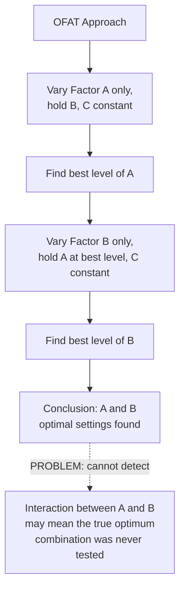
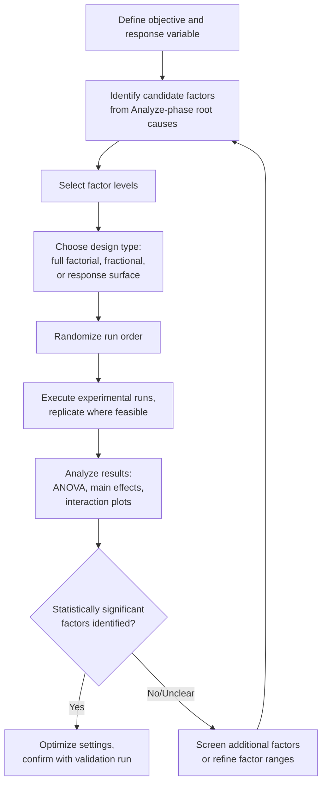

## Design of Experiments

### Overview

**Key Points**

- Design of Experiments (DOE) is a structured, statistically rigorous approach to planning experiments so that the effects of multiple input variables (**factors**) on an output (**response**) can be efficiently and reliably estimated, including interactions between factors that simpler methods cannot detect.
- DOE contrasts sharply with the intuitive but statistically weaker **One-Factor-At-a-Time (OFAT)** approach, offering greater information per experimental run and the unique ability to quantify **interaction effects** — where the effect of one factor depends on the level of another.
- Within the Six Sigma DMAIC framework, DOE is a core Improve-phase tool used to identify optimal process settings once root causes (candidate factors) have been narrowed down in the Analyze phase.

### Why Not One-Factor-At-a-Time (OFAT)?

The traditional approach of testing one variable while holding all others constant seems intuitive but has significant limitations.

**Key Points**

- OFAT requires more total experimental runs to achieve the same statistical precision as a well-designed factorial experiment, and it structurally cannot detect **interaction effects** — situations where, for example, Factor A's optimal setting depends on which level Factor B is set to. A full factorial design tests all combinations, allowing interactions to be estimated directly.

### Core Terminology

| Term | Definition |
| --- | --- |
| **Factor** | An independent input variable that is deliberately varied in the experiment (e.g., temperature, pressure, supplier) |
| **Level** | A specific setting or value a factor is set to during a run (e.g., "low" and "high" temperature) |
| **Response** | The measured output variable of interest (e.g., yield, strength, defect rate) |
| **Treatment / Run** | One specific combination of factor levels tested |
| **Main Effect** | The average change in the response caused by changing a single factor from its low to high level, averaged across all levels of other factors |
| **Interaction Effect** | The degree to which the effect of one factor depends on the level of another factor |
| **Replication** | Repeating the same treatment combination multiple times to estimate experimental (random) error |
| **Randomization** | Running experimental trials in random order to prevent unknown or uncontrolled variables (e.g., time-of-day effects, material lot changes) from biasing results |
| **Blocking** | Grouping experimental runs by a known nuisance variable (e.g., different operators, different days) to remove its effect from the analysis of the factors of interest |

### Full Factorial Designs

#### Structure

A full factorial design tests **every possible combination** of factor levels. For $k$ factors each at 2 levels (commonly denoted "low" and "high," or $-1$ and $+1$), the number of required runs is:

$$\text{Runs} = 2^k$$

**Example**

A $2^3$ full factorial design studying the effect of temperature, pressure, and catalyst concentration on chemical yield requires $2^3 = 8$ runs, covering every combination:

| Run | Temperature | Pressure | Catalyst | Yield (%) |
| --- | --- | --- | --- | --- |
| 1 | Low (−) | Low (−) | Low (−) | 62 |
| 2 | High (+) | Low (−) | Low (−) | 71 |
| 3 | Low (−) | High (+) | Low (−) | 65 |
| 4 | High (+) | High (+) | Low (−) | 82 |
| 5 | Low (−) | Low (−) | High (+) | 68 |
| 6 | High (+) | Low (−) | High (+) | 75 |
| 7 | Low (−) | High (+) | High (+) | 70 |
| 8 | High (+) | High (+) | High (+) | 90 |

#### Calculating a Main Effect

The main effect of a factor is the difference between the average response at its high level and its average response at its low level:

$$\text{Main Effect}_{Temp} = \bar{Y}_{Temp+} - \bar{Y}_{Temp-}$$

Using the table above, the average yield when Temperature is High (runs 2, 4, 6, 8) is $\frac{71+82+75+90}{4} = 79.5$, and when Low (runs 1, 3, 5, 7) is $\frac{62+65+68+70}{4} = 66.25$.

$$\text{Main Effect}_{Temp} = 79.5 - 66.25 = 13.25$$

This indicates that, averaged across all combinations of pressure and catalyst, increasing temperature from low to high raises yield by approximately 13.25 percentage points.

#### Detecting an Interaction

An interaction between Temperature and Pressure would appear if the effect of Temperature is notably different depending on whether Pressure is Low or High:

- Effect of Temp when Pressure is Low: $(71-62) = 9$ (comparing runs 1 and 2)
- Effect of Temp when Pressure is High: $(82-65) = 17$ (comparing runs 3 and 4)

Since these two values (9 vs. 17) differ substantially, this suggests a **Temperature × Pressure interaction** — the benefit of increasing temperature is much larger when pressure is already high than when it is low.

### Interaction Plot Visualization (svg_diagram)

<svg xmlns="http://www.w3.org/2000/svg" viewBox="0 0 680 340">
<text x="340" y="22" text-anchor="middle" font-size="15" font-weight="bold" fill="#1a1a1a">Interaction Plot: Temperature × Pressure (svg_diagram)</text>
<line x1="80" y1="290" x2="600" y2="290" stroke="#333" stroke-width="1.3" />
<line x1="80" y1="60" x2="80" y2="290" stroke="#333" stroke-width="1.3" />
<text x="310" y="320" font-size="11" fill="#333">Temperature (Low to High)</text>
<text x="35" y="180" font-size="11" fill="#333" transform="rotate(-90 35 180)">Yield (%)</text>

<text x="65" y="295" font-size="10" fill="#333">Low</text>

<text x="580" y="295" font-size="10" fill="#333">High</text>

<line x1="130" y1="245" x2="480" y2="185" stroke="#2980b9" stroke-width="2.5" />
<circle cx="130" cy="245" r="4" fill="#2980b9" />
<circle cx="480" cy="185" r="4" fill="#2980b9" />
<text x="490" y="185" font-size="10" fill="#2980b9">Pressure: Low</text>

<line x1="130" y1="225" x2="480" y2="95" stroke="#e74c3c" stroke-width="2.5" />
<circle cx="130" cy="225" r="4" fill="#e74c3c" />
<circle cx="480" cy="95" r="4" fill="#e74c3c" />
<text x="490" y="95" font-size="10" fill="#e74c3c">Pressure: High</text>

<text x="130" y="330" font-size="10" fill="#666">Non-parallel lines indicate an interaction effect between the two factors.</text>

</svg>

**Key Points**

- If the two lines in an interaction plot were parallel, this would indicate no meaningful interaction — the effect of Temperature would be consistent regardless of Pressure's level. The divergence (non-parallel, differing slopes) visually confirms the interaction calculated numerically above.

### Fractional Factorial Designs

#### Motivation

As the number of factors $k$ grows, full factorial designs become expensive: a $2^5$ design requires 32 runs, and a $2^7$ design requires 128 runs. **Fractional factorial designs** deliberately test only a carefully chosen subset (a "fraction," such as $\frac{1}{2}$ or $\frac{1}{4}$) of the full combination set, trading some ability to estimate higher-order interactions for a substantial reduction in run count.

$$\text{Runs} = 2^{k-p}$$

where $p$ determines the fraction size (e.g., $p=1$ gives a half-fraction, $p=2$ gives a quarter-fraction).

#### Resolution

Fractional designs are classified by **resolution**, which describes which effects can be estimated independently versus which are "confounded" (mixed together, indistinguishable from each other):

| Resolution | Confounding Pattern | Practical Implication |
| --- | --- | --- |
| III | Main effects confounded with 2-factor interactions | Useful only for initial screening when interactions are assumed negligible |
| IV | Main effects clear of 2-factor interactions, but 2-factor interactions confounded with each other | Good for screening; main effects reliably estimated |
| V | Main effects and 2-factor interactions both clear of each other | Higher confidence design; allows interaction estimation, at cost of more runs than Resolution III/IV |

[Inference] The choice of design resolution reflects a fundamental trade-off between experimental cost (number of runs) and information gained (which effects can be cleanly estimated); Resolution III designs are typically reserved for early screening among many candidate factors, with more resolved follow-up experiments run on the subset of factors found significant.

### The DOE Workflow

### Screening Designs vs. Optimization Designs

| Design Purpose | Typical Design Type | When Used |
| --- | --- | --- |
| **Screening** (many factors, identify the "vital few") | Fractional factorial (Resolution III/IV), Plackett-Burman designs | Early Improve phase, when many candidate factors exist and the goal is narrowing down |
| **Characterization** (understand main effects and key interactions) | Full factorial or higher-resolution fractional factorial | After screening has reduced the factor list to a manageable few |
| **Optimization** (find the best exact settings) | Response Surface Methodology (RSM) — Central Composite Design, Box-Behnken Design | Final stage, refining settings within a narrowed region to find the true optimum |

**Key Points**

- This progression — screen many factors down to the vital few, then characterize their effects and interactions, then optimize precise settings — reflects the common **sequential experimentation strategy** in DOE, rather than attempting a single, massive, all-factors experiment. Sequential experimentation is generally more resource-efficient because early results inform the design of later, more targeted experiments.

### Response Surface Methodology (Brief Introduction)

When the goal shifts from identifying significant factors to finding the precise optimal settings (e.g., the exact temperature and pressure that maximize yield), **Response Surface Methodology (RSM)** fits a higher-order (typically quadratic) model:

$$Y = \beta_0 + \sum \beta_i X_i + \sum \beta_{ii} X_i^2 + \sum \beta_{ij} X_i X_j + \epsilon$$

This quadratic term ($\beta_{ii} X_i^2$) allows RSM to model curvature in the response — capturing situations where a response initially improves with an increasing factor but then declines beyond some optimal point, which a simple two-level factorial design (which only tests low/high extremes) cannot detect.

### Analysis Methods

- **Analysis of Variance (ANOVA)**: The primary statistical technique for determining which main effects and interactions are statistically significant, by partitioning total variation in the response into components attributable to each factor, their interactions, and residual (unexplained) error.
- **Normal Probability Plot of Effects**: A graphical technique (particularly useful for unreplicated fractional factorial designs where formal ANOVA error terms may not be directly available) that identifies which effects are large enough to be considered "real" versus which are consistent with random noise.
- **Pareto Chart of Effects**: Ranks the magnitude of each main effect and interaction, analogous in spirit to a Pareto chart of defects, helping visually prioritize which factors matter most.

### Practical Considerations

- **Randomization is essential**: Running experiments in a convenient but non-random order (e.g., always testing "low" settings first, then "high") risks confounding the factor's true effect with any time-related drift (equipment warm-up, raw material lot changes, operator fatigue).
- **Replication estimates error**: Without any replicated runs, there is no direct estimate of pure experimental (random) error, which can complicate formal significance testing — though techniques like normal probability plots offer a workaround for unreplicated designs.
- **Practical vs. statistical significance**: An effect can be statistically significant (unlikely due to chance) yet too small in magnitude to matter practically for the business objective; conversely, a promising-looking effect from a small, unreplicated experiment may not hold up under formal testing. [Inference] Distinguishing these requires considering both the p-value (statistical significance) and the effect size in the context of the process's practical tolerances.
- **Confirmation runs**: After identifying optimal settings from a DOE analysis, running a small number of independent confirmation trials at the predicted optimal settings is standard practice to verify that the model's predictions hold up in practice before full-scale implementation.

### Next Steps

- Response Surface Methodology (RSM): Central Composite and Box-Behnken designs
- ANOVA fundamentals for DOE analysis
- Plackett-Burman designs for efficient factor screening
- Taguchi methods and robust parameter design
- The DMAIC Improve phase and solution prioritization
- Hypothesis testing fundamentals underlying DOE significance analysis
- Failure Mode and Effects Analysis (FMEA) as a complementary risk-assessment tool