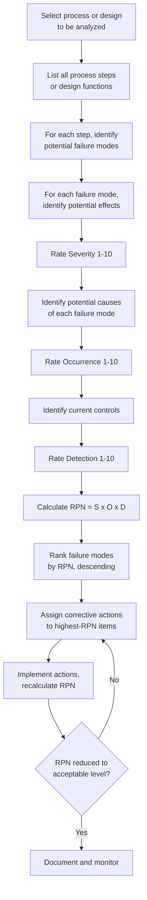
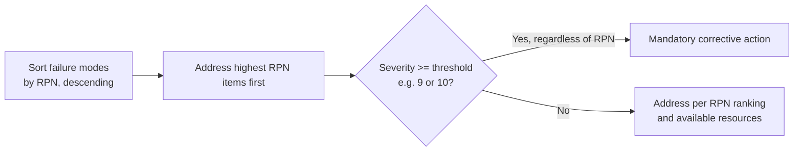
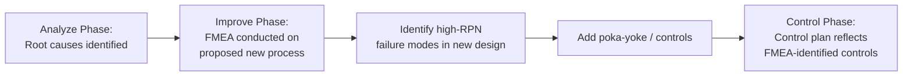

## Failure Mode and Effects Analysis

### Overview

**Key Points**

- Failure Mode and Effects Analysis (FMEA) is a structured, proactive risk-assessment methodology used to systematically identify potential ways a process, product, or design can fail (**failure modes**), evaluate the consequences and likelihood of each, and prioritize corrective actions before failures actually occur.
- FMEA is fundamentally a **preventive** tool — it is applied before failures happen (or before a new/changed process is deployed), distinguishing it from root cause analysis techniques (like the 5 Whys or fishbone diagrams) that are typically applied **after** a failure or defect has already been observed.
- The methodology produces a prioritized action list via a calculated **Risk Priority Number (RPN)**, combining the severity, occurrence likelihood, and detectability of each potential failure.
- Two primary variants exist: **Process FMEA (PFMEA)**, focused on manufacturing or service process steps, and **Design FMEA (DFMEA)**, focused on product or system design failure modes.

### Core Terminology

| Term | Definition |
| --- | --- |
| **Failure Mode** | The specific way in which a process step or design element could fail to perform its intended function |
| **Effect** | The consequence of the failure mode on the customer, downstream process, or system, if it occurs |
| **Cause** | The underlying mechanism or root reason that could produce the failure mode |
| **Severity (S)** | A rating of how serious the effect of the failure would be if it occurred |
| **Occurrence (O)** | A rating of how likely the cause is to occur and produce the failure mode |
| **Detection (D)** | A rating of how likely current controls are to detect the failure mode or its cause before it reaches the customer |
| **Risk Priority Number (RPN)** | $RPN = S \times O \times D$; a composite score used to prioritize which failure modes need corrective action first |
| **Current Controls** | Existing process or design safeguards (inspections, automated checks, procedures) intended to prevent or detect the failure |

### The FMEA Process Flow

### Rating Scales

Each of the three factors is typically rated on a 1–10 scale, though 1–5 scales are also used in some organizations. [Unverified] Exact rating scale definitions and anchor-point wording vary meaningfully between industry standards (e.g., AIAG-VDA harmonized FMEA methodology used in automotive) and individual company procedures, so the specific scale in use should be confirmed against the applicable standard rather than assumed universal.

#### Severity (S) — Illustrative 1–10 Scale

| Rating | Description |
| --- | --- |
| 1 | No discernible effect |
| 2–3 | Minor effect, slight customer annoyance |
| 4–6 | Moderate effect, customer dissatisfaction, possible rework |
| 7–8 | High effect, major customer dissatisfaction, product/process inoperable |
| 9–10 | Severe effect, involves safety hazard or noncompliance with regulation, potentially without warning |

#### Occurrence (O) — Illustrative 1–10 Scale

| Rating | Description | Approximate Failure Rate |
| --- | --- | --- |
| 1 | Failure unlikely; no known history | < 1 in 1,500,000 |
| 2–3 | Low failure rate; isolated incidents | ~1 in 150,000 to 1 in 15,000 |
| 4–6 | Moderate failure rate; occasional failures | ~1 in 2,000 to 1 in 400 |
| 7–8 | High failure rate; repeated failures | ~1 in 80 to 1 in 20 |
| 9–10 | Very high failure rate; failure almost inevitable | ~1 in 8 or higher |

[Unverified] These approximate failure-rate bands are illustrative and follow common published FMEA reference tables; specific numeric anchors vary somewhat by industry standard and should be verified against the governing FMEA procedure.

#### Detection (D) — Illustrative 1–10 Scale

| Rating | Description |
| --- | --- |
| 1 | Current controls will almost certainly detect the failure before it reaches the customer |
| 2–3 | High likelihood of detection |
| 4–6 | Moderate likelihood of detection |
| 7–8 | Low likelihood of detection |
| 9–10 | Current controls will almost certainly NOT detect the failure; no controls exist |

**Key Points**

- Note the intentional inversion in the Detection scale: a **higher** Detection rating means the failure is *less* likely to be caught, which contributes *more* to overall risk — consistent with the multiplicative RPN formula where higher scores across all three factors indicate higher priority for action.

### Worked Example: Process FMEA

**Example**

A PFMEA for a coffee packaging line analyzes the "seal bag" process step.

| Process Step | Failure Mode | Effect | S | Potential Cause | O | Current Controls | D | RPN |
| --- | --- | --- | --- | --- | --- | --- | --- | --- |
| Seal bag | Incomplete seal | Product spoilage, customer complaint | 7 | Heat sealer temperature drifts low | 5 | Operator visual check every hour | 6 | 210 |
| Seal bag | Seal too hot, bag melts | Product damage, packaging failure | 6 | Heat sealer temperature drifts high | 4 | Operator visual check every hour | 6 | 144 |
| Seal bag | Wrong label applied | Regulatory/allergen mislabeling | 9 | Label roll changeover error | 3 | Barcode scanner verification | 2 | 54 |

**Calculation for the top row:**

$$RPN = S \times O \times D = 7 \times 5 \times 6 = 210$$

**Interpretation**: Despite the mislabeling failure mode having the highest severity (9, reflecting a potential allergen/regulatory issue), its RPN (54) is actually the lowest of the three because the automated barcode scanner provides strong detection capability (D=2) and the occurrence is relatively rare (O=3). The "incomplete seal" failure mode has the highest overall RPN (210) due to only moderate occurrence and weak detection (manual, infrequent visual checks), making it the top priority for corrective action despite its lower severity than mislabeling.

### The Severity Override Principle

**Key Points**

- Most standard FMEA methodologies specify that **any failure mode with a Severity rating at or above a defined threshold (commonly 9 or 10)** — typically indicating a safety or regulatory compliance risk — must be flagged for mandatory action **regardless of its calculated RPN**, since a low RPN can result from strong current detection controls that may not always be reliable, and safety-critical modes warrant preventive rather than merely detective action. [Unverified] The specific severity threshold and the exact policy language triggering mandatory action vary by industry standard and organizational FMEA procedure.

### RPN Prioritization and Its Limitations

#### Known Limitations of the RPN Approach

- **Non-uniqueness**: Different combinations of S, O, and D can produce identical RPN values (e.g., $5 \times 4 \times 2 = 40$ and $2 \times 4 \times 5 = 40$) despite representing very different risk profiles — one might be a rare-but-severe failure, the other a frequent-but-minor one.
- **Scale sensitivity**: Because RPN is a product of three ordinal (rank-based) scales rather than true ratio measurements, the resulting numeric RPN values do not have a rigorous mathematical interpretation as an actual probability or expected loss — they function as a relative prioritization heuristic rather than a precise risk metric. [Inference] This is a well-recognized methodological critique of the traditional RPN approach in the quality literature, motivating some newer standards to move away from a single multiplicative score.
- **Threshold ambiguity**: Unlike Severity's mandatory-action override, there is no universally standardized numeric RPN threshold above which action becomes mandatory — organizations typically set their own internal thresholds or focus on the top-ranked percentage of failure modes (a Pareto-style approach).

#### The AIAG-VDA Action Priority Alternative

[Unverified] The newer harmonized AIAG-VDA FMEA methodology (jointly developed by the Automotive Industry Action Group and the German VDA standard) reportedly moves away from the pure multiplicative RPN toward an **Action Priority (AP)** table — a lookup matrix combining Severity, Occurrence, and Detection into a High/Medium/Low priority rating directly, rather than relying solely on a calculated numeric product — intended to address some of RPN's known limitations described above; organizations should consult the specific current version of this standard for exact table structure, as methodology in this area has continued to evolve.

### Design FMEA vs. Process FMEA

| Aspect | Design FMEA (DFMEA) | Process FMEA (PFMEA) |
| --- | --- | --- |
| Focus | Product or system design elements/functions | Manufacturing or service process steps |
| Typical failure modes | Component fails to meet a functional requirement | A process step is performed incorrectly or omitted |
| Timing | Early in product development, before design freeze | Before process launch or when a process changes |
| Example failure mode | "Bracket fractures under specified load" | "Bolt torque applied below specification" |
| Primary owner | Design engineering | Manufacturing/process engineering |

### Integration with DMAIC and Other Quality Tools

**Key Points**

- FMEA is commonly applied during the DMAIC **Improve** phase to proactively assess risks in a newly designed or modified process *before* full implementation, and its output directly feeds the **Control** phase's control plan — process parameters and failure modes identified as high-risk in the FMEA typically become monitored points in the control plan and candidates for control charting.
- FMEA and fault tree analysis (FTA) are complementary but structurally distinct: FMEA works "bottom-up" (starting from individual failure modes and tracing forward to effects), while FTA works "top-down" (starting from an undesired top-level event and tracing backward to combinations of causes).

### Practical Execution Considerations

- **Cross-functional team involvement**: Effective FMEAs typically involve a multidisciplinary team (design, manufacturing, quality, and sometimes customer-facing personnel) rather than a single individual, since failure modes and their effects often span multiple functional perspectives.
- **Living document**: An FMEA is not a one-time exercise; it should be revisited and updated whenever the process or design changes, when new failure data becomes available (e.g., field returns, warranty claims), or periodically as part of ongoing risk management.
- **Avoiding analysis paralysis**: Attempting to exhaustively list every conceivable failure mode for every process step can consume disproportionate time; teams often prioritize based on the criticality of the process step or component, focusing depth of analysis where consequences would be most severe.
- **Consistency in scoring**: Because S, O, and D ratings are inherently somewhat subjective, using well-defined, organization-specific rating scale anchors (as illustrated above) and cross-functional team consensus scoring helps improve consistency and comparability of RPN values across different FMEAs.

### Next Steps

- Fault Tree Analysis (FTA) as a complementary top-down risk assessment method
- The DMAIC Improve and Control phases and their integration with FMEA outputs
- Poka-yoke (mistake-proofing) design techniques for mitigating high-RPN failure modes
- Control plan development following FMEA-driven risk identification
- AIAG-VDA harmonized FMEA methodology and the Action Priority (AP) framework
- Reliability engineering concepts: Mean Time Between Failures (MTBF), fault modes, and redundancy design
- Root cause analysis techniques (5 Whys, fishbone/Ishikawa diagrams) as complementary reactive tools