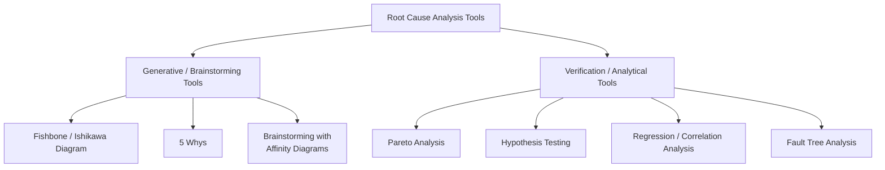
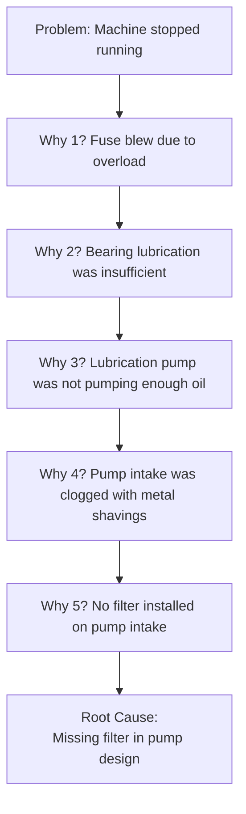
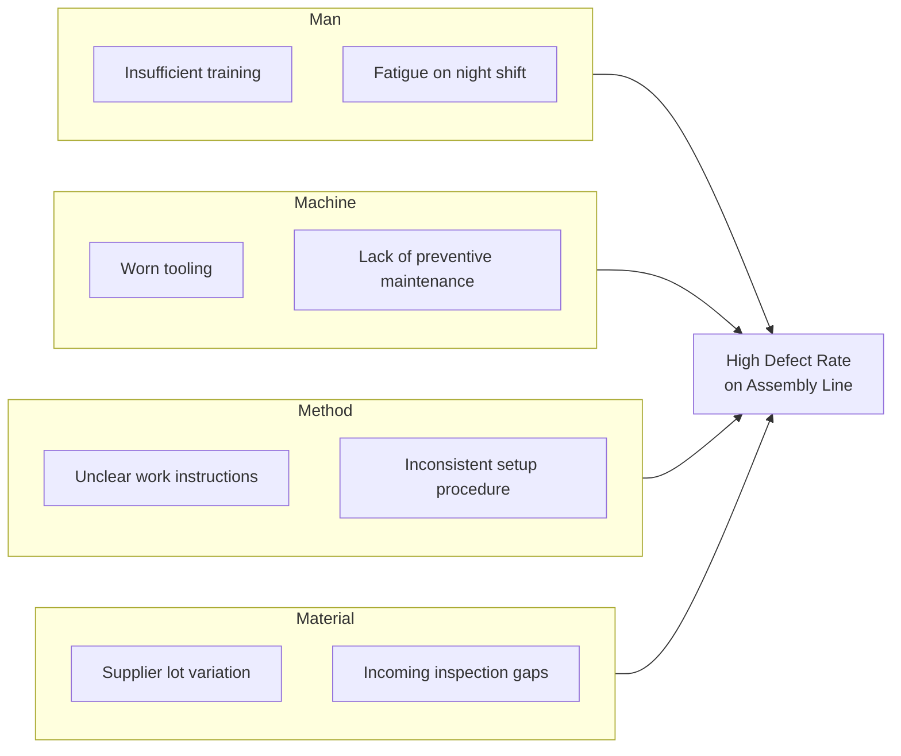
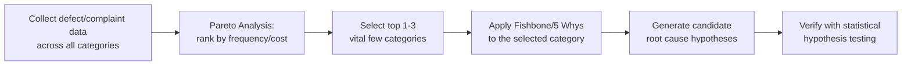
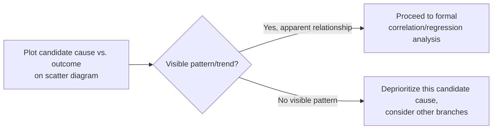
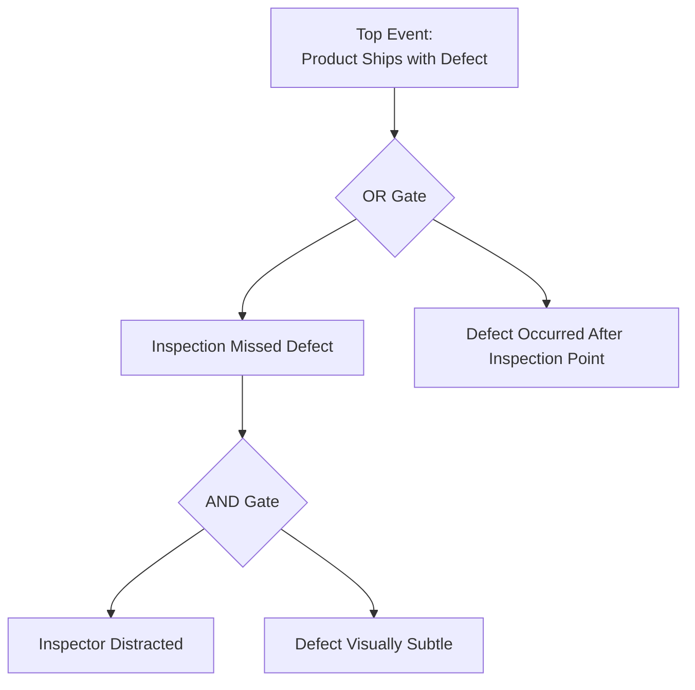
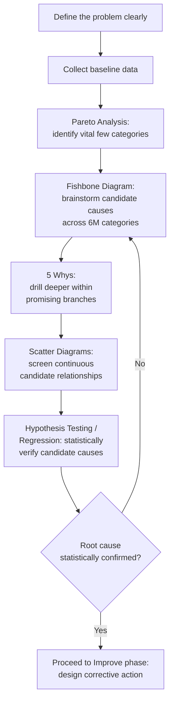

## Root Cause Analysis Tools

### Overview

**Key Points**

- Root cause analysis (RCA) refers to a family of structured techniques used to identify the fundamental, underlying reason a problem occurs, rather than stopping at superficial or immediate symptoms.
- The central discipline across all RCA tools is distinguishing a **root cause** (the deepest, actionable source of a problem, which if removed prevents recurrence) from a **symptom** or **proximate cause** (an observable effect or immediate trigger that may recur even after being addressed, because the underlying driver remains).
- Within the DMAIC framework, RCA tools are primarily applied in the **Analyze** phase to generate and narrow candidate causes, which are then statistically verified before moving to the Improve phase.
- No single RCA tool is universally sufficient; most robust investigations combine a **generative** tool (to brainstorm and organize possible causes) with a **verification** step (statistical testing or data analysis to confirm which candidate causes are actually significant).

### The RCA Toolkit Landscape

### The 5 Whys

#### Method

A simple, iterative questioning technique that repeatedly asks "Why?" (conventionally five times, though the actual number varies) to drill down from a surface-level problem statement to its underlying root cause.

**Example**

This classic example (frequently attributed to Toyota's production system origins) illustrates how each "Why" moves progressively from an immediate, mechanical symptom (a blown fuse) toward a systemic, addressable root cause (a missing design feature) — the corrective action of installing a filter prevents recurrence, whereas simply replacing the fuse would only address the symptom and the machine would likely fail again.

#### Strengths and Limitations

| Strengths | Limitations |
| --- | --- |
| Simple, fast, requires no special statistical training | Assumes a single, linear causal chain; struggles with problems having multiple contributing causes |
| Effective for straightforward, mechanically-linked problems | Highly dependent on the knowledge and honesty of the participants; can stop too early or follow a biased path |
| Encourages deeper thinking beyond the first apparent cause | Provides no statistical verification — conclusions remain hypotheses until independently confirmed |
| Low cost, usable in real-time during problem-solving discussions | Not well suited to complex, multi-factorial process problems with interacting variables |

[Inference] Because the 5 Whys relies entirely on the participants' existing knowledge and reasoning rather than new data collection, it is best suited as a starting hypothesis-generation tool rather than a final, standalone verification method for anything beyond simple, well-understood mechanical or procedural failures.

### Fishbone (Ishikawa / Cause-and-Effect) Diagram

#### Method

A visual brainstorming tool that organizes potential causes of a problem into major categories, radiating off a central "spine" pointing to the problem (the "head" of the fish). The most common category framework for manufacturing contexts is the **6 Ms**:

- **Man** (People): operator skill, training, fatigue, communication
- **Machine** (Equipment): calibration, maintenance, wear, capability
- **Method** (Process): procedure design, work instructions, sequencing
- **Material**: raw material variation, supplier quality, specifications
- **Measurement**: gauge accuracy, measurement system variation
- **Mother Nature** (Environment): temperature, humidity, vibration, lighting

For service or transactional processes, an alternative **4 Ps** (or **8 Ps**) framework is sometimes used: Policies, Procedures, People, Plant/Place (and extended variants adding Price, Promotion, Process, Product).

**Key Points**

- The fishbone diagram is explicitly a **brainstorming and organizing** tool, not a verification tool — it structures a team's collective hypotheses about potential causes across multiple categories simultaneously, but every branch remains a candidate cause requiring data-driven confirmation before being treated as confirmed.
- A common and productive pairing is to use the 5 Whys *within* each branch of a fishbone diagram — once a category (e.g., "Machine") surfaces a candidate cause, iteratively asking "why" on that specific branch can drive toward a more specific, actionable root cause within that category.

#### Strengths and Limitations

| Strengths | Limitations |
| --- | --- |
| Encourages comprehensive, structured brainstorming across multiple cause categories | Can generate a large number of candidate causes without inherently prioritizing which to investigate first |
| Visual format supports group facilitation and cross-functional input | Provides no statistical verification of which causes are actually significant |
| Categories (6 Ms) provide a helpful checklist, reducing the risk of overlooking a cause category entirely | Quality of output depends heavily on the diversity and expertise of the brainstorming group |

### Pareto Analysis

#### Method

Applies the Pareto principle (often stated informally as "80% of effects come from 20% of causes") by tabulating and ranking the frequency or cost impact of different problem categories, typically visualized as a bar chart (descending frequency) combined with a cumulative percentage line.

**Example**

A Pareto chart of customer complaint categories at a call center might show: Billing errors (145 complaints), Long hold times (98), Incorrect information given (52), Rude agent (31), Other (24). Cumulatively, the top two categories (Billing errors and Long hold times) account for roughly 68% of all complaints — directing improvement focus toward those two areas rather than spreading investigative resources evenly across all five categories.

#### Role in Root Cause Analysis

Pareto analysis is typically used **before** deeper causal tools like the fishbone diagram or 5 Whys, to identify *which* problem or defect category is worth investigating first, based on frequency, cost, or severity — it prioritizes *where* to dig, rather than determining *why* the problem occurs.

### Hypothesis Testing as Verification

#### Method

Once candidate causes have been generated (via fishbone or 5 Whys), formal statistical hypothesis tests determine whether an observed difference or relationship is genuinely significant or plausibly due to random chance.

| Test | Used When |
| --- | --- |
| **t-test** | Comparing the means of two groups (e.g., defect rate between two machines, two shifts) |
| **ANOVA (Analysis of Variance)** | Comparing means across three or more groups (e.g., defect rate across four suppliers) |
| **Chi-square test** | Testing association between two categorical variables (e.g., defect type vs. shift) |
| **Correlation / Regression** | Quantifying the strength and direction of a relationship between a continuous candidate cause and the outcome (e.g., machine temperature vs. defect rate) |

**Example**

Continuing the fishbone example above: if "night shift fatigue" is hypothesized as a cause of higher defect rates, a two-sample t-test comparing defect rates between day-shift and night-shift production batches (with adequate sample sizes and appropriate statistical assumptions checked) provides objective, data-based evidence for whether this candidate cause is a statistically verified contributor, rather than an untested assumption from the brainstorming session.

**Key Points**

- This step is what separates a rigorous DMAIC Analyze phase from an unstructured discussion — a fishbone diagram or 5 Whys session might generate a dozen plausible-sounding causes, but only hypothesis testing (or equivalent data analysis) determines which of those causes are actually statistically supported by the process data.

### Scatter Diagrams and Correlation Analysis

A simpler graphical precursor to formal regression, a **scatter diagram** plots a candidate causal (input) variable against the outcome (response) variable to visually assess whether a relationship appears to exist before committing to formal statistical testing.

**Key Points**

- A scatter diagram showing an apparent visual trend does not, by itself, establish statistical significance or causation [Inference] — it serves as an efficient, low-cost screening step to decide which candidate relationships merit the more rigorous, formal correlation or regression analysis, and even a confirmed statistical correlation still requires careful judgment (and often process knowledge or controlled experimentation) to distinguish true causation from mere association driven by a hidden confounding variable.

### Fault Tree Analysis (Brief Introduction)

**Fault Tree Analysis (FTA)** is a top-down, deductive RCA technique starting from an undefined top-level failure event and working backward through logical AND/OR gates to identify combinations of contributing lower-level events.

[Inference] FTA is generally reserved for safety-critical or highly complex systems (e.g., aerospace, nuclear, automotive safety systems) where the interaction of multiple simultaneous conditions (captured via AND/OR logic gates) needs to be modeled explicitly, whereas simpler tools like the 5 Whys or fishbone diagram are more commonly applied to routine manufacturing or service process problems.

### Comparison of RCA Tools

| Tool | Type | Best Suited For | Key Limitation |
| --- | --- | --- | --- |
| 5 Whys | Generative, linear | Simple, single-chain mechanical/procedural problems | Weak for multi-factorial problems; no statistical rigor |
| Fishbone Diagram | Generative, categorical | Comprehensive brainstorming across broad cause categories | Generates hypotheses only; no built-in prioritization or verification |
| Pareto Analysis | Prioritization | Deciding which problem category to investigate first | Identifies *what* to prioritize, not *why* it happens |
| Hypothesis Testing | Verification | Statistically confirming or rejecting a specific candidate cause | Requires adequate, reliable data and correct test selection |
| Scatter Diagram / Regression | Verification (continuous data) | Quantifying relationships between continuous variables | Correlation does not by itself establish causation |
| Fault Tree Analysis | Generative + logical structuring | Complex systems with multiple interacting failure conditions | More complex to construct; typically reserved for safety-critical systems |

### An Integrated RCA Workflow

**Key Points**

- No individual tool in this list is a complete RCA methodology on its own — the combination of a generative/brainstorming step (fishbone, 5 Whys) followed by a data-driven verification step (hypothesis testing, regression) is what distinguishes a rigorous DMAIC Analyze-phase investigation from an unstructured, opinion-driven discussion that stops at a plausible-sounding but unverified explanation.

### Common Pitfalls in Root Cause Analysis

- **Stopping at the first plausible answer**: Accepting an initial, intuitive explanation without verification or without asking "why" enough times to reach a truly actionable, systemic cause.
- **Confusing correlation with causation**: Treating a statistically significant correlation (e.g., from a scatter diagram or regression) as proof of a causal relationship without considering confounding variables or, where feasible, controlled experimentation (DOE).
- **Groupthink in fishbone sessions**: Allowing a dominant voice or existing organizational bias to steer the brainstorming toward a predetermined conclusion rather than genuinely exploring all 6M categories.
- **Skipping verification entirely**: Moving directly from a fishbone diagram's list of "likely causes" to the Improve phase without statistically testing which candidates are actually significant, risking wasted improvement effort on a cause that was never truly responsible for the problem.

### Next Steps

- The DMAIC methodology and the role of RCA tools within the Analyze phase
- Hypothesis testing fundamentals: t-tests, ANOVA, chi-square tests
- Design of Experiments (DOE) as a controlled method for establishing causation
- Failure Mode and Effects Analysis (FMEA) as a proactive, preventive counterpart to reactive RCA
- Fault Tree Analysis (FTA) for complex, safety-critical systems
- Statistical Process Control charts for detecting when a problem is a special cause worth investigating
- Regression analysis and correlation strength interpretation