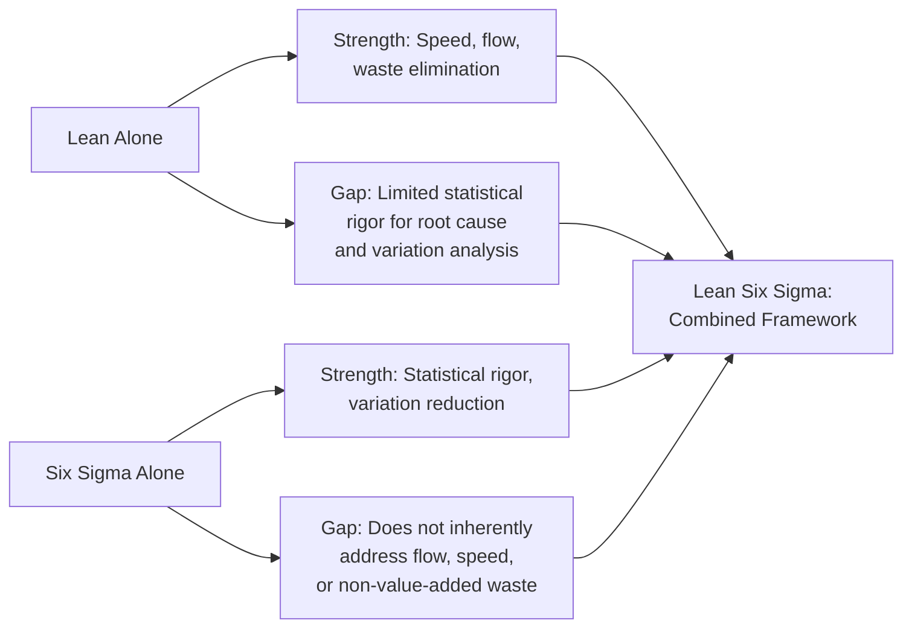
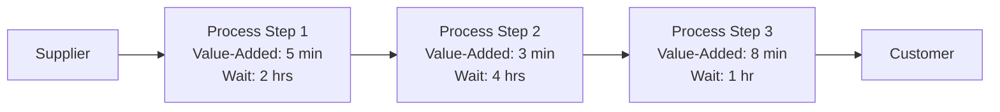
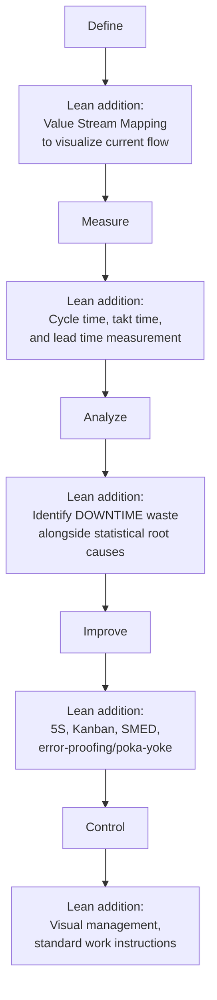

## Lean Six Sigma Integration

### Overview

**Key Points**

- Lean Six Sigma is a hybrid management methodology that combines **Lean manufacturing's** focus on eliminating waste and improving flow with **Six Sigma's** focus on reducing variation and defects through statistical rigor.
- The integration addresses a structural gap in each methodology when applied alone: Lean excels at speed and efficiency but lacks a rigorous statistical framework for diagnosing root causes of variation; Six Sigma excels at variation reduction but does not inherently address process speed, flow, or non-value-added waste.
- The combined approach is often summarized as pursuing processes that are simultaneously **fast** (Lean) and **consistent/predictable** (Six Sigma), rather than treating speed and quality as a trade-off.

### Why Combine Lean and Six Sigma?

| Dimension | Lean | Six Sigma | Lean Six Sigma |
| --- | --- | --- | --- |
| Primary target | Waste (non-value-added activity) | Variation and defects | Both waste and variation |
| Core question | "Where is time/effort/material wasted?" | "Why is output inconsistent or defective?" | "How do we make this process both faster and more consistent?" |
| Typical tools | Value Stream Mapping, 5S, Kanban, SMED | Control charts, hypothesis testing, DOE | Combined toolkit applied contextually |
| Statistical depth | Generally lower | High | High, applied selectively |
| Speed of implementation | Often faster, more visual/intuitive | Can require longer data collection and analysis cycles | Sequenced to gain quick wins (Lean) while pursuing deeper fixes (Six Sigma) |

### Lean Foundations Relevant to the Integration

#### The Eight Wastes (DOWNTIME)

Lean identifies eight categories of non-value-added activity, commonly remembered by the acronym **DOWNTIME**:

| Waste | Description | Example |
| --- | --- | --- |
| **D**efects | Errors requiring rework, scrap, or correction | A part that fails inspection and must be reworked |
| **O**verproduction | Producing more, earlier, or faster than needed | Building finished goods inventory beyond actual demand |
| **W**aiting | Idle time while waiting for the next process step, material, or information | A machine operator waiting for a part from an upstream station |
| **N**on-utilized Talent | Underusing employees' skills, ideas, or creativity | Not soliciting front-line input on process improvement |
| **T**ransportation | Unnecessary movement of materials or products | Moving parts between distant, poorly laid-out workstations |
| **I**nventory | Excess raw material, WIP, or finished goods beyond immediate need | Large buffer stock accumulating between process steps |
| **M**otion | Unnecessary movement by people (as distinct from transportation of materials) | An operator repeatedly reaching or walking to retrieve tools |
| **E**xtra Processing | Performing more work or higher precision than the customer requires | Polishing a surface to a finish beyond what the specification requires |

#### Value Stream Mapping (VSM)

A visual tool that maps the entire flow of materials and information required to deliver a product or service, distinguishing **value-added** steps (which the customer would pay for) from **non-value-added** steps (waste, per the DOWNTIME categories above), typically comparing a **current state map** against a **future state map** representing the improved, leaner process.

**Key Points**

- A common and striking finding from Value Stream Mapping exercises is that **value-added time often represents only a small fraction of total lead time**, with the majority consumed by waiting, transportation, and other non-value-added steps [Inference] — this pattern is widely reported across Lean case studies, though the exact proportion varies substantially by industry and specific process, so it should not be treated as a fixed universal ratio.

### Points of Integration in the DMAIC Framework

Lean tools are commonly inserted at specific points within the standard Six Sigma DMAIC structure, rather than replacing it.

| DMAIC Phase | Six Sigma Contribution | Lean Contribution |
| --- | --- | --- |
| Define | Project charter, CTQ tree, business case | Value Stream Mapping (current state), identifying flow bottlenecks |
| Measure | Baseline capability, MSA, control charts | Cycle time, takt time, lead time, work-in-process (WIP) measurement |
| Analyze | Hypothesis testing, root cause verification | Waste categorization (DOWNTIME), bottleneck/constraint identification |
| Improve | DOE, solution piloting, FMEA | 5S, Kanban, SMED (setup reduction), poka-yoke, cellular layout redesign |
| Control | Control charts, control plans | Visual management boards, standard work, andon systems |

### Key Lean Tools in Detail

#### 5S Workplace Organization

A structured method for organizing a workspace, consisting of five sequential steps (from the Japanese terms): **Sort** (remove unneeded items), **Set in Order** (organize remaining items for efficient access), **Shine** (clean and inspect the workspace), **Standardize** (establish consistent practices), and **Sustain** (maintain discipline over time).

#### Kanban

A visual, pull-based signaling system that triggers replenishment or production only when actual downstream demand occurs, rather than pushing production based on forecasts — helping reduce Overproduction and excess Inventory waste from the DOWNTIME list.

#### SMED (Single-Minute Exchange of Die)

A methodology for dramatically reducing equipment changeover/setup time, distinguishing between **internal setup** (tasks that can only be performed while the machine is stopped) and **external setup** (tasks that can be performed while the machine is still running), then converting as many internal tasks to external as possible.

#### Takt Time

The pace at which production must proceed to match customer demand, calculated as:

$$\text{Takt Time} = \frac{\text{Available Production Time}}{\text{Customer Demand (units required)}}$$

**Example**

If a facility operates 480 minutes per day and customer demand requires 240 units per day, the takt time is $\frac{480}{240} = 2$ minutes per unit — meaning the process must complete one unit every 2 minutes on average to exactly meet demand without overproducing or falling behind.

### Worked Integration Example

**Example**

A hospital seeks to reduce patient wait time in its outpatient pharmacy.

1. **Define (with VSM)**: A value stream map of the current prescription fulfillment process reveals that of a total 45-minute average lead time, only about 6 minutes represents actual value-added pharmacist/technician work, with the remainder consumed by queueing, redundant data entry, and searching for misplaced prescriptions.
2. **Measure**: Control charts on daily wait times confirm the process is in statistical control but centered well above the target, and takt time calculations based on patient arrival rate establish the pace needed to meet demand.
3. **Analyze**: A fishbone diagram identifies candidate causes across both Lean (layout, redundant steps) and Six Sigma (variation in technician processing time) dimensions; hypothesis testing confirms that processing time varies significantly by which technician handles the order, while Pareto analysis of the VSM waste categories shows "Waiting" and "Transportation" (walking between stations) as the two largest waste contributors.
4. **Improve**: A combined solution set is implemented — a redesigned physical layout (Lean, addressing Transportation and Motion waste) alongside standardized technician work instructions and additional training (Six Sigma-informed, addressing the statistically confirmed technician-to-technician variation).
5. **Control**: A visual Kanban-style status board (Lean) tracks prescription status in real time, while an updated control chart (Six Sigma) continues monitoring wait times to catch any future special cause drift.

### Organizational and Cultural Considerations

**Key Points**

- Lean Six Sigma deployments generally retain the Six Sigma belt hierarchy (Champion, Master Black Belt, Black Belt, Green Belt) for project governance and training structure, while incorporating Lean-specific training modules and tools into the belt curricula rather than maintaining fully separate certification tracks.
- A commonly noted sequencing consideration [Inference] is that Lean tools often produce faster, more visible early wins (e.g., a 5S workplace reorganization or a Kanban pull system yielding immediate reductions in visible clutter or queue length), which can help build early stakeholder buy-in and momentum for a project, while the more data-intensive Six Sigma statistical analysis proceeds in parallel to address deeper, less visually obvious sources of variation.
- Critics of poorly executed Lean Six Sigma deployments note the risk of "tool soup" — applying a large combined toolkit without a disciplined DMAIC structure to sequence and prioritize which tools address which specific project objective, resulting in scattered effort rather than a coherent improvement path.

### Comparison Summary Table

| Aspect | Pure Six Sigma | Pure Lean | Lean Six Sigma |
| --- | --- | --- | --- |
| Primary metric focus | Sigma level, DPMO, Cp/Cpk | Cycle time, lead time, takt time | Both variation and flow metrics |
| Typical project duration | Often longer (data collection, hypothesis testing cycles) | Often shorter (visual, kaizen-event driven) | Varies; sequenced for quick wins plus deeper analysis |
| Risk if applied alone | May improve consistency without improving speed | May improve speed without addressing underlying variation causes | Addresses both dimensions, at the cost of a broader toolkit to manage |
| Governance structure | Belt hierarchy (Champion through Green Belt) | Often less formalized, kaizen event-based | Typically retains belt hierarchy with integrated Lean tool training |

### Next Steps

- Value Stream Mapping: current state and future state map construction
- The eight wastes (DOWNTIME) and waste identification techniques
- Kaizen events and rapid improvement workshops
- 5S workplace organization implementation
- SMED and setup time reduction methodology
- The DMAIC methodology as the governing project structure for Lean Six Sigma projects
- Takt time, cycle time, and lead time calculations for flow analysis
- Kanban and pull-system design for inventory and overproduction reduction