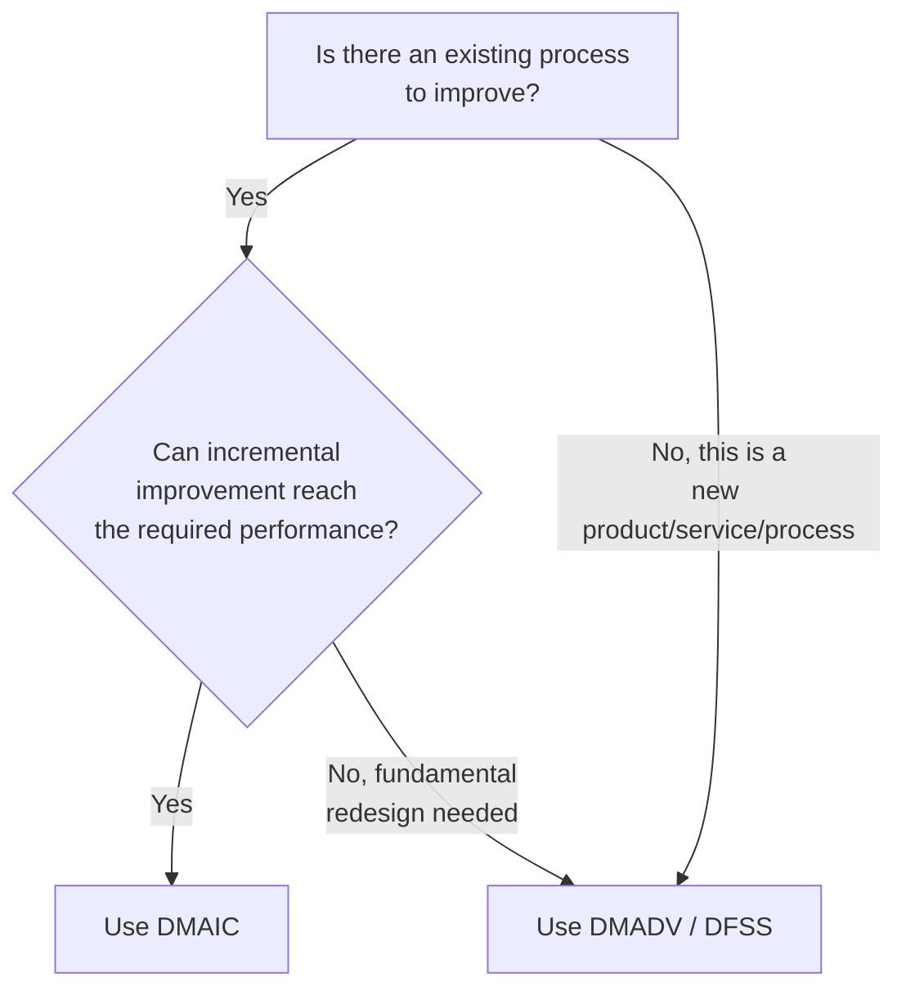
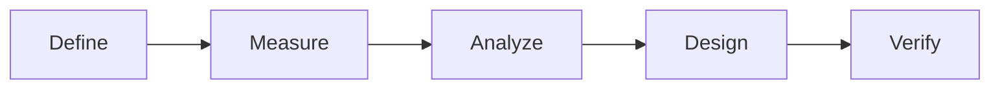
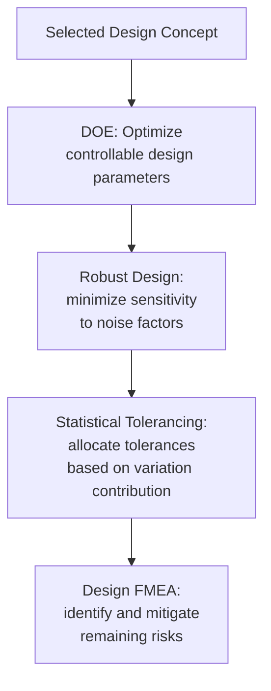
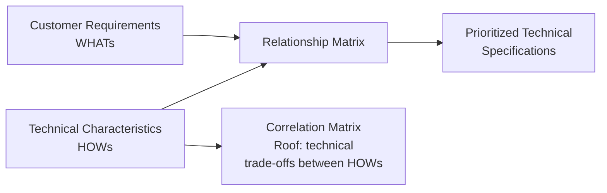

## Design for Six Sigma

### Overview

**Key Points**

- Design for Six Sigma (DFSS) is a proactive methodology for designing **new** products, services, or processes with Six Sigma-level quality (low variation, high capability) built in from the outset, rather than attempting to improve an existing process after the fact.
- The most common DFSS project framework is **DMADV** (Define, Measure, Analyze, Design, Verify), structurally paralleling DMAIC but replacing the "Improve" and "Control" phases with "Design" and "Verify," reflecting that there is no existing process to incrementally improve.
- DFSS is applied when: no process currently exists, an existing process requires such fundamental redesign that incremental improvement (DMAIC) cannot reach the required performance level, or a new product/service is being developed and quality needs to be architected in rather than inspected in later.
- The guiding philosophy is captured in the common phrase **"design it right the first time"** — it is generally understood to be more effective and less costly to build quality into a design than to detect and correct quality problems after a process or product already exists. [Inference] This principle is widely cited across DFSS literature; the specific magnitude of cost savings from early design-stage quality investment versus later-stage correction varies by industry and is often illustrated qualitatively (e.g., the "cost of poor quality" escalating at each downstream stage) rather than via a single universal ratio.

### DMAIC vs. DMADV: When to Use Which

| Aspect | DMAIC | DMADV / DFSS |
| --- | --- | --- |
| Starting point | Existing process with a performance gap | No process exists, or existing process is fundamentally inadequate |
| Final two phases | Improve, Control | Design, Verify |
| Primary output | Optimized settings on an existing process | A newly architected process, product, or service |
| Typical trigger | "Our defect rate is too high" | "We need to launch a new product/service" or "Incremental fixes have plateaued" |
| Design freedom | Constrained by existing process architecture | High — the process/product can be architected from first principles |

### The DMADV Phase Structure

#### Define

Establish the project goals, scope, and the strategic business case for the new design, similar in spirit to the DMAIC Define phase but framed around a new offering rather than an existing problem.

**Key Deliverables**: Project charter, business case, high-level scope boundaries, initial risk assessment.

#### Measure

Identify and quantify customer needs and translate them into measurable design requirements — this phase carries substantially more weight in DFSS than in DMAIC, since there is no existing process data to draw a baseline from.

**Key Deliverables and Tools**:

- **Voice of the Customer (VOC)**: Systematic gathering of customer needs via interviews, surveys, focus groups, and observation, since the design has no existing users to survey about current performance.
- **Critical-to-Quality (CTQ) Tree**: Translating broad, qualitative customer needs into specific, measurable design requirements.
- **Quality Function Deployment (QFD) / House of Quality**: A structured matrix technique that maps customer requirements against technical design characteristics, helping prioritize which technical specifications most strongly drive customer satisfaction.
- **Benchmarking**: Comparing against competitor offerings or best-in-class analogous processes to calibrate target performance levels.

#### Analyze

Generate and evaluate multiple candidate design concepts against the CTQ requirements established in Measure, using structured decision-making tools to select the most promising design direction before detailed design work begins.

**Key Deliverables and Tools**:

- **Concept Generation**: Brainstorming and developing multiple distinct design alternatives capable of meeting the CTQ requirements.
- **Pugh Matrix (Concept Selection Matrix)**: A structured comparison tool scoring multiple design concepts against a baseline (datum) concept across weighted criteria, helping identify the strongest overall candidate.
- **Failure Mode and Effects Analysis (FMEA)**: Applied early to identify potential failure modes in each candidate design concept, informing which risks need mitigation before detailed design proceeds.
- **Process/Product Simulation**: Modeling expected performance of candidate designs before physical prototyping, where feasible.

**Example**

A Pugh Matrix comparing three candidate layouts for a new hospital emergency intake process might score each against a baseline ("current best-practice layout elsewhere") on criteria such as patient walking distance, staff visibility, and equipment accessibility, using simple $+$ (better), $S$ (same), $-$ (worse) ratings — surfacing that Concept B outperforms the baseline on the majority of weighted criteria and should proceed to detailed design.

#### Design

Develop the detailed specifications, parameters, and tolerances for the selected design concept, using statistical tools to optimize settings and build in robustness before implementation.

**Key Deliverables and Tools**:

- **Detailed Design Specifications**: Precise parameters, tolerances, and design documentation for the selected concept.
- **Design of Experiments (DOE)**: Statistically efficient experimentation to optimize design parameters and identify robust settings, often extending into **Response Surface Methodology (RSM)** for fine-tuning near an optimum.
- **Tolerance Design / Statistical Tolerancing**: Setting component or process tolerances based on their statistical contribution to overall system variation, rather than arbitrary or overly conservative tolerance stacking.
- **Design FMEA (DFMEA)**: A more detailed failure mode analysis on the finalized design, informing final risk mitigation before verification.
- **Robust Design / Taguchi Methods**: Designing the product or process to be insensitive to uncontrollable "noise" factors (environmental variation, material variation, usage variation) rather than attempting to eliminate all sources of variation directly.

#### Verify

Validate that the finalized design actually meets the CTQ requirements established in Measure, typically through pilot production, prototype testing, or a controlled pilot launch before full-scale rollout.

**Key Deliverables and Tools**:

- **Pilot Run / Prototype Testing**: Producing the new product or running the new process at limited scale to confirm actual performance matches design intent.
- **Process Capability Analysis**: Calculating $C_p$/$C_{pk}$ (or equivalent) on pilot data to confirm the design achieves the targeted sigma level or capability before full launch.
- **Control Plan Development**: Establishing the ongoing monitoring plan (analogous to DMAIC's Control phase output) that will sustain performance once the design is fully implemented.
- **Full-Scale Launch Readiness Review**: A formal gate confirming all verification criteria have been met before transitioning from pilot to full production/deployment.

### Key DFSS-Specific Tools in Depth

#### Quality Function Deployment (QFD)

QFD, often visualized as the "House of Quality," systematically translates qualitative customer requirements ("whats") into specific technical design characteristics ("hows"), while also assessing the relationships and potential trade-offs between different technical characteristics (the matrix "roof" of the house).

**Key Points**

- QFD's core value is forcing explicit, structured linkage between what the customer actually values and the specific engineering or process parameters the design team controls — preventing a common design failure mode where technically elegant solutions are built that do not actually address the customer's most important stated needs.

#### Robust Design and Taguchi Methods

Rather than tightening tolerances on every variable (often expensive), **robust design** seeks design parameter settings where the response is inherently **insensitive** to variation in uncontrollable "noise" factors (e.g., ambient temperature, raw material batch variation, end-user usage patterns).

$$\text{Signal-to-Noise Ratio (larger-is-better)} = -10 \log_{10}\left(\frac{1}{n}\sum \frac{1}{y_i^2}\right)$$

[Unverified] Taguchi's specific signal-to-noise ratio formulas vary by optimization objective (nominal-is-best, larger-is-better, smaller-is-better), and the broader Taguchi methodology has drawn some methodological debate in the statistical community regarding its experimental design efficiency compared to standard factorial DOE approaches; practitioners should be aware that Taguchi methods and mainstream DOE represent related but distinct schools of thought within robust design practice.

### Worked Example: New Service Design

**Example**

A bank is designing a new digital loan-approval process from scratch (no prior process exists in this form).

1. **Define**: Charter establishes the goal — "Launch a digital loan approval process achieving 95% customer satisfaction and same-day decision turnaround."
2. **Measure**: VOC interviews reveal customers most value speed and transparency; a CTQ tree translates "speed" into the measurable requirement "decision communicated within 4 business hours," and QFD prioritizes technical features (automated document verification, real-time status tracking) that most strongly drive these CTQs.
3. **Analyze**: Three candidate process architectures (fully automated, hybrid automated/human review, fully manual with digital forms) are scored via a Pugh Matrix against the baseline (current in-branch process), with the hybrid approach scoring highest on the weighted combination of speed, accuracy, and implementation risk.
4. **Design**: DOE is used to test combinations of automated verification thresholds and human-review triggering rules to optimize the trade-off between decision speed and approval accuracy; a Design FMEA identifies and mitigates risks such as automated system misclassification of edge-case applications.
5. **Verify**: A pilot launch across a limited customer segment measures actual decision turnaround time and customer satisfaction against the CTQ targets before full-scale rollout, with a control plan established to monitor these metrics on an ongoing basis post-launch.

### Comparison: DFSS Tools vs. DMAIC Tools

| Category | DMAIC Emphasis | DFSS/DMADV Emphasis |
| --- | --- | --- |
| Customer input | Often already understood from existing process complaints/data | VOC and QFD are foundational, since no existing process data exists |
| Concept generation | Not typically applicable (process already exists) | Central activity (Analyze phase) — comparing multiple design alternatives |
| Statistical tools | Hypothesis testing on existing process data, DOE for optimization | DOE and robust design used proactively during Design phase, before any process data exists |
| Risk assessment | FMEA on process changes | FMEA applied earlier and more extensively (concept-level and detailed design-level) |
| Final validation | Control charts confirm sustained improvement | Verify phase confirms the new design meets targets before and during initial launch |

### Practical Considerations and Limitations

- **Higher upfront investment**: DFSS projects often require more extensive upfront data gathering (VOC, QFD) and more design iteration than a typical DMAIC project, reflecting the greater design freedom and correspondingly greater responsibility to get the foundational requirements right.
- **Requires design-stage authority**: DFSS is most effective when the project team has genuine influence over the fundamental architecture of the product, service, or process — applying DFSS tools to a process where major structural decisions have already been locked in defeats much of its purpose.
- **Longer time horizon**: Because DFSS addresses new development rather than incremental optimization, project timelines are often longer, and the value of DFSS investment may not be fully realized until after launch and sustained operation.
- **Skill requirements**: Effective DFSS execution typically requires familiarity with a broader tool set (QFD, Pugh Matrix, robust design, DOE) than a typical DMAIC project, and is often led by more experienced Black Belts or Master Black Belts. [Inference] This is a natural consequence of DFSS's earlier point of intervention in the product/process lifecycle, where more design degrees of freedom exist and correspondingly more sophisticated tools are needed to make effective use of that freedom.

### Next Steps

- Quality Function Deployment (QFD) and House of Quality construction in depth
- Design of Experiments (DOE) and Response Surface Methodology for design optimization
- Taguchi robust design methods and signal-to-noise ratio calculations
- Pugh Matrix concept selection methodology
- Design Failure Mode and Effects Analysis (DFMEA)
- The DMAIC methodology for comparison and contrast
- Statistical tolerancing and tolerance stack-up analysis
- Process capability analysis (Cp, Cpk) as a Verify-phase validation tool