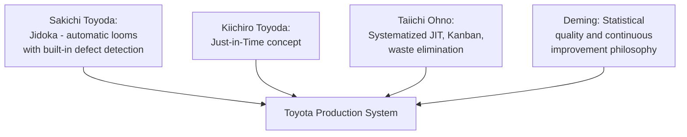
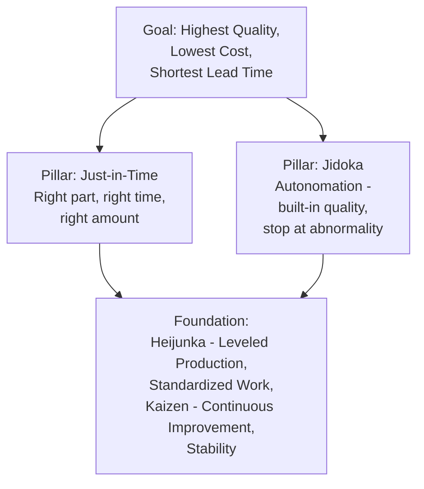
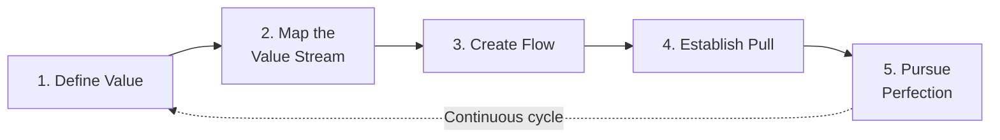
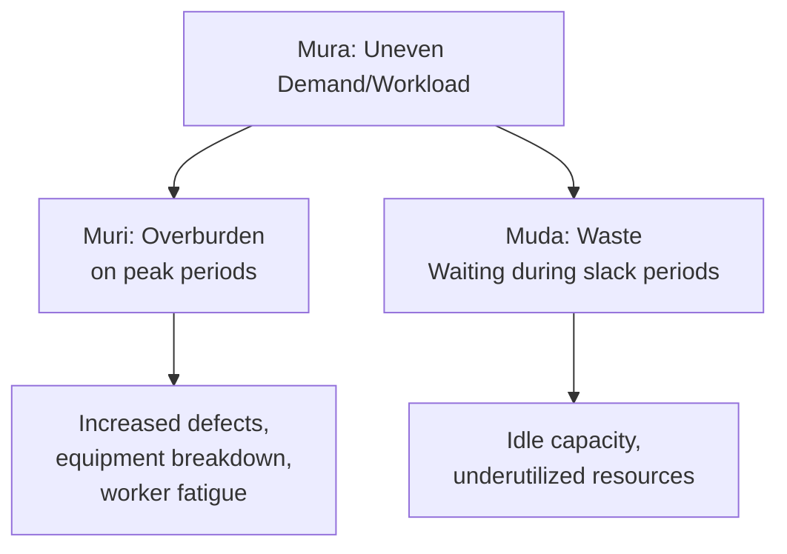

## Lean Philosophy and History

### Overview

**Key Points**

- Lean is a management philosophy and operational approach centered on the systematic **elimination of waste** while maximizing **customer value**, originally developed within Toyota's manufacturing operations in Japan and later generalized into a broad cross-industry management discipline.
- The term "Lean" itself was coined by Western researchers studying Toyota's methods, not by Toyota directly — the underlying system is properly called the **Toyota Production System (TPS)**, with "Lean" serving as the widely adopted generalized name once the principles were extracted and applied beyond Toyota and beyond automotive manufacturing.
- At its core, Lean asks a single organizing question of every activity in a process: **does this step create value for the customer, or is it waste?**

### Historical Origins

#### Pre-Toyota Influences

[Inference] Lean's intellectual lineage draws on several earlier threads that are consistently cited across Lean historical accounts, though the precise degree of direct influence on Toyota's founders versus independent parallel development is not always precisely documented in primary sources:

- **Henry Ford's assembly line** (early 1900s): Introduced flow-based, sequential production and interchangeable parts, demonstrating the power of continuous flow — though Ford's system was rigid, optimized for single-product mass production with minimal variety.
- **Frederick Taylor's scientific management**: Introduced systematic study and standardization of work methods, contributing to the later Lean emphasis on standardized work as a foundation for improvement.
- **Statistical Quality Control (Shewhart, Deming)**: Deming's teachings on statistical process control and continuous improvement, delivered to Japanese industrial leaders in the postwar period, significantly influenced the quality philosophy embedded within TPS.

#### The Toyota Production System (1940s–1970s)

Following World War II, Toyota faced severe capital constraints and a much smaller domestic market than American automakers, making Ford-style mass production (with its large batch sizes and high inventory requirements) economically unviable. Two key figures are most closely associated with developing TPS:

- **Taiichi Ohno**: Widely credited as the primary architect of TPS, developing core concepts including Just-in-Time production, the Kanban pull system, and the systematic identification of waste (muda).
- **Kiichiro Toyoda**: Toyota's founder, who articulated the foundational Just-in-Time concept — producing only what is needed, when it is needed, in the quantity needed.
- **Sakichi Toyoda**: Founder of the broader Toyota Group, credited with the invention of automatic looms incorporating built-in defect detection, which evolved into the **jidoka** (autonomation) principle central to TPS.

**Key Points**

- TPS developed gradually over several decades within Toyota, primarily as an internal, largely undocumented operational practice, rather than being designed as a single formalized methodology from the outset [Inference] — much of the codification and external documentation of TPS principles occurred later, largely driven by external researchers studying Toyota's operations.

#### Western Discovery and the Coining of "Lean" (1980s–1990s)

- **International Motor Vehicle Program (IMVP)**: A research program based at MIT that conducted extensive comparative studies of automotive manufacturing productivity and quality across Japanese, American, and European manufacturers during the 1980s.
- **The Machine That Changed the World** (Womack, Jones, and Roos, 1990): The influential book resulting from the IMVP research, which introduced the term **"lean production"** to Western audiences, documenting Toyota's dramatically superior productivity and quality metrics compared to traditional mass-production automakers.
- **Lean Thinking** (Womack and Jones, 1996): A follow-up work that further codified and generalized Lean principles into five core concepts intended to be applicable beyond automotive manufacturing.

[Unverified] While "The Machine That Changed the World" is consistently credited as the work that popularized the term "lean production" in the West, the precise origin of the specific word choice ("lean") within the IMVP research team's internal discussions is described with varying levels of detail across different secondary historical accounts.

### The Two Pillars of the Toyota Production System

TPS is often visually represented as a "house," with **Just-in-Time** and **Jidoka** as the two supporting pillars, resting on a foundation of stability and standardized work, and supporting the roof goals of highest quality, lowest cost, and shortest lead time.

#### Just-in-Time (JIT)

The principle of producing and delivering only what is needed, when it is needed, in the exact quantity needed — eliminating the waste associated with overproduction and excess inventory that characterized traditional mass-production systems.

#### Jidoka (Autonomation)

Often translated as "automation with a human touch," jidoka refers to designing equipment and processes to automatically detect abnormalities and stop production immediately, preventing defective work from continuing downstream, while simultaneously empowering workers to halt the line themselves when a problem is detected (embodied in Toyota's famous **Andon cord** system).

**Key Points**

- Jidoka's core philosophical shift is separating the human worker from the machine's operating cycle for quality monitoring purposes — a machine equipped with jidoka principles does not require constant human supervision to catch defects, freeing workers for higher-value tasks while still ensuring defects are caught at the source rather than passed downstream. [Inference] This distinguishes jidoka from simple automation, which merely replaces manual labor without necessarily building in this self-monitoring, stop-at-abnormality capability.

### The Five Core Lean Principles (Womack and Jones)

| Principle | Description |
| --- | --- |
| **1. Define Value** | Value is defined strictly from the customer's perspective — what the customer is actually willing to pay for, not what is convenient or traditional for the producing organization to offer |
| **2. Map the Value Stream** | Identify every step required to bring a product or service from raw input to the customer, distinguishing value-added steps from waste (see the eight wastes, DOWNTIME) |
| **3. Create Flow** | Reorganize the remaining value-added steps so that the product or service progresses smoothly, without interruption, batching delays, or backflows |
| **4. Establish Pull** | Produce only in response to actual downstream customer demand, rather than pushing production based on forecasts (the philosophical basis of Kanban and JIT) |
| **5. Pursue Perfection** | Treat waste elimination and flow improvement as a never-ending journey (embodied in the practice of **kaizen**, or continuous improvement) rather than a one-time project with a defined endpoint |

### Muda, Mura, and Muri: The Three Wastes

Beyond the commonly cited eight wastes (DOWNTIME), TPS identifies three interconnected sources of inefficiency using the Japanese terms **muda**, **mura**, and **muri**:

| Term | Meaning | Description |
| --- | --- | --- |
| **Muda** | Waste | Any activity that consumes resources without creating value for the customer (the eight wastes fall under this category) |
| **Mura** | Unevenness | Inconsistency or fluctuation in workload, demand, or process pace, which often causes downstream muda (e.g., alternating between idle periods and rushed overload) |
| **Muri** | Overburden | Placing excessive strain on people, equipment, or processes beyond their reasonable or sustainable capacity, often as a consequence of unaddressed mura |

**Key Points**

- These three concepts are interrelated rather than independent problems to address separately: reducing **mura** (leveling demand and workload, a practice called **heijunka**) is often treated as a prerequisite to sustainably reducing both **muri** (by avoiding peak overload) and **muda** (by avoiding the idle waiting that accompanies uneven flow) — addressing muda alone, without first addressing the underlying mura causing it, may only provide temporary or superficial improvement.

### Kaizen: Continuous Improvement Philosophy

**Kaizen** (roughly translated as "change for the better" or "continuous improvement") represents the cultural and philosophical foundation underlying the entire Lean system — the belief that improvement is an ongoing, incremental, and universally shared responsibility rather than a periodic, specialist-driven activity.

- **Kaizen events (or kaizen "blitzes")**: Focused, time-boxed workshops (often 3–5 days) where a cross-functional team intensively analyzes and improves a specific process area.
- **Daily kaizen**: The broader cultural expectation that all employees, at all levels, continuously identify and suggest small incremental improvements to their own work as a routine part of daily operations, rather than kaizen being confined to occasional formal events.

[Inference] A commonly cited distinction in Lean literature is that kaizen events tend to produce large, visible, but occasionally temporary improvements if not reinforced, whereas sustained daily kaizen culture tends to produce smaller but more durable, compounding gains over time — though the relative contribution of each approach to overall improvement varies across organizations and is not derived from a single standardized comparative study.

### Lean Beyond Manufacturing

While TPS originated in automotive manufacturing, the generalized Lean principles have been widely adapted to non-manufacturing domains:

| Domain | Application Example |
| --- | --- |
| Healthcare ("Lean Healthcare") | Reducing patient wait times, streamlining hospital discharge processes, error-proofing medication administration |
| Software Development | Lean Software Development principles (eliminating waste in development cycles), influencing Agile and DevOps practices |
| Services / Office Processes | Streamlining administrative workflows, reducing paperwork handoffs and approval delays |
| Construction | "Lean Construction" applying flow and pull-based scheduling to reduce project delays and rework |

**Key Points**

- The generalization of Lean beyond its manufacturing origins required reinterpreting some manufacturing-specific concepts (e.g., "inventory" waste in a service context might refer to a backlog of unprocessed customer requests rather than physical stock) [Inference] — the underlying principle (unnecessary accumulation representing waste) transfers conceptually, even though the concrete manifestation differs substantially by industry.

### Lean and Six Sigma: A Brief Contrast

| Aspect | Lean | Six Sigma |
| --- | --- | --- |
| Origin | Toyota Production System, Japan | Motorola, United States |
| Primary target | Waste and flow | Variation and defects |
| Core question | "Where is waste in this process?" | "Why is this process producing inconsistent output?" |
| Statistical intensity | Generally lower | High |

*(Full treatment of the combined Lean Six Sigma methodology is addressed separately.)*

### Common Misconceptions About Lean

- **"Lean is just about cutting costs or headcount."** Lean's foundational philosophy centers on delivering more customer value with fewer wasted resources — cost reduction is often a byproduct of waste elimination, but reducing costs without regard to customer value or through methods that damage quality or morale runs contrary to the philosophy's original intent.
- **"Lean is a fixed toolkit (5S, Kanban, etc.) rather than a philosophy."** While Lean includes a well-known set of tools, these tools are means to an end (flow, waste elimination, customer value) rather than the philosophy itself; applying Lean tools without the underlying cultural commitment to continuous improvement (kaizen) and respect for people is frequently cited as a root cause of failed or superficial Lean implementations.
- **"Lean and mass production are the same, just optimized."** TPS emerged specifically as a departure from Ford-style mass production, designed for smaller batch sizes, greater production flexibility, and demand-driven (pull) rather than forecast-driven (push) manufacturing.

### Next Steps

- The eight wastes (DOWNTIME) and detailed waste identification techniques
- Just-in-Time production and Kanban pull-system design
- Jidoka and autonomation principles in equipment design
- Value Stream Mapping: current state and future state analysis
- Kaizen events and daily continuous improvement culture
- Heijunka (production leveling) and its relationship to mura and muri reduction
- Lean Six Sigma integration and combined DMAIC application
- 5S workplace organization and standardized work development