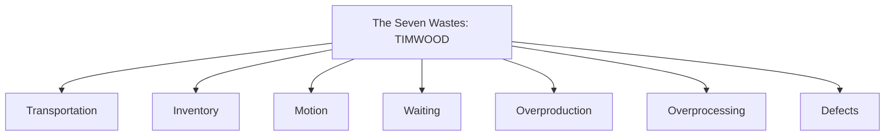
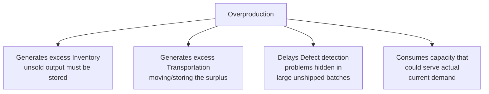
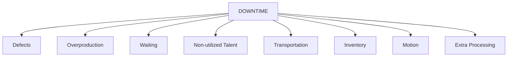
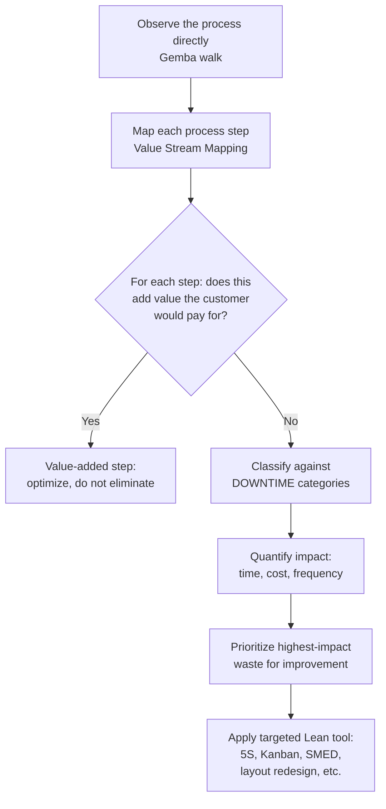

## Identifying the Seven Wastes

### Overview

**Key Points**

- The seven wastes (Japanese: **muda**) is the foundational Lean framework for categorizing non-value-added activity within a process, originally codified by Taiichi Ohno as part of the Toyota Production System.
- Each waste category represents a distinct pattern of resource consumption — time, material, motion, or capacity — that does not contribute value the customer is willing to pay for.
- The original seven wastes are commonly extended to eight in modern Lean practice by adding **Non-utilized Talent** (underused employee skills and ideas), forming the acronym **DOWNTIME**; the classic seven (without this addition) are sometimes remembered by the acronym **TIMWOOD**.
- Identifying waste is not an end in itself — it is the diagnostic first step that feeds into subsequent Lean tools (Value Stream Mapping, Kaizen events, 5S, Kanban) aimed at systematically removing or reducing each identified waste category.

### The Seven (Classic) Wastes: TIMWOOD

### 1. Transportation

#### Definition

Unnecessary movement of materials, products, or information between locations, processes, or systems that does not add value to the customer.

#### Characteristics

- Adds time and handling cost without changing the product's form, fit, or function.
- Increases the risk of damage, loss, or delay during transit.
- Often a symptom of poor facility layout or process sequencing.

**Example**

A manufacturing plant with a poorly designed layout requires parts to travel between five different buildings across a campus before final assembly, when a redesigned single-building layout could eliminate most of this movement. Each transfer adds handling time and risk of damage without improving the product itself.

### 2. Inventory

#### Definition

Excess raw materials, work-in-process (WIP), or finished goods beyond what is immediately required to meet actual customer demand.

#### Characteristics

- Ties up capital and warehouse space.
- Conceals underlying process problems (a large WIP buffer can mask an unreliable upstream process, since disruptions don't immediately halt downstream work).
- Increases risk of obsolescence, damage, or spoilage, particularly for perishable or fast-evolving products.

**Example**

A distributor maintains three months of finished-goods inventory "just in case" demand spikes, tying up significant working capital and warehouse space, when analysis of actual demand variability shows two weeks of buffer stock would provide adequate service levels with dramatically less capital tied up.

### 3. Motion

#### Definition

Unnecessary physical movement by people (as distinct from Transportation, which concerns movement of materials/products) — reaching, bending, walking, or searching that does not add value.

#### Characteristics

- Often caused by poor workstation ergonomics or tool/material placement.
- Contributes to worker fatigue and potential injury risk over time, independent of any output quality impact.
- Frequently addressed through 5S workplace organization (placing frequently used tools within easy reach).

**Example**

An assembly line operator must walk 15 steps to retrieve a specific fastener bin for every unit assembled, because the bin was placed in a "logical" storage location rather than at the point of use — relocating the bin adjacent to the workstation eliminates this repeated unnecessary motion entirely.

### 4. Waiting

#### Definition

Idle time when people, equipment, materials, or information are not being actively processed — the pause between value-added steps.

#### Characteristics

- Often the largest single category of waste identified in Value Stream Mapping exercises across many industries. [Inference] This pattern (waiting/queue time dominating total lead time) is widely and consistently reported in Lean case studies, though the specific proportion varies substantially by process and should not be assumed as a fixed universal ratio.
- Can result from unbalanced workstation capacity, equipment downtime, or upstream process delays.
- Distinct from Inventory waste in that Waiting describes idle *time*, while Inventory describes idle *stock accumulation* — though the two are frequently linked (goods waiting in a queue represent both).

**Example**

A loan application sits untouched for four business days awaiting a supervisor's signature, even though the actual review and signature process itself takes only ten minutes — the four days represent pure waiting waste with zero value added to the customer during that time.

### 5. Overproduction

#### Definition

Producing more, earlier, or faster than actual downstream demand requires.

#### Characteristics

- Frequently cited as the most fundamental of all wastes, because it directly generates several other wastes: excess Inventory (the unsold output must be stored), additional Transportation (moving the excess output), and potential Defects (problems in over-produced batches go undetected longer before reaching a customer who would flag the issue).
- Often driven by a "push" production philosophy (producing based on forecast) rather than a "pull" philosophy (producing in response to actual confirmed demand).

**Key Points**

- Because overproduction cascades into multiple other waste categories, it is frequently treated as the highest-priority waste to address first in a Lean transformation [Inference] — this sequencing logic (address overproduction early, since doing so reduces the downstream Inventory, Transportation, and Defect-detection-delay wastes it generates) is a commonly cited rationale in Lean practitioner literature, distinguishing it as somewhat more foundational than the other six categories.

**Example**

A bakery produces 500 loaves of a specialty bread each morning based on an optimistic sales forecast, but typically sells only 350, resulting in 150 loaves of daily waste (discarded or heavily discounted) — a pull-based approach tied to actual order data or a more conservative, replenishment-based baking schedule would eliminate this systemic overproduction.

### 6. Overprocessing (Extra Processing)

#### Definition

Performing more work, using more resources, or achieving a higher level of precision or refinement than the customer actually requires or is willing to pay for.

#### Characteristics

- Often invisible to those performing the work, since it may reflect internally-driven quality or thoroughness standards rather than externally-verified customer requirements.
- Can include redundant approvals, unnecessary reporting detail, excessive inspection steps, or manufacturing tolerances tighter than the specification requires.

**Example**

A finance department requires three separate managerial sign-offs for expense reports under $50, when analysis shows that a single sign-off achieves equivalent control effectiveness for such low-value transactions — the additional two approval steps represent overprocessing waste that adds delay without proportional risk reduction.

### 7. Defects

#### Definition

Errors, mistakes, or non-conformances that require correction, rework, scrap, or that escape to the customer, along with the resources consumed inspecting for and correcting them.

#### Characteristics

- Directly connects to Statistical Process Control and Six Sigma variation-reduction concepts — a process producing frequent defects is, in Lean terms, generating waste, while in Six Sigma terms it may reflect excessive common or special cause variation.
- Includes not only the physical scrap or rework itself, but the wasted original processing time invested in the now-defective unit, plus the inspection/detection effort required to catch it.

**Example**

A software development team ships a feature with a critical bug, requiring an emergency patch release; the waste includes the original development time on the flawed code, the customer support time handling complaints, the emergency development time fixing the bug, and the deployment resources for the patch release — all attributable to a single defect that could have been caught earlier with more effective testing.

### The Eighth Waste: Non-Utilized Talent

Modern Lean practice commonly extends the original seven to an eighth category, forming the acronym **DOWNTIME**.

#### Definition

Failing to utilize employees' skills, knowledge, creativity, or ideas for improvement — treating workers as interchangeable executors of predefined tasks rather than as sources of process insight.

#### Characteristics

- Distinct from the original seven "physical process" wastes in that it concerns organizational and cultural practices rather than material or motion flow.
- Frequently manifests as a lack of structured mechanisms (suggestion systems, kaizen events, daily improvement huddles) for capturing front-line employee insight.

**Example**

Machine operators who work with a piece of equipment daily notice a recurring minor adjustment that could prevent a common defect, but no formal channel exists for them to report this observation to engineering — the organization is failing to utilize the operators' accumulated tacit knowledge, representing Non-Utilized Talent waste.

[Unverified] The exact origin and timing of when "Non-Utilized Talent" was formally added to the classic seven wastes (converting TIMWOOD to DOWNTIME) is described somewhat inconsistently across secondary Lean sources; it is widely attributed to later Western adaptations and extensions of the original Toyota framework rather than to Ohno's original seven-waste formulation itself.

### DOWNTIME: The Extended Framework

### Comparative Summary Table

| Waste | Category | Primary Symptom | Common Root Cause |
| --- | --- | --- | --- |
| Transportation | Material flow | Excess movement of materials/products | Poor facility layout, disconnected process steps |
| Inventory | Material accumulation | Excess raw material, WIP, or finished goods | Push-based production, poor demand signaling |
| Motion | People flow | Unnecessary physical movement by workers | Poor workstation design, tool/material placement |
| Waiting | Time | Idle time between value-added steps | Unbalanced capacity, equipment downtime, approval delays |
| Overproduction | Volume/timing | Producing more/earlier than needed | Forecast-driven (push) planning, large batch sizes |
| Overprocessing | Effort/precision | Doing more than the customer requires | Internally-driven standards, unclear customer requirements |
| Defects | Quality | Errors requiring correction or causing escapes | Insufficient process control, inadequate mistake-proofing |
| Non-Utilized Talent | Organizational | Underused employee skills/ideas | Lack of structured improvement channels, rigid hierarchy |

### A Practical Waste-Identification Workflow

**Key Points**

- Effective waste identification typically requires **direct observation** of the actual process (a practice referred to in Lean as the **Gemba walk**, "gemba" meaning "the real place") rather than relying solely on secondhand reports or documented procedures, since actual work often deviates from how a process is formally documented, and waste is frequently more visible in practice than on paper.
- Not every non-value-added activity can be immediately eliminated: some steps, while not directly valued by the customer, may be currently necessary for regulatory compliance, safety, or organizational reasons — these are sometimes distinguished as **necessary non-value-added** activity (to be minimized over time) versus **pure waste** (to be eliminated outright wherever possible).

### Applying the Framework Beyond Manufacturing

| Waste | Manufacturing Example | Service/Office Example |
| --- | --- | --- |
| Transportation | Moving parts between distant workstations | Routing a document through multiple physical or digital handoffs |
| Inventory | Excess raw material stock | A backlog of unprocessed customer support tickets |
| Motion | Operator walking to retrieve tools | Employee switching between multiple software systems to complete one task |
| Waiting | Parts sitting between production stages | A request waiting in an approval queue |
| Overproduction | Producing more units than ordered | Generating reports nobody reads |
| Overprocessing | Polishing beyond specification | Requiring more approval signatures than needed for the risk level |
| Defects | A part failing quality inspection | A data entry error requiring correction |
| Non-Utilized Talent | Ignoring operator suggestions | Not soliciting front-line staff input on process design |

### Common Pitfalls in Waste Identification

- **Confusing necessary work with value-added work**: Some steps (e.g., regulatory documentation, certain quality inspections) may be currently required even though the end customer does not directly value them — these require a different improvement strategy (minimize/simplify) than pure waste (eliminate).
- **Focusing only on the "visible" wastes**: Physical wastes like Transportation and Motion are often easier to observe directly than less visible wastes like Overprocessing or Non-Utilized Talent, which can lead to an incomplete waste assessment if the analysis is not deliberately structured to check all eight categories.
- **Treating waste identification as a one-time audit**: Since process conditions, demand patterns, and organizational structures change over time, waste identification is most effective as an ongoing discipline (consistent with the kaizen philosophy of continuous improvement) rather than a single point-in-time assessment.

### Next Steps

- Value Stream Mapping: visualizing and quantifying waste across an entire process
- Gemba walks and direct observation techniques for waste identification
- 5S workplace organization as a countermeasure to Motion and Transportation waste
- Kanban pull systems as a countermeasure to Overproduction and Inventory waste
- SMED (setup time reduction) as a countermeasure to Waiting and batch-size-driven Overproduction
- Kaizen events and continuous improvement culture
- Lean philosophy and the Toyota Production System's historical foundations
- Failure Mode and Effects Analysis (FMEA) as a complementary tool for the Defects waste category