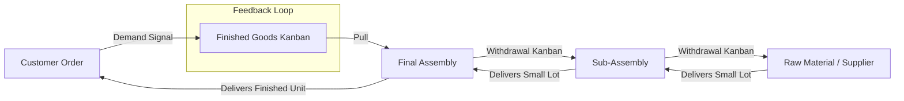
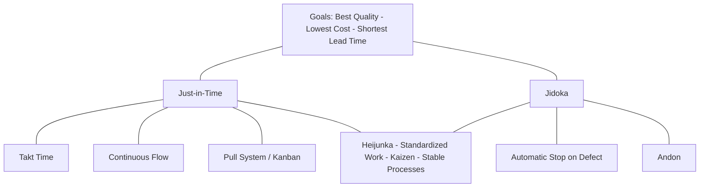

## Just-in-time Production Principles

### Overview

Just-in-Time (JIT) production is a manufacturing and inventory management philosophy in which materials, components, and subassemblies are produced or delivered only in the quantity needed, at the time needed, at the point where they are needed. JIT originated within the Toyota Production System (TPS), developed primarily by Taiichi Ohno at Toyota Motor Corporation between the 1940s and 1970s, and is one of the two pillars of TPS alongside jidoka (autonomation, or automation with a human touch).

The core objective of JIT is the systematic elimination of waste (muda) — particularly the waste of overproduction, which Ohno considered the worst form of waste because it conceals and generates all other forms of waste (excess inventory, wasted motion, wasted transportation, defects, and waiting).

### Foundational Principles

**Key Points**

- **Pull system over push system**: Production is triggered by actual downstream demand (a customer order or a consuming process) rather than by a forecast-driven schedule pushed from upstream.
- **Production leveling (heijunka)**: Smoothing both volume and mix of production over time to avoid uneven demand on upstream processes.
- **Takt time synchronization**: Pacing production to match the rate of customer demand.
- **One-piece flow**: Moving product through processes in single units (or small batches) rather than large batch transfers, reducing lead time and work-in-process (WIP).
- **Waste elimination**: Systematically identifying and removing the seven (or eight) wastes.
- **Continuous flow with minimal buffer**: Inventory functions as a buffer against variability; JIT seeks to reduce variability itself so that buffers can shrink.

### The Seven Wastes (Muda) Addressed by JIT

1. **Overproduction** — producing more, earlier, or faster than required by the next process.
2. **Waiting** — idle time for people, machines, or material.
3. **Transportation** — unnecessary movement of materials between processes.
4. **Overprocessing** — doing more work than the customer values.
5. **Inventory** — excess raw material, WIP, or finished goods.
6. **Motion** — unnecessary movement of people.
7. **Defects** — rework, scrap, and inspection effort.

An eighth waste commonly added in modern treatments is **unused employee creativity/skill**.

### Pull System Mechanics: Kanban

JIT is most commonly implemented operationally through **kanban**, a visual signaling system that authorizes and controls production and movement of materials.

**Key Points**

- A kanban card (or electronic signal) is attached to a container of parts.
- When a downstream process consumes the container, the kanban is returned upstream as a signal to produce or deliver a replacement.
- No kanban, no production — this hard constraint prevents overproduction by design.
- Two common kanban types: **production kanban** (authorizes making a batch) and **withdrawal/conveyance kanban** (authorizes moving a batch between stages).

**Example**

A seat assembly line consumes seat foam pads from a supermarket rack. Each time a bin of pads empties, the operator returns the empty bin's kanban card to the foam supplier's production cell. The card is the only trigger for the supplier to mold another batch — no card, no molding — which prevents the supplier from building ahead of actual consumption.

### Kanban Card Quantity Formula

The number of kanban cards circulating in a loop is typically calculated as:

$$K = \frac{D \times (L + S)}{C} \times (1 + \alpha)$$

Where:

- $K$ = number of kanban cards
- $D$ = average demand rate per unit time
- $L$ = lead time to replenish (production + transport time)
- $S$ = safety time (buffer to absorb variability)
- $C$ = container capacity (units per kanban)
- $\alpha$ = safety factor (expressed as a decimal, e.g., 0.1 for 10%)

**Example**

- $D$ = 200 units/day
- $L + S$ = 0.5 days
- $C$ = 25 units/container
- $\alpha$ = 0.10

$$K = \frac{200 \times 0.5}{25} \times 1.10 = 4.4 \approx 5 \text{ cards}$$

Rounding up ensures sufficient buffer capacity; rounding conventions and the exact treatment of $\alpha$ vary by implementation. [Inference: the specific rounding and safety-factor convention differs across firms and textbooks; treat the formula as a standard planning heuristic rather than a fixed universal standard.]

### JIT and Takt Time

Takt time (from the German *Takt*, meaning "pace" or "cycle") sets the rhythm of a JIT line to match customer demand:

$$\text{Takt Time} = \frac{\text{Available Production Time}}{\text{Customer Demand}}$$

**Example**

- Available time per shift = 450 minutes (after breaks)
- Customer demand = 300 units/shift

$$\text{Takt Time} = \frac{450}{300} = 1.5 \text{ minutes/unit}$$

Each workstation must be balanced so its cycle time is at or below takt time; stations exceeding takt time become bottlenecks that break the pull rhythm.

### Enabling Conditions for JIT

JIT cannot function as a standalone technique — it requires a supporting operational environment:

- **Setup time reduction (SMED — Single-Minute Exchange of Die)**: Small lot sizes are only economical if changeover times are minimal. Shigeo Shingo's SMED methodology is foundational here.
- **Standardized work**: Consistent, documented work sequences reduce variability that would otherwise require buffer stock.
- **Total Productive Maintenance (TPM)**: Unplanned equipment downtime is catastrophic in a zero-buffer system, so preventive/predictive maintenance is essential.
- **Quality at the source (jidoka)**: Defects must be caught and stopped immediately (andon systems) since there is no buffer stock to absorb rework.
- **Stable, leveled demand (heijunka)**: Wild demand swings undermine the pull signal; production is smoothed via mixed-model scheduling.
- **Reliable supplier network**: Suppliers must deliver small lots frequently and reliably, often requiring geographic proximity or tightly synchronized logistics (e.g., milk-run delivery routes).
- **Employee involvement and cross-training**: Workers must be multi-skilled to flex across stations as demand mix changes.

### Process Flow Diagram

### JIT vs. Traditional Push/MRP Systems

| Dimension | JIT (Pull) | Traditional Push (MRP-driven) |
| --- | --- | --- |
| Trigger | Actual downstream consumption | Forecast/master schedule |
| Inventory | Minimal, buffer as last resort | Higher safety stock buffers |
| Lot sizes | Small, frequent | Large, batch-oriented |
| Flexibility | High for mix changes | Lower, optimized for volume |
| Defect visibility | Immediate (no inventory to hide behind) | Delayed (inventory masks defects) |
| Setup time requirement | Must be minimized (SMED) | Less critical |
| Supplier relationship | Tight integration, frequent small deliveries | Bulk periodic deliveries |

### Benefits

- Reduced inventory carrying costs (storage, insurance, obsolescence, capital tied up)
- Shorter manufacturing lead times
- Faster detection of quality problems (no inventory buffer hides defects)
- Reduced floor space requirements
- Improved cash flow due to lower WIP
- Greater responsiveness to demand changes when combined with heijunka

### Risks and Limitations

- **Supply chain fragility**: Because buffers are minimal, disruptions (natural disasters, supplier failure, transportation delays, geopolitical events) propagate quickly through the system. [Unverified: the magnitude of disruption impact is highly context- and industry-dependent, as demonstrated variably across different real-world supply chain shocks.]
- **Dependence on demand stability**: Highly volatile or unpredictable demand undermines kanban sizing and takt-based balancing.
- **Requires cultural and organizational maturity**: Cross-training, andon empowerment, and continuous improvement (kaizen) routines take significant time to institutionalize.
- **Supplier geographic constraints**: Frequent small-lot delivery favors suppliers located close to the plant, which can limit sourcing flexibility or increase transportation trip frequency.
- **Vulnerability to demand spikes**: Sudden surges can outstrip the system's ability to replenish quickly, since capacity buffers are also minimized.

### Worked Example: JIT vs. Batch Production Cost Trade-off

Consider a component with:

- Annual demand $D = 12{,}000$ units
- Ordering/setup cost $S = \$50$ per setup
- Holding cost $H = \$4$ per unit per year

Economic Order Quantity (EOQ) under traditional batch logic:

$$EOQ = \sqrt{\frac{2DS}{H}} = \sqrt{\frac{2 \times 12{,}000 \times 50}{4}} = \sqrt{300{,}000} \approx 548 \text{ units}$$

Under JIT, the objective shifts: rather than accepting $S = \$50$ as fixed and optimizing lot size around it, JIT invests in **reducing $S$** (via SMED) so that smaller, more frequent lots become economical without increasing total cost. If setup cost is reduced to $S = \$2$:

$$EOQ = \sqrt{\frac{2 \times 12{,}000 \times 2}{4}} = \sqrt{12{,}000} \approx 110 \text{ units}$$

This illustrates the core JIT insight: **lot size reduction is achieved by attacking setup cost, not by ignoring the trade-off implied by the EOQ model.**

### JIT II and Extended Supply Chain Integration

JIT II is an evolution where supplier representatives are embedded on-site at the customer's facility, replacing traditional purchasing/order-processing intermediaries with direct planning collaboration. This further compresses lead time and communication delays inherent in conventional JIT supplier relationships. [Inference: JIT II adoption is less universally documented than base JIT/kanban practice and is best treated as a specialized extension rather than a core universal principle.]

### Relationship to Broader Lean and TPS Structure

JIT diagram within the TPS "house" model:

### Conclusion

Just-in-Time production principles reorient manufacturing around pull-based, demand-synchronized flow rather than forecast-driven push production. Its effectiveness rests not on the kanban mechanism alone but on the surrounding enabling systems — SMED, standardized work, TPM, jidoka, and heijunka — that make small-lot, low-buffer operation viable without sacrificing reliability. JIT trades inventory-based risk absorption for process stability and waste elimination, which is powerful in stable, high-volume, well-coordinated supply environments but introduces fragility when demand or supply variability exceeds the system's designed tolerance.

**Related Topics**

- Kanban system design and card-quantity calculation
- Heijunka (production leveling) and mixed-model scheduling
- SMED (Single-Minute Exchange of Die) methodology
- Jidoka and andon systems
- Total Productive Maintenance (TPM)
- Toyota Production System "house" model
- Value stream mapping
- Supplier relationship management under JIT (milk-run logistics, JIT II)
- Theory of Constraints vs. JIT comparison
- Bullwhip effect and demand variability in pull systems