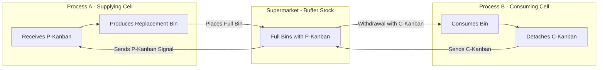

## Kanban Pull Systems

### Overview

Kanban (Japanese for "signboard" or "visual card") is the scheduling and material-flow control mechanism used to implement pull-based production within the Toyota Production System (TPS) and Just-in-Time (JIT) manufacturing. Developed by Taiichi Ohno at Toyota, kanban replaces centralized, forecast-driven push scheduling with a decentralized, visual signaling system in which each workstation authorizes upstream production or replenishment only in response to actual consumption.

The fundamental rule of kanban is: **no card, no production; no card, no movement.** This constraint is what physically prevents overproduction — the waste Ohno considered most damaging because it conceals all other forms of waste.

### Core Principles

**Key Points**

- **Pull, not push**: Each process withdraws parts from the preceding process only as needed; the preceding process produces only to replace what was withdrawn.
- **Visual control**: The status of production and inventory is made visible to all operators without requiring reports or computer queries.
- **Self-regulating limits**: The number of kanban cards in circulation sets a hard ceiling on WIP (work-in-process) inventory in a given loop.
- **Decentralized authority**: Individual workstations, not a central planning department, trigger replenishment.
- **Continuous improvement lever**: Deliberately reducing the number of kanban cards in circulation exposes inefficiencies (this is sometimes called "lowering the water level to expose the rocks").

### Types of Kanban

1. **Production kanban (P-kanban)**: Authorizes a workstation to produce a specific quantity of a specific part.
2. **Withdrawal/conveyance kanban (C-kanban)**: Authorizes movement of a container of parts from a supplying process (or supermarket) to a consuming process.
3. **Signal kanban**: Used for batch/lot processes (e.g., stamping, molding) where a triangular kanban signals that a reorder point has been reached, since these processes cannot make one piece at a time economically.
4. **Supplier kanban**: Extends the loop to an external supplier, authorizing external delivery rather than internal production.
5. **Electronic kanban (e-kanban)**: Digital signal systems (barcode scans, RFID, ERP-integrated triggers) replacing physical cards, common in modern implementations.

### The Two-Card Kanban Loop

**Example**

Consider a machining cell (Process A) supplying a sub-assembly cell (Process B) through a supermarket of parts bins.

1. Process B consumes a bin of parts; the C-kanban attached to the empty bin is removed and placed in a collection post.
2. The C-kanban is carried (or scanned) to the supermarket between A and B.
3. A full bin bearing a P-kanban is retrieved from the supermarket; the C-kanban is attached to it and it is delivered to Process B. The P-kanban from that bin is removed and placed in Process A's production-instruction post.
4. Process A sees the P-kanban and produces exactly one replacement bin of parts, in the sequence the cards arrive — never ahead of demand.
5. The completed bin, with its P-kanban attached, is placed back in the supermarket, closing the loop.

This sequence ensures Process A never overproduces beyond what has actually been consumed downstream.

### Kanban Loop Diagram

### Calculating the Number of Kanban Cards

The number of kanban cards (and thus the WIP ceiling) in a loop is calculated as:

$$K = \frac{D \times (L + S)}{C} \times (1 + \alpha)$$

Where:

- $K$ = number of kanban cards (rounded up to nearest whole number)
- $D$ = average demand rate per unit time
- $L$ = replenishment lead time (production + transport)
- $S$ = safety time buffer
- $C$ = container/standard lot capacity
- $\alpha$ = safety stock factor (decimal)

**Example**

- $D$ = 480 units/day
- $L + S$ = 0.25 days
- $C$ = 20 units/container
- $\alpha$ = 0.15

$$K = \frac{480 \times 0.25}{20} \times 1.15 = \frac{120}{20} \times 1.15 = 6 \times 1.15 = 6.9 \approx 7 \text{ cards}$$

Total maximum WIP in this loop = $7 \times 20 = 140$ units. [Inference: exact rounding conventions (round up vs. nearest) and how $\alpha$ is applied vary somewhat between organizations and textbooks; treat this as a standard planning formula rather than a single fixed universal standard.]

### Kanban Board Structure (Visual Management)

A physical or digital kanban board typically has three or more zones representing workflow stages:

| Zone | Purpose | WIP Limit Behavior |
| --- | --- | --- |
| To Do / Backlog | Work authorized but not started | Not limited (queue) |
| In Process | Work actively being performed | Limited by card count |
| Done / Supermarket | Completed work awaiting pull | Limited by container/card count |

**Example (Manufacturing Floor Board)**

A physical kanban post (heijunka box variant) is divided into time-slot pigeonholes. Cards are placed into slots corresponding to when their production should be scheduled to level the mix and volume of output — this integrates kanban with heijunka (production leveling).

### Kanban Rules (Toyota's Six Rules)

1. The downstream (customer) process withdraws only what is needed, when needed.
2. The upstream (supplier) process produces only what has been withdrawn.
3. No defective parts are sent downstream (quality at the source).
4. The number of kanban cards should be minimized over time (continuous improvement).
5. Kanban is used to smooth (level) production, not to accommodate wide fluctuation.
6. Processes must be stabilized and rationalized before kanban can function effectively.

### Determining WIP Ceiling and Little's Law Relationship

Kanban systems are a physical embodiment of Little's Law, which relates WIP, throughput, and cycle time:

$$WIP = \text{Throughput} \times \text{Cycle Time}$$

Because the kanban card count fixes an upper bound on WIP, and throughput is largely determined by downstream demand pull, cycle time is constrained as a derived quantity:

$$\text{Cycle Time} = \frac{WIP}{\text{Throughput}} = \frac{K \times C}{D}$$

**Example**

Using the earlier values ($K = 7$, $C = 20$, $D = 480$/day):

$$\text{Cycle Time} = \frac{7 \times 20}{480} = \frac{140}{480} \approx 0.29 \text{ days}$$

Reducing $K$ (removing cards) directly reduces achievable cycle time, provided the process can still keep pace — this is the mechanism by which kanban card reduction drives continuous improvement.

### Kanban vs. MRP (Push Scheduling)

| Dimension | Kanban (Pull) | MRP (Push) |
| --- | --- | --- |
| Trigger | Actual consumption signal | Forecasted master production schedule |
| Control mechanism | Physical/visual cards, decentralized | Centralized computer system, data-driven |
| Best suited for | Repetitive, stable demand, standard parts | Complex BOMs, engineered-to-order, volatile demand |
| WIP control | Physically capped by card count | Not inherently capped; relies on planning accuracy |
| Responsiveness to demand changes | High within capacity limits | Dependent on replanning cycle frequency |
| Data requirements | Low (visual, simple) | High (accurate BOM, lead times, forecasts) |

Many real-world systems use a hybrid: MRP for long-range capacity and material planning, kanban for shop-floor execution control (sometimes termed "MRP for planning, kanban for execution").

### Conditions Required for Kanban to Function

- **Stable, repetitive demand** at the loop level, even if final product mix varies (via heijunka).
- **Standardized containers and lot sizes** so card-to-quantity relationships remain fixed.
- **Short, reliable setup times** (via SMED) so small-lot replenishment is economical.
- **Reliable equipment** (via TPM) since kanban loops carry minimal buffer against downtime.
- **Quality at the source (jidoka)** since defective parts entering a kanban loop propagate quickly with no inspection buffer.
- **Disciplined adherence to the rules** — kanban fails if operators bypass the card system to "help" during shortages.

### Digital/Electronic Kanban (e-Kanban)

Modern implementations often replace physical cards with electronic signals integrated into ERP or MES (Manufacturing Execution System) platforms:

- Barcode/RFID scans at consumption points automatically trigger replenishment orders.
- Electronic kanban boards provide real-time visibility across multiple sites or supply chain partners.
- Enables kanban loops that span long distances (e.g., supplier kanban across regions), where physical card transport would be impractical.

[Unverified: the specific software architecture and vendor implementation details of e-kanban systems vary considerably across ERP/MES platforms and are not standardized industry-wide.]

### Kanban Beyond Manufacturing

The pull/visual-signal principle has been adapted into knowledge-work contexts (notably software development, under names like the Kanban Method popularized by David J. Anderson), using WIP limits on task-board columns rather than physical card counts on containers. The underlying principle — limiting work in process to match actual pull-through capacity — remains structurally identical to the manufacturing original. [Inference: this adaptation is a widely recognized extension of the concept, though its formal linkage back to Toyota's original manufacturing rules is looser than in shop-floor kanban.]

### Common Failure Modes

- **Card loss or bypass**: Operators skip the card discipline during rush periods, undermining the WIP ceiling and reintroducing overproduction.
- **Static card counts in a changing environment**: Failing to recalculate $K$ as demand $D$ or lead time $L$ shifts leads to stockouts or excess buffer.
- **Applying kanban to highly volatile or engineer-to-order demand**: Kanban assumes relatively stable, repetitive consumption; it performs poorly for one-off or highly erratic items.
- **Insufficient process stability**: Introducing kanban before achieving stable cycle times and low defect rates simply exposes chaos rather than controlling it.

### Conclusion

Kanban pull systems operationalize the JIT principle of producing only what is needed, when needed, by converting an abstract scheduling philosophy into a concrete, self-limiting visual control mechanism. Card count directly caps WIP, which through Little's Law directly caps cycle time, giving kanban both an operational control function and a built-in continuous-improvement lever via deliberate card reduction. Its effectiveness depends heavily on surrounding process stability — standardized work, short setups, reliable equipment, and quality at the source — without which the pull signal alone cannot compensate for underlying variability.

**Related Topics**

- Just-in-Time production principles
- Heijunka (production leveling) and the heijunka box
- SMED and setup time reduction
- Little's Law and WIP-to-cycle-time relationships
- Supermarket systems and two-bin replenishment
- Electronic kanban (e-kanban) and MES integration
- The Kanban Method in software/knowledge work
- Value stream mapping and pull-loop design
- Jidoka and quality-at-the-source controls
- Hybrid MRP-kanban scheduling architectures