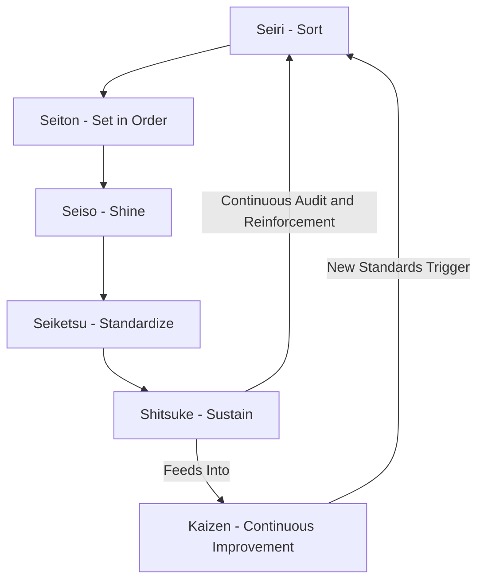

## 5S Workplace Organization

### Overview

5S is a workplace organization methodology originating from the Toyota Production System, consisting of five sequential steps — each named for a Japanese term beginning with "S" — designed to create and sustain an organized, clean, standardized, and disciplined work environment. 5S serves as a foundational enabler for other lean tools (kanban, JIT, jidoka) because visual control, error reduction, and efficient material flow all depend on a well-ordered physical workspace. Poorly organized workspaces hide waste, defects, and safety hazards; 5S makes these visible.

### The Five Pillars

1. **Seiri (整理) — Sort**: Distinguish necessary items from unnecessary ones; remove what is not needed from the immediate work area.
2. **Seiton (整頓) — Set in Order**: Arrange necessary items so they are easy to find, use, and return; "a place for everything, and everything in its place."
3. **Seiso (清掃) — Shine**: Clean the workspace and equipment thoroughly and regularly; cleaning doubles as inspection, surfacing early signs of equipment wear or malfunction.
4. **Seiketsu (清潔) — Standardize**: Establish standards, schedules, and visual controls so the first three S's are maintained consistently rather than as one-time events.
5. **Shitsuke (躾) — Sustain**: Build discipline and habit so 5S becomes self-reinforcing organizational culture rather than a one-off initiative that decays over time.

**Key Points**

- The Western adaptation sometimes adds a sixth "S" for **Safety**, though this is treated as embedded within the original five in classical TPS literature. [Inference: whether Safety is a distinct sixth pillar or an implicit outcome of the original five is a matter of differing regional/organizational convention rather than a single documented standard.]
- 5S is a prerequisite condition for kanban and JIT to function reliably — Toyota's kanban rules explicitly require "processes must be stabilized" before kanban is introduced, and 5S is a primary stabilization mechanism.

### Detailed Breakdown of Each Step

**Seiri (Sort)**

- Apply the **red-tag technique**: attach a red tag to any item whose necessity or usage frequency is uncertain; move tagged items to a holding area for a defined evaluation period (commonly 30 days).
- Decision criteria typically include: frequency of use, criticality to current operations, quantity needed versus quantity present, and condition of the item.
- Items not used within the evaluation window are discarded, relocated, sold, or reallocated to another area/process that needs them.

**Example**

A machine shop finds 40 tool fixtures on a shelf. A red-tag audit reveals 12 are used daily, 5 are used monthly, and 23 have not been used in over a year. The 23 are red-tagged; after a 30-day holding period with no requests, they are removed from the floor and repurposed or scrapped.

**Seiton (Set in Order)**

- **Point-of-use storage**: Tools and materials are stored as close as possible to where they are used, minimizing motion waste.
- **Shadow boards**: Tool outlines are painted or taped onto pegboards so any missing tool is immediately visually apparent.
- **Location coding**: Floor markings, labeled bins, and color-coded zones make correct placement unambiguous.
- **Ergonomic placement**: Frequently used items are placed within easy reach; heavier or less-used items are stored lower or farther away.

**Seiso (Shine)**

- Cleaning is treated as **inspection**, not mere tidiness — operators cleaning a machine daily are positioned to notice leaks, loose bolts, or abnormal wear before they cause a breakdown.
- Cleaning responsibilities and schedules are assigned per zone/equipment, often integrated with **Total Productive Maintenance (TPM)** autonomous maintenance routines.
- Root causes of contamination (leaking seals, dust sources) are addressed rather than merely repeatedly cleaning up symptoms.

**Seiketsu (Standardize)**

- Convert Sort/Set-in-Order/Shine practices into documented, repeatable standards: checklists, cleaning schedules, visual standards (photos of "correct" vs. "incorrect" states).
- Visual management boards display the standard alongside current status so deviations are immediately obvious.
- Assign clear ownership (who does what, how often) to prevent standards from lapsing.

**Shitsuke (Sustain)**

- Regular audits (5S audits/scorecards) with defined scoring criteria per area.
- Leadership engagement — management participation in audits signals organizational priority.
- Integration into daily routines and performance metrics rather than treating 5S as a separate improvement "event."
- Recognition and reinforcement mechanisms (visible scoreboards, team recognition) to sustain motivation.

### 5S Audit Scoring Example

A typical 5S audit scores each pillar on a 0–5 scale across defined criteria, producing an area score:

| Pillar | Criteria Example | Score (0-5) |
| --- | --- | --- |
| Sort | No unnecessary items present in work area | 4 |
| Set in Order | All tools have designated, labeled locations | 3 |
| Shine | Equipment and floor free of dirt/debris | 5 |
| Standardize | Visual standards posted and current | 3 |
| Sustain | Audit completed on schedule, prior issues resolved | 2 |

$$\text{5S Score} = \frac{\sum \text{Pillar Scores}}{\text{Number of Pillars} \times \text{Max Score per Pillar}} \times 100$$

$$\text{5S Score} = \frac{4+3+5+3+2}{5 \times 5} \times 100 = \frac{17}{25} \times 100 = 68\%$$

Scores below a defined threshold (commonly 70–80%, organization-dependent) trigger a corrective action plan. [Unverified: exact scoring scales, weightings, and threshold conventions vary significantly across organizations and are not governed by a single universal standard.]

### 5S Implementation Cycle Diagram

### Shadow Board Layout Illustration (svg_diagram)

<svg xmlns="http://www.w3.org/2000/svg" viewBox="0 0 500 260">
<text x="250" y="24" text-anchor="middle" font-size="16" font-family="sans-serif" font-weight="bold">Shadow Board Layout (svg_diagram)</text>
<rect x="30" y="45" width="440" height="180" fill="none" stroke="#333" stroke-width="2" />
<rect x="60" y="70" width="70" height="14" rx="4" fill="none" stroke="#666" stroke-width="2" />
<text x="95" y="100" text-anchor="middle" font-size="11" font-family="sans-serif">Wrench</text>
<circle cx="200" cy="80" r="18" fill="none" stroke="#666" stroke-width="2" />
<text x="200" y="112" text-anchor="middle" font-size="11" font-family="sans-serif">Hammer Head</text>
<rect x="270" y="65" width="18" height="45" fill="none" stroke="#666" stroke-width="2" />
<text x="279" y="122" text-anchor="middle" font-size="11" font-family="sans-serif">Screwdriver</text>
<rect x="340" y="70" width="90" height="35" rx="6" fill="none" stroke="#666" stroke-width="2" />
<text x="385" y="118" text-anchor="middle" font-size="11" font-family="sans-serif">Tape Measure</text>
<rect x="60" y="150" width="60" height="60" fill="none" stroke="#999" stroke-width="2" stroke-dasharray="4,3" />
<text x="90" y="182" text-anchor="middle" font-size="10" font-family="sans-serif">Bin A</text>
<rect x="150" y="150" width="60" height="60" fill="none" stroke="#999" stroke-width="2" stroke-dasharray="4,3" />
<text x="180" y="182" text-anchor="middle" font-size="10" font-family="sans-serif">Bin B</text>
<rect x="240" y="150" width="60" height="60" fill="none" stroke="#999" stroke-width="2" stroke-dasharray="4,3" />
<text x="270" y="182" text-anchor="middle" font-size="10" font-family="sans-serif">Bin C</text>
<text x="250" y="245" text-anchor="middle" font-size="10" font-family="sans-serif" fill="#555">Outlines show correct tool location — any gap is instantly visible as missing</text>
</svg>

### Relationship to Waste Elimination

| 5S Pillar | Primary Waste(s) Addressed |
| --- | --- |
| Sort | Excess inventory, wasted space, wasted search motion |
| Set in Order | Motion waste, waiting (searching for tools/materials) |
| Shine | Defects (early detection via inspection-while-cleaning), equipment downtime |
| Standardize | Variability-driven defects and inconsistent quality |
| Sustain | Regression of all prior gains; long-term waste creep |

### 5S and Visual Management Integration

5S is the physical foundation for broader **visual management** systems used throughout lean operations:

- Andon systems (visual/audible defect alerts) depend on a workspace clean and organized enough that abnormal conditions stand out.
- Kanban card systems require designated, standardized storage locations (Set in Order) to function without confusion.
- Standardized work instructions posted at workstations (Standardize) rely on the discipline established through Sustain.

### Common Implementation Pitfalls

- **Treating 5S as a one-time "cleanup event"** rather than an ongoing discipline — gains typically erode within months without a Sustain mechanism.
- **Sorting without criteria discipline** — removing items based on opinion rather than documented usage data, leading to needed items being discarded.
- **Standardizing prematurely** — locking in standards before Sort and Set in Order have stabilized, requiring rework of standards later.
- **Lack of leadership involvement** — 5S initiatives driven only from the shop floor without management audit participation tend to lose priority over time.
- **Ignoring root causes in Shine** — repeatedly cleaning contamination without addressing its source (e.g., a leaking machine seal) wastes labor without eliminating the underlying defect.

### 5S Beyond the Factory Floor

The methodology extends to office environments (sometimes termed "5S for offices"), applied to shared drives, desk organization, digital file structures, and even software development environments (organizing repositories, standardizing folder structures, decluttering unused code branches). [Inference: this is a widely cited extension of 5S principles, though formal audit criteria for non-manufacturing contexts are less standardized than for shop-floor applications.]

### Conclusion

5S provides the physical and behavioral groundwork on which higher-order lean tools such as JIT, kanban, and jidoka depend. By sequentially sorting out the unnecessary, organizing what remains for efficient use, maintaining cleanliness as a form of inspection, standardizing these practices, and sustaining them through discipline and audit, organizations create a workplace where abnormalities are immediately visible and waste has nowhere to hide. Its greatest implementation risk is not technical but cultural: without genuine sustained commitment (Shitsuke), 5S gains predictably decay back toward disorganization.

**Related Topics**

- Total Productive Maintenance (TPM) and autonomous maintenance
- Visual management and andon systems
- Standardized work documentation
- Kaizen and continuous improvement events
- Jidoka and quality-at-the-source
- Kanban pull systems (prerequisite process stability)
- Workplace safety integration (6S models)
- 5S audit scorecards and gemba walks
- Lean office and digital workspace organization
- Root cause analysis (5 Whys) in Shine-stage defect detection