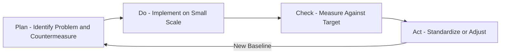
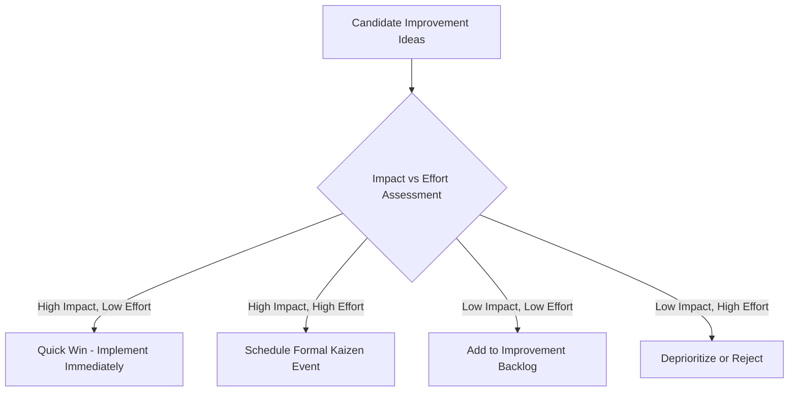

## Kaizen and Continuous Improvement Events

### Overview

Kaizen (改善, "change for the better" or commonly translated "continuous improvement") is the philosophical and practical foundation underlying the Toyota Production System's culture of incremental, ongoing improvement carried out by everyone in the organization, from senior management to frontline workers. Unlike large-scale, capital-intensive innovation projects, kaizen emphasizes small, frequent, low-cost changes that compound over time. Masaaki Imai's 1986 book *Kaizen: The Key to Japan's Competitive Success* popularized the concept internationally and formalized much of its terminology for Western audiences.

Kaizen operates at two complementary levels: **kaizen as a daily philosophy** (an ongoing mindset embedded in normal work) and **kaizen events** (structured, time-boxed improvement projects, also called kaizen blitzes or rapid improvement events).

### Core Philosophy

**Key Points**

- **Everyone participates**: Improvement is not confined to engineers or management; frontline operators who directly perform the work are considered primary sources of improvement ideas.
- **Small, incremental changes**: Kaizen favors many small improvements over infrequent large ones, reducing risk and implementation cost per change.
- **Process focus over blame**: Problems are treated as opportunities to improve the process, not occasions to assign individual fault.
- **Standardize, then improve**: Improvement cycles first establish a stable standard, then challenge that standard — without a baseline, "improvement" cannot be measured or sustained.
- **Gemba orientation**: Improvement decisions are made based on direct observation at the "gemba" (現場, the actual place where work happens), not from conference rooms or reports alone.

### Kaizen vs. Kaikaku (Radical Change)

| Dimension | Kaizen | Kaikaku |
| --- | --- | --- |
| Scale of change | Small, incremental | Large, transformational |
| Frequency | Continuous, ongoing | Episodic, infrequent |
| Risk profile | Low risk per change | Higher risk, higher potential disruption |
| Investment | Minimal capital investment | Often significant capital investment |
| Who leads | Frontline teams, cross-functional groups | Senior management, dedicated project teams |
| Example | Rearranging a tool cart to reduce reach distance | Replacing an entire production line with new automation |

Both are used within TPS; kaizen sustains ongoing gains between periodic kaikaku-level transformations.

### The PDCA Cycle as Kaizen's Engine

Kaizen activities are structured using the **PDCA (Plan-Do-Check-Act)** cycle, originally popularized by W. Edwards Deming and closely associated with kaizen practice at Toyota:

1. **Plan**: Identify a problem or improvement opportunity, analyze current state, and propose a countermeasure.
2. **Do**: Implement the countermeasure on a small scale (pilot/trial).
3. **Check**: Measure results against the expected outcome; verify whether the countermeasure worked.
4. **Act**: If successful, standardize the change across the broader process; if not, adjust and repeat the cycle.

### Structure of a Kaizen Event (Kaizen Blitz)

A kaizen event is a focused, time-boxed (typically 3–5 days) improvement project targeting a specific process or work area, involving a cross-functional team pulled temporarily from normal duties.

**Typical Phases**

1. **Preparation (pre-event, days to weeks prior)**: Define scope, select team members, gather baseline data (cycle times, defect rates, current-state process maps), set measurable targets.
2. **Day 1 — Current State Analysis**: Team walks the gemba, documents the current-state value stream map, identifies waste (muda) and root causes using tools like the 5 Whys or fishbone (Ishikawa) diagrams.
3. **Day 2 — Future State Design**: Team brainstorms countermeasures, designs a future-state process, and prioritizes changes by impact versus implementation effort.
4. **Day 3 — Implementation**: Physical changes are made on the floor — layout changes, new standardized work instructions, visual controls installed — with the team directly implementing rather than merely recommending.
5. **Day 4 — Testing and Refinement**: New process is run under real conditions; data is collected to verify improvement against baseline; adjustments made based on observed issues.
6. **Day 5 — Standardization and Report-Out**: New standard work is documented, training is conducted for the broader team, and results are presented to leadership and stakeholders (often called the "report-out").

**Example**

A kaizen event targets a packaging station with a baseline cycle time of 95 seconds against a 75-second takt time. Over the five-day event, the team identifies that operators walk an average of 12 meters per cycle retrieving packaging materials from a distant shelf (motion waste). They relocate materials to point-of-use bins within arm's reach (Seiton), reducing cycle time to 68 seconds — a 28% improvement — and standardize the new layout with photos and updated work instructions.

### Kaizen Event Team Composition

**Key Points**

- **Team leader/facilitator**: Guides the process, ensures PDCA discipline, often trained in lean methodology.
- **Process operators**: Frontline workers who perform the actual tasks daily — critical for both accurate current-state understanding and buy-in for the new standard.
- **Cross-functional members**: Representatives from adjacent departments (maintenance, quality, engineering) who bring relevant technical perspective.
- **Management sponsor**: Provides authority to approve resource use and remove organizational obstacles during the event, without micromanaging day-to-day team decisions.
- **Outside-perspective member**: Someone unfamiliar with the specific process, included to ask "naive" questions that challenge unquestioned assumptions.

### Common Kaizen Event Tools

| Tool | Purpose |
| --- | --- |
| Value Stream Mapping (VSM) | Visualize current and future state material/information flow |
| 5 Whys | Root cause analysis by repeated questioning |
| Fishbone (Ishikawa) Diagram | Categorize potential causes of a problem (Methods, Machines, Materials, Manpower, Measurement, Environment) |
| Spaghetti Diagram | Map physical movement paths to identify motion waste |
| Time Observation Sheets | Capture cycle time data element-by-element |
| A3 Report | Single-page structured problem-solving document summarizing the PDCA cycle |

### The A3 Problem-Solving Format

The A3 report (named for the A3-size paper it was traditionally printed on) is a standardized one-page format used to document kaizen thinking, structured typically as:

1. Background/context
2. Current condition (with data/diagram)
3. Goal/target condition
4. Root cause analysis
5. Countermeasures
6. Implementation plan
7. Follow-up/results verification

This format enforces concise, evidence-based reasoning and is used both within kaizen events and for ongoing daily improvement documentation.

### Measuring Kaizen Impact

Common metrics tracked before and after a kaizen event include:

$$\text{Percent Improvement} = \frac{\text{Baseline} - \text{New Value}}{\text{Baseline}} \times 100$$

**Example**

Using the packaging station example above:

$$\text{Percent Improvement} = \frac{95 - 68}{95} \times 100 \approx 28.4\%$$

Other tracked metrics typically include defect rate reduction, changeover/setup time reduction, WIP reduction, and space (square footage) freed.

### Sustaining Kaizen Gains

**Key Points**

- **Standardized work updates**: New processes must be formally documented, not left as informal tribal knowledge, or gains erode as personnel change.
- **Follow-up audits**: Scheduled checks (30/60/90-day) verify the new standard is being followed and results are holding.
- **Visual tracking boards**: Ongoing metrics posted at the work area keep the improvement visible and reinforce accountability.
- **Leader standard work**: Supervisors incorporate verification of the new standard into their own routine gemba walks.
- Without deliberate sustainment mechanisms, kaizen event gains are prone to regression — a well-documented risk sometimes referred to informally as "improvement decay." [Inference: the specific decay rate and prevalence of regression varies substantially by organization and is not governed by a single documented statistic; treat this as a widely observed risk pattern rather than a fixed quantified norm.]

### Kaizen Suggestion Systems (Teian)

Beyond formal events, TPS incorporates continuous individual-level improvement through structured suggestion systems (teian), where:

- Any employee can submit an improvement idea, however small.
- Suggestions are reviewed and, where feasible, implemented quickly to maintain engagement.
- Implemented suggestions are tracked and often publicly recognized to reinforce the culture of continuous contribution.
- Toyota's system has historically generated an extremely high volume of implemented suggestions per employee per year relative to typical Western suggestion-box programs. [Unverified: specific historical suggestion-volume figures are frequently cited in lean literature but vary by source and time period; treat exact numbers as illustrative rather than a fixed benchmark.]

### Kaizen Event Selection and Prioritization

Organizations typically prioritize kaizen events using an impact-versus-effort framework:

### Common Pitfalls in Kaizen Implementation

- **Treating kaizen events as isolated projects** rather than reinforcing a daily improvement culture — events without a surrounding culture tend to produce short-lived gains.
- **Excluding frontline operators** from the team, relying instead on engineers or consultants who lack ground-level process knowledge.
- **Setting vague or unmeasurable goals**, making it impossible to verify via the "Check" phase whether the countermeasure actually worked.
- **Skipping root cause analysis** and jumping directly to solutions, often addressing symptoms rather than underlying causes.
- **Insufficient follow-up**, allowing new standards to erode once the event team disbands and attention shifts elsewhere.
- **Overloading the pace of change**, introducing kaizen events faster than the organization can absorb and standardize, leading to inconsistent adherence across areas.

### Conclusion

Kaizen provides both the day-to-day philosophical backbone and the structured event-based mechanism through which lean organizations pursue ongoing operational improvement. Its power lies not in the size of any single change but in the compounding effect of continuous, evidence-based, PDCA-disciplined refinement carried out by the people closest to the work. Kaizen events accelerate this process by concentrating cross-functional effort and management support into a short, intensive window, but sustained results depend on rigorous standardization and follow-up — without which even well-executed events tend to regress toward prior conditions.

**Related Topics**

- PDCA cycle and Deming's quality philosophy
- A3 problem-solving methodology
- Value stream mapping (current-state and future-state)
- 5 Whys and root cause analysis
- 5S workplace organization (foundation for many kaizen events)
- Gemba walks and leader standard work
- Standardized work documentation
- Teian (employee suggestion) systems
- Kaikaku and large-scale transformation initiatives
- Statistical process control and quality tools (fishbone diagrams, Pareto analysis)