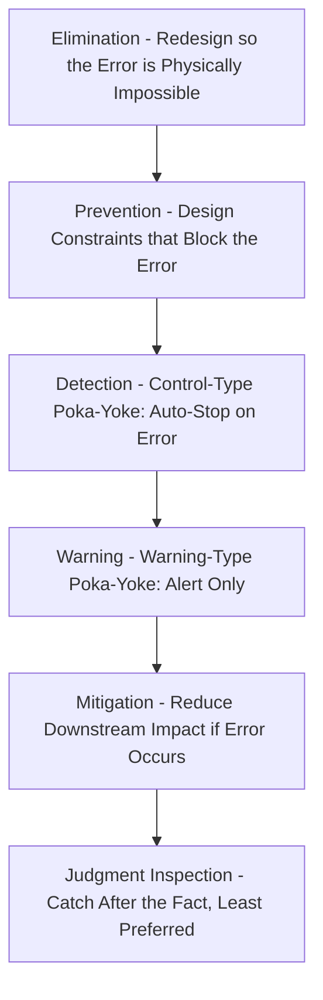
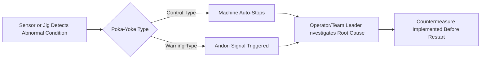

## Poka-yoke and Mistake-proofing

### Overview

Poka-yoke (ポカヨケ, roughly "mistake-proofing" or "inadvertent error prevention") is a lean manufacturing technique that uses mechanisms, designs, or procedures to prevent human errors from occurring, or to make errors immediately detectable before they result in a defect reaching the customer. The concept was formalized by Shigeo Shingo at Toyota in the 1960s, who deliberately renamed an earlier term, *baka-yoke* ("fool-proofing"), to *poka-yoke* out of respect for workers, since the original term implied blame on the operator rather than the process. Poka-yoke is a core enabling mechanism of **jidoka** (automation with a human touch), one of the two pillars of the Toyota Production System alongside Just-in-Time.

The underlying principle is that human error is inevitable, but defects are not — a well-designed process makes it physically difficult or impossible to make an error, or catches the error immediately so it cannot propagate downstream.

### Shingo's Classification of Inspection

Shingo distinguished three types of inspection relevant to mistake-proofing, ranked by effectiveness at preventing defects from reaching the customer:

1. **Judgment inspection**: Sorting good parts from bad after production — detects defects but does not prevent them, and does so after resources have already been wasted.
2. **Informative inspection**: Statistical process control (SPC) and similar feedback methods that identify trends toward defects, allowing corrective action before defects occur in volume.
3. **Source inspection (poka-yoke)**: Checking conditions at the point where an error could occur, before it turns into a defect — the most effective level, since it addresses root causes rather than downstream symptoms.

### Poka-yoke Function Types

Poka-yoke devices are classified by *what* they do when an abnormal condition is detected:

**Key Points**

- **Control (shutdown) type**: Automatically stops the process or machine when an abnormality is detected, preventing the defect from being produced at all. This is the strongest form and directly implements the jidoka principle of stopping at the first sign of a problem.
- **Warning type**: Alerts the operator (light, sound, andon signal) when an abnormality occurs, but does not stop the process automatically — relies on human response to the alert.

Control-type poka-yoke is generally preferred where feasible, since it does not depend on an operator noticing and reacting to a warning signal in time.

### Poka-yoke Detection Methods

Poka-yoke devices are also classified by *how* they detect an abnormal condition:

1. **Contact method**: Detects whether a physical object's shape, dimension, or other physical attribute is correct through direct physical contact (e.g., a limit switch, a shaped jig that only accepts correctly oriented parts).
2. **Fixed-value (constant number) method**: Detects whether a specified number of movements or repetitions has occurred (e.g., a counter that confirms exactly 5 screws were installed before allowing the next step).
3. **Motion-step (sequence) method**: Detects whether the prescribed steps or motions of a process were followed in the correct order (e.g., a sensor confirming a part was inserted before a fastener could be applied).

### Poka-yoke Examples by Method

**Example (Contact Method)**

A connector housing is molded with an asymmetric key/notch shape so that a wiring harness plug can only be inserted in the single correct orientation — physically preventing reversed-polarity connections.

**Example (Fixed-Value Method)**

An assembly station uses a parts tray with exactly the number of recessed slots matching the number of screws required for one unit. If any slot still contains a screw after the operator signals task completion, a sensor detects the remaining screw and halts the line — a missed fastener is caught before the unit moves downstream.

**Example (Motion-Step Method)**

A control panel requires that a safety guard be closed (detected by a proximity sensor) before the start button's circuit is completed; the machine physically cannot cycle unless the guard-closure step occurred first, regardless of button presses.

### Poka-yoke in Everyday and Digital Systems

**Key Points**

- USB-C and similar reversible connectors eliminate the "wrong orientation" error via symmetric or foolproof design (design elimination — see below).
- Automated teller machines (ATMs) that require card retrieval before dispensing cash prevent customers from forgetting their card (sequence-based poka-yoke).
- Software forms with required-field validation preventing form submission until mandatory fields are completed (a digital fixed-value/sequence check).
- Washing machine lids that lock during a spin cycle, preventing the drum from being opened while the mechanism is in a hazardous state (control-type, safety-oriented poka-yoke).

### Design-Level Mistake-Proofing Hierarchy

Beyond individual device types, mistake-proofing strategy generally follows a preference hierarchy from most to least robust:

**Key Points**

- **Elimination** is the strongest strategy: redesigning a part or process so the error-prone condition cannot exist at all (e.g., using a single universal fastener size instead of two similar-looking sizes that could be confused).
- **Prevention** constrains the process so an error, while theoretically possible, is made physically very difficult (asymmetric jigs, keyed connectors).
- **Detection (control-type poka-yoke)** stops the process immediately when an error occurs, preventing propagation.
- **Warning-type poka-yoke** and **mitigation** strategies are progressively weaker fallbacks used when elimination or prevention is not technically or economically feasible.
- **Judgment inspection** (100% or sampling inspection after production) is the least preferred approach and is treated in TPS as a symptom of insufficient upstream mistake-proofing, not a solution in itself.

### Relationship to Jidoka and Andon

Poka-yoke is the mechanical/procedural implementation of jidoka's principle: build quality into the process by making abnormalities immediately visible and stopping production before defects propagate.

This tight feedback loop — detect, stop or alert, root-cause, countermeasure, restart — is what allows a JIT system to operate with minimal buffer inventory: since defects are caught immediately at the source, they cannot silently accumulate in downstream WIP.

### Implementing a Poka-yoke: General Process

1. **Identify the failure mode**: Use tools such as Failure Mode and Effects Analysis (FMEA), defect Pareto analysis, or direct gemba observation to pinpoint recurring or high-impact errors.
2. **Perform root cause analysis**: Apply the 5 Whys or a fishbone diagram to understand why the error occurs (operator variability, ambiguous instructions, similar-looking parts, etc.).
3. **Select the appropriate mistake-proofing level**: Attempt elimination first; fall back to prevention, then detection/control, then warning only if higher levels are infeasible.
4. **Design and prototype the device or procedure**: Often low-cost — many effective poka-yoke solutions use simple mechanical jigs, sensors, or checklists rather than expensive automation.
5. **Test under real production conditions**: Verify the device correctly distinguishes good from bad conditions without excessive false positives (which would disrupt flow unnecessarily) or false negatives (which would fail to catch the actual error).
6. **Standardize and document**: Incorporate the poka-yoke into standardized work instructions and maintenance schedules so its function is preserved over time.

### Failure Mode and Effects Analysis (FMEA) Link

Poka-yoke devices are frequently prioritized using outputs from FMEA, which ranks potential failure modes by a **Risk Priority Number (RPN)**:

$$RPN = S \times O \times D$$

Where:

- $S$ = Severity of the failure's effect (1–10 scale)
- $O$ = Occurrence — likelihood the failure occurs (1–10 scale)
- $D$ = Detection — likelihood the failure is detected before reaching the customer (1–10 scale, where 10 = least likely to be detected)

**Example**

A missing-gasket defect is rated $S = 8$ (causes leak in field), $O = 4$ (occurs occasionally), $D = 7$ (hard to detect visually).

$$RPN = 8 \times 4 \times 7 = 224$$

A poka-yoke that makes the missing gasket physically impossible to proceed past (e.g., a sensor blocking the next station) would primarily reduce $D$ toward 1–2 (near-certain detection) and, if implemented as true prevention/elimination, could also reduce $O$ toward near-zero, sharply lowering the RPN and the priority for further corrective action.

### Cost-Effectiveness Considerations

**Key Points**

- Effective poka-yoke devices are frequently low-cost — simple mechanical constraints, jigs, or sensors — reflecting Shingo's original emphasis on ingenuity over expensive automation.
- The cost of implementing poka-yoke should be weighed against the cost of the defect it prevents, including scrap, rework, warranty claims, and reputational/safety risk; for safety-critical or high-severity failure modes, higher-cost control-type solutions are typically justified even where a cheaper warning-type alternative exists. [Inference: this is a widely accepted decision heuristic in quality engineering rather than a fixed universal cost formula, since severity thresholds for "safety-critical" vary by industry and regulatory context.]

### Common Pitfalls

- **Relying on warning-type devices where control-type is feasible**, leaving error prevention dependent on operator attentiveness under fatigue or distraction.
- **Over-engineering solutions**: introducing costly automated inspection systems when a simple jig or fixture redesign would eliminate the error entirely.
- **Treating poka-yoke as a one-time fix**: failing to revisit and validate devices as processes, parts, or suppliers change over time, allowing the mistake-proofing to become misaligned with the actual failure mode.
- **Designing poka-yoke around symptoms rather than root causes**: catching a defect after it occurs rather than preventing the underlying condition that causes it.
- **Ignoring operator input**: since operators encounter the failure mode directly, excluding them from poka-yoke design often produces solutions that are technically sound but impractical on the floor.

### Conclusion

Poka-yoke operationalizes the jidoka principle of building quality into the process rather than inspecting it in afterward. By classifying devices along both function (control versus warning) and detection method (contact, fixed-value, motion-step), and by following a preference hierarchy that favors elimination and prevention over mere detection or after-the-fact inspection, organizations can systematically close off the physical possibility of recurring errors rather than merely catching them. Because mistake-proofing devices are frequently simple and low-cost, poka-yoke represents one of the highest-leverage quality tools within lean operations — directly enabling the minimal-buffer, zero-defect assumptions that JIT and kanban systems depend on.

**Related Topics**

- Jidoka and autonomation (automation with a human touch)
- Andon systems and visual quality signaling
- Failure Mode and Effects Analysis (FMEA)
- Statistical process control (SPC) and informative inspection
- Root cause analysis (5 Whys, fishbone diagrams)
- Standardized work and error-proofed work instructions
- Total Productive Maintenance (TPM) and sensor/device upkeep
- Design for Manufacturability (DFM) and design elimination strategies
- Six Sigma DMAIC and quality tool integration
- Kaizen events targeting recurring defect root causes