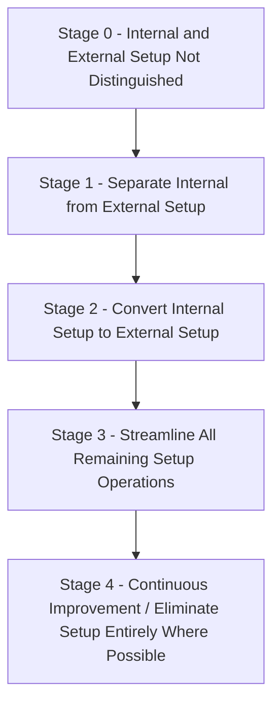
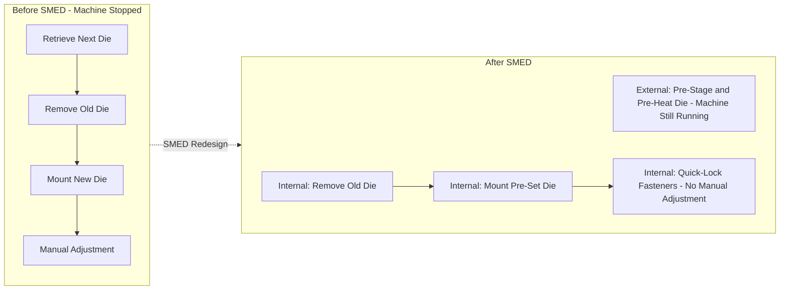

## Single-minute Exchange of Die

### Overview

Single-Minute Exchange of Die (SMED) is a lean methodology for dramatically reducing equipment changeover/setup time, developed by Shigeo Shingo at Toyota and various Japanese manufacturers between 1950 and 1969. The name reflects the aspirational target of reducing changeover time to a "single digit" number of minutes (under 10 minutes), though the methodology's actual purpose is far broader: it is the enabling technology that makes small-lot, high-mix Just-in-Time production economically viable. Without short setup times, small-batch production would incur prohibitive per-unit setup cost, forcing a return to large-batch (and therefore high-inventory, low-flexibility) production.

### Why SMED Matters for JIT

**Key Points**

- Traditional batch-and-queue manufacturing uses the Economic Order Quantity (EOQ) logic to justify large lot sizes, because setup cost is treated as fixed and amortized over more units.
- SMED attacks the setup cost itself, rather than accepting it as fixed, which allows the EOQ-optimal lot size to shrink without increasing total cost.
- Shorter changeovers enable more frequent, smaller-lot production runs, which is a prerequisite for kanban-driven pull systems and heijunka (production leveling) across mixed product lines.
- Reduced changeover time also directly increases available machine capacity (uptime), since less time is spent in non-value-adding transition between jobs.

### The Core Distinction: Internal vs. External Setup

The foundational insight of SMED is the separation of setup activities into two categories:

1. **Internal setup (IED — Internal Exchange of Die)**: Operations that can only be performed while the machine is stopped (e.g., removing and mounting a die, since the machine cannot run with the die partially attached).
2. **External setup (OED — External Exchange of Die)**: Operations that can be performed while the machine is still running the previous job (e.g., retrieving the next die from storage, pre-heating a mold, gathering tools).

**Key Points**

- Historically, many organizations perform external-setup-eligible tasks *while the machine is stopped* simply out of habit or poor planning — the single largest and cheapest SMED gain typically comes from correctly reclassifying and relocating these tasks to run in parallel with production.
- Shingo observed that in unoptimized processes, a substantial share of "setup time" is actually external work being performed internally without technical necessity. [Inference: the specific proportion of reclassifiable time varies significantly by process and equipment type and is not governed by a single universal ratio; treat this as a common empirical pattern rather than a fixed rule.]

### The Four Conceptual Stages of SMED

Shingo's methodology proceeds through four conceptual stages, each yielding a step-change reduction in setup time:

**Stage 0 — Undifferentiated Setup**

No distinction is made between internal and external activities; all preparation, adjustment, and changeover work happens with the machine stopped, including tasks that could have been done in advance.

**Stage 1 — Separate Internal and External Setup**

The team documents every step of the current changeover process (often via direct video recording and time observation) and classifies each step as internal or external. This alone frequently yields significant setup time reduction (commonly cited historical results are in the 30–50% range) simply by moving already-external-eligible tasks outside the machine-stopped window. [Unverified: exact percentage improvements are process-specific and vary across documented case studies; treat cited ranges as illustrative rather than guaranteed outcomes.]

**Stage 2 — Convert Internal Setup to External Setup**

Activities that currently must be internal are re-examined and, where possible, redesigned so they can be performed externally instead. Common techniques include:

- Pre-heating or pre-adjusting dies/molds to operating condition before installation.
- Using standardized, pre-set fixtures or intermediary jigs so mounting is a simple attach-and-go rather than an in-place adjustment.
- Preparing all tools, fasteners, and materials on a dedicated changeover cart staged next to the machine in advance.

**Stage 3 — Streamline All Remaining Operations**

Both internal and external operations are further reduced through targeted improvement techniques:

- Eliminating adjustment through standardized settings (e.g., pre-calibrated stops rather than trial-and-error adjustment).
- Replacing threaded fasteners (which require multiple rotations) with quick-release clamps, cam-locks, or one-turn fasteners.
- Enabling **parallel operations**, where two or more people perform different changeover tasks simultaneously rather than sequentially.
- Using functional standardization (only standardizing the dimensions/interfaces that actually affect changeover, rather than the entire part) to reduce unnecessary uniformity requirements.

**Stage 4 — Continuous Improvement**

Ongoing kaizen activity continues to refine the changeover procedure, potentially approaching true "one-touch" or even "zero" changeover for certain equipment/product combinations, where a changeover requires no perceptible setup time at all.

### Key SMED Techniques in Detail

**Example (Parallel Operations)**

A stamping press changeover traditionally required one technician working alone for 24 minutes: removing the old die (8 min), retrieving and mounting the new die (10 min), and calibrating alignment (6 min). By assigning a second technician to simultaneously stage the new die and prepare calibration jigs externally while the first completes die removal internally, and by using pre-set alignment blocks instead of manual calibration, total internal time is reduced to 9 minutes.

**Example (Elimination of Adjustment via Standardization)**

A CNC machining center previously required manual fixture height adjustment (using shims and a dial indicator, taking 12 minutes) for each new job. Introducing a standardized fixture base plate with fixed locating pins at a single common reference height eliminates the adjustment step entirely — the new fixture is simply bolted into a fixed position, since all future fixtures are built to the same reference standard.

**Example (Quick-Release Fasteners)**

A die previously secured with eight full-thread bolts requiring multiple full rotations each is redesigned to use pear-shaped washers and cam-lock clamps, so a single 90-degree turn secures each fastening point, replacing roughly 4 minutes of bolt-turning with under 30 seconds.

### SMED Implementation Process

1. **Select the target changeover**: Prioritize based on frequency of changeover, current duration, and impact on overall equipment effectiveness (OEE) or capacity constraints.
2. **Document the current process**: Video record an actual changeover from start to finish; time each discrete step precisely.
3. **Classify each step**: Internal versus external, using the Stage 1 framework.
4. **Relocate external-eligible tasks**: Move any task not strictly requiring the machine to be stopped to occur before or after the stoppage.
5. **Convert remaining internal tasks where possible**: Apply Stage 2 techniques (pre-adjustment, standardized fixtures).
6. **Streamline remaining steps**: Apply Stage 3 techniques (quick fasteners, parallel operations, elimination of adjustment).
7. **Standardize the new procedure**: Document the new changeover sequence as standardized work; train all relevant operators.
8. **Measure and iterate**: Track changeover time on an ongoing basis; treat further reduction as a continuous kaizen target rather than a one-time project.

### Setup Time Reduction Waterfall

| Stage | Example Cumulative Time | Technique Applied |
| --- | --- | --- |
| Baseline (Stage 0) | 60 min | No internal/external distinction |
| After Stage 1 | 40 min | Separate and relocate external tasks |
| After Stage 2 | 22 min | Convert internal tasks to external (pre-staging, pre-heating) |
| After Stage 3 | 8 min | Quick fasteners, parallel work, eliminate adjustment |
| After Stage 4 (ongoing) | 5 min | Continued kaizen refinement |

### Impact on Lot Size Economics

SMED's effect can be shown directly through the Economic Order Quantity (EOQ) formula:

$$EOQ = \sqrt{\frac{2DS}{H}}$$

Where $D$ = annual demand, $S$ = setup/ordering cost per changeover, $H$ = annual holding cost per unit.

**Example**

- $D = 20{,}000$ units/year
- $H = \$5$/unit/year
- Setup cost before SMED, $S_1 = \$300$ (reflecting 60 minutes of downtime plus labor)

$$EOQ_1 = \sqrt{\frac{2 \times 20{,}000 \times 300}{5}} = \sqrt{2{,}400{,}000} \approx 1{,}549 \text{ units}$$

After SMED reduces changeover to 5 minutes, setup cost falls to $S_2 = \$25$:

$$EOQ_2 = \sqrt{\frac{2 \times 20{,}000 \times 25}{5}} = \sqrt{200{,}000} \approx 447 \text{ units}$$

This roughly 3.5x reduction in optimal lot size directly reduces average inventory levels and shortens replenishment lead time, enabling smaller kanban containers and tighter pull-loop cycle times.

### SMED Setup Time Reduction Diagram

### Organizational Prerequisites and Enablers

- **Standardized work documentation**: A defined, repeatable changeover sequence is required before meaningful streamlining can be measured and sustained.
- **Cross-training**: Operators capable of performing parallel changeover tasks (rather than a single specialist) enable Stage 3 parallelization.
- **5S workplace organization**: Point-of-use storage and shadow-boarded tool organization are prerequisites for eliminating wasted motion during external and internal setup steps.
- **Management support for capital-light investment**: Many SMED improvements (jigs, quick-release fasteners, standardized fixtures) require modest tooling investment rather than large capital expenditure, but still require sponsorship and shop-floor time allocation.

### Common Pitfalls

- **Attempting Stage 2/3 techniques before completing Stage 1**: Skipping the internal/external separation step means effort is spent optimizing tasks that could have simply been moved outside the stopped-machine window at near-zero cost.
- **Treating SMED as a one-time project**: Like kaizen broadly, changeover time is prone to regression without ongoing measurement and standardized work enforcement.
- **Ignoring operator input during redesign**: Operators performing changeovers daily often identify friction points that engineering-led redesigns miss.
- **Over-investing in automation before exhausting low-cost improvements**: Expensive automated die-change systems are sometimes pursued before simpler quick-fastener or standardization opportunities have been implemented.
- **Failing to retrain all shifts/operators on the new procedure**, resulting in inconsistent changeover times across shifts even after a successful redesign.

### Conclusion

SMED provides the mechanical and procedural means by which lean operations escape the traditional large-batch economics implied by fixed setup costs. By rigorously separating internal from external setup, converting internal tasks to external wherever feasible, and streamlining what remains through standardization and parallelization, SMED can reduce changeover times by an order of magnitude or more without requiring major capital investment. This reduction is what makes small-lot, mixed-model, pull-based production — the operational core of JIT and kanban — economically sustainable rather than merely theoretically appealing.

**Related Topics**

- Just-in-Time production principles and EOQ trade-offs
- Kanban pull systems and lot-size sensitivity
- Heijunka (production leveling) and mixed-model scheduling
- 5S workplace organization as a SMED prerequisite
- Standardized work and changeover documentation
- Overall Equipment Effectiveness (OEE) and availability loss
- Kaizen events applied to changeover reduction
- Total Productive Maintenance (TPM) and equipment reliability
- Design for Manufacturability (DFM) in fixture/tooling standardization
- Quick-changeover tooling design (cam-locks, modular fixtures)