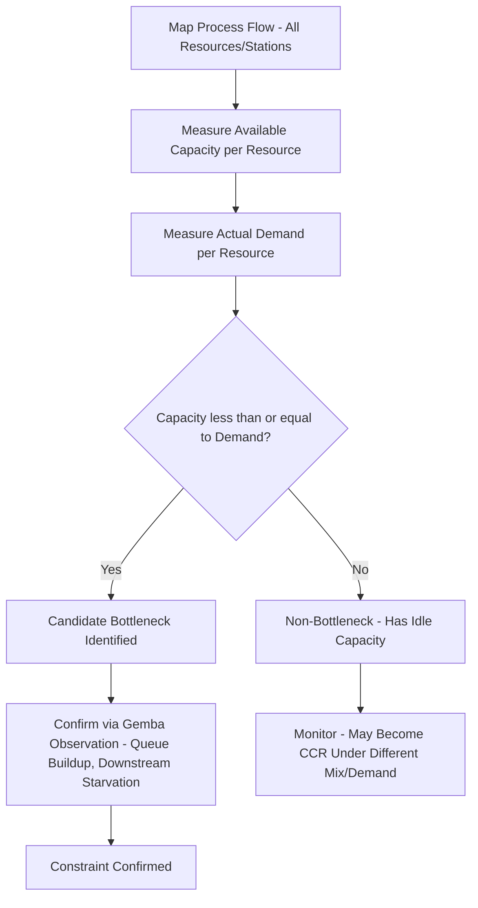

## Identifying System Bottlenecks

### Overview

A bottleneck (also called a constraint) is any resource in a production or service system whose capacity is less than or equal to the demand placed upon it, such that it limits the throughput of the entire system. The identification of bottlenecks is the foundational first step of the Theory of Constraints (TOC), developed by Eliyahu M. Goldratt and popularized in his 1984 book *The Goal*. Goldratt's central insight is that any system, however complex, is limited in achieving its goal by a very small number of constraints — often just one — and that improvements anywhere other than at the constraint produce little or no improvement in overall system throughput.

### Core Definitions

**Key Points**

- **Bottleneck (constraint) resource**: A resource whose available capacity is less than or equal to the demand placed on it by the market or the process.
- **Non-bottleneck resource**: A resource whose capacity exceeds the demand placed on it; it has idle time by definition, even if it appears "busy."
- **Capacity-constrained resource (CCR)**: A resource that is not strictly a bottleneck but whose utilization is close enough to capacity that if not managed carefully (e.g., through poor scheduling), it can become a de facto bottleneck.
- **Throughput**: The rate at which the system generates money through sales (in Goldratt's original financial framing, throughput = revenue minus totally variable cost).
- **Capacity**: The maximum output rate a resource can sustain within a given period.

### The Fundamental Principle: An Hour Lost at the Bottleneck

Goldratt's most quoted principle regarding bottleneck identification and management:

**Key Points**

- **An hour lost at a bottleneck is an hour lost for the entire system** — because the bottleneck paces the system's total throughput, any downtime, slowdown, or inefficiency at the bottleneck directly reduces total system output with no way to recover it elsewhere.
- **An hour saved at a non-bottleneck is a mirage** — improving efficiency, speed, or utilization at a non-constraint resource does not increase system throughput, because that resource was never limiting output in the first place; the improvement simply increases idle time or excess WIP at that resource.

This principle is the reason bottleneck *identification* must precede any improvement effort — without knowing which resource actually constrains the system, improvement resources are frequently misallocated to resources that have no effect on overall output.

### Why Bottlenecks Are Often Misidentified

**Key Points**

- **Local efficiency metrics mislead**: Traditional cost accounting and departmental efficiency metrics reward keeping every resource busy, which encourages non-bottleneck resources to overproduce, creating the illusion that multiple areas are "constrained" when only one actually limits system throughput.
- **Visual busyness is not capacity data**: A resource that appears constantly active may simply be poorly scheduled or performing unnecessary rework, not actually resource-constrained relative to demand.
- **Bottlenecks can shift over time**: Changes in product mix, demand volume, equipment condition, or staffing can move the constraint from one resource to another; a bottleneck identified six months ago may no longer be the current constraint.
- **Bottlenecks are not always internal/physical**: Constraints can be a **market constraint** (insufficient demand), a **policy constraint** (an internal rule or procedure that limits throughput, such as an unnecessarily restrictive batch-size policy), or a **resource constraint** (equipment, labor, or material capacity).

### Systematic Methods for Identifying Bottlenecks

**1. Capacity-vs-Demand Analysis**

Compare the maximum available capacity of each resource against the demand placed upon it over the same period. The resource with the smallest capacity margin (or a negative margin, meaning demand exceeds capacity) is the constraint.

$$\text{Capacity Utilization}_i = \frac{\text{Demand}_i}{\text{Available Capacity}_i} \times 100$$

**Example**

| Resource | Available Capacity (units/day) | Demand (units/day) | Utilization |
| --- | --- | --- | --- |
| Cutting | 500 | 420 | 84% |
| Welding | 450 | 440 | 97.8% |
| Painting | 480 | 420 | 87.5% |
| Assembly | 400 | 420 | **105%** |
| Packaging | 550 | 420 | 76.4% |

Assembly has demand exceeding capacity (105% utilization) — it is the system bottleneck. Even though Welding is highly utilized (97.8%), it has just enough capacity to keep pace; Assembly is the resource actually limiting throughput to a maximum of 400 units/day regardless of how fast upstream processes run.

**2. Direct Observation (Gemba-Based Identification)**

- **Queue/WIP accumulation**: The bottleneck resource typically has a visibly growing queue of work-in-process waiting in front of it, since upstream processes feed it faster than it can process.
- **Starvation downstream**: Resources immediately downstream of the bottleneck frequently sit idle waiting for output, since the bottleneck cannot supply them fast enough.
- **Overtime and expediting patterns**: Resources consistently requiring overtime, weekend work, or expedited attention are strong bottleneck candidates.

**3. Time-Based (Throughput) Analysis**

Track actual output rate versus theoretical capacity at each resource over a representative period; the resource achieving the lowest sustainable throughput relative to demand, especially the one determining the pace of finished-goods completion, is the constraint.

**4. Simulation and Value Stream Mapping**

Value stream mapping (VSM) documents cycle time at each process step alongside takt time; the step(s) with cycle time closest to or exceeding takt time are bottleneck candidates. Discrete-event simulation can model variability and interdependency effects that static capacity calculations miss (e.g., how upstream variability compounds queue buildup at a downstream near-capacity resource).

### Bottleneck Identification Flow

### Types of Constraints Beyond Physical Resources

| Constraint Type | Description | Example |
| --- | --- | --- |
| Physical/resource constraint | Equipment, labor, or material capacity limit | A single heat-treat furnace with fixed daily throughput |
| Market constraint | Insufficient customer demand relative to available capacity | A factory capable of producing 10,000 units/month but only receiving 6,000 units/month in orders |
| Policy constraint | An internal rule, procedure, or metric that artificially limits throughput | A minimum batch-size policy that forces unnecessary queuing before a changeover-sensitive process |
| Logistical constraint | Scheduling, sequencing, or information-flow limitations | A centralized approval step that delays order release regardless of production capacity |

**Example (Policy Constraint)**

A plant enforces a rule requiring a minimum lot size of 500 units per production run "to justify the changeover." This policy — not any physical machine — is the true constraint, since it forces excess WIP and delays responsiveness even though the equipment itself has capacity to run smaller, more frequent batches. Removing or revising the policy (rather than adding equipment) resolves the bottleneck.

### Bottleneck Identification Checklist

**Key Points**

- Identify where WIP inventory visibly accumulates on the shop floor or in a process queue.
- Identify which resource(s) are most frequently the subject of expediting, overtime, or "fire-fighting" management attention.
- Compare capacity and demand data resource-by-resource rather than relying on subjective busyness impressions.
- Confirm findings through direct gemba observation, not spreadsheet analysis alone — data can be stale or mismeasured.
- Check whether the apparent bottleneck is actually a policy or market constraint rather than a physical resource limitation, since the appropriate response differs substantially.
- Re-verify the constraint periodically, since successfully "elevating" a constraint (Step 4 of TOC's Five Focusing Steps) causes the bottleneck to move elsewhere in the system.

### Relationship to the Theory of Constraints Five Focusing Steps

Identification corresponds specifically to Step 1 of Goldratt's broader Five Focusing Steps framework:

1. **Identify** the system's constraint. *(covered in this topic)*
2. Decide how to **exploit** the constraint (maximize its output without capital investment).
3. **Subordinate** everything else to the above decision (align non-constraint resources to support the constraint's pace).
4. **Elevate** the constraint (invest in additional capacity if needed).
5. Repeat the process, since the constraint will move once the current one is resolved — avoiding "inertia" from becoming the next constraint.

Accurate identification is the prerequisite for all subsequent steps; misidentifying the constraint causes exploitation and subordination efforts to be directed at the wrong resource, yielding no system-level throughput improvement.

### Common Pitfalls in Bottleneck Identification

- **Relying solely on utilization percentages from ERP/MRP reports** without validating against actual physical queue and starvation observation, since reported "capacity" figures often do not reflect real-world variability, downtime, or changeover loss.
- **Assuming the busiest-looking department is the constraint**, when busyness may reflect poor scheduling or unnecessary batching rather than a genuine capacity shortfall.
- **Ignoring policy and market constraints**, focusing improvement efforts exclusively on physical equipment when the true limiting factor is an internal rule or insufficient demand.
- **Treating bottleneck identification as a one-time exercise**: failing to re-identify the constraint after process changes, demand shifts, or successful elevation of the previous bottleneck, leading to continued investment in a resource that is no longer the true constraint.
- **Confusing a temporary capacity dip (e.g., a single equipment breakdown) with a structural, persistent bottleneck**, leading to overreaction based on short-term data.

### Conclusion

Identifying the system bottleneck is the indispensable first step of the Theory of Constraints, because every subsequent improvement action — exploitation, subordination, and elevation — depends on directing effort at the resource (or policy, or market condition) that actually limits total system throughput. Rigorous capacity-versus-demand analysis, confirmed through direct gemba observation of queue buildup and downstream starvation, provides a more reliable identification method than relying on utilization reports or subjective impressions of busyness alone. Because constraints shift over time — particularly after being successfully elevated — bottleneck identification must be treated as an ongoing diagnostic discipline rather than a single exercise.

**Related Topics**

- The Five Focusing Steps of the Theory of Constraints
- Exploiting and subordinating to the constraint
- Drum-Buffer-Rope scheduling methodology
- Throughput accounting versus traditional cost accounting
- Capacity-constrained resources (CCRs) and buffer management
- Value stream mapping and takt time analysis
- Policy constraints and organizational rule redesign
- Little's Law and WIP-to-throughput relationships
- Critical chain project management (TOC applied to projects)
- Goldratt's *The Goal* and the Five Focusing Steps in practice