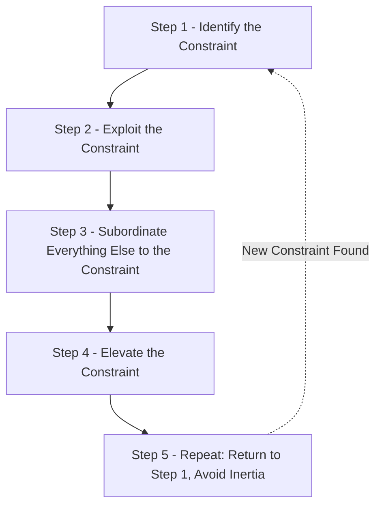
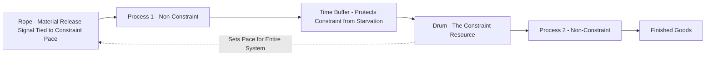

## The Five Focusing Steps

### Overview

The Five Focusing Steps are the core process methodology of the Theory of Constraints (TOC), developed by Eliyahu M. Goldratt and introduced in *The Goal* (1984). They provide a structured, ongoing improvement cycle for maximizing system throughput by systematically finding, managing, and then re-finding the constraint that limits overall performance. The framework rests on Goldratt's central premise that any system has, at any given time, at most a very small number of constraints — often exactly one — and that improvement efforts directed anywhere else yield little or no system-level benefit.

### The Five Steps

### Step 1: Identify the Constraint

Determine which resource, policy, or market condition currently limits the system's throughput toward its goal. This requires comparing capacity against demand at each resource, confirmed through direct observation of queue buildup and downstream starvation, since a constraint may be a physical resource, an internal policy, or insufficient market demand rather than a piece of equipment.

**Key Points**

- Misidentifying the constraint causes every subsequent step to be misdirected, since exploitation and subordination decisions only produce system-level benefit when applied to the true limiting factor.
- Constraints are classified as physical/resource, market, or policy in nature; the appropriate response differs substantially depending on which type is present.

### Step 2: Exploit the Constraint

Once identified, extract the maximum possible throughput from the constraint using existing capacity — without yet investing in additional capacity. This step asks: "How do we get the most out of what we already have?"

**Key Points**

- **Eliminate idle time at the constraint**: Ensure the constrained resource is never starved for input material or waiting due to poor scheduling; buffer stock is often deliberately placed immediately in front of the constraint to guarantee it is never idle.
- **Eliminate quality losses at the constraint**: Since any unit of output lost at the constraint is lost for the whole system, quality inspection is often moved to occur *before* the constraint (to avoid wasting constraint time on parts that will be scrapped anyway) and immediately *after* the constraint (to avoid further processing of parts already damaged at the constraint).
- **Optimize scheduling at the constraint**: Sequence jobs at the constraint to minimize setup/changeover time and maximize productive processing time, since SMED-style setup reduction directly increases effective constraint capacity.
- **Prevent the constraint from performing unnecessary work**: Any task that does not need to be done by the constrained resource specifically should be offloaded to a non-constraint resource, even if that appears locally "inefficient" elsewhere.

**Example**

A heat-treat furnace identified as the constraint has historically been idle for roughly 90 minutes per shift waiting for parts from an upstream process. Exploitation actions include: establishing a small pre-furnace buffer of parts so the furnace is never left waiting, moving pre-furnace quality inspection ahead of the furnace so defective parts never consume furnace capacity, and re-sequencing furnace loads to batch similar heat-treat profiles together, reducing changeover time between batches.

### Step 3: Subordinate Everything Else to the Constraint

All non-constraint resources and policies are aligned to support the constraint's pace, even if doing so reduces their own local efficiency or utilization. This is often the most organizationally difficult step, because it directly contradicts traditional efficiency metrics that reward keeping every resource maximally busy.

**Key Points**

- Non-constraint resources should produce only at the rate needed to support the constraint — producing faster than the constraint can consume simply builds excess WIP inventory ahead of the constraint without increasing system throughput.
- **Drum-Buffer-Rope (DBR)** scheduling is the primary mechanism for operationalizing subordination:
  - **Drum**: The constraint's schedule sets the overall production rhythm/pace for the entire system.
  - **Buffer**: A time or inventory buffer is placed before the constraint to protect it from upstream variability, ensuring it is never starved.
  - **Rope**: A signal (analogous to a kanban pull signal) is sent upstream to release new material into the system only at the rate the constraint can consume it, preventing upstream overproduction.
- Local efficiency metrics at non-constraint resources should be de-emphasized or redefined, since maximizing them independently works against overall system throughput.

### Drum-Buffer-Rope Diagram

### Step 4: Elevate the Constraint

If, after fully exploiting and subordinating around the constraint, it still limits system throughput below the level needed to meet demand or strategic goals, additional capacity investment is warranted. This is the step most commonly (and prematurely) reached for by organizations that skip Steps 2 and 3.

**Key Points**

- Elevation involves capital investment: purchasing additional equipment, adding shifts, hiring additional staff, outsourcing constraint-related work, or redesigning the process/product to reduce load on the constraint.
- Elevation should only be pursued after exploitation and subordination have been exhausted, since many organizations discover the constraint's true throughput capacity is substantially higher than assumed once idle time, quality losses, and scheduling inefficiencies are addressed — often eliminating or delaying the need for capital investment entirely.
- Elevation decisions should be evaluated using throughput accounting (impact on system-wide throughput, inventory, and operating expense) rather than traditional cost-accounting metrics that may favor decisions optimizing local efficiency instead.

**Example**

After exploiting and subordinating around the heat-treat furnace constraint, effective furnace throughput increases by 35% purely from eliminating idle time and changeover waste — closing most of the gap to demand without capital investment. The remaining shortfall justifies purchasing a second furnace (elevation), a decision now based on verified need rather than an initial assumption of capacity shortage.

### Step 5: Repeat the Process (Avoid Inertia)

Once a constraint is elevated (or otherwise resolved), the system's limiting factor will shift to a different resource, policy, or market condition. The cycle returns to Step 1 to identify the new constraint.

**Key Points**

- Goldratt explicitly warned against **inertia**: policies, buffer sizes, and subordination rules put in place to manage the *previous* constraint often persist even after that constraint has been resolved, and can themselves become the *new* constraint if not revisited.
- Continuous re-application of the Five Focusing Steps forms an ongoing improvement cycle analogous in spirit to the PDCA/kaizen cycle, but specifically focused on system throughput rather than general process improvement.
- Failure to repeat Step 1 after elevation is one of the most commonly cited reasons TOC implementations stagnate after an initial round of improvement. [Inference: this is a widely discussed practitioner observation in TOC literature rather than a formally measured failure-rate statistic.]

### Five Focusing Steps Applied: Worked Example Summary

| Step | Action Taken | Outcome |
| --- | --- | --- |
| 1. Identify | Capacity-vs-demand analysis shows Assembly at 105% utilization | Assembly confirmed as constraint |
| 2. Exploit | Pre-assembly buffer added; quality inspection moved before Assembly; changeover sequencing improved | Effective Assembly capacity rises from 400 to 460 units/day |
| 3. Subordinate | Upstream processes throttled via DBR rope signal to Assembly's pace; local efficiency metrics at upstream stations de-emphasized | WIP inventory ahead of Assembly reduced; no more overproduction upstream |
| 4. Elevate | Remaining gap (480 units/day demand vs. 460 units/day capacity) addressed by adding a second shift at Assembly | Capacity raised to 520 units/day, meeting demand |
| 5. Repeat | Re-run capacity-vs-demand analysis system-wide | New constraint identified at Packaging (previously non-binding) |

### Relationship to Other Lean and Quality Frameworks

| Framework | Relationship to Five Focusing Steps |
| --- | --- |
| Just-in-Time / Kanban | DBR's "rope" mechanism functions analogously to a kanban pull signal, tying release rate to consumption capacity |
| SMED | Setup time reduction is a primary exploitation-step lever for increasing effective constraint capacity |
| Kaizen / PDCA | Both are iterative improvement cycles; TOC's cycle is specifically anchored to the system constraint rather than general process improvement |
| Throughput Accounting | Provides the financial decision framework (throughput, inventory, operating expense) used to evaluate exploitation and elevation decisions |

### Common Pitfalls

- **Jumping directly to elevation (Step 4)** without first exhausting exploitation (Step 2) and subordination (Step 3), leading to unnecessary capital expenditure when idle time or scheduling inefficiency was the real issue.
- **Optimizing non-constraint resources for local efficiency** during the subordination step, which increases WIP and cost without improving system throughput.
- **Failing to repeat the cycle after elevation**, leaving outdated buffer sizes, subordination rules, or policies in place that were designed for a constraint that no longer exists.
- **Treating the Five Focusing Steps as a one-time project** rather than an ongoing operating discipline requiring periodic re-identification of the constraint.
- **Using traditional cost-accounting metrics** (e.g., machine utilization, labor efficiency) to evaluate exploitation/elevation decisions instead of throughput-accounting metrics, which can lead to locally "efficient" but system-suboptimal choices.

### Conclusion

The Five Focusing Steps provide the operational discipline that turns bottleneck identification into sustained throughput improvement: exploit the constraint fully before investing further, subordinate the rest of the system to protect and support the constraint's pace, elevate capacity only once existing capacity is genuinely exhausted, and then repeat the entire cycle, since resolving one constraint reliably surfaces another. The framework's persistent challenge is organizational rather than technical — subordination in particular requires abandoning traditional local-efficiency incentives in favor of system-wide throughput as the primary success metric.

**Related Topics**

- Identifying system bottlenecks
- Drum-Buffer-Rope scheduling in depth
- Throughput accounting versus traditional cost accounting
- Buffer management and buffer sizing methods
- Capacity-constrained resources (CCRs)
- Critical chain project management (TOC applied to projects)
- Policy constraints and organizational rule redesign
- Kanban pull systems (comparison to the "rope" mechanism)
- SMED as an exploitation-step lever
- Goldratt's *The Goal* and TOC case studies