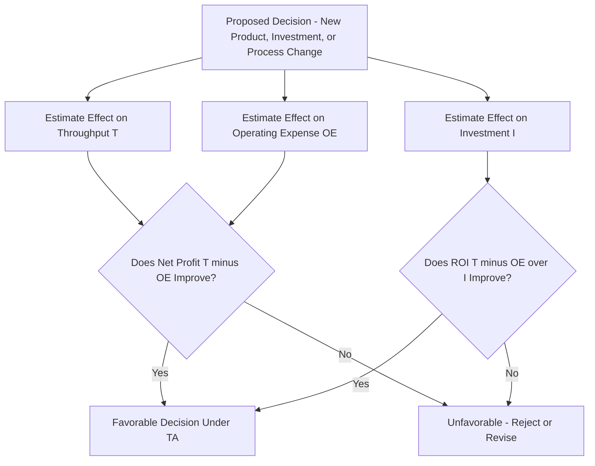

## Throughput Accounting

### Overview

Throughput Accounting (TA) is a managerial accounting framework developed by Eliyahu M. Goldratt as an alternative to traditional cost accounting, designed specifically to support decision-making under the Theory of Constraints (TOC). Rather than allocating overhead costs to individual products and evaluating decisions by their effect on unit cost or local efficiency, throughput accounting evaluates decisions by their effect on three system-wide financial measures: throughput, investment, and operating expense. Goldratt argued that traditional cost accounting, particularly cost allocation practices, systematically produces decisions that appear locally rational but harm overall organizational profitability — especially in constrained systems.

### The Three Core Measures

**Throughput (T)**

The rate at which the system generates money through sales — defined specifically as revenue minus totally variable cost (TVC), where TVC typically includes only costs that vary directly and immediately with each unit sold (primarily raw materials and, in some formulations, sales commissions).

$$T = \text{Sales Revenue} - \text{Totally Variable Cost (TVC)}$$

**Key Points**

- Throughput is generated only when a sale actually occurs — producing inventory that is not sold generates zero throughput, regardless of how much labor or overhead was consumed making it.
- Direct labor is typically treated as part of operating expense (a largely fixed cost within the relevant time horizon), not as a totally variable cost, since labor capacity generally cannot be adjusted instantaneously per unit produced. [Inference: the precise treatment of labor as fixed versus variable can differ by organization and time horizon; the fixed-cost treatment reflects Goldratt's standard TA convention rather than a universally applied accounting rule in all contexts.]

**Investment/Inventory (I)**

All the money the system has tied up in things it intends to sell, including raw materials, work-in-process, and finished goods inventory, as well as capital equipment and facilities. In TA, inventory is valued strictly at totally variable (raw material) cost — not at a cost that includes allocated labor or overhead, which avoids the traditional accounting practice of "manufacturing profit" being recorded simply by producing unsold inventory.

**Operating Expense (OE)**

All the money the system spends turning inventory into throughput — essentially all costs other than totally variable cost, including labor, rent, utilities, depreciation, and administrative overhead. In TA, OE is generally treated as a single aggregate figure rather than being allocated down to individual products or departments.

### The TA Profitability Formulas

$$\text{Net Profit} = T - OE$$

$$\text{Return on Investment (ROI)} = \frac{T - OE}{I}$$

**Example**

A company sells 10,000 units at $50 each, with totally variable cost of $20 per unit. Operating expense for the period is $220,000, and total investment (inventory plus equipment) is $500,000.

$$T = (10{,}000 \times 50) - (10{,}000 \times 20) = 500{,}000 - 200{,}000 = \$300{,}000$$

$$\text{Net Profit} = 300{,}000 - 220{,}000 = \$80{,}000$$

$$ROI = \frac{300{,}000 - 220{,}000}{500{,}000} = \frac{80{,}000}{500{,}000} = 16\%$$

### Throughput Accounting vs. Traditional Cost Accounting

| Dimension | Throughput Accounting | Traditional Cost Accounting |
| --- | --- | --- |
| Cost allocation | Overhead treated as a single aggregate OE; not allocated per product | Overhead allocated to individual products/units via absorption costing |
| Inventory valuation | Valued at totally variable (raw material) cost only | Valued at full absorbed cost, including allocated labor/overhead |
| Decision focus | System-wide throughput impact, especially at the constraint | Per-unit cost and product-level profitability margins |
| Effect of producing unsold inventory | Contributes zero throughput; recognized as tying up investment | Can appear to increase "profit" on paper via absorbed overhead capitalized into inventory |
| Product mix decisions | Prioritize throughput per unit of constraint time | Prioritize highest per-unit margin, potentially ignoring constraint impact |

### Product Mix Decisions: Throughput per Constraint Unit

One of throughput accounting's most distinctive and practically important applications is guiding product mix decisions when a system operates under a known constraint. Rather than prioritizing products by traditional gross margin per unit, TA prioritizes products by **throughput per unit of constraint time consumed**.

$$\text{Throughput per Constraint Minute} = \frac{T_{\text{product}}}{\text{Constraint Time Required per Unit}}$$

**Example**

A company produces two products on a single constrained machine (the bottleneck):

| Product | Selling Price | Totally Variable Cost | Throughput per Unit | Constraint Minutes per Unit | Throughput per Constraint Minute |
| --- | --- | --- | --- | --- | --- |
| A | $100 | $40 | $60 | 10 min | $6.00/min |
| B | $80 | $20 | $60 | 5 min | $12.00/min |

Both products generate identical throughput per unit ($60), which under traditional per-unit-margin thinking might suggest indifference between them. However, Product B generates twice the throughput per minute of constraint time ($12.00 vs. $6.00). Given limited constraint capacity, prioritizing Product B maximizes total system throughput — a conclusion invisible to traditional per-unit margin analysis, which does not account for differential constraint consumption.

**Key Points**

- This ranking method applies specifically when a genuine capacity constraint exists; without a binding constraint, throughput per unit itself (not per constraint minute) may be the more directly relevant comparison, since there is no scarce resource to allocate.
- Product mix decisions should be re-evaluated whenever the identified constraint changes (consistent with Step 5 of the Five Focusing Steps), since throughput-per-constraint-minute rankings are constraint-specific and shift if the bottleneck moves to a different resource.

### Why Traditional Cost Accounting Can Mislead Constraint-Based Decisions

**Key Points**

- **Allocated overhead distorts apparent product profitability**: A product consuming a large share of allocated fixed overhead (via arbitrary allocation bases like direct labor hours) may appear less profitable under absorption costing even if it generates strong throughput and consumes little constraint time.
- **Encourages local efficiency over system throughput**: Traditional variance analysis (e.g., labor efficiency variances) can incentivize non-constraint resources to run at full utilization producing excess WIP, since idle non-constraint time is treated as a negative "unfavorable variance" even though it has no effect on system throughput.
- **Can favor discontinuing a genuinely profitable product**: A product may appear to lose money once allocated fixed overhead is subtracted, even though it contributes positive throughput and its discontinuation would not actually reduce the underlying fixed costs, resulting in a net profitability decline if dropped.

**Example**

A traditional cost report allocates $15 of fixed overhead per unit to Product C based on labor hours, making it appear to generate a $5 loss per unit ($60 price, $50 variable+allocated cost). Under throughput accounting, Product C's actual throughput contribution is $25 per unit ($60 price minus $35 totally variable cost) — a positive contribution to covering fixed operating expense. Discontinuing Product C based on the traditional report would eliminate $25 of throughput per unit sold while likely leaving most of the allocated fixed overhead unchanged, reducing overall net profit.

### Throughput Accounting Decision Framework

### Applying TA to Capital Investment Decisions

**Key Points**

- Capital investment (e.g., purchasing new equipment) is evaluated by its net effect on the T, I, OE triad rather than by traditional metrics like per-unit depreciation-adjusted cost.
- Investment that increases capacity at a genuine system constraint is evaluated for its throughput impact (Step 4, "Elevate," of the Five Focusing Steps); investment increasing capacity at a non-constraint resource typically will not increase system throughput at all, regardless of how favorably it appears under traditional payback or unit-cost analysis.
- This reframing often reveals that proposed investments targeting non-constraint resources — however attractive their standalone ROI appears in isolation — provide little or no actual system-level financial benefit.

### Common Pitfalls in Applying Throughput Accounting

- **Continuing to use per-unit allocated cost data for pricing or product-mix decisions** alongside TA reporting, creating internal inconsistency between decision-making frameworks.
- **Misclassifying direct labor or other largely fixed costs as totally variable cost**, distorting throughput calculations and undermining the framework's core distinction between T and OE.
- **Applying throughput-per-constraint-minute ranking without first correctly identifying the actual system constraint**, which produces a mix recommendation optimized for the wrong resource.
- **Ignoring investment (I) effects when evaluating decisions that improve throughput but significantly increase inventory or capital tied up**, missing potential ROI degradation even where absolute net profit appears to rise.
- **Treating throughput accounting as a full replacement for financial/statutory accounting**: TA is a managerial decision-support framework; external financial reporting still generally requires GAAP/IFRS-compliant cost accounting methods. [Unverified: specific regulatory treatment and the extent of TA's acceptance for external reporting purposes vary by jurisdiction and are not addressed by TOC theory itself.]

### Conclusion

Throughput accounting reframes managerial decision-making around three system-wide measures — throughput, investment, and operating expense — rather than allocated per-unit costs, directly supporting the Theory of Constraints' emphasis on system-level throughput over local efficiency. Its most distinctive practical contribution is the throughput-per-constraint-minute ranking method for product mix decisions, which can produce conclusions directly opposite to those suggested by traditional per-unit margin analysis whenever a genuine capacity constraint exists. Because TA's core distinctions (treating most costs as fixed OE, valuing inventory at raw material cost only) diverge meaningfully from standard absorption costing, organizations adopting TA for internal decision-making typically maintain it as a supplementary managerial framework alongside — not a replacement for — conventional financial accounting.

**Related Topics**

- The Five Focusing Steps of the Theory of Constraints
- Identifying system bottlenecks
- Drum-Buffer-Rope scheduling
- Product mix optimization under capacity constraints
- Activity-based costing (as a contrasting overhead allocation approach)
- Variable versus absorption costing
- Capital budgeting and investment decision frameworks
- Capacity-constrained resources (CCRs)
- Critical chain project management
- Return on investment (ROI) analysis in operations decisions