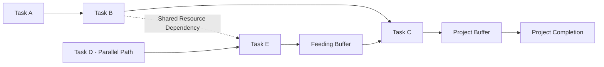

## Critical Chain Project Management

### Overview

Critical Chain Project Management (CCPM) is a project scheduling and execution methodology developed by Eliyahu M. Goldratt, introduced in his 1997 book *Critical Chain*, applying Theory of Constraints (TOC) principles to project environments. CCPM addresses systemic problems in traditional project management — chronic schedule overruns, resource contention, and the erosion of individual task safety time — by restructuring how task duration estimates, resource dependencies, and schedule buffers are handled. Rather than protecting every individual task with its own safety margin (as in traditional Critical Path Method scheduling), CCPM aggregates safety time into strategically placed project-level and feeding buffers.

### Problems with Traditional Project Scheduling

**Key Points**

- **Student syndrome**: Individuals tend to delay starting a task until close to its deadline, consuming built-in safety time through procrastination rather than early completion, regardless of how generous the original estimate was.
- **Parkinson's Law in task duration**: Work expands to fill the time available; even when a task could be completed early, it is rarely reported as finished ahead of schedule.
- **Multitasking penalty**: When individuals or resources are assigned to multiple concurrent tasks/projects, context-switching between them extends the effective completion time of every task involved, often substantially more than the switching itself would suggest.
- **Lack of early-finish reporting incentive**: Task owners who finish early are often reluctant to report it, fearing that future estimates will simply be cut, or that idle time will invite additional unplanned work.
- **Path merging risk ignored**: In traditional CPM, tasks along the critical path receive scheduling attention, but tasks along near-critical parallel paths that "merge" into the critical path are often insufficiently protected, and delays there can still cause overall project delay even though they were not classified as "critical."

### Core Structural Changes in CCPM

**1. Removing Padding from Individual Task Estimates**

Traditional task estimates often embed significant hidden safety margin (commonly cited informal estimates suggest task durations may include 50% or more contingency buffer beyond the median expected duration). [Unverified: the specific proportion of embedded safety time varies substantially by estimator, task type, and organizational culture; treat this as an illustrative pattern discussed in CCPM literature rather than a fixed universal ratio.] CCPM asks estimators to provide durations closer to a 50% confidence level (a duration by which the task has roughly even odds of being completed) rather than a highly conservative near-certain estimate.

**2. Aggregating Removed Safety into Buffers**

The safety time removed from individual tasks is not discarded — it is aggregated and relocated to strategic points in the schedule, where it can be shared and applied flexibly rather than being wastefully consumed task-by-task through student syndrome and multitasking penalties.

**3. Identifying the Critical Chain (Not Just the Critical Path)**

The **critical chain** is the longest sequence of dependent tasks through the project, accounting for both **task dependencies** (as in traditional CPM) and **resource dependencies** (the same resource being required by multiple tasks, potentially in different branches of the network). A resource constraint can extend the effective critical sequence beyond what pure task-dependency analysis (traditional critical path) would identify.

### Types of Buffers in CCPM

**Project Buffer (PB)**

Placed at the very end of the critical chain, immediately before the project completion milestone. It protects the overall project due date from variability accumulated along the critical chain, absorbing delays in critical-chain tasks without automatically pushing back the committed completion date.

**Feeding Buffer (FB)**

Placed wherever a non-critical-chain path merges into the critical chain. It protects the critical chain from being delayed by variability in the feeding (non-critical) path, ensuring that delays in parallel work do not propagate into and disrupt the critical chain's schedule.

**Resource Buffer**

A warning/alert mechanism (not a time buffer in the schedule itself) that notifies a resource in advance that their critical-chain task is approaching, ensuring the resource is available and not tied up on unrelated work when needed.

### Common Buffer Sizing Method: Cut-and-Paste (C&PM)

A widely used buffer sizing approach removes roughly half of the safety time from each task along a chain and aggregates it into the buffer at the end of that chain.

$$\text{Buffer Size} = \frac{1}{2} \sum (\text{Original Padded Estimate}_i - \text{Aggressive 50\% Estimate}_i)$$

**Example**

A critical chain consists of three tasks with the following estimate comparison:

| Task | Traditional (Safe) Estimate | Aggressive (50% Confidence) Estimate | Removed Safety |
| --- | --- | --- | --- |
| A | 10 days | 6 days | 4 days |
| B | 8 days | 5 days | 3 days |
| C | 12 days | 7 days | 5 days |

Total removed safety = 4 + 3 + 5 = 12 days. Applying the cut-and-paste method (aggregating roughly half of the removed safety into the project buffer):

$$\text{Project Buffer} = \frac{1}{2} \times 12 = 6 \text{ days}$$

The scheduled critical chain duration becomes 6 + 5 + 7 = 18 days of task work plus a 6-day project buffer, for a committed completion of 24 days — compared to the traditional padded estimate of 10 + 8 + 12 = 30 days. The buffer is shared and consumed only as actual variability occurs, rather than being distributed (and likely wasted) across each individual task.

### Buffer Consumption Monitoring (Fever Chart)

CCPM projects are tracked using a **buffer consumption chart** (often called a "fever chart"), plotting percentage of critical chain completed against percentage of project buffer consumed, divided into color zones analogous to DBR's buffer zones:

| Zone | Buffer Consumption Relative to Chain Progress | Action |
| --- | --- | --- |
| Green | Buffer consumption proportionally less than chain progress | No action needed |
| Yellow | Buffer consumption roughly proportional to chain progress | Monitor; plan contingency response |
| Red | Buffer consumption disproportionately exceeds chain progress | Immediate management intervention required |

**Example**

At 60% of critical chain task work completed, only 20% of the project buffer has been consumed — the project is in the green zone, indicating tasks are running close to or better than their aggressive estimates. If, instead, 60% of chain progress has already consumed 75% of the project buffer, the project is in the red zone, signaling that remaining tasks are highly likely to threaten the committed due date without corrective action.

### CCPM Execution Practices

**Key Points**

- **Roadrunner mentality**: Task owners are encouraged to start work as soon as prerequisite inputs are available and to complete tasks as quickly as possible, immediately handing off to the next task rather than waiting until a "deadline" — directly countering student syndrome.
- **No task-level due dates on the critical chain**: Because individual task estimates are aggressive (50% confidence) and safety is pooled in buffers, individual tasks are not penalized or negatively evaluated simply for running longer than their estimate, since some variability is expected and absorbed by the buffer.
- **Relay-race handoffs**: Resources are expected to be ready to begin their task immediately when the preceding task completes, minimizing the delay of resource reassignment or task-switching.
- **Minimizing multitasking**: Resources are protected from being simultaneously assigned to multiple projects or tasks where possible, since CCPM identifies multitasking as a major, often underestimated, source of project delay.

### CCPM vs. Traditional Critical Path Method (CPM)

| Dimension | Critical Chain Project Management | Traditional CPM |
| --- | --- | --- |
| Task duration estimates | Aggressive (50% confidence), safety removed from individual tasks | Padded/conservative estimates embedding individual safety margin |
| Safety time placement | Aggregated into project and feeding buffers | Distributed within each task's own estimate |
| Constraint definition | Longest chain considering both task AND resource dependencies | Longest chain considering task dependencies only |
| Progress tracking | Buffer consumption (fever chart) relative to chain progress | Percent complete against individual task due dates |
| Multitasking treatment | Actively discouraged/minimized as a primary delay driver | Not explicitly addressed |
| Due date protection mechanism | Shared, pooled project buffer | Individual task float/slack along the critical path |

### Relationship to the Five Focusing Steps

CCPM is often described as an application of the TOC Five Focusing Steps to the project management domain:

1. **Identify**: The critical chain (accounting for resource contention) is the project's constraint.
2. **Exploit**: Protect the critical chain with buffers; eliminate student syndrome and multitasking penalties that would otherwise waste chain capacity.
3. **Subordinate**: Non-critical-chain (feeding) tasks are scheduled and resourced to support the critical chain's pace, using feeding buffers to prevent them from delaying it.
4. **Elevate**: If the critical chain remains too long relative to business needs, additional resources or scope/schedule changes are applied specifically to critical-chain tasks.
5. **Repeat**: As the project progresses or scope changes, the critical chain may shift; ongoing buffer monitoring identifies whether the current critical chain remains the actual constraint.

### Common Pitfalls in CCPM Implementation

- **Reintroducing hidden safety time despite CCPM's aggressive-estimate framework**: Estimators, distrustful of losing their padding, may inflate "50% confidence" estimates back toward traditional safe estimates, undermining the buffer-sizing logic.
- **Penalizing task owners for exceeding individual aggressive estimates**: This reintroduces the incentive for padding and defeats the purpose of pooling safety into buffers.
- **Failing to address multitasking at an organizational level**: If resources remain assigned across multiple concurrent projects without prioritization discipline, CCPM's core execution benefit (minimizing multitasking penalty) is not realized.
- **Miscalculating the critical chain by ignoring resource contention**: Treating the schedule as pure task-dependency CPM defeats CCPM's key structural distinction and may misidentify which tasks actually determine project duration.
- **Inconsistent buffer monitoring**: Failing to actively track and respond to fever chart zone status removes the early-warning mechanism that CCPM relies on for proactive intervention.

### Conclusion

Critical Chain Project Management applies Theory of Constraints logic to project scheduling by identifying the true constraining sequence of tasks — accounting for both dependency and resource contention — removing individually embedded safety margins that are typically wasted through student syndrome and multitasking, and relocating that safety into strategically placed, actively monitored buffers. This restructuring directly targets the systemic behavioral causes of chronic project overruns rather than simply asking estimators to "try harder" to hit padded individual deadlines, while its buffer consumption monitoring (fever chart) provides an early-warning system analogous to DBR's buffer zone management in production environments.

**Related Topics**

- The Five Focusing Steps of the Theory of Constraints
- Drum-Buffer-Rope scheduling (production analog of CCPM buffers)
- Identifying system bottlenecks
- Throughput accounting in project-based decision-making
- Resource leveling and multi-project resource contention
- Traditional Critical Path Method (CPM) and PERT estimation
- Buffer management and fever chart monitoring
- Project risk management and schedule variance analysis
- Agile and hybrid project management approaches (comparison to CCPM)
- Behavioral drivers of schedule overrun (student syndrome, Parkinson's Law)