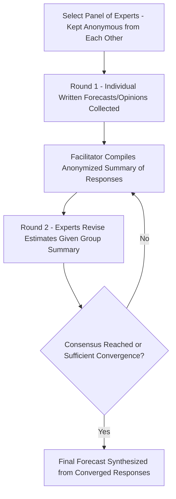

## Qualitative Forecasting Techniques

### Overview

Qualitative forecasting techniques generate demand or business predictions based on expert judgment, experience, intuition, and subjective assessment rather than on statistical analysis of historical numerical data. These methods are particularly valuable when historical data is unavailable, unreliable, or insufficient to capture anticipated changes — such as forecasting demand for a genuinely new product, predicting the market impact of a novel technology, or projecting outcomes in rapidly evolving or unprecedented conditions where past patterns provide limited guidance. Qualitative methods are typically contrasted with quantitative techniques (time series analysis, causal/regression models), and are often used in combination with quantitative methods rather than as a strict substitute.

### When Qualitative Methods Are Most Appropriate

**Key Points**

- **New product introductions**: No historical sales data exists for the specific item being forecasted.
- **Long-range strategic forecasting**: Time horizons long enough that historical patterns may not reasonably extrapolate (e.g., 5–10 year technology or market shift projections).
- **Environments undergoing structural change**: Regulatory shifts, disruptive competitive entry, or major economic disruption where historical data reflects a fundamentally different context.
- **Situations requiring integration of non-quantifiable factors**: Political risk, emerging consumer sentiment, or qualitative market intelligence that resists direct numerical modeling.
- **Early-stage forecasting before sufficient data accumulates**: Used as an interim approach until enough historical data exists to support quantitative time-series methods.

### Major Qualitative Forecasting Techniques

**1. Executive/Jury of Executive Opinion**

A small group of senior managers or executives, often representing different functional perspectives (sales, marketing, finance, operations), pools its collective judgment and experience to arrive at a forecast, typically through structured discussion and consensus-building.

**Key Points**

- Advantages: fast to conduct, integrates diverse senior perspectives, useful for high-level strategic forecasts.
- Disadvantages: susceptible to groupthink, dominant-personality bias (a highly persuasive or senior individual can disproportionately sway the outcome), and lacks the discipline of a structured methodology.

**2. Sales Force Composite**

Individual salespeople or regional sales managers, who have direct, ground-level contact with customers, submit their own estimates of expected sales in their respective territories or accounts; these are aggregated into a composite organizational forecast.

**Key Points**

- Advantages: leverages frontline market knowledge closest to actual customer behavior; can capture localized trends that aggregate statistical models might miss.
- Disadvantages: salespeople may systematically underestimate (to ensure achievable quotas) or overestimate (to appear optimistic or secure sufficient inventory/resource allocation) depending on incentive structures.

**Example**

A regional sales manager for industrial equipment estimates 340 units of demand for the upcoming quarter based on direct conversations with key accounts about upcoming capital expenditure plans — information not reflected in any historical sales database, since these are new expansion projects.

**3. Customer/Market Surveys**

Structured surveys or interviews gather direct input from current or prospective customers about their purchase intentions, preferences, or anticipated needs.

**Key Points**

- Advantages: captures direct voice-of-customer data; particularly useful for testing demand for new product concepts before launch.
- Disadvantages: stated purchase intent frequently diverges from actual future purchase behavior; sampling bias and survey design flaws can distort results; can be costly and time-consuming for large-scale rollouts.

**4. Delphi Method**

A structured, iterative process in which a panel of experts (often geographically dispersed and kept anonymous from one another) independently provides forecasts or opinions through multiple rounds of questionnaires. After each round, a facilitator compiles and shares an anonymized summary of the group's responses; experts then revise their own estimates in light of the group feedback, typically converging toward consensus over several rounds.

**Key Points**

- Anonymity reduces the dominant-personality and groupthink effects present in jury-of-executive-opinion approaches, since no participant knows whose opinion they are reacting to.
- Iterative rounds allow experts to reconsider their position based on the reasoning and data presented by others, without direct social pressure.
- Particularly well-suited to long-range technology forecasting and strategic scenarios involving high uncertainty and few directly comparable historical precedents.
- Disadvantages: time-consuming (multiple rounds can take weeks or months), dependent on the panel's genuine expertise and diversity, and outcomes remain fundamentally subjective judgment even after structured aggregation.

**Delphi Method Process**

**Example**

A panel of 15 industry experts is asked to independently estimate when a specific emerging battery technology will achieve cost parity with current lithium-ion batteries. Round 1 estimates range widely from 3 to 12 years. After the facilitator shares the anonymized distribution and key supporting rationale from outlier respondents, Round 2 estimates converge more tightly around 5–7 years, as experts incorporate reasoning they had not previously considered.

**5. Market Research and Test Marketing**

Distinct from general customer surveys, this involves observing actual (not merely stated) customer behavior in a controlled or limited-scale setting — such as launching a product in a single test market region before full national rollout — to gather empirical, behavior-based signal ahead of a full-scale forecast.

**Key Points**

- Provides stronger predictive signal than stated-intent surveys, since it captures revealed rather than stated preference.
- More costly and time-consuming than surveys or panel-based methods, and results from a limited test market may not generalize perfectly to broader rollout conditions.

**6. Historical Analogy**

Forecasts for a new product or market are constructed by drawing parallels to the adoption pattern or lifecycle of a comparable prior product or market, adjusting for known differences in context.

**Example**

A company launching a new streaming video service estimates its early subscriber growth curve by analogy to the adoption pattern of an earlier, structurally similar streaming service's launch, adjusted for differences in market saturation and competitive intensity at the time of the new launch.

**Key Points**

- Useful when direct historical data for the specific product/market does not exist, but a reasonably comparable analog does.
- Relies heavily on the analyst's judgment regarding which historical analog is genuinely comparable and how to adjust for contextual differences — a significant source of potential forecasting error if the analogy is poorly chosen.

### Comparison of Qualitative Techniques

| Technique | Speed | Cost | Bias Risk | Best Suited For |
| --- | --- | --- | --- | --- |
| Executive/Jury Opinion | Fast | Low | High (groupthink, dominant personality) | Quick strategic-level forecasts |
| Sales Force Composite | Moderate | Low-moderate | Moderate (incentive-driven distortion) | Near-term, territory-level demand |
| Customer/Market Surveys | Moderate-slow | Moderate-high | Moderate (stated vs. actual behavior gap) | New product concept testing |
| Delphi Method | Slow | Moderate-high | Low (anonymity mitigates social bias) | Long-range, high-uncertainty forecasts |
| Test Marketing | Slow | High | Low (behavior-based data) | Pre-launch demand validation |
| Historical Analogy | Fast-moderate | Low | Moderate-high (analog selection bias) | New products with comparable precedents |

### Integrating Qualitative and Quantitative Forecasting

**Key Points**

- Qualitative judgment is frequently used to adjust a baseline quantitative (statistical) forecast for factors the model cannot capture — a known upcoming competitor product launch, a planned marketing campaign, or an anticipated regulatory change.
- As sufficient historical data accumulates over a product's lifecycle, organizations typically transition from primarily qualitative methods (at launch) toward primarily quantitative time-series or causal methods (once a stable demand history exists), often blending both approaches during the transition period.
- Forecast accuracy in qualitative methods is inherently harder to measure objectively than in quantitative methods, since there is no single "correct" model output to benchmark against — evaluation often relies on retrospective comparison of forecasted versus actual outcomes over time.

### Common Pitfalls in Qualitative Forecasting

- **Overreliance on a single dominant voice** in jury-of-executive-opinion settings, effectively reducing a "collective" forecast to one individual's judgment.
- **Incentive-driven distortion in sales force composites**, particularly when forecasts are linked to compensation, quota-setting, or inventory allocation decisions.
- **Confusing stated purchase intent with actual future behavior** in survey-based forecasting, leading to systematic overestimation of demand for novel products.
- **Choosing a poorly matched historical analogy**, where superficial similarity to a prior product/market masks meaningful structural differences that undermine the forecast's validity.
- **Treating Delphi consensus as objective truth**: convergence among expert opinions reflects agreement, not necessarily accuracy — a panel can converge confidently on an incorrect estimate if the underlying assumptions are systematically flawed.
- **Neglecting to eventually incorporate emerging quantitative data**: continuing to rely purely on qualitative judgment even after sufficient historical sales data exists to support more rigorous quantitative modeling.

### Conclusion

Qualitative forecasting techniques provide essential predictive capability precisely where quantitative, data-driven methods are structurally unavailable or insufficient — new products, long-range strategic horizons, and environments undergoing fundamental change. Each technique trades off speed, cost, and susceptibility to particular forms of judgment bias differently: executive opinion and historical analogy are fast but bias-prone, while the Delphi method's structured anonymity and iteration reduce social bias at the cost of time and effort. In practice, most forecasting systems blend qualitative judgment with quantitative modeling, using expert input to adjust statistical baselines for factors the data alone cannot anticipate, and gradually shifting emphasis toward quantitative methods as sufficient historical data accumulates.

**Related Topics**

- Quantitative forecasting techniques (time series and causal models)
- Forecast error measurement and accuracy metrics (MAD, MAPE, bias)
- New product forecasting and product lifecycle demand curves
- Sales and operations planning (S&OP) integration
- Collaborative Planning, Forecasting, and Replenishment (CPFR)
- Scenario planning and long-range strategic forecasting
- Bias in expert judgment and cognitive heuristics in forecasting
- Combining qualitative overlays with statistical forecast baselines
- Market research methodology and test marketing design
- Technology adoption curves and diffusion of innovation theory