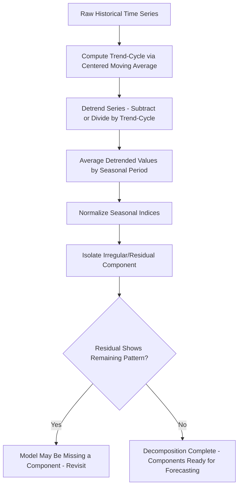

## Time Series Decomposition

### Overview

Time series decomposition is a quantitative forecasting and analytical technique that separates a historical demand (or other) time series into distinct underlying components, allowing each pattern to be analyzed, modeled, and forecasted individually before being recombined into a full forecast. By isolating trend, seasonality, cyclical variation, and irregular/random fluctuation, decomposition reveals structure in the data that would be obscured if the raw series were modeled as a single undifferentiated signal. Decomposition underlies many practical demand forecasting methods, including seasonal-adjustment approaches used in operations and supply chain planning.

### The Four Classical Components

**Trend (T)**

The long-term underlying direction of the series — a gradual increase, decrease, or stability over an extended time horizon, independent of shorter-term fluctuations.

**Seasonality (S)**

Regular, predictable fluctuations that repeat at fixed, known intervals — typically tied to the calendar (weekly, monthly, quarterly, or annual patterns), such as increased retail demand during a holiday season or increased HVAC equipment demand in summer months.

**Cyclical component (C)**

Fluctuations that occur over a longer and less rigidly fixed period than seasonality, typically tied to broader economic or business cycles (multi-year expansions and contractions) rather than the calendar. Cyclical patterns lack the fixed, predictable periodicity of seasonality.

**Irregular/Random component (I)**

Unpredictable, non-systematic variation remaining after trend, seasonal, and cyclical components have been accounted for — sometimes called "noise" or the residual. This includes one-off shocks (natural disasters, sudden policy changes) and genuinely random variation.

### Additive vs. Multiplicative Decomposition Models

**Additive Model**

Used when the magnitude of seasonal fluctuations remains roughly constant in absolute terms regardless of the trend level.

$$Y_t = T_t + S_t + C_t + I_t$$

**Multiplicative Model**

Used when the magnitude of seasonal fluctuations grows or shrinks proportionally with the trend level (common in many real-world demand series, where seasonal swings become larger in absolute terms as overall demand grows).

$$Y_t = T_t \times S_t \times C_t \times I_t$$

**Key Points**

- Selection between additive and multiplicative models is typically guided by visual inspection of the time series plot: if seasonal amplitude stays roughly constant over time, additive is appropriate; if seasonal amplitude scales with the trend level, multiplicative is appropriate.
- Many practical forecasting software packages default to multiplicative decomposition for retail and demand-planning contexts, since seasonal swings in absolute units often do scale with overall business growth, though this is not a universal rule and should be verified against the actual data pattern. [Inference: software defaults and typical practitioner preference vary by industry and specific forecasting tool; treat this as a common but not universally fixed convention.]

### Decomposition Model Comparison Diagram (svg_diagram)

<svg xmlns="http://www.w3.org/2000/svg" viewBox="0 0 560 320">
<text x="280" y="24" text-anchor="middle" font-size="16" font-family="sans-serif" font-weight="bold">Additive vs Multiplicative Seasonality (svg_diagram)</text>
<text x="140" y="50" text-anchor="middle" font-size="12" font-family="sans-serif" font-weight="bold">Additive - Constant Amplitude</text>
<line x1="40" y1="140" x2="260" y2="140" stroke="#999" stroke-width="1" />
<polyline points="40,120 60,150 80,100 100,130 120,80 140,110 160,60 180,90 200,40 220,70 240,20 260,50" fill="none" stroke="#2266cc" stroke-width="2" />
<line x1="40" y1="85" x2="260" y2="35" stroke="#cc4444" stroke-width="1" stroke-dasharray="4,3" />
<text x="140" y="170" text-anchor="middle" font-size="10" font-family="sans-serif" fill="#555">Seasonal swing stays the same size as trend rises</text>
<text x="420" y="50" text-anchor="middle" font-size="12" font-family="sans-serif" font-weight="bold">Multiplicative - Growing Amplitude</text>
<line x1="320" y1="140" x2="540" y2="140" stroke="#999" stroke-width="1" />
<polyline points="320,125 340,135 360,110 380,125 400,90 420,115 440,65 460,105 480,40 500,95 520,15 540,80" fill="none" stroke="#2266cc" stroke-width="2" />
<line x1="320" y1="90" x2="540" y2="40" stroke="#cc4444" stroke-width="1" stroke-dasharray="4,3" />
<text x="420" y="170" text-anchor="middle" font-size="10" font-family="sans-serif" fill="#555">Seasonal swing grows larger as trend rises</text>
<text x="280" y="290" text-anchor="middle" font-size="10" font-family="sans-serif" fill="#333">Red dashed line = trend component; blue line = actual observed series</text>
</svg>

### Classical Decomposition Process (Moving Average Method)

1. **Compute the trend-cycle component** using a centered moving average with a window matching the seasonal period (e.g., a 12-month centered moving average for monthly data with annual seasonality). This smooths out both seasonal and irregular fluctuations, leaving an estimate of the combined trend-cycle.
2. **Detrend the series**: For an additive model, subtract the trend-cycle estimate from the original series ($Y_t - T_t$); for a multiplicative model, divide the original series by the trend-cycle estimate ($Y_t / T_t$). The result contains seasonal and irregular components combined.
3. **Estimate the seasonal component**: Average the detrended values for each seasonal period across all years/cycles in the data (e.g., average all "January" detrended values together) to produce a stable seasonal index for each period, smoothing out irregular noise.
4. **Normalize seasonal indices**: For additive models, adjust seasonal indices so they sum to zero across a full cycle; for multiplicative models, adjust so they average to 1.0 (or sum to the number of periods) across a full cycle — ensuring the seasonal component does not itself introduce artificial trend into the series.
5. **Isolate the irregular component**: Remove the trend-cycle and seasonal components from the original series, leaving the residual irregular/random component for analysis (e.g., checking for remaining structure that indicates an incomplete model, or assessing the magnitude of unexplained noise).

### Worked Example: Multiplicative Decomposition

**Example**

Consider quarterly demand data (in units) for a seasonal product over two years:

| Quarter | Year 1 | Year 2 |
| --- | --- | --- |
| Q1 | 200 | 240 |
| Q2 | 300 | 350 |
| Q3 | 500 | 580 |
| Q4 | 350 | 410 |

**Step 1 — Trend-cycle (illustrative centered moving average)**: Suppose the centered moving average yields approximate trend-cycle values that gradually rise from roughly 320 in early Year 1 to roughly 400 by late Year 2 (values omitted here for calculation brevity; in practice this requires a full centered moving-average calculation across all periods, with initial/final periods lost to the centering window).

**Step 2 — Detrend (multiplicative)**: Divide each quarter's actual value by its corresponding trend-cycle estimate to get a seasonal-irregular ratio, e.g., a Q3 value of 500 against a trend-cycle estimate of 340 yields a ratio of approximately 1.47.

**Step 3 — Average seasonal ratios by quarter across years**: Suppose averaging the Q1 ratios across both years yields approximately 0.70, Q2 yields approximately 0.95, Q3 yields approximately 1.45, and Q4 yields approximately 0.98.

**Step 4 — Normalize**: Since these four seasonal indices should average to 1.0 across a full cycle:

$$\text{Average} = \frac{0.70 + 0.95 + 1.45 + 0.98}{4} = \frac{4.08}{4} = 1.02$$

Each index is divided by 1.02 to normalize: Q1 ≈ 0.686, Q2 ≈ 0.931, Q3 ≈ 1.422, Q4 ≈ 0.961 (now averaging to 1.0).

**Forecasting Using Decomposed Components**

To forecast Year 3, Q3 demand: extend the trend-cycle estimate forward (e.g., to approximately 420 by projecting the observed trend growth rate), then apply the normalized Q3 seasonal index:

$$\text{Forecast}_{Y3,Q3} = T_{Y3,Q3} \times S_{Q3} = 420 \times 1.422 \approx 597 \text{ units}$$

[Inference: the specific trend-cycle extrapolation method (linear extension, regression, or another projection technique) is a modeling choice not fully specified by decomposition itself; the figures above are illustrative rather than derived from a complete dataset.]

### Time Series Decomposition Flow

### Seasonally Adjusted Data

**Key Points**

- **Seasonal adjustment** removes the seasonal component from a series (e.g., $Y_t / S_t$ for multiplicative models), producing a series that reflects only trend-cycle and irregular variation — useful for comparing performance across different periods of the year on a like-for-like basis (e.g., comparing March performance to February performance without seasonal distortion).
- Many published macroeconomic statistics (unemployment rates, retail sales figures) are reported on a seasonally adjusted basis for this reason, allowing month-over-month comparison without seasonal noise obscuring the underlying trend.

### STL Decomposition (Seasonal-Trend Decomposition using LOESS)

A more advanced and flexible decomposition method than classical moving-average decomposition, STL uses locally weighted regression (LOESS) to extract trend and seasonal components, allowing the seasonal component to change gradually over time rather than remaining perfectly fixed.

**Key Points**

- **Advantage over classical decomposition**: STL can handle seasonality that evolves gradually (e.g., a seasonal pattern that slowly shifts as consumer behavior changes) rather than assuming a rigid, unchanging seasonal index across all years.
- **Robustness option**: STL can be configured to be robust to outliers, preventing occasional extreme values from distorting the trend and seasonal estimates.
- STL is widely implemented in statistical software and forecasting libraries and is generally considered more flexible than classical multiplicative/additive decomposition for real-world series with evolving patterns. [Unverified: the specific superiority of STL versus classical decomposition depends on the characteristics of the particular dataset in question; treat this as a general methodological advantage rather than a universal performance guarantee.]

### Application to Operations and Demand Planning

**Key Points**

- Decomposed seasonal indices directly inform inventory and capacity planning: a seasonal index of 1.42 for a given period indicates demand roughly 42% above the deseasonalized trend-cycle baseline, informing safety stock, staffing, and production capacity decisions ahead of that period.
- Isolating trend separately from seasonality allows planners to distinguish genuine underlying demand growth from a temporarily strong seasonal period — critical for avoiding both under-forecasting sustained growth and over-forecasting a one-time seasonal spike as if it represented a permanent shift.
- Decomposition-based forecasts are frequently combined with causal/regression-based adjustments (e.g., planned promotions, pricing changes) as an overlay on top of the base decomposed forecast.

### Common Pitfalls

- **Applying additive decomposition to data with clearly growing seasonal amplitude** (or vice versa), producing systematically biased seasonal indices that misrepresent the true pattern.
- **Insufficient historical data to reliably estimate seasonal indices**: at minimum, several full seasonal cycles of history are generally needed to distinguish genuine seasonal pattern from random noise or a single unusual year.
- **Treating a cyclical (business-cycle) pattern as if it were fixed-period seasonality**, applying rigid seasonal indices to fluctuations that actually follow variable-length economic cycles.
- **Ignoring structural breaks in the data** (e.g., a major product relaunch or market disruption) that invalidate historical seasonal indices going forward without adjustment.
- **Over-interpreting the irregular component**: treating residual noise as meaningful signal, leading to overfitting or false confidence in short-term random fluctuations.

### Conclusion

Time series decomposition provides the structural foundation for many quantitative demand forecasting methods by separating a historical series into trend, seasonal, cyclical, and irregular components that can each be analyzed, validated, and projected independently. Correctly choosing between additive and multiplicative models based on how seasonal amplitude behaves relative to the trend level, and properly normalizing seasonal indices, directly affects forecast accuracy — errors in decomposition propagate directly into any forecast built upon it. More advanced methods such as STL extend classical decomposition by allowing seasonal patterns to evolve gradually, better reflecting the reality that most real-world demand patterns are not perfectly static year over year.

**Related Topics**

- Qualitative forecasting techniques
- Moving average and exponential smoothing forecasting methods
- Seasonal adjustment in economic and demand data
- STL decomposition and LOESS regression
- Forecast error measurement (MAD, MSE, MAPE)
- Causal/regression-based forecasting models
- Sales and operations planning (S&OP) integration
- Inventory planning using seasonal demand indices
- ARIMA and seasonal ARIMA (SARIMA) modeling
- Structural break detection in time series data