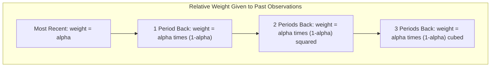

## Moving Averages and Exponential Smoothing

### Overview

Moving averages and exponential smoothing are foundational quantitative time-series forecasting techniques that generate forecasts by systematically weighting historical demand observations, rather than relying on subjective judgment. Both approaches smooth out random (irregular) fluctuation in historical data to reveal underlying patterns, but they differ fundamentally in how they weight past observations: moving averages apply equal weight to a fixed window of recent observations, while exponential smoothing applies weights that decline geometrically as observations recede further into the past, giving more influence to recent data without discarding older data entirely.

### Simple Moving Average (SMA)

The simple moving average forecast for the next period is the arithmetic mean of the most recent $n$ observations:

$$F_{t+1} = \frac{Y_t + Y_{t-1} + \cdots + Y_{t-n+1}}{n}$$

Where $F_{t+1}$ is the forecast for the next period, $Y_t$ is the actual observed value in period $t$, and $n$ is the number of periods included in the moving average window.

**Key Points**

- **Choice of $n$ (window size)**: A larger $n$ produces a smoother forecast, more resistant to random noise, but slower to react to genuine shifts in the underlying pattern (more lag). A smaller $n$ reacts more quickly to recent changes but is more sensitive to random noise.
- All observations within the window receive equal weight, and observations outside the window are given zero weight regardless of how recently they occurred relative to the window boundary.
- Simple moving averages are best suited to relatively stable demand series without strong trend or seasonality, since they systematically lag behind a trending series.

**Example**

Using a 3-period moving average on the following monthly demand data:

| Month | Actual Demand | 3-Month Moving Average Forecast |
| --- | --- | --- |
| Jan | 120 | — |
| Feb | 135 | — |
| Mar | 128 | — |
| Apr | 142 | (120+135+128)/3 = 127.7 |
| May | 138 | (135+128+142)/3 = 135.0 |
| Jun | — | (128+142+138)/3 = 136.0 |

The June forecast of 136.0 is generated purely from the three most recent actual observations (April, March excluded once the window moves forward, February and January no longer included at all).

### Weighted Moving Average (WMA)

A variant of the simple moving average that assigns different (typically higher) weights to more recent observations within the window, allowing the forecast to be more responsive to recent changes while still smoothing out some noise.

$$F_{t+1} = \sum_{i=1}^{n} w_i \, Y_{t-i+1}, \quad \text{where} \sum_{i=1}^{n} w_i = 1$$

**Example**

Using a 3-period weighted moving average with weights of 0.5 (most recent), 0.3, and 0.2 (least recent) applied to the April, March, and February data above:

$$F_{May} = (0.5 \times 142) + (0.3 \times 128) + (0.2 \times 135) = 71.0 + 38.4 + 27.0 = 136.4$$

Compared to the simple moving average forecast of 135.0 for the same period, the weighted average shifts the forecast slightly higher, reflecting the heavier weight placed on April's stronger reading.

### Simple Exponential Smoothing (SES)

Exponential smoothing generates a forecast as a weighted average of the most recent actual observation and the most recent forecast, controlled by a single smoothing constant $\alpha$ (alpha), where $0 < \alpha < 1$:

$$F_{t+1} = \alpha Y_t + (1 - \alpha) F_t$$

Equivalently, this can be expressed as the previous forecast adjusted by a fraction of the most recent forecast error:

$$F_{t+1} = F_t + \alpha (Y_t - F_t)$$

**Key Points**

- **Smoothing constant $\alpha$**: A higher $\alpha$ (closer to 1) gives more weight to the most recent actual observation, making the forecast more responsive to recent changes but more sensitive to random noise. A lower $\alpha$ (closer to 0) produces a smoother, more stable forecast that reacts more slowly to genuine shifts in the pattern.
- Despite using only the two most recent values (last actual, last forecast) in the calculation, exponential smoothing implicitly incorporates all historical data, since each prior forecast itself embeds the influence of all observations before it, with progressively (geometrically) declining weight.
- Simple exponential smoothing, like the simple moving average, is not well suited to series with a pronounced trend or seasonality, since it will systematically lag behind a consistently rising or falling series.

**Example**

Given $\alpha = 0.3$, a prior forecast $F_t = 130$, and an actual observation $Y_t = 142$:

$$F_{t+1} = 130 + 0.3(142 - 130) = 130 + 0.3(12) = 130 + 3.6 = 133.6$$

The new forecast of 133.6 moves only partway toward the actual observation of 142, reflecting the smoothing effect of a moderate $\alpha$ value.

### Implicit Weighting Structure of Exponential Smoothing

Expanding the recursive formula reveals that exponential smoothing places geometrically declining weight on all past observations:

$$F_{t+1} = \alpha Y_t + \alpha(1-\alpha) Y_{t-1} + \alpha(1-\alpha)^2 Y_{t-2} + \cdots$$

**Key Points**

- Unlike the simple moving average, which applies a hard cutoff (zero weight beyond the window), exponential smoothing gives every historical observation some nonzero weight, with that weight shrinking geometrically the further back in time it occurred.
- This property makes exponential smoothing computationally efficient (only the most recent forecast and actual value need to be stored) while still reflecting the full historical pattern.

### Choosing the Smoothing Constant ($\alpha$)

**Key Points**

- $\alpha$ is often chosen by minimizing a forecast error metric (such as Mean Squared Error or Mean Absolute Deviation) computed by testing different $\alpha$ values against historical data — a process sometimes done via optimization/search rather than fixed rule-of-thumb selection.
- Commonly cited practitioner starting ranges fall between 0.1 and 0.3 for relatively stable series, with higher values reserved for series expected to shift more quickly, though the appropriate value is genuinely data-dependent and should be validated rather than assumed. [Inference: specific numeric starting ranges are commonly cited heuristics in forecasting practice rather than a single formally standardized rule; actual optimal values vary by series.]

### Trend-Adjusted (Double/Holt's) Exponential Smoothing

Because simple exponential smoothing systematically lags behind a trending series, **Holt's method** (double exponential smoothing) extends the technique by explicitly tracking both a level component and a trend component, each with its own smoothing constant.

$$L_t = \alpha Y_t + (1-\alpha)(L_{t-1} + T_{t-1})$$

$$T_t = \beta (L_t - L_{t-1}) + (1-\beta) T_{t-1}$$

$$F_{t+m} = L_t + m T_t$$

Where $L_t$ is the smoothed level estimate, $T_t$ is the smoothed trend estimate, $\alpha$ and $\beta$ are separate smoothing constants for level and trend respectively, and $m$ is the number of periods ahead being forecast.

**Key Points**

- Holt's method directly addresses simple exponential smoothing's key weakness (lag behind trending data) by explicitly modeling and projecting the trend forward, rather than relying solely on a level estimate that always lags a consistently rising or falling series.
- A further extension, **Holt-Winters (triple) exponential smoothing**, adds a third component and smoothing constant to explicitly capture seasonality, making it suitable for series exhibiting trend, seasonality, and level simultaneously.

### Comparison of Techniques

| Method | Handles Trend? | Handles Seasonality? | Data Storage Required | Responsiveness Control |
| --- | --- | --- | --- | --- |
| Simple Moving Average | No (lags) | No | Fixed window of $n$ past values | Window size $n$ |
| Weighted Moving Average | No (lags, partially mitigated) | No | Fixed window of $n$ past values | Chosen weight distribution |
| Simple Exponential Smoothing | No (lags) | No | Last forecast + last actual only | Smoothing constant $\alpha$ |
| Holt's (Double) Exponential Smoothing | Yes | No | Last level + last trend estimate | $\alpha$ (level) and $\beta$ (trend) |
| Holt-Winters (Triple) Exponential Smoothing | Yes | Yes | Level, trend, and seasonal estimates | $\alpha$, $\beta$, and $\gamma$ (seasonal) |

### Forecast Error Evaluation

Both moving average and exponential smoothing forecasts are typically evaluated using standard error metrics computed over a historical test period:

$$\text{MAD (Mean Absolute Deviation)} = \frac{\sum |Y_t - F_t|}{n}$$

$$\text{MSE (Mean Squared Error)} = \frac{\sum (Y_t - F_t)^2}{n}$$

$$\text{MAPE (Mean Absolute Percentage Error)} = \frac{100}{n}\sum \left| \frac{Y_t - F_t}{Y_t} \right|$$

**Example**

Comparing a 3-month moving average forecast against a simple exponential smoothing forecast ($\alpha = 0.3$) over the same 6-month back-test period, if the moving average yields MAD = 8.2 and the exponential smoothing model yields MAD = 6.5, the exponential smoothing model would be judged more accurate for this specific series and back-test window under this metric — though a different $\alpha$ value or window size $n$ might shift this comparison, so error metrics should be computed across a reasonable range of parameter choices before selecting a final model.

### Selecting Between the Two Approaches

**Key Points**

- Both simple moving average and simple exponential smoothing are best suited to demand series without strong trend or seasonal pattern; using either on a strongly trending or seasonal series without extension (Holt's or Holt-Winters) will produce systematically biased, lagging forecasts.
- Exponential smoothing is generally preferred in practice for automated, large-scale forecasting systems (forecasting thousands of SKUs simultaneously) because it requires storing only the most recent forecast value per item rather than a full window of historical observations, reducing computational and data storage overhead.
- Moving averages remain useful for simpler analytical contexts, quick manual calculations, or as a baseline benchmark against which more sophisticated methods are compared.

### Common Pitfalls

- **Applying simple (non-trend-adjusted) methods to clearly trending data**, producing forecasts that consistently lag behind a rising or falling series — a systematic bias rather than random error.
- **Choosing window size $n$ or smoothing constant $\alpha$ without back-testing against historical error metrics**, relying instead on arbitrary or "typical" values that may not fit the specific series' actual volatility and pattern.
- **Ignoring seasonality when it is present**: using simple or double exponential smoothing on a strongly seasonal series without a seasonal component (Holt-Winters) will misrepresent seasonal peaks and troughs as trend or noise.
- **Over-tuning $\alpha$ to historical data (overfitting)**: selecting a smoothing constant that perfectly minimizes historical error may not generalize well to future periods if the historical fit captured noise rather than genuine underlying pattern.
- **Failing to periodically re-evaluate parameter choices** as the underlying demand pattern evolves over time — an $\alpha$ or window size optimal for last year's data may no longer be optimal if the series' volatility or trend has since changed.

### Conclusion

Moving averages and exponential smoothing form the core toolkit of classical quantitative demand forecasting, differing primarily in how they weight historical observations: equal weighting within a fixed window versus geometrically declining weight extending across all history. Both methods are computationally simple and effective for relatively stable demand patterns, but require extension (weighted moving averages, or Holt's and Holt-Winters exponential smoothing) to avoid systematic lag when trend or seasonality is present. Because forecast accuracy is highly sensitive to parameter choices (window size $n$, smoothing constants $\alpha$, $\beta$, $\gamma$), these should be selected and periodically re-validated using historical error metrics rather than fixed by convention alone.

**Related Topics**

- Time series decomposition (trend, seasonal, cyclical, irregular components)
- Holt-Winters (triple) exponential smoothing in depth
- Forecast error metrics (MAD, MSE, MAPE, bias tracking signal)
- ARIMA and seasonal ARIMA (SARIMA) modeling
- Qualitative forecasting techniques
- Causal/regression-based forecasting models
- Safety stock and demand variability planning
- Sales and operations planning (S&OP) forecast integration
- Forecast accuracy measurement and tracking signals
- Automated large-scale SKU-level forecasting systems