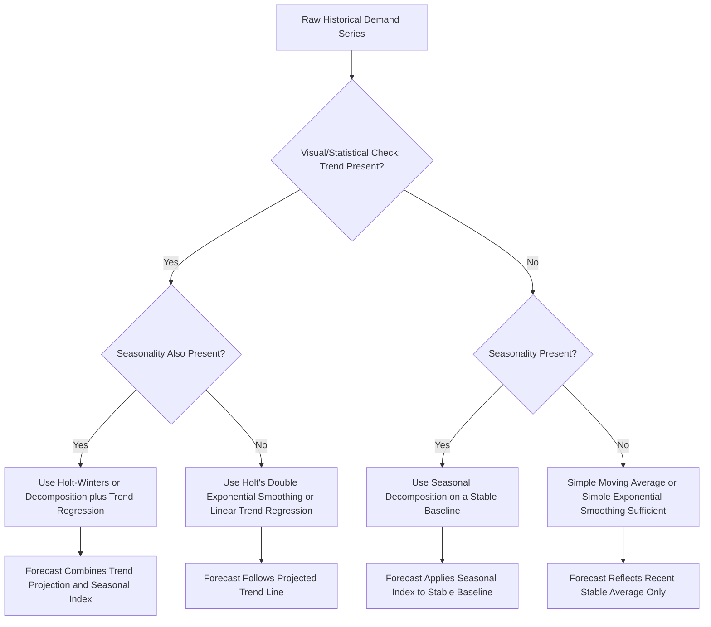

## Trend and Seasonality Adjustment

### Overview

Trend and seasonality adjustment refers to the set of techniques used to explicitly incorporate long-term directional movement (trend) and recurring calendar-based fluctuation (seasonality) into a demand forecast, correcting the systematic lag and bias that basic forecasting methods (simple moving averages, simple exponential smoothing) produce when applied to data exhibiting these patterns. Because trend and seasonality are both fundamentally *predictable* components of a demand series — unlike genuinely random irregular variation — properly adjusting for them substantially improves forecast accuracy relative to methods that ignore or only implicitly react to these patterns.

### Why Basic Methods Fail on Trending or Seasonal Data

**Key Points**

- Simple moving averages and simple exponential smoothing both compute a forecast as some form of average of recent past values; when the underlying series is consistently rising (or falling), any average of past values will systematically underestimate (or overestimate) the next period, since the average necessarily lags behind a moving target.
- When strong seasonality is present but not explicitly modeled, a basic method will treat seasonal peaks as pattern in the short-term average and seasonal troughs as a drop, generating forecasts that lag one full season behind and never accurately anticipate an upcoming seasonal swing before it has already begun to show up in recent data.

### Detecting Trend and Seasonality

**Key Points**

- **Visual inspection**: Plotting the raw time series is often the fastest way to identify obvious trend direction and recurring seasonal peaks/troughs.
- **Autocorrelation analysis**: Examining the autocorrelation function (ACF) of a series can reveal seasonality as significant correlation spikes at lags corresponding to the seasonal period (e.g., a spike at lag 12 for monthly data with annual seasonality).
- **Seasonal index calculation via decomposition**: Formally computing seasonal indices (as in classical time series decomposition) both confirms the presence of seasonality and quantifies its magnitude for each period.
- **Regression on a time index**: Fitting a simple linear regression of demand against a sequential time variable ($t = 1, 2, 3, \ldots$) provides a formal trend estimate and statistical significance test for whether the observed trend is distinguishable from random variation.

### Linear Trend Adjustment via Regression

A straightforward way to explicitly model trend is ordinary least squares regression of demand against a time index:

$$\hat{Y}_t = b_0 + b_1 t$$

Where $b_0$ is the estimated intercept, $b_1$ is the estimated trend slope (change in demand per period), and $t$ is the sequential time index.

**Example**

Given 8 periods of demand data, a fitted regression yields:

$$\hat{Y}_t = 105 + 6.2t$$

For period $t = 9$:

$$\hat{Y}_9 = 105 + 6.2(9) = 105 + 55.8 = 160.8$$

For period $t = 12$:

$$\hat{Y}_{12} = 105 + 6.2(12) = 105 + 74.4 = 179.4$$

This provides an explicit trend-based forecast that projects continued growth at the estimated rate of 6.2 units per period, unlike a moving average or simple exponential smoothing forecast, which would lag behind this growth.

### Combining Trend and Seasonal Indices

A common practical approach layers a seasonal index (from decomposition) on top of a trend-based baseline forecast:

$$\text{Forecast}_t = (\text{Trend Baseline}_t) \times (\text{Seasonal Index for period } t)$$

**Example**

Using the trend line above ($\hat{Y}_t = 105 + 6.2t$) combined with seasonal indices derived via decomposition (Q1 = 0.69, Q2 = 0.93, Q3 = 1.42, Q4 = 0.96, as in the earlier decomposition example):

For period $t = 13$ (a Q1 period, given a quarterly series continuing from $t=12$):

$$\text{Trend Baseline}_{13} = 105 + 6.2(13) = 105 + 80.6 = 185.6$$

$$\text{Forecast}_{13} = 185.6 \times 0.69 \approx 128.1 \text{ units}$$

This produces a forecast that correctly anticipates the seasonally weak Q1 period while still reflecting the underlying upward trend — a combination neither a pure trend model nor a pure seasonal index alone would capture.

### Trend and Seasonality via Holt-Winters Exponential Smoothing

Holt-Winters (triple exponential smoothing) formally extends exponential smoothing to explicitly track level, trend, and seasonal components simultaneously, using three separate smoothing constants.

**Additive Seasonality Formulation:**

$$L_t = \alpha (Y_t - S_{t-p}) + (1-\alpha)(L_{t-1} + T_{t-1})$$

$$T_t = \beta (L_t - L_{t-1}) + (1-\beta) T_{t-1}$$

$$S_t = \gamma (Y_t - L_t) + (1-\gamma) S_{t-p}$$

$$F_{t+m} = L_t + m T_t + S_{t+m-p}$$

Where $L_t$ = level, $T_t$ = trend, $S_t$ = seasonal component, $p$ = number of periods in a full seasonal cycle, $\alpha$/$\beta$/$\gamma$ = smoothing constants for level/trend/seasonal respectively, and $m$ = number of periods ahead being forecast.

**Key Points**

- A **multiplicative seasonality** version of Holt-Winters exists as well, used when seasonal amplitude scales with the trend level rather than remaining constant in absolute terms — mirroring the additive-versus-multiplicative choice discussed in time series decomposition.
- Because Holt-Winters continuously re-estimates all three components as new data arrives, it can adapt to gradually evolving trend and seasonal patterns over time, unlike a static decomposition-based seasonal index computed once from historical data and then held fixed.
- Selecting all three smoothing constants ($\alpha$, $\beta$, $\gamma$) typically requires optimization against a historical error metric (e.g., minimizing MSE via search across the parameter space) rather than manual selection, since manually tuning three interacting parameters is impractical.

### Trend and Seasonality Adjustment Flow

### Deseasonalizing Data for Trend Analysis

Before fitting a trend line to seasonal data, it is often useful to first remove the seasonal component (deseasonalize) so the trend estimate is not distorted by seasonal peaks and troughs happening to fall at the start or end of the data window.

$$\text{Deseasonalized}_t = \frac{Y_t}{S_t} \quad \text{(multiplicative)} \qquad \text{or} \qquad Y_t - S_t \quad \text{(additive)}$$

**Example**

A retailer analyzing year-over-year growth trend in a highly seasonal product line first divides each quarter's actual sales by that quarter's seasonal index, producing a deseasonalized series that isolates the underlying growth trend without the trend line being skewed by, for instance, the data window happening to start in a strong Q4 period and end in a weak Q1 period.

### Practical Model Selection Guidance

| Data Characteristics | Recommended Approach |
| --- | --- |
| No trend, no seasonality | Simple moving average or simple exponential smoothing |
| Trend present, no seasonality | Linear trend regression or Holt's double exponential smoothing |
| Seasonality present, no trend | Seasonal decomposition applied to a stable baseline |
| Both trend and seasonality present | Holt-Winters triple exponential smoothing, or decomposition combined with trend regression |
| Trend/seasonal pattern evolving gradually over time | Holt-Winters (adapts continuously) preferred over static decomposition-based seasonal indices |

### Evaluating Trend and Seasonal Adjustments

As with any forecasting method, adjusted forecasts should be validated using standard error metrics computed on a historical hold-out period:

$$\text{MAPE} = \frac{100}{n}\sum \left| \frac{Y_t - F_t}{Y_t} \right|$$

**Key Points**

- Comparing MAPE (or MAD/MSE) between a trend-and-seasonally-adjusted model and a naive or basic model on the same historical hold-out data quantifies the actual accuracy improvement gained from the adjustment — this validation step should not be skipped, since added model complexity does not automatically guarantee improved forecast accuracy for every series.
- A **tracking signal** (cumulative forecast error divided by MAD) is often monitored over time to detect whether a trend or seasonal adjustment has become miscalibrated as the underlying pattern shifts, signaling a need to re-estimate parameters.

### Common Pitfalls

- **Applying a trend adjustment to a series where the "trend" is actually a temporary shift or one-time event**, extrapolating a pattern that will not continue, leading to persistent over- or under-forecasting once the temporary effect ends.
- **Using a static, historically computed seasonal index indefinitely** without re-validating it periodically, even as underlying consumer behavior, product mix, or market conditions evolve.
- **Failing to check whether seasonal amplitude is growing (multiplicative) or constant (additive)** before selecting a decomposition or Holt-Winters seasonality formulation, leading to systematically biased seasonal adjustments.
- **Over-parameterizing with Holt-Winters when a simpler model performs equally well**, adding unnecessary complexity and parameter-tuning burden without a corresponding accuracy gain — always validate against simpler baseline models.
- **Ignoring structural breaks** (a major disruption, product relaunch, or market shift) that invalidate previously estimated trend slopes or seasonal indices going forward.

### Conclusion

Trend and seasonality adjustment transforms basic averaging-based forecasting methods into models capable of anticipating, rather than merely lagging behind, the predictable directional and calendar-based patterns present in most real-world demand data. Whether achieved through explicit regression-based trend estimation combined with decomposition-derived seasonal indices, or through the continuously self-updating Holt-Winters framework, the core objective is the same: separate genuinely predictable structure (trend, seasonality) from random noise so that structure can be projected forward accurately, while random variation is appropriately smoothed rather than chased. As with all forecasting techniques, the value of any given adjustment approach should be confirmed empirically against historical error metrics rather than assumed from model sophistication alone.

**Related Topics**

- Time series decomposition (additive and multiplicative models)
- Moving averages and simple/double exponential smoothing
- Holt-Winters (triple) exponential smoothing in depth
- Forecast error metrics and tracking signals
- Autocorrelation analysis and seasonal lag detection
- ARIMA and seasonal ARIMA (SARIMA) modeling
- Deseasonalized data analysis for trend isolation
- Sales and operations planning (S&OP) forecast integration
- Structural break detection in demand series
- Qualitative overlay adjustments to quantitative forecasts