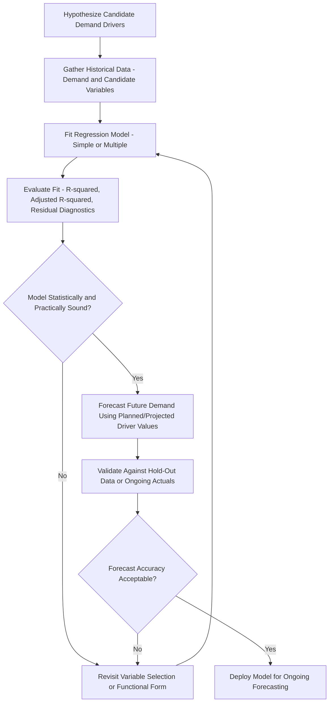

## Causal and Regression-based Forecasting

### Overview

Causal (also called explanatory or regression-based) forecasting techniques predict demand using its statistical relationship with one or more independent variables believed to influence or drive that demand — such as price, advertising expenditure, competitor actions, economic indicators, or weather. This distinguishes causal forecasting from time-series methods (moving averages, exponential smoothing, decomposition), which forecast future demand purely as a function of the demand series' own historical pattern, without reference to any external explanatory factor. Causal methods are particularly valuable when a known driver is expected to change materially (a planned price change, a new marketing campaign, an anticipated economic shift), since time-series methods have no mechanism to anticipate the effect of a factor outside the historical demand data itself.

### Causal vs. Time-Series Forecasting

| Dimension | Causal/Regression-Based | Time-Series-Based |
| --- | --- | --- |
| Basis of prediction | Relationship between demand and one or more independent variables | Demand's own historical pattern (trend, seasonality, past values) |
| Data requirements | Historical values for both demand and the independent variable(s) | Historical demand data only |
| Ability to anticipate driver changes | Can incorporate planned/known future changes in the independent variable | Cannot anticipate factors external to historical demand pattern |
| Complexity | Generally higher (requires identifying and validating causal relationships) | Generally lower to moderate |
| Best suited for | Situations with a known, measurable demand driver expected to change | Stable environments where past demand patterns are expected to persist |

### Simple Linear Regression Forecasting

The most fundamental causal forecasting technique models demand as a linear function of a single independent variable:

$$\hat{Y} = b_0 + b_1 X$$

Where $\hat{Y}$ is the predicted (dependent) demand value, $X$ is the independent (explanatory) variable, $b_0$ is the estimated intercept, and $b_1$ is the estimated slope (the change in demand associated with a one-unit change in $X$).

The coefficients are typically estimated via **ordinary least squares (OLS)**, which minimizes the sum of squared differences between actual and predicted values:

$$b_1 = \frac{\sum (X_i - \bar{X})(Y_i - \bar{Y})}{\sum (X_i - \bar{X})^2}, \qquad b_0 = \bar{Y} - b_1 \bar{X}$$

**Example**

A company examines the relationship between local advertising expenditure ($X$, in thousands of dollars) and monthly unit sales ($Y$) over the past 10 months, and fits the following regression:

$$\hat{Y} = 850 + 42X$$

If the company plans to spend $15,000 on advertising next month:

$$\hat{Y} = 850 + 42(15) = 850 + 630 = 1{,}480 \text{ units}$$

This forecast directly incorporates a planned future change in the advertising driver — something a pure time-series model applied to historical sales alone could not anticipate, since it has no visibility into planned advertising spend.

### Assessing Regression Model Fit: R-squared

The **coefficient of determination** ($R^2$) measures the proportion of variance in the dependent variable explained by the independent variable(s):

$$R^2 = 1 - \frac{\sum (Y_i - \hat{Y}_i)^2}{\sum (Y_i - \bar{Y})^2}$$

**Key Points**

- $R^2$ ranges from 0 to 1, with values closer to 1 indicating the independent variable(s) explain a larger share of the variation in demand.
- A high $R^2$ does not by itself confirm a genuine causal relationship — correlation revealed by regression analysis does not establish causation, and two variables can be strongly correlated due to a shared underlying driver or pure coincidence rather than a direct causal link. [Inference: this is a foundational statistical principle rather than a claim specific to any particular dataset; it applies generally whenever interpreting regression results.]
- $R^2$ tends to increase (or at minimum not decrease) simply by adding more independent variables to a model, even when those variables have no genuine explanatory power — **adjusted $R^2$** corrects for this by penalizing the addition of variables that do not meaningfully improve model fit.

### Multiple Regression Forecasting

Extends simple linear regression to incorporate several independent variables simultaneously:

$$\hat{Y} = b_0 + b_1 X_1 + b_2 X_2 + \cdots + b_k X_k$$

**Example**

A retailer forecasts weekly demand using both price ($X_1$) and local unemployment rate ($X_2$) as explanatory variables:

$$\hat{Y} = 2{,}400 - 18X_1 - 45X_2$$

For a planned price of $40 and a forecasted local unemployment rate of 5.2%:

$$\hat{Y} = 2{,}400 - 18(40) - 45(5.2) = 2{,}400 - 720 - 234 = 1{,}446 \text{ units}$$

This model captures two distinct demand drivers simultaneously — a negative price elasticity effect and a negative macroeconomic effect — neither of which a univariate time-series model could represent.

### Regression Assumptions and Diagnostic Considerations

**Key Points**

- **Linearity**: OLS regression assumes a linear relationship between the independent and dependent variables; a genuinely nonlinear relationship (e.g., diminishing returns to advertising spend) may require transformation of variables or a nonlinear modeling approach.
- **Independence of errors**: Residuals (forecast errors) should not be systematically correlated with each other; time-series data in particular is prone to **autocorrelation** in residuals, which standard OLS does not account for and can lead to underestimated standard errors and misleading significance tests.
- **Homoscedasticity**: The variance of residuals should be roughly constant across the range of predicted values; **heteroscedasticity** (residual variance that grows or shrinks with the predicted value) can distort confidence interval estimates.
- **Multicollinearity**: When independent variables are themselves highly correlated with one another, individual coefficient estimates become unstable and difficult to interpret reliably, even if the overall model fit remains strong.
- **Sufficient historical data**: Regression estimates, particularly with multiple independent variables, require an adequate number of historical observations relative to the number of variables being estimated to produce statistically reliable coefficients.

### Causal Forecasting Process

### Leading Indicators in Causal Forecasting

**Key Points**

- A **leading indicator** is an independent variable whose changes precede (and help predict) changes in demand, often by a measurable lag — such as housing starts leading appliance demand by several months, or new business formation leading commercial office furniture demand.
- Leading indicators are particularly valuable in causal forecasting because they allow demand to be projected forward using already-observed (rather than merely assumed or planned) changes in the driver variable.
- Identifying a genuine, stable leading relationship (rather than a spurious historical correlation) typically requires both domain reasoning about why the relationship should exist and statistical validation (e.g., cross-correlation analysis at various lags) across a sufficient historical period.

### Econometric and Advanced Causal Techniques

**Key Points**

- **Distributed lag models**: Incorporate not just the current value of an independent variable but also its values from several prior periods, capturing delayed effects (e.g., an advertising campaign's impact on demand may build over several weeks rather than occurring entirely within the same period it is spent).
- **Price elasticity models**: A specific application of regression forecasting focused on quantifying how demand responds to price changes, often expressed as percentage change in demand per percentage change in price.
- **Panel/cross-sectional regression**: Used when forecasting across multiple related units simultaneously (e.g., multiple stores or regions), pooling data to estimate more statistically robust relationships than would be possible from any single unit's history alone.
- Machine learning regression techniques (e.g., regularized regression, tree-based ensemble methods) are increasingly used as extensions of classical causal forecasting when relationships are nonlinear or involve many candidate explanatory variables, though these require larger datasets and careful validation to avoid overfitting. [Unverified: the specific comparative performance of machine learning approaches versus classical regression varies substantially by dataset size, variable relationships, and domain; treat this as a general trend in forecasting practice rather than a guaranteed performance improvement in any specific application.]

### Combining Causal and Time-Series Approaches

**Key Points**

- In practice, many demand planning systems use a hybrid approach: a time-series model (e.g., Holt-Winters) provides the baseline forecast reflecting historical trend and seasonality, while causal regression coefficients are layered on top to adjust for known planned changes in specific drivers (a scheduled price change, a planned promotional event).
- This hybrid approach leverages the relative strengths of each method: time-series components capture persistent underlying patterns efficiently, while causal components explicitly incorporate forward-looking information about drivers that a purely historical pattern-based model cannot see.

### Common Pitfalls

- **Mistaking correlation for causation**: Including a variable in a regression model because it is statistically correlated with historical demand, without a plausible causal mechanism, risks building a model that fits historical data well but fails when the (non-causal) correlation breaks down going forward.
- **Ignoring autocorrelation in time-series-based regression residuals**, leading to overstated confidence in coefficient significance and potentially misleading forecasts.
- **Overfitting with too many independent variables relative to available historical observations**, producing a model that fits historical data closely but generalizes poorly to future periods.
- **Failing to validate driver forecasts themselves**: A causal model is only as reliable as the accuracy of the projected future values used for its independent variables (e.g., an inaccurate planned advertising budget projection will directly distort the resulting demand forecast).
- **Extrapolating a regression relationship well beyond the range of the historical data used to estimate it**, assuming a linear relationship continues to hold at driver values far outside those historically observed.

### Conclusion

Causal and regression-based forecasting techniques provide a mechanism for demand forecasting that pure time-series methods fundamentally cannot: the ability to explicitly incorporate known or planned changes in external demand drivers, rather than relying solely on the historical demand pattern's own momentum. Their effectiveness depends heavily on correctly identifying genuine causal relationships (supported by both domain reasoning and statistical validation), satisfying core regression assumptions, and ensuring driver forecasts themselves are reasonably reliable — since any regression-based demand forecast inherits the uncertainty of its input projections. In practice, causal methods are frequently combined with time-series approaches, using a statistical baseline for persistent patterns and causal adjustments for anticipated changes in specific known drivers.

**Related Topics**

- Time series decomposition and Holt-Winters exponential smoothing
- Qualitative forecasting techniques
- Price elasticity of demand and pricing strategy
- Multiple regression diagnostics (multicollinearity, heteroscedasticity, autocorrelation)
- Leading indicators and cross-correlation analysis
- Machine learning approaches to demand forecasting
- Sales and operations planning (S&OP) forecast integration
- Forecast error metrics (MAD, MSE, MAPE) and model validation
- Promotional lift modeling and marketing mix analysis
- ARIMA with exogenous variables (ARIMAX) modeling