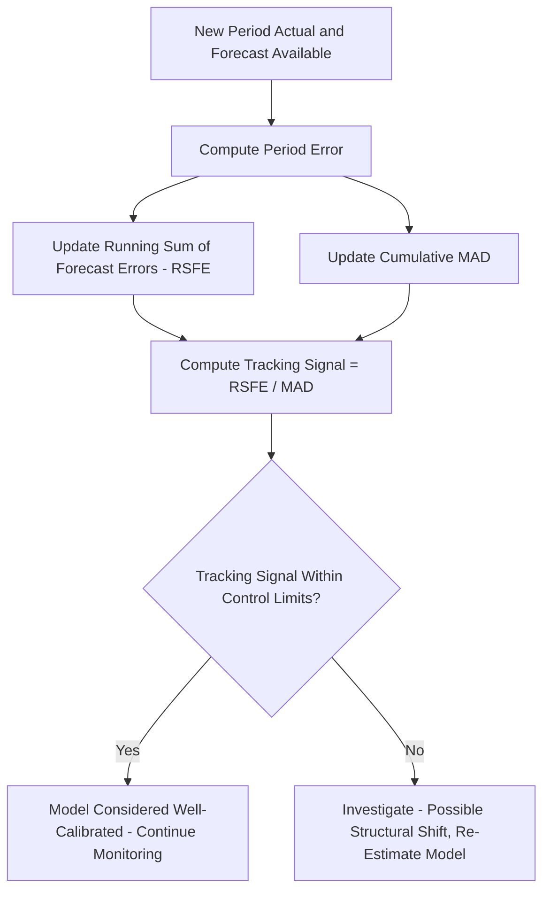

## Forecast Error Measurement

### Overview

Forecast error measurement encompasses the statistical metrics and monitoring techniques used to quantify how closely a forecast matches actual observed demand, evaluate whether a forecasting method or parameter choice is performing well, compare competing forecasting approaches, and detect when a previously accurate model has become miscalibrated as underlying conditions change. Since no forecast is ever perfectly accurate, forecast error measurement is not merely a diagnostic afterthought — it is the mechanism by which forecasting systems are selected, tuned, and continuously monitored in operational use.

### Forecast Error Defined

The basic building block of all forecast error measurement is the individual period error:

$$e_t = Y_t - F_t$$

Where $Y_t$ is the actual observed value in period $t$, and $F_t$ is the forecast that had been made for period $t$.

**Key Points**

- A positive $e_t$ indicates the forecast underestimated actual demand (a stockout risk if capacity/inventory was planned to the forecast); a negative $e_t$ indicates the forecast overestimated demand (excess inventory risk).
- Individual period errors are rarely useful in isolation; forecast error measurement typically aggregates errors across many periods to assess overall accuracy and bias.

### Mean Error (ME) / Mean Forecast Error (Bias)

$$ME = \frac{\sum_{t=1}^{n} e_t}{n} = \frac{\sum (Y_t - F_t)}{n}$$

**Key Points**

- Because positive and negative errors can offset each other in a simple average, Mean Error specifically measures **systematic bias** — whether a forecasting method consistently over- or under-forecasts — rather than overall accuracy or magnitude of error.
- An ME close to zero suggests the method is not systematically biased, even if individual period errors are large in either direction; ME does not by itself indicate how large typical errors are.
- A persistently positive or negative ME over an extended period signals that the forecasting model requires recalibration, since consistent bias indicates a systematic (correctable) rather than random source of error.

### Mean Absolute Deviation (MAD)

$$MAD = \frac{\sum_{t=1}^{n} |Y_t - F_t|}{n}$$

**Key Points**

- MAD measures the average magnitude of forecast error, regardless of direction, providing a straightforward measure of typical forecast accuracy in the same units as the original demand data (e.g., "units").
- Unlike ME, MAD does not allow positive and negative errors to cancel, so it directly reflects overall forecast precision rather than directional bias.
- MAD is widely used in operations because its units are directly interpretable (e.g., "the forecast is typically off by about 12 units per period") and because it is less sensitive to occasional large outlier errors than squared-error metrics.

**Example**

Given actual and forecasted demand over 5 periods:

| Period | Actual ($Y_t$) | Forecast ($F_t$) | Error ($e_t$) | Absolute Error |
| --- | --- | --- | --- | --- |
| 1 | 120 | 115 | 5 | 5 |
| 2 | 138 | 130 | 8 | 8 |
| 3 | 110 | 122 | -12 | 12 |
| 4 | 145 | 140 | 5 | 5 |
| 5 | 128 | 135 | -7 | 7 |

$$ME = \frac{5+8-12+5-7}{5} = \frac{-1}{5} = -0.2$$

$$MAD = \frac{5+8+12+5+7}{5} = \frac{37}{5} = 7.4$$

The near-zero ME (-0.2) suggests minimal systematic bias, while the MAD of 7.4 indicates the forecast is typically off by about 7.4 units per period in either direction.

### Mean Squared Error (MSE) and Root Mean Squared Error (RMSE)

$$MSE = \frac{\sum_{t=1}^{n} (Y_t - F_t)^2}{n}$$

$$RMSE = \sqrt{MSE}$$

**Key Points**

- Squaring individual errors before averaging causes MSE (and RMSE) to penalize large errors disproportionately more than small ones, making these metrics more sensitive to occasional large forecast misses than MAD.
- RMSE returns the error measure to the original units of the data (since MSE is in squared units), making RMSE more directly interpretable than MSE while retaining the same sensitivity to large errors.
- MSE/RMSE are commonly used as the objective function being minimized when optimizing model parameters (e.g., selecting a smoothing constant $\alpha$), precisely because the squaring makes the resulting optimization mathematically well-behaved (differentiable, single global minimum for many standard models).

**Example**

Using the same 5-period data above:

$$MSE = \frac{5^2+8^2+(-12)^2+5^2+(-7)^2}{5} = \frac{25+64+144+25+49}{5} = \frac{307}{5} = 61.4$$

$$RMSE = \sqrt{61.4} \approx 7.84$$

Note that RMSE (7.84) is somewhat larger than MAD (7.4) for this data — a common pattern, since RMSE's squared-error penalty gives extra weight to the larger Period 3 error of 12 units, whereas MAD weights all error magnitudes proportionally.

### Mean Absolute Percentage Error (MAPE)

$$MAPE = \frac{100}{n}\sum_{t=1}^{n} \left| \frac{Y_t - F_t}{Y_t} \right|$$

**Key Points**

- MAPE expresses error as a percentage of actual demand, making it useful for comparing forecast accuracy across items or series with very different demand volumes (e.g., comparing forecast accuracy for a high-volume SKU against a low-volume SKU on a common percentage scale).
- MAPE is undefined (division by zero) when actual demand $Y_t = 0$ in any period, and becomes extremely large or misleading when actual demand is very close to zero even without being exactly zero — a significant limitation for intermittent or low-volume demand series.
- MAPE also asymmetrically penalizes over- and under-forecasting: because the denominator is the actual value, an over-forecast can produce a percentage error larger than 100%, while an under-forecast is mathematically capped at 100% error, creating a subtle bias in how the metric treats forecasts that are too high versus too low. [Inference: this asymmetry is a well-documented mathematical property of the MAPE formula rather than an assumption specific to any dataset.]

**Example**

Using the same data:

$$MAPE = \frac{100}{5}\left(\frac{5}{120} + \frac{8}{138} + \frac{12}{110} + \frac{5}{145} + \frac{7}{128}\right)$$

$$= \frac{100}{5}(0.0417 + 0.0580 + 0.1091 + 0.0345 + 0.0547) = \frac{100}{5}(0.298) = 5.96\%$$

A MAPE of approximately 5.96% indicates the forecast is, on average, about 6% off from actual demand across these periods.

### Comparison of Error Metrics

| Metric | Measures | Sensitive to Large Errors? | Scale-Independent? | Key Limitation |
| --- | --- | --- | --- | --- |
| Mean Error (ME) | Systematic bias (direction) | No | No | Positive/negative errors cancel out; hides magnitude |
| MAD | Average error magnitude | No | No | Same units as data; not comparable across different-scale series |
| MSE / RMSE | Average error magnitude, weighted toward large errors | Yes | No | Harder to interpret intuitively (MSE); still scale-dependent |
| MAPE | Average error as % of actual | No | Yes | Undefined/unstable near zero actuals; asymmetric penalty |

### Tracking Signal

The **tracking signal** monitors cumulative bias relative to typical error magnitude over time, providing an early-warning system for a forecasting model that has become systematically miscalibrated:

$$\text{Tracking Signal}_t = \frac{\text{Running Sum of Forecast Errors (RSFE)}_t}{MAD_t}$$

Where RSFE is the cumulative (running) sum of $e_t$ values up to period $t$, and $MAD_t$ is the mean absolute deviation computed up to period $t$.

**Key Points**

- A tracking signal that remains within a defined control range (commonly cited practitioner thresholds are roughly ±4, though the appropriate threshold depends on the desired sensitivity and the specific series) suggests the forecast remains reasonably unbiased over time. [Unverified: the specific numeric threshold used for tracking signal control limits varies across organizations and is not governed by a single universally standardized value; treat cited ranges as common practitioner heuristics.]
- A tracking signal that drifts persistently toward one boundary (or exceeds it) indicates the forecast has developed a systematic bias — the underlying pattern may have shifted, and the model requires recalibration or re-selection of parameters.
- Because the tracking signal is recalculated each period as new data arrives, it functions as an ongoing operational monitoring tool rather than a one-time model evaluation metric.

### Tracking Signal Monitoring Process

### Applying Error Metrics to Model Selection

**Key Points**

- Comparing multiple candidate models (e.g., different smoothing constants, moving average window sizes, or entirely different forecasting methods) on the same historical hold-out data using a consistent error metric allows an objective, data-driven selection rather than relying on convention or intuition alone.
- Different metrics can favor different models: a model that minimizes MSE (penalizing large errors heavily) may not be the same model that minimizes MAD, particularly when the error distribution includes occasional large outliers. Selecting which metric to prioritize should reflect the actual business cost structure of forecast error (e.g., if large misses are disproportionately costly — such as a stockout of a critical component — a metric more sensitive to large errors, like RMSE, may better reflect the true cost of poor forecasts than MAD).
- Error metrics should generally be evaluated on out-of-sample (hold-out) data not used to fit the model, since evaluating solely on in-sample fit can favor overfit models that will not generalize well to genuinely new future periods.

### Common Pitfalls

- **Relying solely on Mean Error (bias) without also examining MAD/MSE**, potentially missing a model that has zero net bias but very large individual-period errors that offset each other in the aggregate.
- **Using MAPE on intermittent or low-volume/near-zero demand series**, producing unstable or misleadingly large percentage errors that do not reflect a genuine accuracy problem.
- **Comparing MAD or MSE values directly across items or series with very different demand volumes**, since these metrics are scale-dependent and a "large" MAD for a high-volume item may represent better relative accuracy than a "small" MAD for a low-volume item.
- **Ignoring tracking signal drift** because aggregate error metrics (MAD, MAPE) computed over a long historical window appear acceptable, missing a recent but persistent shift in bias that a longer-window aggregate metric would dilute and obscure.
- **Evaluating model accuracy only on in-sample historical fit** rather than genuine out-of-sample hold-out or rolling-forecast validation, overstating expected future accuracy.
- **Choosing an error metric without considering the actual business cost asymmetry of over- versus under-forecasting**, applying a symmetric metric (like MAD) when, for example, stockout costs substantially exceed excess-inventory holding costs for the item in question.

### Conclusion

Forecast error measurement provides the quantitative basis for selecting, tuning, and continuously monitoring demand forecasting models, moving model evaluation beyond subjective impression to objective, comparable metrics. Because different metrics — Mean Error, MAD, MSE/RMSE, and MAPE — capture different aspects of forecast performance (bias versus magnitude, absolute versus percentage terms, equal versus outlier-weighted sensitivity), a complete evaluation typically examines several metrics together rather than relying on any single figure. The tracking signal extends this evaluation into ongoing operational monitoring, providing an early warning when a previously well-calibrated model begins to drift as underlying demand patterns evolve, prompting timely recalibration before forecast bias causes material inventory or capacity planning errors.

**Related Topics**

- Moving averages and exponential smoothing (parameter tuning via error metrics)
- Time series decomposition and seasonal index validation
- Causal and regression-based forecasting model evaluation
- Trend and seasonality adjustment validation
- Safety stock calculation and demand variability
- Sales and operations planning (S&OP) forecast performance review
- Statistical process control (control charts and control limits)
- Intermittent demand forecasting (Croston's method and related techniques)
- Forecast bias correction and model recalibration practices
- Cost of forecast error: stockout versus overstock trade-offs