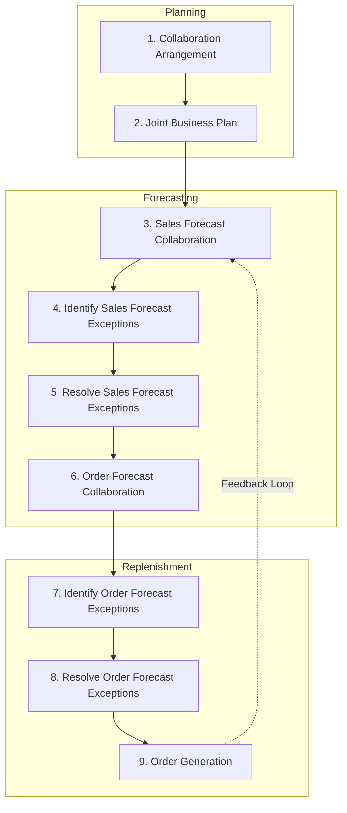

## Collaborative Planning, Forecasting, and Replenishment

### Definition and Purpose

Collaborative Planning, Forecasting, and Replenishment (CPFR) is a structured, cross-organizational business practice in which trading partners—typically a manufacturer/supplier and a retailer/distributor—jointly develop demand forecasts, production and replenishment plans, and inventory strategies through shared data, agreed-upon exception rules, and synchronized workflows. The goal is to reduce forecast error, minimize the bullwhip effect, lower inventory across the supply chain, and improve product availability by replacing sequential, siloed forecasting with a single, mutually agreed number.

CPFR was formalized in the mid-1990s as an extension of earlier initiatives such as Quick Response (QR), Efficient Consumer Response (ECR), and Vendor-Managed Inventory (VMI). It was standardized by the Voluntary Interindustry Commerce Standards (VICS) Association, whose CPFR framework remains the reference model taught in operations management curricula.

### Core Premise: The Bullwhip Problem CPFR Solves

In a conventional supply chain, each tier (retailer, distributor, manufacturer, supplier) forecasts demand independently based only on the orders it receives from the tier immediately downstream, not on actual consumer demand. Small fluctuations at the retail level amplify as they propagate upstream because each party adds its own safety margin and reacts to order patterns rather than true sell-through data. This amplification is known as the bullwhip effect.

CPFR addresses this by giving all partners visibility into the same point-of-sale (POS) data, promotional calendars, and inventory positions, so that every tier forecasts against the same demand signal instead of against distorted order data from the tier below it.

### The Nine-Step VICS CPFR Model

The VICS reference model organizes CPFR into three phases—Planning, Forecasting, and Replenishment—broken into nine sequential activities.

**Phase 1: Planning**

1. **Collaboration Arrangement** — Partners define the scope, objectives, roles, resources, and escalation/exception procedures for the collaboration (a formal front-end agreement).
2. **Joint Business Plan** — Partners share category roles, strategies, promotional calendars, product introductions/discontinuations, and store openings/closings that will influence demand.

**Phase 2: Forecasting**

3. **Sales Forecast Collaboration** — Both parties generate a sales forecast (often the retailer's POS-driven forecast) and identify exceptions where forecasts diverge beyond an agreed tolerance.

4. **Identify Exceptions for Sales Forecast** — Exception thresholds (e.g., forecasts differing by more than a set percentage) are flagged automatically for review.

5. **Resolve/Collaborate on Exception Items** — Planners from both sides jointly investigate and resolve flagged discrepancies (e.g., a promotion not reflected in one partner's forecast).

6. **Order Forecast Collaboration** — The sales forecast is translated into an order/replenishment forecast, accounting for lead times, lot sizing, and inventory policies.

**Phase 3: Replenishment**

7. **Identify Exceptions for Order Forecast** — Similar exception logic applied to the order forecast (e.g., a spike that would breach production capacity).

8. **Resolve/Collaborate on Order Forecast Exceptions** — Joint resolution of capacity, minimum order quantity, or logistics constraints.

9. **Order Generation** — The finalized, collaborative forecast is converted into an actual firm order or replenishment shipment plan.

### Data Inputs Required for CPFR

- **Point-of-sale (POS) data**: actual retail sell-through, typically at SKU-store-day granularity
- **Inventory positions**: on-hand stock at retailer DCs, stores, and supplier warehouses
- **Promotional calendars**: pricing changes, markdowns, advertised specials, end-cap placements
- **Causal/event data**: seasonality, weather patterns, local events, competitor actions
- **Product lifecycle data**: new item introductions, discontinuations, packaging changes
- **Order and shipment history**: lead times, fill rates, historical order patterns
- **Capacity constraints**: production capacity, minimum order quantities (MOQ), transportation capacity

### CPFR vs. Related Practices

| Practice | Who Forecasts | Who Owns Replenishment Decision | Data Shared |
| --- | --- | --- | --- |
| Traditional EDI ordering | Each party independently | Retailer places orders; supplier reacts | Purchase orders only |
| VMI (Vendor-Managed Inventory) | Supplier | Supplier decides replenishment quantities | Inventory levels, POS data |
| ECR (Efficient Consumer Response) | Joint, category-level | Shared, category-focused | Category performance data |
| **CPFR** | **Jointly, at SKU level, with formal exception process** | **Jointly agreed, then executed by responsible party** | **POS, inventory, promotions, causal data, forecasts themselves** |

CPFR is distinguished from VMI by its emphasis on collaborative *forecasting* (not just replenishment execution) and its formal exception-management workflow; VMI can be viewed as one possible execution mechanism within a broader CPFR relationship.

### Worked Example

A retailer and a packaged-goods manufacturer implement CPFR for a seasonal snack SKU.

- **Joint Business Plan**: Both parties agree the SKU will be promoted with a price reduction during weeks 34–36 (back-to-school period), with expected lift of 40% over baseline.
- **Sales Forecast Collaboration**: The retailer's system forecasts 12,000 units/week during the promotion based on POS history; the manufacturer's independent statistical forecast predicts 9,500 units/week.
- **Exception Identification**: The variance (26%) exceeds the agreed 15% exception threshold, triggering a review.
- **Exception Resolution**: A joint call reveals the manufacturer's model did not incorporate the confirmed end-cap placement communicated in the Joint Business Plan. The forecast is revised upward to 11,500 units/week (a compromise informed by last year's comparable promotion).
- **Order Forecast Collaboration**: Using the agreed 11,500 units/week figure, and the manufacturer's 2-week production lead time, an order forecast is generated specifying required production quantities and ship dates.
- **Order Generation**: The system auto-generates a firm purchase order 2 weeks ahead of the promotion start, synchronized with the manufacturer's production schedule.

### Quantifying Forecast Exception Thresholds

A common way to formalize exception detection is a percentage-variance rule:

$$\text{Exception Flag} = \begin{cases} \text{True} & \text{if } \dfrac{|F_{retailer} - F_{supplier}|}{F_{retailer}} > \tau \\ \text{False} & \text{otherwise} \end{cases}$$

where $F_{retailer}$ and $F_{supplier}$ are the two independently generated forecasts for a given SKU-period, and $\tau$ is the agreed tolerance threshold (commonly between 5% and 20%, negotiated during the Collaboration Arrangement step).

### Technology and Systems Enabling CPFR

- **EDI (Electronic Data Interchange)**: legacy but still common transport for POS, inventory, and order transactions (e.g., EDI 852 Product Activity Data, EDI 830 Planning Schedule)
- **APS (Advanced Planning Systems)**: SAP IBP, Blue Yonder (formerly JDA), Oracle Demantra/Fusion Demand Management, o9 Solutions — these provide shared forecasting workspaces, exception dashboards, and collaborative workflow engines
- **Retail data portals**: Walmart Retail Link, Target Partners Online — supplier-facing portals exposing POS and inventory data
- **Cloud-based control towers**: real-time visibility platforms aggregating multi-tier supply chain data for exception monitoring

[Inference] Modern CPFR implementations increasingly substitute the original batch EDI cadence with near-real-time API-based data exchange and machine-learning-driven exception detection, though the underlying nine-step process model remains the reference framework taught in most curricula.

### Benefits

- Reduced forecast error and lower safety stock requirements across the chain
- Mitigation of the bullwhip effect through shared demand signals
- Higher product availability / reduced stockouts during promotions
- Improved fill rates and reduced expedited shipping costs
- Stronger, longer-term trading partner relationships built on data transparency

### Barriers to Implementation

- **Trust and data-sharing reluctance**: partners may be unwilling to expose margin-sensitive or competitively sensitive data
- **System incompatibility**: differing ERP/APS platforms and data standards complicate integration
- **Organizational misalignment**: sales, category management, and supply chain functions must coordinate internally before collaborating externally
- **Resource intensity**: exception resolution requires dedicated planner time from both organizations
- **Scalability**: full SKU-level CPFR across thousands of items and hundreds of partners is operationally expensive, leading many firms to apply CPFR selectively to top-volume or high-variability SKUs

### Key Points

- CPFR is a nine-step, three-phase (Planning, Forecasting, Replenishment) collaborative process standardized by VICS
- It differs from VMI by embedding a formal, bilateral forecasting and exception-resolution workflow rather than unilateral vendor-managed execution
- Success depends on shared POS/inventory/causal data, agreed exception thresholds, and organizational commitment from both trading partners
- It directly targets bullwhip-effect reduction by replacing order-based forecasting with demand-based forecasting

### Related Topics

- Bullwhip effect and its causes/mitigation strategies
- Vendor-Managed Inventory (VMI)
- Sales and Operations Planning (S&OP)
- Point-of-sale (POS) data integration and EDI standards
- Demand sensing and machine-learning-based forecasting
- Safety stock optimization under collaborative forecasting
- Supply chain control towers and real-time visibility platforms