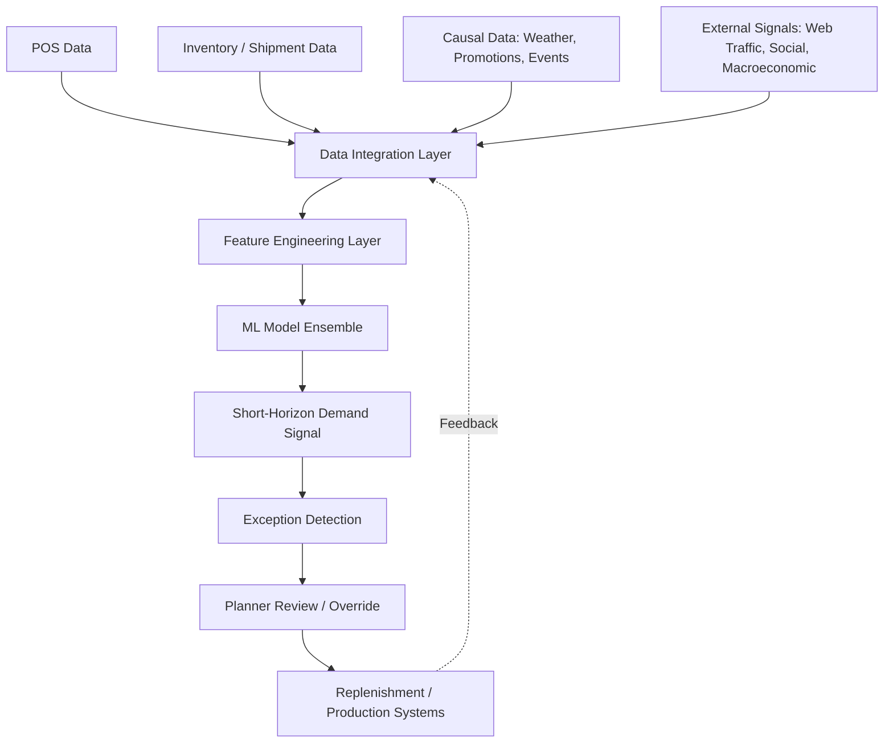

## AI and Machine Learning in Demand Sensing

### Definition and Purpose

Demand sensing is a short-horizon demand forecasting approach that uses near-real-time downstream signals (POS data, syndicated market data, weather, web traffic, social signals) combined with machine learning algorithms to detect shifts in actual demand days or weeks in advance, rather than relying solely on historical shipment or order patterns. It sits alongside traditional statistical forecasting as a shorter-horizon, higher-frequency complement, typically covering the 0–13 week window where reaction time is most operationally valuable (replenishment, production scheduling, labor planning).

Where traditional forecasting methods (moving averages, exponential smoothing, ARIMA) rely on smoothing historical time series and are recalculated infrequently (weekly or monthly), demand sensing recalculates frequently (daily or even intraday) using algorithms designed to pick up inflection points quickly rather than smooth them out.

### Why Machine Learning Is Applied to Demand Sensing

Classical time-series methods assume relatively stable, linear relationships between past and future demand. Real-world demand is influenced by many simultaneous, often nonlinear and interacting factors: price elasticity, weather, promotions, competitor actions, social sentiment, and macroeconomic indicators. Machine learning models are used because they can:

- Ingest high-dimensional, heterogeneous data (structured and unstructured) simultaneously
- Capture nonlinear interactions between causal variables (e.g., a promotion's effect varying by weather condition)
- Update continuously as new data arrives, rather than requiring full model re-specification
- Automatically detect pattern shifts (regime changes) without manual re-parameterization

### Core Architecture of a Demand-Sensing System

**Layer breakdown:**

1. **Data Integration Layer**: ETL/ELT pipelines ingesting POS, inventory, EDI transactions, and external data via APIs
2. **Feature Engineering Layer**: constructs lag features, rolling statistics, calendar/holiday flags, price-elasticity indicators, weather indices
3. **ML Model Ensemble**: typically combines multiple algorithm families (see below) rather than a single model
4. **Exception Detection**: statistical thresholds or anomaly-detection models flag forecasts diverging significantly from baseline
5. **Planner Review Layer**: human-in-the-loop override capability, critical for auditability and trust
6. **Downstream Execution**: feeds replenishment, MRP, or S&OP systems

### Common Machine Learning Techniques Used

| Technique | Typical Use in Demand Sensing | Strength |
| --- | --- | --- |
| Gradient Boosted Trees (XGBoost, LightGBM) | SKU-location level short-term forecasts | Handles nonlinear feature interactions, tabular data, missing values |
| Random Forests | Baseline ensemble forecasts | Robust to overfitting, interpretable feature importance |
| Recurrent Neural Networks (LSTM/GRU) | Sequential demand pattern learning | Captures temporal dependencies across long lag windows |
| Temporal Fusion Transformers | Multi-horizon forecasting with mixed static/temporal inputs | Attention mechanism highlights which inputs drive each forecast |
| Prophet / Bayesian Structural Time Series | Baseline decomposition (trend, seasonality, holiday effects) | Interpretable, good for capturing known seasonal structure |
| Clustering (k-means, hierarchical) | Grouping SKUs/locations with similar demand patterns for pooled model training | Improves data sufficiency for low-volume SKUs |
| Anomaly detection (isolation forests, autoencoders) | Exception flagging | Surfaces unusual patterns without predefined rules |

[Inference] In practice, most commercial demand-sensing platforms use ensembles that blend gradient-boosted trees with neural sequence models, since no single algorithm family consistently dominates across the heterogeneous mix of high-volume and long-tail SKUs found in typical retail/CPG portfolios.

### Feature Categories Commonly Engineered

- **Temporal features**: day-of-week, week-of-year, days-to-holiday, lag values ($t-1, t-7, t-28$)
- **Causal/promotional features**: price, discount depth, promotion type, display/end-cap flag
- **External features**: temperature, precipitation, local event calendars, macroeconomic indices
- **Cross-sectional features**: category-level demand, cannibalization/substitution effects between related SKUs
- **Hierarchical features**: store cluster, regional demand pooling for sparse-data SKUs

### Worked Example

A grocery retailer applies ML-based demand sensing for fresh produce (short shelf life, high demand volatility).

1. **Data inputs**: daily POS by SKU-store, 10-day weather forecast, promotional calendar, day-of-week/holiday flags.
2. **Model**: a gradient-boosted tree ensemble trained on 2 years of history, retrained weekly, generating rolling 7-day-ahead forecasts refreshed daily.
3. **Signal detected**: the model detects a forecasted temperature spike combined with an upcoming local festival, and increases the demand forecast for bottled beverages and salad items by 22% relative to the naive statistical baseline for the affected stores.
4. **Exception handling**: the deviation exceeds the configured 15% exception threshold versus the statistical baseline forecast, triggering planner review.
5. **Outcome**: the planner confirms the causal logic (weather + local event) and approves the adjusted replenishment quantity, reducing stockout risk and spoilage relative to the unadjusted baseline forecast.

### Forecast Accuracy Measurement

Demand-sensing model performance is commonly evaluated using:

$$\text{MAPE} = \frac{1}{n}\sum_{i=1}^{n}\left|\frac{A_i - F_i}{A_i}\right| \times 100$$

$$\text{WMAPE} = \frac{\sum_{i=1}^{n}|A_i - F_i|}{\sum_{i=1}^{n}|A_i|} \times 100$$

where $A_i$ is actual demand and $F_i$ is forecast demand for period $i$. WMAPE is generally preferred over MAPE in demand-sensing contexts because it weights errors by volume, avoiding the distortion MAPE produces on low-volume SKUs (division by small $A_i$ values).

Bias is also tracked separately:

$$\text{Forecast Bias} = \frac{\sum_{i=1}^{n}(F_i - A_i)}{\sum_{i=1}^{n}A_i} \times 100$$

Bias reveals systematic over- or under-forecasting that an aggregate accuracy metric alone can mask.

### Integration with Traditional Forecasting and S&OP

Demand sensing does not typically replace statistical or consensus-based (S&OP) forecasting; it operates as a short-horizon correction layer:

- **Long horizon (13+ weeks)**: statistical/causal models and S&OP consensus process drive strategic planning, procurement, and capacity decisions
- **Short horizon (0–13 weeks)**: demand-sensing ML models adjust the near-term portion of the forecast based on real-time signals
- **Reconciliation**: the sensed short-horizon forecast is blended with or overrides the statistical forecast within the sensing window, with the two converging toward the longer-horizon plan as the horizon lengthens

### Benefits

- Faster detection of demand inflection points than moving-average or exponential-smoothing methods
- Reduced safety stock requirements due to tighter forecast error at short horizons
- Improved responsiveness to promotions, weather, and local events
- Reduction in stockouts and markdowns/spoilage, particularly for perishable or promotionally volatile categories

### Limitations and Risks

- **Data quality dependency**: ML models amplify errors present in POS or inventory data (e.g., unrecorded stockouts misread as low demand)
- **Explainability**: complex ensemble/neural models can be harder for planners to trust and override than simple statistical models, motivating use of explainability tools (SHAP values, attention weights)
- **Cold-start problem**: new products or new stores lack historical data; typically addressed via analog/proxy-SKU pooling or hierarchical model borrowing
- **Overfitting to noise**: high-frequency retraining risks fitting to short-term anomalies rather than genuine demand shifts, requiring careful validation design (e.g., rolling-origin cross-validation)
- [Speculation] Organizational change management is often the binding constraint on realized value: platforms can generate statistically superior forecasts, but benefit is only captured if planners act on the exceptions rather than manually overriding them out of habit.

### Key Points

- Demand sensing is a short-horizon (0–13 week), high-frequency forecasting layer that complements rather than replaces traditional statistical and S&OP forecasting
- ML techniques (gradient boosting, RNNs, transformer-based models) are favored for their ability to model nonlinear, multi-source causal relationships
- WMAPE and bias are the primary evaluation metrics, chosen over MAPE to avoid distortion on low-volume SKUs
- Human-in-the-loop exception review remains standard practice due to explainability and trust considerations

### Related Topics

- Statistical forecasting methods (exponential smoothing, ARIMA) as the long-horizon baseline
- Sales and Operations Planning (S&OP) forecast reconciliation
- Collaborative Planning, Forecasting, and Replenishment (CPFR)
- Forecast error metrics (MAPE, WMAPE, bias, tracking signal)
- Feature engineering for time-series machine learning
- Explainable AI (SHAP, LIME) in operational forecasting contexts
- Cold-start forecasting for new product introductions