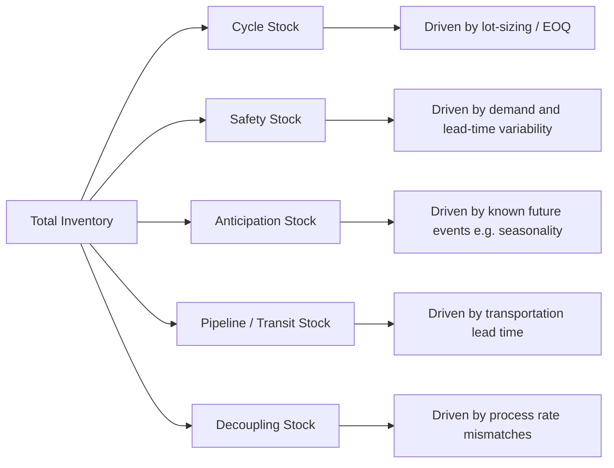

## Functions and Types of Inventory

### Definition and Purpose

Inventory refers to the stock of raw materials, work-in-process, finished goods, and maintenance/repair/operating (MRO) supplies held by an organization to support production, decouple supply from demand, and buffer against variability in the supply chain. Inventory exists because supply and demand are rarely perfectly synchronized in timing, quantity, or location; holding stock allows an operation to absorb this mismatch without stopping production or losing sales.

Inventory decisions sit at the core of operations management because inventory simultaneously represents (a) a necessary buffer that enables service and production continuity, and (b) a capital cost and risk (obsolescence, holding cost, damage) that ties up working capital. Effective inventory management requires understanding *why* inventory is held (its function) before deciding *how much* to hold (quantity/policy decisions covered in separate topics such as EOQ, safety stock, and reorder points).

### The Four Primary Functions of Inventory

1. **Decoupling Function**

   Inventory separates dependent stages of a process so that a disruption or rate mismatch at one stage does not immediately halt another. This applies both within a single facility (decoupling one production stage from the next via WIP buffers) and across the supply chain (decoupling a retailer's sales from a supplier's production schedule).
2. **Cycle Stock Function (Economic Lot Sizing)**

   Inventory is held because it is often more economical to produce or purchase in batches larger than immediate need, due to fixed setup/ordering costs. The resulting stock consumed between replenishments is cycle stock, directly tied to lot-sizing decisions such as the Economic Order Quantity (EOQ).
3. **Safety/Buffer Function**

   Inventory held beyond expected demand to protect against uncertainty in demand (demand variability) or supply (lead time variability, supplier reliability). This is safety stock, sized using demand/lead-time variability and a target service level.
4. **Anticipation Function**

   Inventory built up in advance of a known or predictable future need — seasonal demand peaks, planned promotions, anticipated price increases, or planned supplier shutdowns (e.g., annual maintenance). Unlike safety stock (which buffers *uncertainty*), anticipation stock buffers a *known, predictable* future event.

Some frameworks add a fifth function:

5. **Pipeline/Transit (Movement) Function**

   Inventory that exists because goods are physically in transit between stages of the supply chain (in a truck, on a ship, on a conveyor). Also called work-in-transit or pipeline stock; its magnitude is a function of transit lead time and throughput rate.

$$\text{Pipeline Inventory} = \text{Average Demand Rate} \times \text{Lead Time}$$

### Classification by Position in the Production Process

| Type | Definition | Example |
| --- | --- | --- |
| **Raw Materials (RM)** | Purchased inputs not yet entered into production | Steel coils awaiting stamping |
| **Work-in-Process (WIP)** | Partially completed items at some stage between raw material and finished good | A partially assembled engine on the line |
| **Finished Goods (FG)** | Completed items ready for sale or shipment | Packaged product on warehouse shelves |
| **MRO (Maintenance, Repair, Operating) Supplies** | Items consumed in supporting production but not part of the product itself | Lubricants, spare machine parts, cleaning supplies |

### Classification by Functional Purpose

| Type | Purpose | Driven By |
| --- | --- | --- |
| **Cycle Stock** | Satisfies regular demand between order/production cycles | Lot-sizing economics (EOQ, batch size) |
| **Safety Stock** | Buffers against demand/lead-time uncertainty | Demand variability, service-level targets |
| **Anticipation Stock** | Buffers against a *known* future demand or supply event | Seasonality, promotions, planned shutdowns |
| **Pipeline (Transit) Stock** | Exists due to physical movement time | Lead time, transportation mode |
| **Decoupling Stock** | Separates dependent process stages | Process rate mismatches, bottleneck protection |

### Worked Example

A furniture manufacturer holds the following inventory for a single chair model:

- **Raw materials**: lumber and fabric awaiting the cutting stage → classified as *raw material inventory*, serving a *decoupling function* (protecting production from supplier delivery delays).
- **WIP**: partially assembled chair frames sitting between the framing and upholstery stations → classified as *work-in-process*, serving a *decoupling function* between two process stages running at different rates.
- **200 units held** because the upholstery machine has a costly changeover, making it economical to run larger batches than daily demand requires → classified as *cycle stock*.
- **50 additional units** held above expected average demand because historical demand has shown a coefficient of variation requiring a 95% service level buffer → classified as *safety stock*.
- **300 units built up** over the prior two months in anticipation of a confirmed back-to-school retail promotion → classified as *anticipation stock*.
- **120 units currently on a truck** en route from the regional distribution center to retail stores, with a 3-day transit lead time → classified as *pipeline/transit stock*.

Each of these five inventory "types" coexists simultaneously for the same SKU, but each is sized and managed using a different logic and different formula (lot-sizing models for cycle stock, statistical safety-stock formulas for buffer stock, judgmental/forecast-driven sizing for anticipation stock, and lead-time-times-throughput for pipeline stock).

### Why Distinguishing Functions Matters for Management

Treating all on-hand inventory as a single undifferentiated pool leads to poor decisions, because each functional category responds to different levers:

- Reducing **cycle stock** requires reducing setup/changeover costs or ordering more frequently in smaller batches (see EOQ trade-off).
- Reducing **safety stock** requires reducing demand/lead-time variability or improving supplier reliability, not simply cutting the buffer (which raises stockout risk).
- Reducing **anticipation stock** requires better demand shaping (e.g., pricing, promotion timing) or more flexible/responsive capacity.
- Reducing **pipeline stock** requires shortening lead times or switching transportation modes.
- Reducing **decoupling stock** requires better synchronization of process rates (e.g., through line balancing or Just-In-Time/Kanban systems), which may increase the risk of process stoppage if done without addressing root-cause variability.

[Inference] Misclassifying safety stock as "excess" cycle stock (or vice versa) during inventory-reduction initiatives is a common practical error, since both appear identically as generic "on-hand inventory" in standard ERP inventory reports unless the system is explicitly configured to segment inventory by function.

### Benefits of Functional Classification

- Enables targeted inventory-reduction strategies rather than blanket cuts that risk service failures
- Clarifies which inventory-related cost driver (ordering cost, holding cost, stockout cost, obsolescence risk) applies to each pool
- Supports accurate root-cause analysis when total inventory or service levels drift from target
- Provides the conceptual foundation for subsequent quantitative models (EOQ for cycle stock, safety stock formulas for buffer stock)

### Limitations and Considerations

- In practice, ERP/WMS systems typically track inventory by SKU and location, not by functional category, requiring additional analysis (e.g., decomposition modeling) to separate cycle stock from safety stock from anticipation stock within a single on-hand balance
- Functional categories are analytical constructs; a single physical unit of inventory cannot always be cleanly attributed to one function, particularly when cycle and safety stock replenishment cycles overlap
- [Unverified] The relative proportion of each inventory type varies substantially by industry and product characteristics (e.g., perishables typically carry minimal anticipation stock, while seasonal apparel carries substantial anticipation stock), and specific benchmark ratios should be sourced from industry-specific studies rather than assumed universally.

### Key Points

- Inventory serves four (or five, including pipeline) distinct functions: decoupling, cycle, safety/buffer, anticipation, and transit
- Functional classification differs from physical/positional classification (raw materials, WIP, finished goods, MRO)
- Each functional type is driven by a different underlying cause and requires a different management lever to reduce
- A single SKU typically holds inventory across multiple functional categories simultaneously

### Related Topics

- Economic Order Quantity (EOQ) and lot-sizing models
- Safety stock calculation and service-level optimization
- ABC inventory classification and cycle counting
- Just-In-Time (JIT) and Kanban systems for decoupling-stock reduction
- Inventory holding cost and carrying cost components
- Bullwhip effect and its relationship to cycle/safety stock inflation
- Seasonal inventory planning and demand shaping strategies