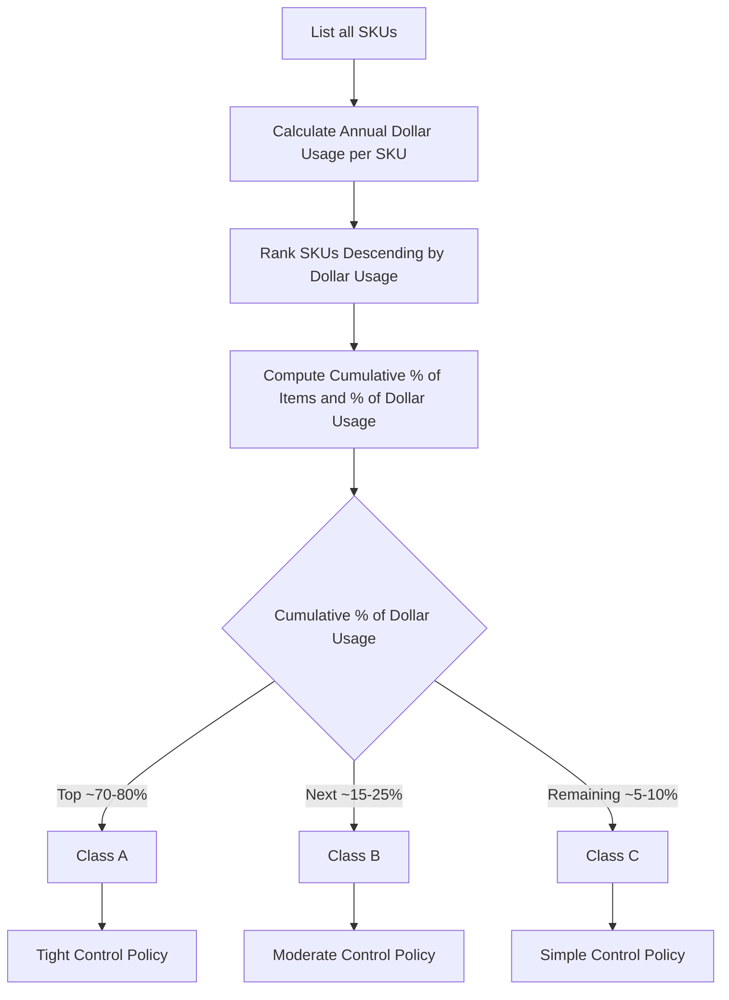

## ABC Classification Analysis

### Definition and Purpose

ABC classification analysis is an inventory categorization technique that segments stock keeping units (SKUs) into three (or more) tiers—A, B, and C—based on their relative contribution to a chosen value metric, most commonly annual dollar usage (annual consumption volume multiplied by unit cost). The technique applies the Pareto principle (the 80/20 rule) to inventory management: a small percentage of items typically accounts for the large majority of value, while the majority of items account for a small fraction of value.

The purpose of ABC analysis is to allocate management attention, control rigor, and analytical resources proportionally to the economic importance of each item, rather than applying uniform inventory policies (review frequency, safety stock precision, ordering methods) across an entire SKU portfolio regardless of value.

### Underlying Principle: The Pareto Distribution

Named after economist Vilfredo Pareto, who observed that wealth distribution follows a highly skewed pattern, the Pareto principle applied to inventory typically manifests as:

- **Class A**: approximately 10–20% of items, accounting for approximately 70–80% of annual dollar usage
- **Class B**: approximately 20–30% of items, accounting for approximately 15–25% of annual dollar usage
- **Class C**: approximately 50–70% of items, accounting for approximately 5–10% of annual dollar usage

[Unverified] These percentage bands are commonly cited heuristics rather than fixed rules; actual distributions vary by industry, product portfolio, and organization, and should be empirically derived from the specific dataset rather than assumed to match the canonical 80/20 split.

### Step-by-Step Methodology

1. **Determine annual dollar usage for each SKU**


   $$\text{Annual Dollar Usage}_i = \text{Annual Demand}_i \times \text{Unit Cost}_i$$
2. **Rank all SKUs in descending order** of annual dollar usage.
3. **Calculate cumulative percentage of total items and cumulative percentage of total dollar usage** as items are added down the ranked list.
4. **Assign classification breakpoints** based on cumulative percentage of dollar usage (commonly at 70–80% for the A/B boundary and 90–95% for the B/C boundary), though breakpoints may be set judgmentally rather than by rigid percentage rule.
5. **Apply differentiated management policies** to each class (see below).



### Worked Example

A distributor stocks 10 SKUs with the following annual demand and unit cost data:

| SKU | Annual Demand (units) | Unit Cost | Annual Dollar Usage |
| --- | --- | --- | --- |
| 1 | 500 | $200 | $100,000 |
| 2 | 1,500 | $50 | $75,000 |
| 3 | 200 | $150 | $30,000 |
| 4 | 3,000 | $8 | $24,000 |
| 5 | 100 | $120 | $12,000 |
| 6 | 2,000 | $5 | $10,000 |
| 7 | 400 | $20 | $8,000 |
| 8 | 800 | $8 | $6,400 |
| 9 | 1,000 | $4 | $4,000 |
| 10 | 600 | $3 | $1,800 |

**Total annual dollar usage** = $271,200

Ranking descending and computing cumulative percentages:

| Rank | SKU | Dollar Usage | Cumulative $ | Cumulative % of $ | Cumulative % of Items | Class |
| --- | --- | --- | --- | --- | --- | --- |
| 1 | 1 | $100,000 | $100,000 | 36.9% | 10% | A |
| 2 | 2 | $75,000 | $175,000 | 64.5% | 20% | A |
| 3 | 3 | $30,000 | $205,000 | 75.6% | 30% | A |
| 4 | 4 | $24,000 | $229,000 | 84.4% | 40% | B |
| 5 | 5 | $12,000 | $241,000 | 88.9% | 50% | B |
| 6 | 6 | $10,000 | $251,000 | 92.6% | 60% | B |
| 7 | 7 | $8,000 | $259,000 | 95.5% | 70% | C |
| 8 | 8 | $6,400 | $265,400 | 97.9% | 80% | C |
| 9 | 9 | $4,000 | $269,400 | 99.3% | 90% | C |
| 10 | 10 | $1,800 | $271,200 | 100% | 100% | C |

In this example: **3 SKUs (30% of items) = Class A (75.6% of value)**; **3 SKUs (30% of items) = Class B (16.9% of value incremental)**; **4 SKUs (40% of items) = Class C (7.4% of value incremental)**. Note this dataset's actual split (30/30/40 by item count) diverges from the canonical 20/30/50 heuristic, illustrating why breakpoints should be derived from the specific data rather than assumed.

### Differentiated Management Policies by Class

| Dimension | Class A | Class B | Class C |
| --- | --- | --- | --- |
| **Review frequency** | Continuous or frequent (weekly) | Periodic (monthly) | Infrequent (quarterly/annual) |
| **Forecasting method** | Sophisticated statistical/causal models | Moderate statistical methods | Simple methods (e.g., fixed reorder point) |
| **Safety stock precision** | Tight, statistically calculated, high service level | Moderate precision | Loose, rule-of-thumb buffers |
| **Ordering approach** | Continuous review (Q-system) or tight periodic review | Periodic review (P-system) | Simple two-bin or visual systems |
| **Cycle counting frequency** | Frequent (e.g., monthly or continuous) | Moderate (e.g., quarterly) | Infrequent (e.g., annual) |
| **Management attention** | Senior/dedicated planner oversight | Standard planner oversight | Minimal oversight, automated reorder |
| **Supplier relationship** | Close collaboration, possibly VMI/CPFR | Standard purchasing terms | Bulk/simple purchasing arrangements |

### Extensions and Variants

- **ABC-XYZ Matrix**: combines ABC (value-based) classification with XYZ classification (demand variability-based, where X = stable/predictable demand, Y = moderate variability, Z = highly volatile/sporadic demand). This produces a 3×3 matrix (AX, AY, AZ, BX, BY, BZ, CX, CY, CZ) enabling more nuanced policy differentiation—an "AZ" item (high value, high variability) warrants very different treatment than an "AX" item (high value, stable demand) despite both being Class A.
- **Multi-criteria ABC (MCABC)**: extends the single-criterion (dollar usage) model to incorporate additional weighted criteria such as lead time, criticality/obsolescence risk, substitutability, and stockout cost, often combined using weighted-scoring or analytic hierarchy process (AHP) methods.
- **HML (High-Medium-Low) classification**: an alternative or complementary classification based on unit price alone rather than total dollar usage, useful for procurement/purchasing decisions distinct from inventory control decisions.
- **VED (Vital-Essential-Desirable) classification**: commonly used in spare-parts/MRO contexts, classifying by criticality to operations rather than dollar value—a low-cost part whose absence halts production may be "Vital" despite low dollar usage.

```mermaid
flowchart TD
    A[ABC-XYZ Matrix (svg_diagram)] --> B["AX: High value, stable demand -- tight control, standard safety stock"]
    A --> C["AZ: High value, volatile demand -- tight control, elevated safety stock or flexible sourcing"]
    A --> D["CX: Low value, stable demand -- simple reorder-point system"]
    A --> E["CZ: Low value, volatile demand -- minimal control, accept occasional stockouts or use blanket ordering"]
```

### Benefits

- Focuses limited planning and analytical resources on the items that drive the majority of inventory value or risk
- Reduces total inventory management cost by avoiding over-engineering control systems for low-value items
- Provides a data-driven basis for differentiating cycle-counting frequency, forecasting sophistication, and safety-stock precision
- Straightforward to compute and communicate, requiring only demand and cost data already present in most ERP systems

### Limitations and Considerations

- **Single-criterion bias**: classification based solely on dollar usage can misclassify low-cost, high-criticality items (e.g., an inexpensive but essential spare part) as low priority, motivating multi-criteria extensions (MCABC, VED)
- **Static snapshot risk**: dollar usage and classifications shift over time (new product introductions, seasonal items, declining products); ABC analysis should be recalculated periodically (commonly annually or semi-annually) rather than treated as permanent
- **Boundary sensitivity**: classification breakpoints (e.g., 70% vs. 80% cumulative threshold for Class A) are somewhat arbitrary and can shift items across boundaries with small changes in demand or cost, so systems sometimes apply hysteresis rules to avoid excessive reclassification churn
- [Inference] Because ABC analysis is a relative ranking within a given item population, results are not directly comparable across different product portfolios or facilities without normalizing for portfolio size and value concentration.

### Key Points

- ABC classification applies the Pareto principle to segment inventory by relative dollar-usage contribution into typically three tiers
- Class A items (small % of SKUs, large % of value) warrant the most rigorous forecasting, review, and control; Class C items warrant simplified, low-effort control
- Classification should be recalculated periodically and is commonly extended with variability (XYZ) or criticality (VED) dimensions for more nuanced policy design
- The technique's core value is resource allocation: concentrating planning effort where it has the greatest economic impact

### Related Topics

- Functions and types of inventory
- Economic Order Quantity (EOQ) and continuous/periodic review systems
- Safety stock calculation and service-level targets
- XYZ analysis (demand variability classification)
- Cycle counting and physical inventory accuracy
- Spare parts management and VED (Vital-Essential-Desirable) classification
- Multi-criteria decision analysis (AHP) in inventory management